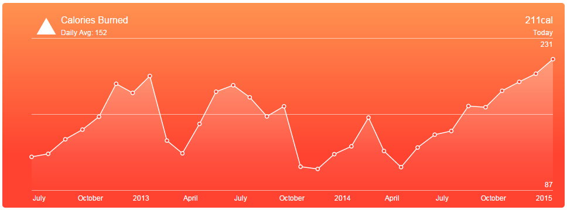
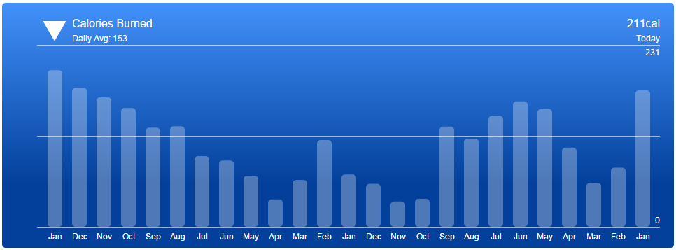

<Sponsorship />

Last year Apple released their new collection of iPhones. One innovation of Apple which caught my eyes is the new health app. The dashboard with its health charts is appealing and well designed. Therefore I had to remake one of its components with D3.js. This is what you are going to achieve.

* [Gist for Source Code](https://gist.github.com/rwieruch/7b90f99823ee1feda28a)
* [Example with Source Code + Visualization](http://bl.ocks.org/rwieruch/7b90f99823ee1feda28a)

* [Gist for Source Code](https://gist.github.com/rwieruch/1e1ee13299db48252e2c)
* [Example with Source Code + Visualization](http://bl.ocks.org/rwieruch/1e1ee13299db48252e2c)
