<Sponsorship />

<ReactFirebaseBook />

This short visual Firebase tutorial should help you to create your first Firebase application that can be used with any web framework/library such as React, Angular or Vue. For instance, you can use it for this [extensive Firebase in React tutorial](https://www.robinwieruch.de/complete-firebase-authentication-react-tutorial/) that uses all the features we will discuss in this visual guide.

Let's start by [creating a Firebase application with your Google Account](https://console.firebase.google.com). Therefore, hit the "Add Project" button to create a new Firebase project:


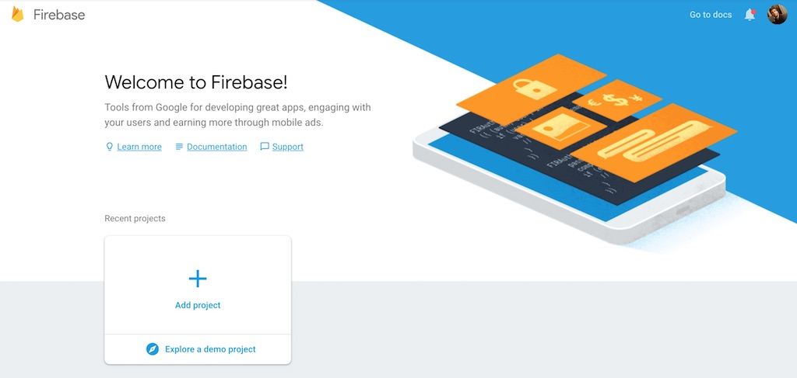

Then give your project a remarkable name.

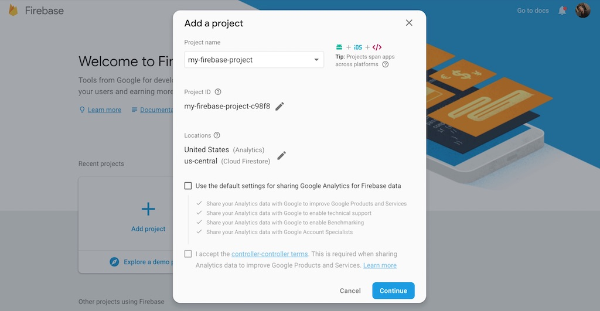

It is up to you to share analytical insights in form of data with Google.

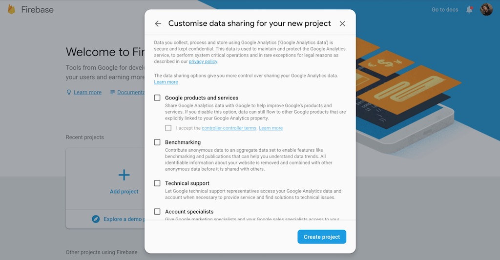

Afterward it takes a couple of seconds to setup your Firebase project. Then you should find yourself on your Firebase project's dashboard.

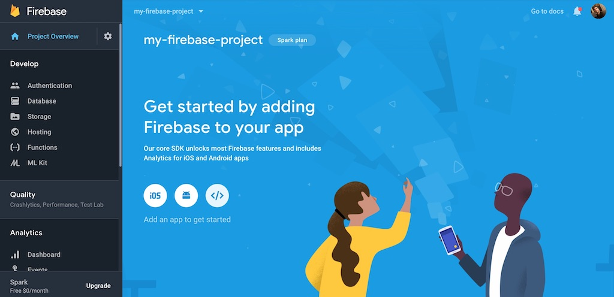

Above of the "Add an app to get started" you find three icons whereas the last one would be for a web application. Click the button and find your Firebase Configuration that should be used to connect your application to the Firebase API.

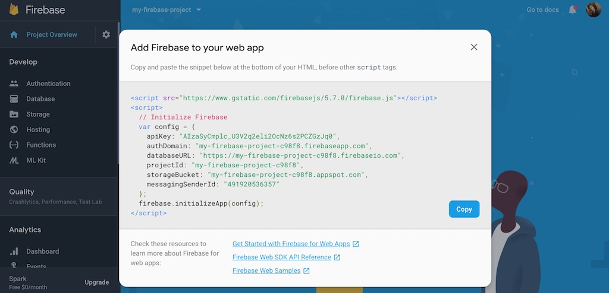

It is recommended to keep this sensitive data in your environment variables in your project to configure your application. Even though this information is accessible in your client-side application, it's okay to have them publicly available. You need to project your Firebase application later with other mechanisms (.e.g Read/Write Rules, Domain Restrictions). That's it for the Firebase setup with a configuration. You should be able to get along with the initial steps of setting up a Firebase application.


# Firebase Authentication

If you want to use authentication mechanisms with your Firebase application, to enable users to sign up, sign in and sign out, you need to head over to the Authentication option.

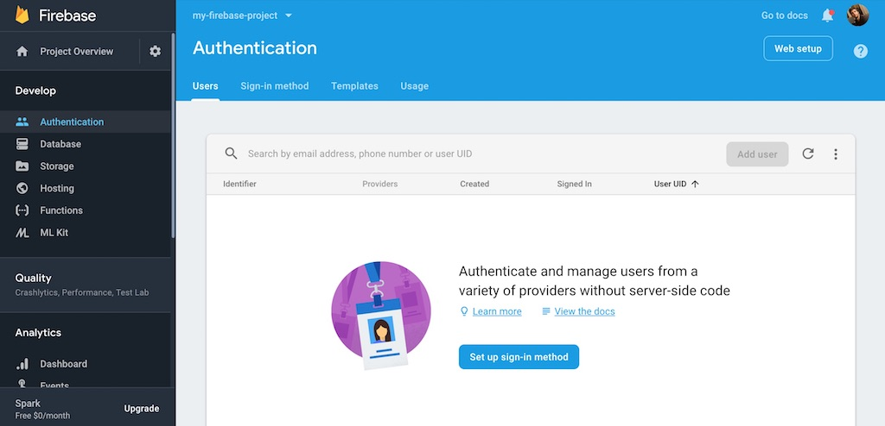

You can either set up a sign in method here or by clicking the Sign-in method option above.

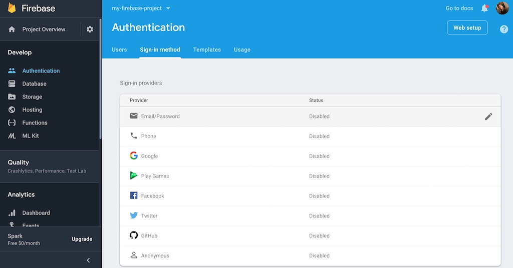

Let's enable the Email/Password sign in method so that users can login with a email and password in your application.

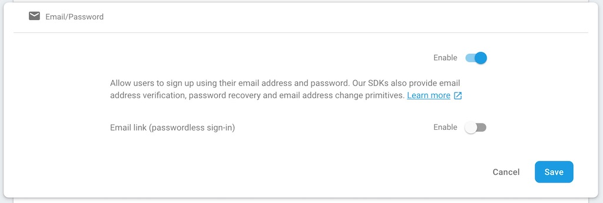

That's it. You can implement email/password authentication flows in your application now. If you click the Users option above, and users have actually signed up in your application, you can see these users in a list with their authentication methods.

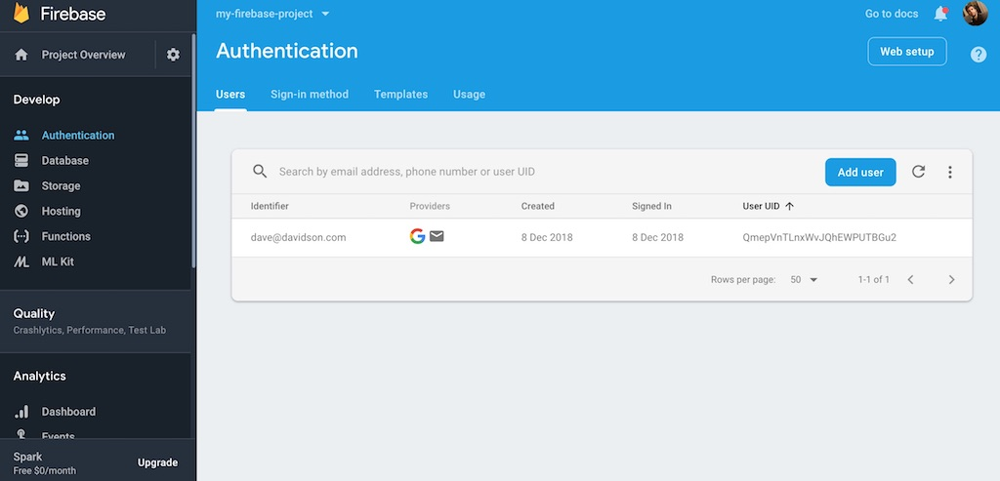

If you want to setup social sign in methods such as Google, Facebook and Twitter, head over to [this tutorial that guides you through the process of setting up Facebook and Twitter Apps, but also through the necessary source code implementation](https://www.robinwieruch.de/react-firebase-social-login/). Otherwise you can also follow these visual guides on how to setup [Facebook](https://www.robinwieruch.de/firebase-facebook-login/) and [Twitter](https://www.robinwieruch.de/firebase-twitter-login/).

Firebase authentication comes with more advanced features that go beyond the login of a user to your application. What about password reset/change, email change or email verification features? Firebase helps you with these things. In case you want to adjust email templates for these features, for instance for a email verification that a user receives to confirm their email, you can do it in the Templates option.

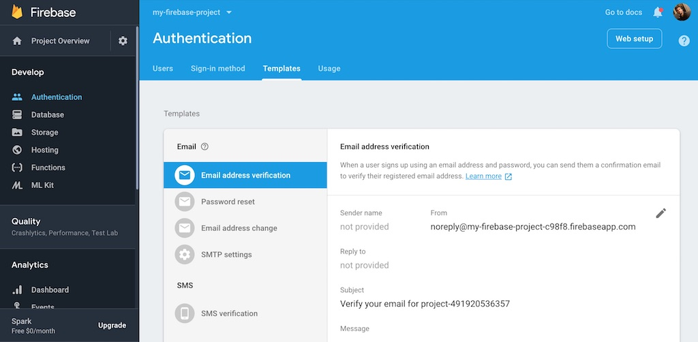

You can find more about the implementation details in the Firebase in React tutorial referenced in the beginning of this visual guide.

# Firebase Database

If you navigate to the Database option, you will be presented with two database options for Firebase: the newer Cloud Firestore and the Firebase Realtime Database.

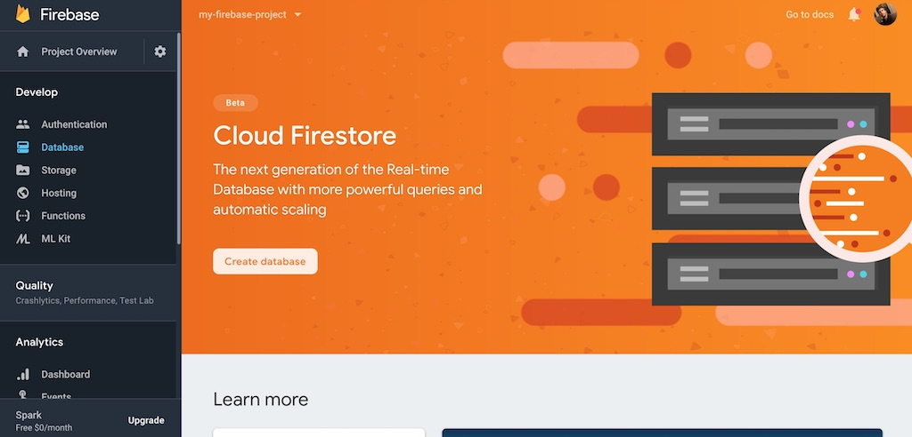

You need to find out yourself which [matches the requirements of your application](https://firebase.google.com/docs/database/rtdb-vs-firestore).

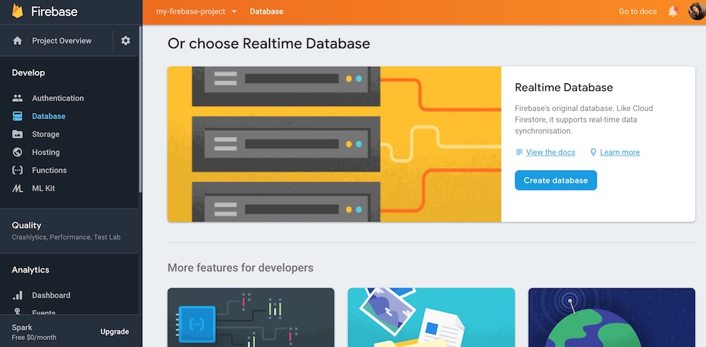

The Firebase in React tutorial from the beginning shows you how to implement the older Firebase Realtime Database, but also shows you how to migrate over to Cloud Firestore in the end. Choosing one doesn't mean to use it forever. If you would use the Cloud Firestore, your Database could look like the following in your Firebase project's dashboard.

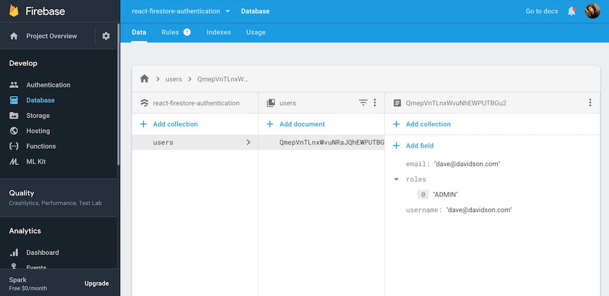

While Firebase manages users that are created from authentication sign up/in methods with email/password or social logins such as Google, Facebook or Twitter, you are in charge to create the user entities yourself in the database. Next to the users you can create other entities such as messages for a chat application or projects for a project management software.

**Careful:** While Firebase Realtime Database can be used on the free plan, Cloud Firestore is charged by usage. That's why you can [set monthly quotas](https://firebase.google.com/docs/firestore/quotas) and [budget alerts](https://cloud.google.com/billing/docs/how-to/budgets). You can always see the pricing plan, and adjust it, in the bottom left corner of your Firebase project's dashboard.

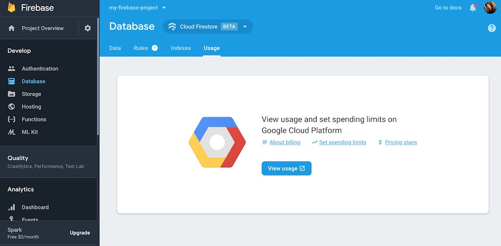

For the sake of completion, the Indexes option for Realtime Database and Cloud Firestore can be used to make your database queries faster. For instance, if you query a list of items ordered by property X, it makes sense to index the items by property X and not only there default identifier. Then it's more effortless for Firebase to retrieve the data indexed by the query property.

# Firebase Hosting

Finally you can use Firebase to host your project on top of Google's infrastructure. When you navigate to the Hosting option, you can get started to deploy your application.

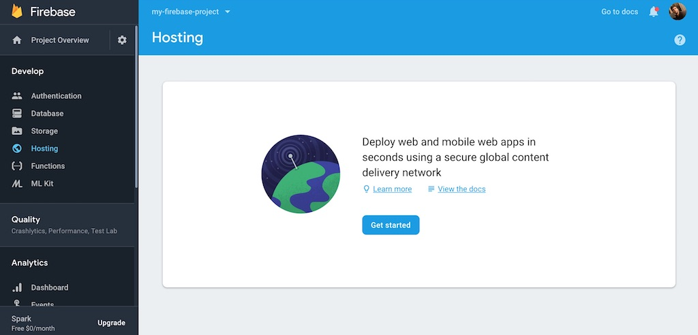

First you need to install the necessary node packages on the command line.

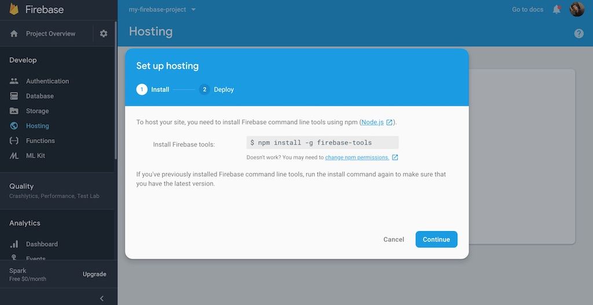

Then you can login with your Google account, initialize a Firebase application, and finally deploy it.

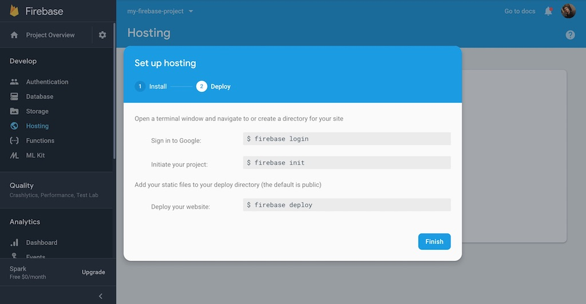

I have written about this in greater detail for [deploying a React application with Firebase Hosting](https://www.robinwieruch.de/firebase-deploy-react-js/). Otherwise, it's worth to mention that Firebase Hosting comes with all the essential features (e.g. analytics, domain support) other hosting provider would offer you as well.

That's it for my visual guide through setting up Firebase with authentication, database and hosting. If you want to go through the implementation of all these features, checkout the referenced React in Firebase tutorial from the beginning of this guide. Otherwise explore your Firebase project's dashboard a bit more to learn more about Firebase Cloud gor hosting files such as images, audio and video, and Cloud Functions for serverless business logic.
