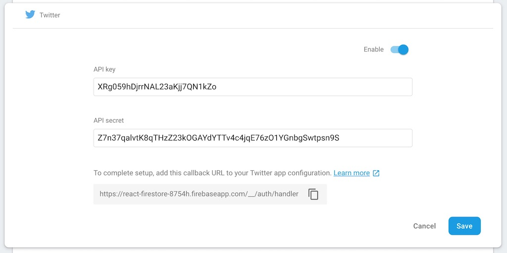
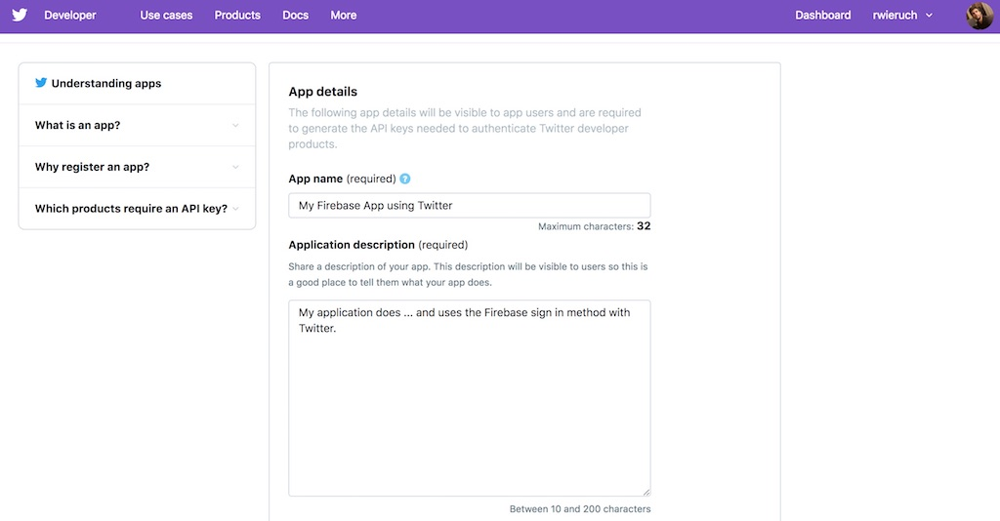
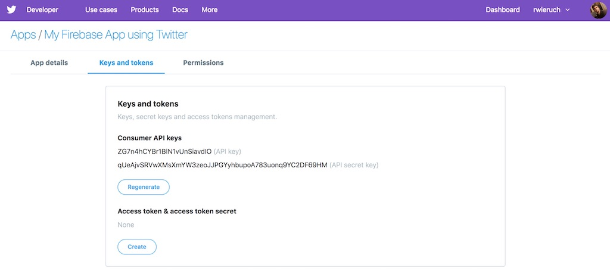
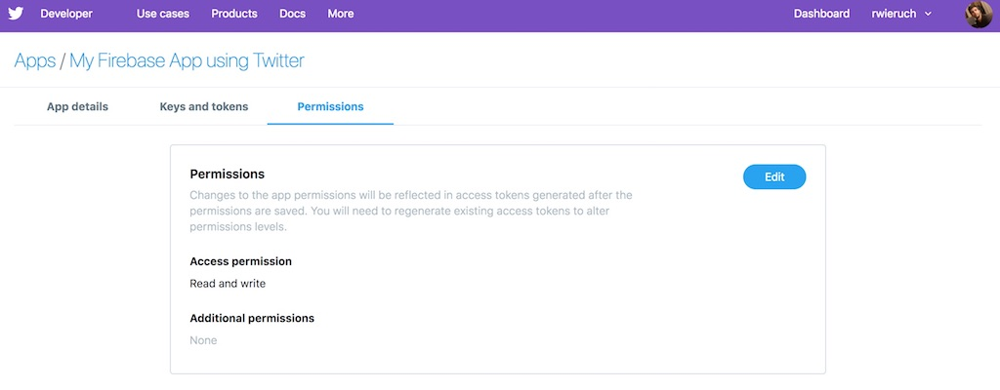
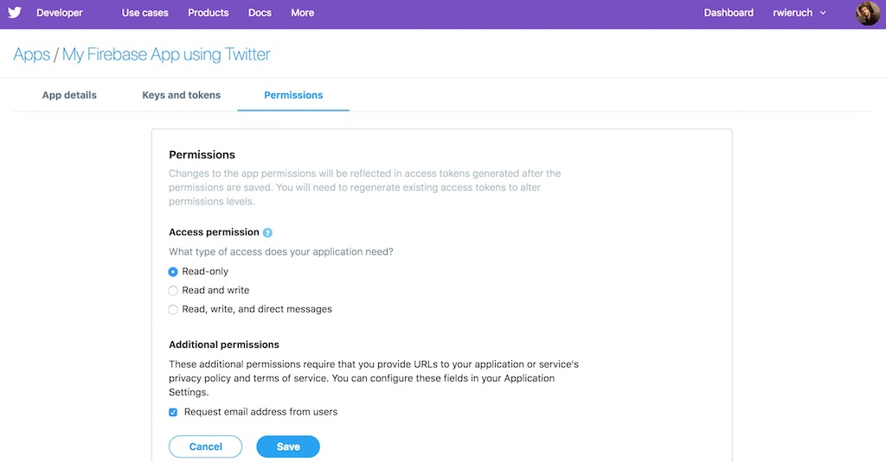

<Sponsorship />

<ReactFirebaseBook />

In this short visual guide, I want to show you how to activate the Twitter authentication for your Firebase or Firestore application. It should only take you a couple of minutes to set up the Twitter as web login for your app. Afterward, there is no email needed for your users to authenticate with your application.

First, on your Firebase project's dashboard, navigate to the Authentication/Sign-in method option. There you can enable the Twitter sign in method that enables you to login people via Twitter to your [Firebase application](/complete-firebase-authentication-react-tutorial).

When enabling the Twitter login method, where no email is needed to sign in to your application later, you need to provide an API key and API secret. Note that all shown sensitive data is fake here, so there is no need to do something with it.


You will get both credentials when creating a Twitter App which we will do in the next steps. Also you need to copy the callback URL for later, because this needs to be provided when creating the Twitter App.

Head over to Twitter to [create a Twitter App](https://developer.twitter.com/en/apps/create). If you don't have a Twitter account yet, create one and optionally follow [my tweets](https://twitter.com/rwieruch) for other web development tutorials. Next provide an identifiable App name and insightful App description.


Provide also the callback URL that you get when enabling the Twitter Sign In Method in Firebase. Also provide a description for Twitter to review your application.


Create your application. Afterward, you can edit the details of your Twitter App. For instance, retrieve your Keys and Tokens for your Twitter App to use them somewhere else. If you setup the Twitter Sign In Method for Firebase, provide Firebase the API key and the API secret key when enabling it.

You also want to edit the permission of your Twitter App to get access to your user's email address when they sign in with Twitter.

You can edit the permission and add the privilege to access a user's email address.

You should be able to use the Twitter App in your [Firebase application](/react-firebase-social-login) or any other application now.
