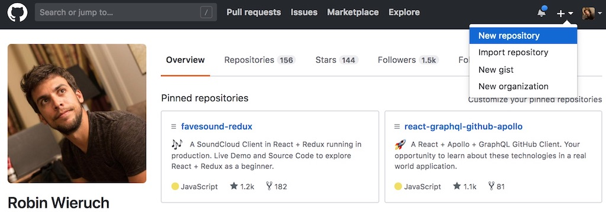

<Sponsorship />

<LinkCollection label="This tutorial is part 2 of 2 in the series." links={[{ prefix: "Part 1:", label: "My development setup as a JavaScript web developer", url: "/developer-setup/" }]} />

When you get started with Git, it can be quite overwhelming. First, the idea of a distributed version control system and the benefits of it are not clear for everyone. And second, there are plenty of commands with additional options in order to master Git on the command line. It can be intimidating.

However, you will never need all the combinations of commands and options in Git. For me they break down to only a few essential commands that I use for web development. Everything else can be looked up whenever complex problems arise.

In this article, I want to give you a brief introduction to Git and GitHub, how to get started and how to use it. Afterward, I want to show you my essential commands for Git that enabled me to do web development in the recent years. It's no magic and doesn't need to be overwhelming.

# Why Git and GitHub?

Git is a version control system for tracking file/folder snapshots and their changes across multiple machines. Most of the time, the files are related to software, for instance the source code of an application, but they don't need to be only of this kind. I already met writers and content marketers using Git to organize their files and to collaborate with others.

These files and folders are grouped into a repository. Multiple people can collaborate on a repository. Basically a repository is your project's container for Git and GitHub. People can create a local copy of the repository, modify the folders/files, and sync all the changes back to the remote repository. All collaborators can pull the recent changes from the remote repository to their local repository.

While Git happens on the command line by executing commands to pull, modify and push repositories, GitHub is the web-based Git platform. You can create repositories on the GitHub website and synchronize them to with a project on your local machine. Afterward, you can use Git on the command line to execute commands.

# Remote vs. Local Repository?

In GitHub, a person or organization (e.g. Facebook, Airbnb) can have repositories. These repositories can have files or whole folder structures for source code, markdown or other content. Unless a repository is private, everyone has reading access to it. It is a remote repository, because it is decentralized from your local machine.

Yet everyone is able to make a copy of the remote repository to his or her local machine. It becomes a local repository. You can make changes in your local repository that are not immediately reflected in the remote repository. You decide when or whether you want to merge the changes back to the remote repository.

The local repository can be used to experiment with source code, to add improvements or to fix issues. Eventually, these adjustments in the local repository get merged back to the remote repository. However, the collaborator has to have writing permission for the remote repository.

The distribution of repositories makes it possible to collaborate as a group on one remote repository when everyone has reading and writing access. A local repository is used to perform changes while the remote repository is the single source of truth.

GitHub offers the possibility to make repositories private. But you would have to upgrade to a paid GitHub account. Once your GitHub profile is upgraded, you can make any repository private thus only visible for yourself.

# Getting started with Git and GitHub Setup

Now that you know about Git and GitHub, you might wonder how to get started. That's fairly straight forward, covered by multiple guides, but also by the GitHub website itself.

First, visit the [official GitHub website](https://github.com/) to create an account. Second, you have to [install Git](https://help.github.com/articles/set-up-git/) on your command line. Every operating system should come with a default command line, but you can check [this developer setup guide](/developer-setup/) to get to know my setup. Third, I highly recommend to setup SSH for your GitHub account. It is optional but secures your access to GitHub. In addition, it leaves out the tedious task where you always have to enter your credentials when you push changes of your local repository to a remote repository on GitHub.

Last but not least, explore and socialize on GitHub. You can explore different repositories by visiting profiles of people and organizations. You can watch and star the repositories to get updates and to show your admiration. You can even start to contribute on a repository as a open source contributor.

In order to socialize, you can follow people who start interesting projects or discussions on GitHub. Try it out [by following my account to have your first social connection](https://github.com/rwieruch). I would be keen to see you using it.

If you have no clue about the workflow with Pull Requests and Issues when working with GitHub, checkout the [official GitHub Learning Lab](https://lab.github.com/). It should offer everything to get you up to speed. It's a great way to get started with GitHub itself.

# Initialize a repository with Git and GitHub

In the beginning, you somehow have to initialize a Git repository. You can initialize a local repository by using the `git init` command in a project's folder on your local machine.

A local repository has a *.git* file where all the information, for instance the commit history, about the repository is saved. Another file, a *.gitignore* file, can be added to ignore certain files which shouldn't be added to the remote repository. Ignored files are only in your local repository.

```javascript
git init
touch .gitignore
```

For instance, you may want to ignore the *.env* file where you store sensitive environment variables of your project or the *node_modules/* folder for not uploading all your project dependencies to your remote GitHub repository.

```javascript
.env

node_modules/
```

After you have used the `git init` command in your local project, you can create a repository on GitHub. There you can give it a name, an optional description and license (e.g. MIT). Don't use the checkbox for adding a README.md. Instead, leave the checkbox unchecked. Then you get the instructions to link your local repository to your remote repository in the next step.

In addition, you may want to add a *README.md* file in your project which is then displayed in your repository on GitHub. Basically that's everything you need to know for initializing a git project, adding the *.gitignore* file to it, connecting it to your remote repository on GitHub, add adding changes to it with the add, commit, and push sequence. You will learn more about this sequence in the next section.



Otherwise, if you check the checkbox, you will have a ready to go remote repository which you can clone then to your local machine for having it as local repository. If you want to have a copy of a remote repository, you can clone it by using `git clone <repository_url>` to your local machine.

After you have linked your local repository and added, committed and pushed your initial project to the remote repository (not when you have cloned it), you can start to adjust your project (local repository). Afterward, you always follow the add, commit and push sequence. More about this in the next section.

# Push your Changes

Over the past years, I have noticed that the GitHub commands I use break down to only a few essential ones that I use in recurring scenarios. These essential commands were quite sufficient for me to come along in web development.

Once you have a local repository, you want to "commit" changes to the code base. Each commit is saved as an atomic step that changes your repository. It is saved in the Git history that is accessible on the command line and GitHub.

Commits come with a commit message. You will see later on how to write a commit message. In addition, a hash is automatically generated to identify your commit. You don't have to care about the hash in the beginning, but later it can be used to jump to specific points in history or to compare commits with each other.

The commits happen in your local repository before you eventually "push" them to the remote repository where they are accessible and visible for everyone. You can accumulate multiple commits locally before you sync them to the remote repository with a push.

How would you get your changes from a local repository to the remote repository? There are three essential commands: add, commit, push.

First, you can either add all or only selected changed files for the next commit.

```javascript
git add .
git add <path/to/file>
```

These files will change their status from unstaged to staged files. You can always verify it with `git status`. When files are staged, they can be committed. There is also a way back from a staged to an unstaged file.

```javascript
git reset HEAD <path/to/file>
```

Second, you can commit the staged files with a commit that comes with a commit message. The message describes your change. There are two ways to commit. You can use the shortcut commit command to add the commit message inline:

```javascript
git commit -m "<message>"
```

Also you can use the default commit command to make a more elaborated commit message with multi-lines afterward.

```javascript
git commit
```

The latter command will open up your default command line editor. Usually, the default command line editor is vim. In vim you would type your commit message. Afterward, you can save and exit vim by using `:wq` which stands for write and quit. Most of the time, you will use the shortcut commit though. It is fast and often an inlined commit message is sufficient.

Now, before you get to the third step, multiple commits can accumulate in your local repository. Eventually, in the third step, you would push all the commits in one command to the remote repository.

```javascript
git push origin master
```

These are the three necessary steps to get your changes from your local repository to the remote repository. But when you collaborate with others, there can be an intermediate step before you push your changes. It can happen that someone else already pushed changes in the remote repository while you made your changes in your local repository. Thus, you would have to pull all the changes from the remote repository before you are allowed to push your own changes. It can be simple as that:

```javascript
git pull origin master
```

However, I never pull directly. Instead, I pull rebase:

```javascript
git pull --rebase origin master
```

What's the difference between pull and pull rebase? A basic `git pull` would simply put all the changes from the remote repository on top of your changes. With a pull rebase, it is the other way around. The changes from the remote repository come first, then your changes will be added on top. Essentially a pull rebase has two benefits:

* it keeps an ordered git history, because your changes are always added last
* it helps you to resolve conflicts, if you run into them, because you can adjust your own changes more easily

If you have changed but uncommited files when you pull from the remote repository, you are asked to stash your changed files first. After you have pulled all the changes, you can apply the stash again. Stashing will be explained later in the article.

# Git Status, Log and History

There a three essential git commands that give you a status of your project about current and recent changes. They don't alter anything in your local repository but only show you information. For instance, whenever you want to check the local staged and unstaged changes, type:

```javascript
git status
```

Whenever you want to see your local unstaged changes compared to the recent commit, type:

```javascript
git diff
```

And whenever you want to see the git history of commits, type:

```javascript
git log
```

The default `git log` is not helpful for most people. Each commit takes too much space and it is hard to scan the history. You can use the following configuration to setup a more concise alias:

```javascript
git config --global alias.lg "log --color --graph --pretty=format:'%Cred%h%Creset -%C(yellow)%d%Creset %s %Cgreen(%cr) %C(bold blue)<%an>%Creset' --abbrev-commit"
```

Now you can use it with `git lg` instead of `git log`. Try it out to see the difference.

# Branching

Git Branches are used for multiple use cases. Imagine you are working on a new feature for your project. You want to open a new branch for it to track the changes independently from the whole project, to be more specific: independently from the master branch. Before you merge the branch into your master branch, you (or others) can review the changes.

Another use case is when you work in a team of developers. You want to give everyone the freedom to work independently on improvements, bug fixes and features. Thus, it makes sense to branch out from the master branch for these use cases. **What are the essential commands for Git branching?** You can either create a new branch on your own:

```javascript
git checkout -b <branch>
```

Or *checkout* a branch that is already there.

```javascript
git checkout <branch>
```

When the branch is newly created by another collaborator and not yet known to your local repository, you can *fetch* all the branch information from the remote repository. Branches after all are tracked remotely as well. Afterward, you can checkout the branch in your local repository.

```javascript
git fetch
git checkout <branch>
```

Once you are on the branch, you can pull all the recent changes for it from the remote repository.

```javascript
git pull --rebase origin <branch>
```

Now you can start to adjust the code, `git add .` and `git commit` them, and push your changes eventually. But rather than pushing them to the master branch, you would push them to the branch.

```javascript
git push origin <branch>
```

That's how you can work on so called feature branches for your project. Other developers can collaborate on these branches and eventually the branches are merged in a Pull Request to the master branch.

# Merge a Pull Request

At some point, you want to merge a branch to the master branch. You would use the GitHub interface to open a Pull Request (PR) before merging it. Pull Requests help to inspire discussions and peer reviews for an improved code quality and to share knowledge across collaborators.

Before opening a PR, I usually follow these steps to checkout the branch, get all the updates to merge them with my own, get all the recent changes from the master branch too, and force push all the changes to the branch itself.

First, when being on the master branch, update the master branch to the recent changes:

```javascript
git pull --rebase origin master
```

Second, checkout the branch:

```javascript
git checkout <branch>
```

If you have not the branch yet, fetch all the branches from the remote repository before and then checkout the branch:

```javascript
git fetch
git checkout <branch>
```

Third, pull rebase all recent changes from the branch:

```javascript
git pull --rebase origin <branch>
```

Fourth, rebase all the changes locally from the recent master branch on top:

```javascript
git rebase master
```

Last but not least, force push all the changes to the remote branch:

```javascript
git push -f origin <branch>
```

The branch is synced with changes from all collaborators, your changes and changes from the master branch. Finally, when the branch is updated in the remote repository, you can hit the "Merge Pull Request" button on GitHub.

# Resolving Conflicts

Sometimes, when you pull the recent changes from a remote repository or when you rebase the master on a branch, you run into conflicts. Conflicts happen when Git cannot resolve multiple changes on the same file. That can happen more often than expected when collaborating with multiple people.

For instance, imagine it happens for a `git rebase master` on your branch. The command line would indicate that it stopped the rebase and shows you the conflicting files. That's no reason to panic. You can open the indicated files and resolve the conflicts. In the file you should see the changes well separated: the changes from master (HEAD) and from your branch (usually the commit message). You have to decide which of both versions you want to take in order to resolve the conflict. After you have resolved all conflicts in all files (usually all files are shown on the command line), you can continue the rebase:

```javascript
git add .
git rebase --continue
```

If you run again into conflicts, you can resolve them and run the commands again.

# Git Stash

A git stash happens usually when you want to throw away changes permanently or temporary.

```javascript
git stash
```

The latter, when you want to stash only temporary, can be used when you want to do something else in between. For instance, fixing a bug or creating a PR one someone's behalf.

The stash is a heap. You can pick up the latest stash to apply it again to your local repository.

```javascript
git stash apply
```

If you don't want to "throw away" all changes by stashing, but only selected files, you can use the checkout command instead:

```javascript
git checkout -- <path/to/file>
```

The file goes from unstaged to not changed at all. But remember, whereas stashing allows you to get the stash back from the heap, the checkout reverts all changes in the files. So you are not able to retrieve these changes.

# Delete Branches

Once you merged a Pull Request, you usually want to delete the remote and local branch.

```javascript
git branch -d <branch>
git push origin :<branch>
```

While the first command deletes the branch on your local machine, the second command deletes the remote branch on GitHub. It is always good to clean up after you, so you should make this a habit.

# Interactive Rebase

I must admit, it is not an essential command for Git, but I use it often to organize my commits on a branch. I like to have a tidy branch before I open it as a PR for others. Tidying a branch means to bring commits in an order that makes sense, rewriting commit messages or "squashing" commit. To squash commits means to merge multiple commits into one.

When using an interactive rebase, you can decide how many commits you want to interactively adjust.

```javascript
git rebase -i HEAD˜<number>
```

Afterward, since you adjusted the Git history, you need to force push your changes. A force push will overwrite the Git commits in your remote repository.

```javascript
git push -f origin master
```

In general, you should be careful with force pushes. A good rule of thumb is that you can do them on a branch, but never on the master branch. In larger projects a force push is often programmatically not allowed on the master branch.

# Commit Message Conventions

When you collaborate with others or want to have tidy commit messages on your own, you can follow Git commit message conventions. There are a handful of conventions. I am used to follow these that were [brought up in the Angular community](https://gist.github.com/brianclements/841ea7bffdb01346392c):

* **feat**: A new feature
* **fix**: A bug fix
* **docs**:  A documentation change
* **style**: A code style change, doesn't change implementation details
* **refactor**: A code change that neither fixes a bug or adds a feature
* **perf**: A code change that improves performance
* **test**: When testing your code
* **chore**: Changes to the build process or auxiliary tools and libraries

They follow this syntax: `<type>(<scope>): <subject>`

An example taken from the command line could be:

```javascript
git commit -m "feat(todo-list) add filter feature"
```

That's how you can keep a tidy commit history for yourself but also for your team.

# Git Aliases

Git aliases are used to make up own Git commands by using the built-in Git commands. Aliases allow you to make Git commands more concise or to group them. For instance, you can group two Git commands in order to execute them in one command. That would for example make sense if you wanted to delete a branch. The local and remote deletion would happen in one command. Something like this: `git nuke`. In another scenario you would abbreviate `git pull --rebase` with `gpr`.

# Pull Requests vs. Issues

Pull Requests (PR) and Issues are used in collaboration with multiple people.

When someone in your team created a new branch to work independently on a feature, the branch will lead to a PR eventually. A PR can be reviewed by other collaborators on GitHub. You can have discussions, reviews and have the option to merge or close the PR.

An issue is mostly opened before a branch and PR is created. The issue states a problem in the project and stimulates a discussion. The conversation can lead to a specification that can be used as blueprint to implement a solution. Therefore, you would create a PR based on the Issue. Issues can be labeled to keep track of different categories of issues.

Finally, it is also possible to use PRs and Issues in a private, single person repository. Even when you work on your own, you can use these feature of GitHub to keep better track of problems and changes.

<Divider />

These GitHub and Git essentials should be everything you need to get started in this area. You shouldn't feel intimidated by the setup nor by the commands. After all, the commands break down to several atomic ones that can be used in only a few essential scenarios.

The essential Git commands break down to:

* git init
* git clone
* git add
* git commit
* git push
* git pull --rebase
* git fetch
* git status
* git log (git lg)
* git diff

Obviously, there are more Git commands (git bisect, git reflog, ...) that you could master. However, I don't find myself using them very often. You can look these up, once you need them, before you have to memorize them. After all, in most cases you will more likely lookup the issue you want to solve in Git rather than a specific command. Most of these issues in Git are well explained when you search for them.

<LinkCollection label="This tutorial is part 1 of 2 in this series." links={[{ prefix: "Part 2:", label: "How to establish a Git Team Workflow", url: "/git-team-workflow/" }]} />

<ReadMore label="The minimal Node.js with Babel Setup" link="/minimal-node-js-babel-setup" />

<ReadMore label="The minimal React + Webpack 5 + Babel Setup" link="/minimal-react-webpack-babel-setup" />
