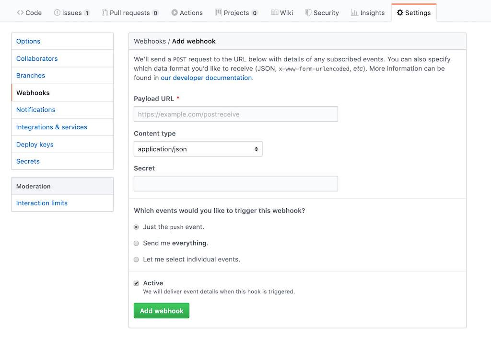

<Sponsorship />

<ByExample />

The following implementation shows you how to deploy a [Github Webhook](https://developer.github.com/webhooks/) in Node.js. Personally I am using this kind of GitHub Webhook to deploy my websites automatically on [Digital Ocean](https://m.do.co/c/fb27c90322f3). Without having to get into my web server with SSH to deploy my website manually, the ever running Webhook on my DigitalOcean instance makes sure (A) to pull the recent changes from GitHub and (B) to build my website.

# Webhook Setup on GitHub

Initially decide for which GitHub repository you want to run the Webhook. Then, navigate into *Settings* and *Webhooks* for this project. There you can create a new Webhook for this GitHub repository:



First, whether you are running your application on DigitalOcean or somewhere else, in the end, you only need to find out the URL or IP address where it is possible to communicate with your hosted Webhook implemented in the next step with Node.js. Put this address in the *Payload URL* field. Personally I am just using the IP address here with the port I am going to introduce in the implementation of the Webhook (e.g. `http://133.66.66.66:8080`).

Second, set the *Content Type* to application/json. And third, create a *Secret* string which shouldn't be shared with anyone else. Last but not least, we only want to received events when someone pushes something new to our GitHub repository.

# GitHub Webhook with Node.js

If you don't have an up and running Node.js application for this code snippet, check out this minimal [Node.js tutorial](/minimal-node-js-babel-setup/), to get you started. In the end, everything you need for your Node.js application's Webhook is the following implementation:

```javascript
import http from 'http';
import crypto from 'crypto';
import { exec } from 'child_process';

const SECRET = 'MY_GITHUB_WEBHOOK_SECRET';

http
  .createServer((req, res) => {
    req.on('data', chunk => {
      const signature = `sha1=${crypto
        .createHmac('sha1', SECRET)
        .update(chunk)
        .digest('hex')}`;

      const isAllowed = req.headers['x-hub-signature'] === signature;

      const body = JSON.parse(chunk);

      const isMaster = body?.ref === 'refs/heads/master';

      if (isAllowed && isMaster) {
        // do something
      }
    });

    res.end();
  })
  .listen(8080);
```

The implementation shows a bare bones HTTP server running in Node.js. Once it gets deployed, it receives the GitHub Webhook requests; given the *Payload URL* is set correctly to your deployed Webhook.

Also make sure to replace the `SECRET` with your *Secret* from your new GitHub Webhook. Only this way, only you are able to make verified calls to this Webhook (see `isAllowed` boolean).

In addition, we are only doing something in this Webhook when something gets pushed to the master branch (see `isMaster` boolean) -- which makes sense if you want to use this Webhook to deploy the most recent version of your GitHub repository. For further assistance, please cross-read this [tutorial from DigitalOcean](https://www.digitalocean.com/community/tutorials/how-to-use-node-js-and-github-webhooks-to-keep-remote-projects-in-sync).

# Deploy of GitHub Webhook

Now, we are going to deploy the Webhook as ever running service to DigitalOcean -- or whatever hosting provider you are using. Therefore, follow these steps:

* Create an individual GitHub repository for your Webhook project.
* Clone this Webhook project to your web server.
* Make sure it runs on your web server with `npm start`.

Now you can execute a sample request on Github for the repository where you have created your Webhook. The request should go through and you should be able to see some output on either

* 1) Github's Webhook Console
* 2) via `console.log()` from your Webhook project

Next, we will make the Webhook project on your web server an ever running HTTP server -- which also reboots if something goes wrong. We will use PM2 -- a Node.js process manager -- to run the application on our web server. First, install PM2 globally via the command line on your web server:

```javascript
sudo npm install -g pm2
```

And second, run your application:

```javascript
pm2 start my-github-webhook
```

If you need to let PM2 run an npm script for you, you can trigger it with the following command instead:

```javascript
pm2 start npm --name my-github-webhook -- start
```

PM2 should output a list of processes for all your running applications. Now, you don't need to worry about starting your Node.js application by hand anymore. PM2 takes care of it. If you need more readind about PM2 on DigitalOcean, cross-read this [tutorial on DigitalOcean](https://www.digitalocean.com/community/tutorials/how-to-set-up-a-node-js-application-for-production-on-ubuntu-16-04).

# Automatic Website Deployment

Last but not least, you need to implement the neccessary code in your GitHub Webhook for the automatic deployment of your website or any other application. For instance, you could replace `// do something` with the following line of code:

```javascript
exec('cd /home/rwieruch/my-website && npm run build');
```

Whereas you would have to replace the path and npm script with your own. If the command in the execution becomes to verbose, consider to give your project -- the one that you are going to deploy with the Webhook -- a bash script which executes everything to deploy the website.

```javascript
exec('cd /home/rwieruch/my-website && bash deploy.sh');
```

Also if you want to re-use the Webhook for multiple web application/website deployments, you can make the execution script dependent on the incoming Webhook request from your various GitHub repositories:

```javascript{7-10,25,27-33}
import http from 'http';
import crypto from 'crypto';
import { exec } from 'child_process';

const SECRET = 'MY_GITHUB_WEBHOOK_SECRET';

const GITHUB_REPOSITORIES_TO_DIR = {
  'rwieruch/my-website-one-on-github': '/home/rwieruch/my-website-one',
  'rwieruch/my-website-two-on-github': '/home/rwieruch/my-website-two',
};

http
  .createServer((req, res) => {
    req.on('data', chunk => {
      const signature = `sha1=${crypto
        .createHmac('sha1', SECRET)
        .update(chunk)
        .digest('hex')}`;

      const isAllowed = req.headers['x-hub-signature'] === signature;

      const body = JSON.parse(chunk);

      const isMaster = body?.ref === 'refs/heads/master';
      const directory = GITHUB_REPOSITORIES_TO_DIR[body?.repository?.full_name];

      if (isAllowed && isMaster && directory) {
        try {
          exec(`cd ${directory} && bash deploy.sh`);
        } catch (error) {
          console.log(error);
        }
      }
    });

    res.end();
  })
  .listen(8080);
```

This approach would require you to create GitHub Hooks with the same *Secret* for all your GitHub repositories that should be automatically deployed. Also every of your *to be deployed websites/web applications* would have to have a bash *deploy.sh* file. You can find my GitHub Webhook implementation which powers my websites over [here](https://github.com/rwieruch/github-webhook-automatic-blog-deployment).