<Sponsorship />

Recently, I built [my own course platform](https://courses.robinwieruch.de/) to teach students and professionals about web development. The courses on the platform are teaching about React and its ecosystem, but I want to generalize the platform's implementation in the future. It should be reusable for for other educational domains too. The platform launch came along with the release of my second course, [Taming the State in React](/learn-react-redux-mobx-state-management/), and therefore was the perfect playground to experiment with it. In the following article, I want to give you a huge brain dump of mine about why I built my own course platform, what I used to accomplish it, what challenges I faced, and what decisions I had to make along the way. The article might give you a couple of valuable insights into launching your own platform. I am definitely not an expert in this domain, because I just try to document my own learnings on my website. If you have any advice for me, feel free to reach out :-)

**TLDR:** It takes a lot of effort and energy, but it is a challenging experience which broadens your skill set and enables you to learn new things along the way.

So why did I decide to build my own course platform in the first place? I know that there are various alternatives such as Udemy and Teachable out there. So what's the motivation behind building your own course platform?

* **Learning:** I wanted to build an own platform to face all the challenges when shipping an own product. A lot of these challenges are explained in the following article. They didn't only challenge my abilities to code (which wasn't the hardest part), but also in challenging myself by creating, launching and advertising a product.

* **Independence:** The reasoning behind it is the same as for having an own website with an own domain rather than hosting your content on third-party platforms or using their third-party APIs. You never know how long these platforms survive, you never know how far the vendor lock-in reaches and you will have a hard time to transfer your audience to another platform eventually.

* **Tailored Solution:** I wanted to have an own platform for my content where I am able to make all the fine-grained decisions. I didn't want to be restricted by a third-party platform. I didn't want to integrate with the services another platform might suggest or any course structure which is recommend by it. For instance, since my content evolved around ebooks so far, I wanted to have an option to download these in different formats. Afterward, it should still be possible to offer links to source code projects for exciting applications or to give access to screencasts series to supplement the learning experience.

* **Pricing & Fees:** Many third-party platforms come with a membership pricing model or/and high fees when your course is sold. I wanted to avoid both by having an own platform. I wanted to cut out most of the middlemen when selling a course. It is similar to self-publishing an ebook rather than having a dedicated publisher for it. In addition, I can choose the third-party services that are integrated in my platform based on my needs, their pricing and features, and an effortless integration. I would only pay the services that are needed for my course platform and only the payment gateways would apply a fee for every payment that goes through them.

* **Experiencing the Journey:** It was always a milestone in my life to have a product one day that goes beyond an informational product such as an ebook or course. That's why I wanted to build a platform around my educational content. It would grow my abilities by facing all the challenges that come along the way. I wanted to experience the journey from an idea to the launch of a product on my own.

* **Full-Control:** It goes hand in hand with having a tailored solution to my own needs and having independence rather than using a third-party platform. But it goes far beyond it. I wanted to make the decisions when it comes to supporting students that cannot afford to pay for the courses. I wanted to be able to apply discounts whenever I believed it would support people from developing countries. I wanted to support diversity in the developer community by enabling minorities to take the courses. By having a third-party course platform, I wouldn't be able to apply those fine-grained rules, would I?

* **Open Sourcing:** I keep the idea in my head to open source the whole thing eventually. It would be great to be able to strip out all the specific parts and only leave the generic parts of the course platform so that everybody could use it for their own educational domain to serve courses on their own hosted solution. It is still a long journey to make it happen, but you can support me if you like the idea.

In the following, I tried to break up the different areas of building an own course platform. It will outline a few of the challenges I faced along the way, the decisions I made and the things I have chosen to work with to realize the platform.

# What to use for the client-side application?

Since the course platform is a web application, I wanted to use a single page application (SPA) framework or view layer library for it. The bigger question was: Would I want to learn a new framework/library or would I go with a known technology to build the platform fast yet efficient? I think this particular decision has to be made for every side project that evolves into a product eventually. I decided for the latter, using React as my core library for the client-side application, and [complement it with further libraries](/react-libraries/). Often, I have side projects that lead me nowhere but I have learned something new. This time, I wanted to ship the course platform as soon as possible, because my second course waited to be launched on it. In the end, it depends on your own priorities of learning something new or ending up with a product eventually. It is hard to achieve both with a limited amount of time. Nevertheless, even though I have chosen React as my core library, I ended up with enough challenges on the way to learn new things.

Maintaining an own website, where I write frequently about web development, is a valuable asset in order to know about all the little things that come with having an own hosted solution. It was important for me to make the course platform accessible to search engines, because I knew how valuable it would be to be exposed to organic search traffic. I am aware that web crawlers became more efficient in crawling SPA applications over the last years, but still I wanted to be on the safe side. So I decided to give server-side rendering with React a shot. I would have had the option to go with a custom server-side rendering solution or [Next.js](https://github.com/zeit/next.js/). Either way, I would learn something new, because I never did server-side rendering in React in a professional project. I made the decision to try Next.js in order to launch the course platform as soon as possible by having a supportive framework. If I have time in the future, I can always decide to roll out my custom server-side rendering solution to avoid the vendor lock-in. But I must admit that developing with Next.js was a pleasant experience. It came with its own challenges such as integrating [Redux and Redux Saga on the server-side](/nextjs-redux-saga/) or having the non existent window object when using external libraries that are not supported in server-side rendered environments. But I managed to solve them.


Regarding the course platform itself, I had to figure out how to present the content. I tried to keep it simple by having a "Browse Courses" page, giving an overview of courses and packages, and a "Course Detail" page, giving more information about the course content. I didn't do any user testing regarding what content should belong on the overview or detail page. (If you have any recommendations for improvements, I would appreciate it if you reached out to me :-)) In addition, I integrated the whole authentication flow from sign up, sign in to sign out and password reset and password change capabilities. If an user wants to enroll in a course, a payment dialog would open up. Once a student is enrolled in a course, they will have a dedicated page to access all the course content. The course content that is shown on the overview and detail pages is only one large JavaScript blob. It was the easiest way in the beginning without worrying about storing these meta information somewhere else.

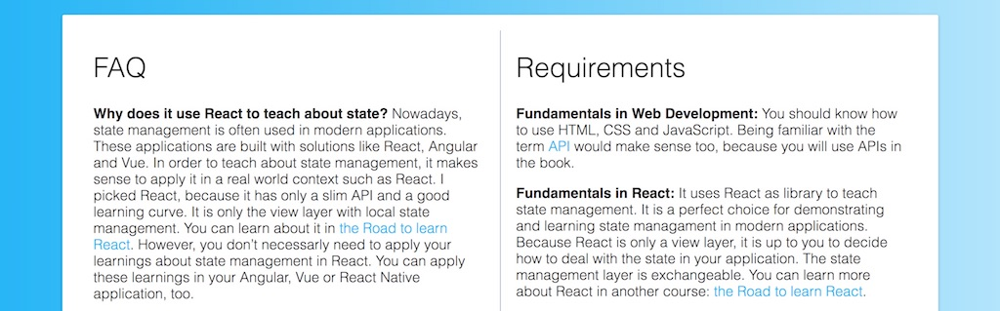

In terms of styling, I kept it simple from the implementation perspective by using the built-in style option provided by Next.js. Basically, it is CSS in JS with a pre-loaded styling framework. In addition, I think I am doing fine to implement an own application, but when it comes to styling I have to learn heaps from others. Before ending up with various custom CSS definitions that are cluttered in the whole application, I tried to abstract certain layouts from the beginning. That way, I ended up with a couple of colored backgrounds with optional radiants, rotated backgrounds, and [SVG background patterns](/react-svg-patterns/). All of them are implemented in a reusable way. So I had to worry about them once, but wouldn't need to touch them again afterward. They are only composable components which make use of React's children for each content item.

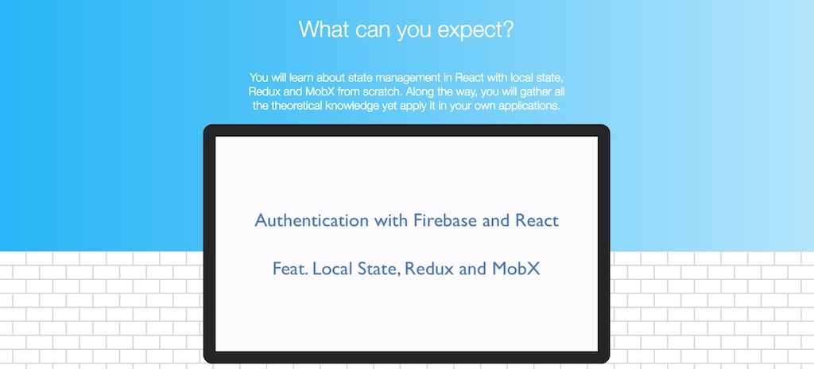

I didn't want to implement common components such as a navigation bar, dropdown menus and dialogs from scratch. I was pretty much indifferent which library should do the job, so I decided in favor of Material UI even though I heard only good things about Semantic UI in React. I wanted to give the latter a shot in the first place, but as it was about time to choose one UI library to complement my React core, the Semantic UI website was offline. I will try it the next time, because people highly recommend it. After all, I think it doesn't make a huge difference which UI library you choose, as long as it includes all the features you are about to use in your application.

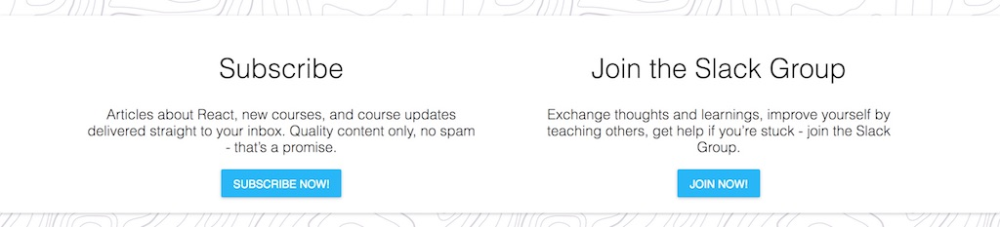

Another requirement was to make the platform accessible on tablet and mobile as well. So I had to make it responsive. Even though I try to avoid CSS as much as possible, I figured that using a combination of [media queries](https://www.w3schools.com/css/css_rwd_mediaqueries.asp) and [flexbox](https://www.w3schools.com/css/css3_flexbox.asp) would do the job. After all, it boils down in aligning your containers differently on mobile, desktop and tablet.

```javascript
<style jsx>{`
  .packages {
    display: flex;
  }

  @media (min-device-width: ${PHONE}) {
    .packages {
      justify-content: center;
      flex-wrap: wrap;
    }
  }

  @media (max-device-width: ${PHONE}) {
    .packages {
      flex-direction: column;
      align-items: center;
    }
  }
`}</style>
```

Often, only using flexbox would be sufficient without even using media queries. I tried to come up with different thresholds for desktop, tablet and phone and stored them in a constants file.

# How to keep track of users?

Most of the course content can be downloaded once students have enrolled in a course. Their personal dashboard gives access to all the learning materials, including the ebooks in different formats (PDF, EPUB, MOBI) that were generated on [Leanpub](https://leanpub.com/taming-the-state-in-react), screencasts that are hosted on Vimeo but only accessible on the platform's domain, source code projects to showcase examples but also to get students started with boilerplate projects, and further readings related to the topics.

It was a necessity to introduce the user domain to keep track of users and eventually their enrolled courses as well. The course platform had to have an authentication solution with sign up, sign in and sign out but also password change and password reset. In an ideal world with unlimited time, the best solution would have been to roll out my own solution yet without implementing the underlying authentication flow from scratch. I would have used [Passport.js](http://passportjs.org/) along with a Koa, Express or Hapi server to manage the API requests. But I didn't for keeping the first iteration of the course platform as minimal viable product (MVP). So I decided in favor of Firebase to manage my users but also their enrolled courses. This decision might cause trouble eventually when I have to migrate over to an own solution, but so far I am running on a free plan which is sufficient.

The second course that I have launched along with the platform teaches state management in React. Two of its three packages include exciting source code projects. A couple of these projects are boilerplate projects to get students started with firebase authentication in plain React but also when using it with other complementary libraries such as MobX or Redux.

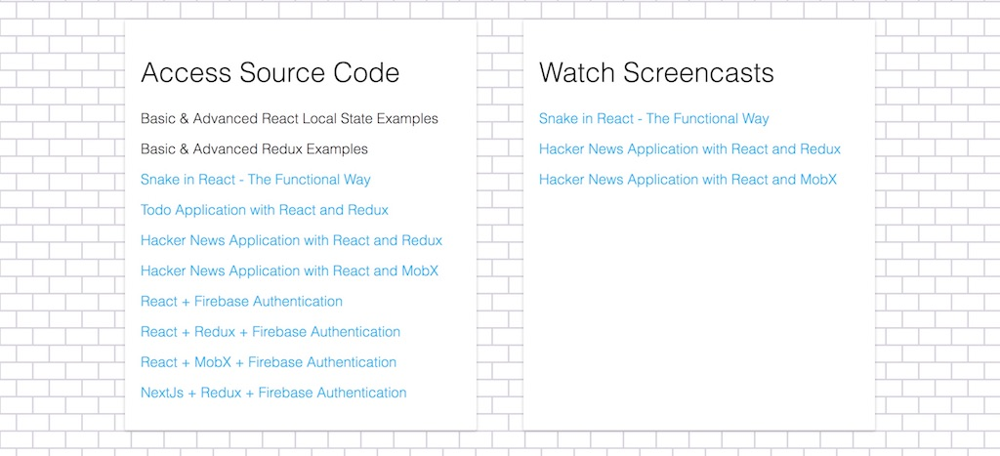

So far, Firebase has given me a seamless integration regarding user authentication. I am in control of the session handling, knowing when an user is authenticated and protecting routes in React Router by using [higher order components in React](/react-higher-order-components/). All of these components are included in the source code projects of the Taming the State in React when enrolling in the complete course.

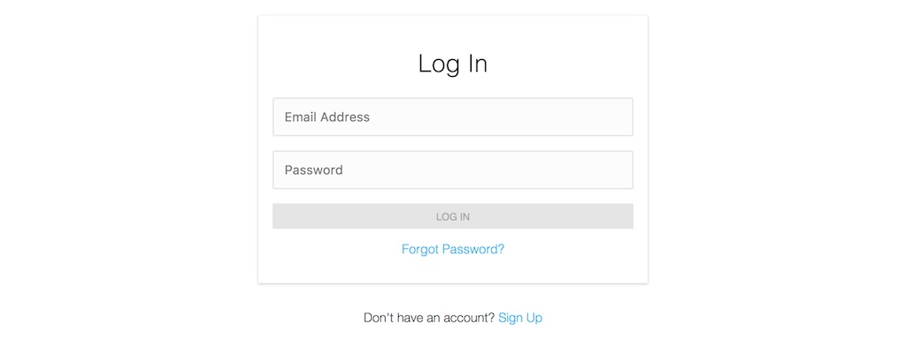

At some point, I would love to migrate over to a server-side solution using Passport.js. It should be a standalone service, because so far I have used a couple of other server applications that deal only with one subject successfully. One of these services that handles the payment processing will be mentioned later on.

# How to organize the course content?

Before buying a course, students can read up the course content on a course details page, download a preview of the ebook, read up a several testimonials, and checkout the FAQ section for further information. Each course comes with a variation of packages to enrich the learning experience.

Since I love to write about educational content, an ebook is the essential part of my courses. The recent course, Taming the State in React, has a 250-page ebook that takes you on a journey to learn and master Redux and MobX in React. These learnings could be applied in any other solution such as Angular or Vue too. Furthermore, I added more content around the ebook to give students a course feeling rather than just reading a book. In the end, it boils down that only reading a book isn't sufficient to learn such a practical topic. That's why the ebook already comes with plenty of hands on examples where students have to code themselves.

I find when people have the opportunity to use all their senses to learn something new, like reading, listening and trying something on their own, they are much more likely to learn from it. That's why I wanted to build an own course platform in the first place, because it gave me the opportunity to adjust the course content around the essential ebook as its core.

Each student can download the ebook in the three formats PDF, EPUB and MOBI. I created the books on Leanpub and I am grateful for their service. If you are going for the plain ebook and don't want any extra material, you can [buy it on their platform](https://leanpub.com/taming-the-state-in-react) too. On the course platform though, you would get a bunch of more references to reading material when enrolling in the bare essentials.

After I finished writing the ebook, I had the idea to add screencasts to complement the course. It would enrich the learning experience, because students could follow me on how to build a couple of applications from scratch with all the reasoning behind it. So I had to figure out how to give access to videos without streaming them myself on the platform, yet without giving them out for free because I would have hosted them somewhere else. I compared YouTube and Vimeo to solve the problem of video streaming. In the end, I have found out that Vimeo, even though it would require me to subscribe for a Plus Account, would give me domain level access controls to only allow streaming the uploaded video material on my course platform’s domain. It wouldn't be possible to access them on Vimeo. Youtube doesn’t offer such a feature (only on request for high-end customers).

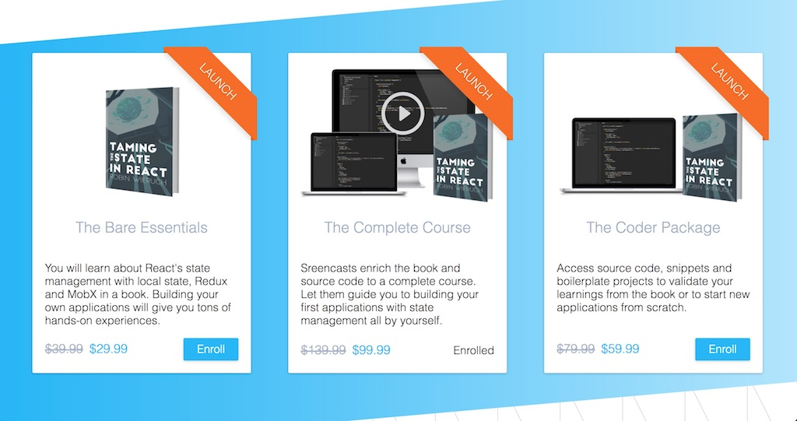

The last course of mine had three packages ranging from only buying the 250-page ebook, that offers a practical learning experience, to having access to exciting source code projects and screencast series. It is always hard to estimate what people would pay for a course. Over the last 6 months I invested every free minute in the content, so I would argue it has a great quality. After completing the course, students are set up to build their own applicatiions using the taught topics in a practical environment. It goes beyond the basics and teaches best practices in scaling applications. In the end, students bought all kinds of packages evenly distributed. Hence, I would assume that the pricing matched pretty well. Surprisingly though, the complete course package was sold the most for $99.

# How to administer users and courses?

On the administrative side of the platform, there isn't any automation involved yet. Before launching the platform along with the course, I thought it would be a good idea to setup a "Contact & Troubleshoot" page. It includes common questions that I would have expected after the launch and in addition included a pre-filled subject and body when writing emails with all the information (e.g. email address and user id on the platform) that I would need to resolve certain issues. It involved topics such as upgrading a course package, enrolling in a course when the course was bought somewhere else or requesting an invoice.

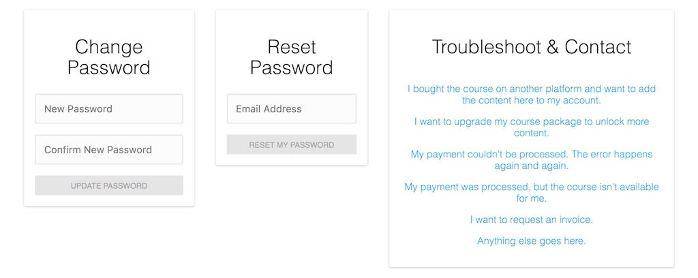

The most frightening part for me was the payment and checkout flow when launching the course. That's why there are two shortcut contact emails to give notice about payment issues. Fortunately, no one had to make use of these emails, because everything went flawlessly. I tested the payment flow well before launching the platform (more about this later), but you never know in what kind of problems your users might run. It gets more of an important subject when money is involved. So it gave me a better feeling to know that I would have the troubleshoot area when launching the platform and the course.

Furthermore, I built a simple admin page before launching the platform. The page gives me access to all users on the platform (email, username, sign up date, enrolled courses and revenue driven by user). Moreover, there are two actions to add courses manually and to show enrolled courses (course id, package id, purchase date, revenue, currency, payment type) per user. In addition, the admin dashboard has a couple of filter and sorting features to make it easier to navigate through it. But everything is kept pretty simple on that side, because only I would see it in the end. By having all this information, it became simple to associate users and courses to entities in the database, to email requests or to payments on the Stripe or PayPal dashboards.

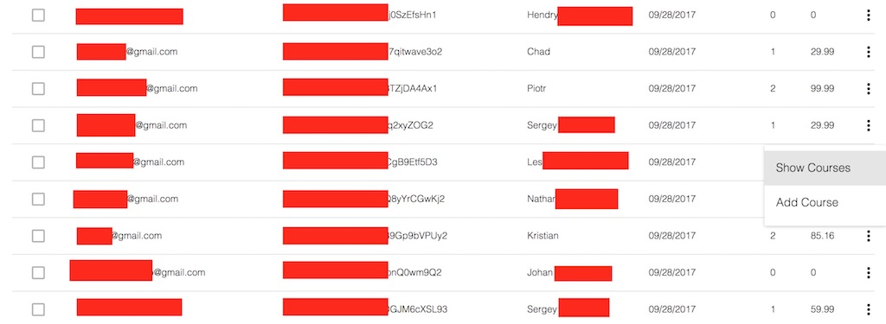

Especially the ability to add courses manually to a user was important for me, because of these following three things:

* First, it was my backup in case of a successful payment that didn't lead to an enrollment in the course. Luckily it never happened.
* Second, it would give me the opportunity to add courses to users who bought the course somewhere else. For instance, before launching the course, I had several people pre-ordering it on other platforms. That way, I could easily add them to their pre-ordered packages when they signed up on the platform.
* Third, I can provide students who cannot afford to pay for the course an option to access the course without going through the payment flow. That way, I hope to support groups of minorities and people from developing countries. Last but not least, I can manually upgrade the packages of students.

# What about the server-side application?

So far, I only mentioned the client-side application without telling you anything about the server-side application. That's because there is no real server-side application. If I had decided to go with Passport.js instead of Firebase for my user authentication process, I would have implemented it as an authentication server using any library such as Express, Hapi or Koa. If that had been the case, I would have gone with any database to store my users, courses and invoices, because the data structure wouldn't become too complex. I also invested a bit of time to evaluate outsourcing the data storing to a third-party provider such as MLabs or MongoDB Atlas. But in the end, I went with Firebase on the client-side application. It helped me to keep the first iteration of the course platform as MVP.

Firebase on its free plan only allows 100 simultaneous connections. I wasn't too sure about this number. Having Google Analytics on my own website, it could be considered as too low when announcing a new product. That's why I upgraded the plan for the course launch in case there would be a spike of users on the platform. After launching the course, I saw that 100 simultaneous connections would have been sufficient. Even though the launch went with several launch stages, the number of simultaneous users on my platform never went over 47 for the initial release and later on never over 74. It went higher on my own website though, where I put the launch blog post. So I think it depends on where you link your audience when launching a product on your own platform.

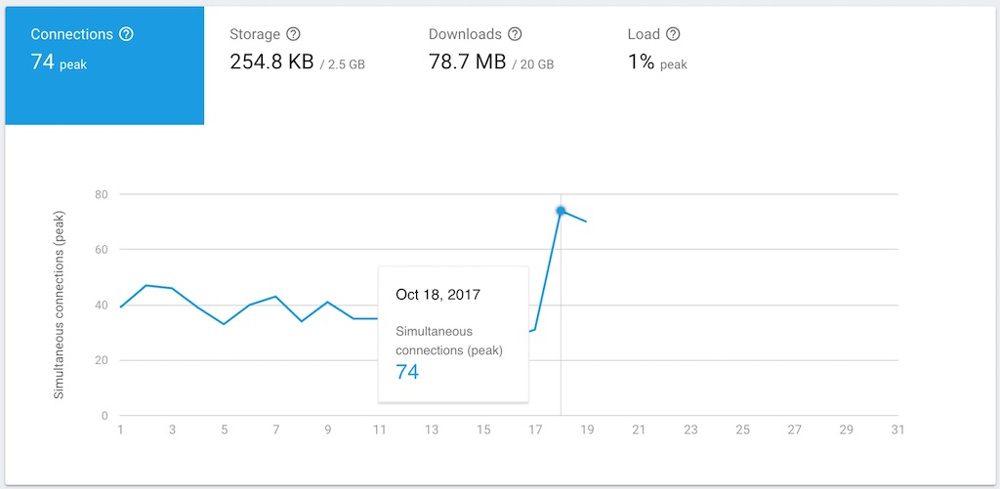

I created two firebase projects for development and production environments. Under the assumption that everything should work regardless of the environment, it gave me an effortless experience to develop the platform itself. It enabled me to have my development sandbox to make mistakes in the early stages.

So far, the only server-side application for my course platform is my payment server powering Stripe for charging credit card payments. It is one of my few microservice to keep concerns separated and I hope when adding new server-side functionalities that I can keep them in similar small scale applications like the payment server. In the following, you will read more about the challenges in a whole when dealing with customer payments on your own platform.

Last but not least, I have a couple of APIs that power my course platform as well. As already mentioned, the platform uses Firebase and Vimeo as external services, even though I don't have to touch Vimeo's API. Vimeo only allows me to upload and stream videos from their platform with restricting it to my platform domain. In addition, Stripe and PayPal are used to process payments and there is a neat currency API that allows me to have currency conversion in the payment flow.

# What about payment on a course platform?

Using an own payment solution was one goal of having an own course platform. It gives you the promise of low fees when customers purchase a product, because you only have to pay the payment gateway fee and the currency conversions. In addition, it is empowering to be able to charge customers yourself without relying too much on third-parties. Hence another goal was it to learn about the different payment options, how to integrate them in an application and how to serve different needs (credit, PayPal, ...) for your customers.

There were 4 different payment options that I found out about:

* Stripe
* PayPal
* Braintree
* Gumroad

Previously, I used Gumroad to sell pre-orders of my course. It is a great solution for offering a product. The payment flow is fully handled by Gumroad and it doesn't take any effort to embed their checkout form on your platform. It comes with a great design as well. In the end, there was one missing feature. After purchasing a course, I would have wanted a callback function that notifies the course platform about a successful payment. Afterward, the course platform would enroll the student in a course. But without having the callback function, there was no way to enroll a student. It would only be possible to manually lookup the order on the Gumroad platform. It wouldn't have been possible to provide the whole checkout experience on the course platform. That's why I didn't use Gumroad for the course platform.

It was exciting for me to use Stripe for credit card purchase for an own professional product. Considering the conversations about Stripe on Hacker News, Reddit and Podcasts, it must be a great product. Because I was so excited about using Stripe, Brainstree was never an option for me, even though it would integrate both credit card and PayPal purchases. In the end, maybe Braintree would have been the better solution. Because whereas Stripe was an effortless integration, integrating PayPal in the course platform was a troublesome experience. After all, I decided in favor of Stripe and PayPal and never gave Braintree a shot. Maybe the next time, because it is always exciting to learn something new.

<ReadMore label="How to setup Stripe in React" link="/react-express-stripe-payment/" />

Before deciding to integrate PayPal as well, I read up several resources to figure out how much people would want to use PayPal over credit card. It wasn't possible to come up with any statistical evidence, but people reported increased sales when offering PayPal. Still, I had the notion to prefer credit card over PayPal for the course platform and therefore discouraged users from using PayPal by having an extra step in the checkout process. The extra step was introduced during the course launch. Before, people used both payment options rather equally. But after introducing the extra step, people started to use their credit card over PayPal. There is no strong evidence, but I think the course purchases weren't going down due to discouraging from using PayPal.

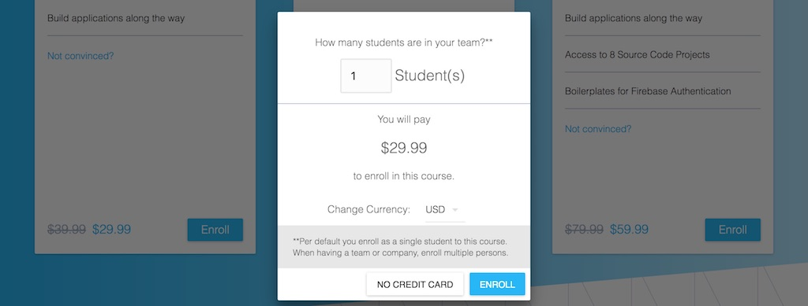

There was another crucial decision for the checkout experience. I decided to enforce a sign up before a student could enroll in a course. If a user wanted to enroll in a course, but didn’t have an account yet, he/she would be redirected to the sign-up page in order to create an account or to sign in into an existing account. There was no way to measure it, but it might be that there is a number of users who didn't enroll in a course because of this restriction.

An alternative would have been to create a temporary account on the user's behalf when enrolling in a course. But I figured that it could lead to a bunch of problems. For instance, what happens if the student has an account already, but didn't sign in before, and now needs to merge the course into his/her existing account? Another crucial step would be to complete the account registration afterward. If users missed it, they would wonder where they can access the course. In order to access the course material, you need to have an account on the platform. After all, all these problems led me to introduce the sign up redirection as simplest solution for it.

There are a couple of features in the checkout itself. For instance, users can purchase more than one license. In the calculation of the course, users with multiple licenses get a discount based on the licenses count. Another feature would be the ability to support courses that are for free. Users can decide to support the free course by donations. That way, a course can be kept for free to enable other students to enroll in them without any costs.

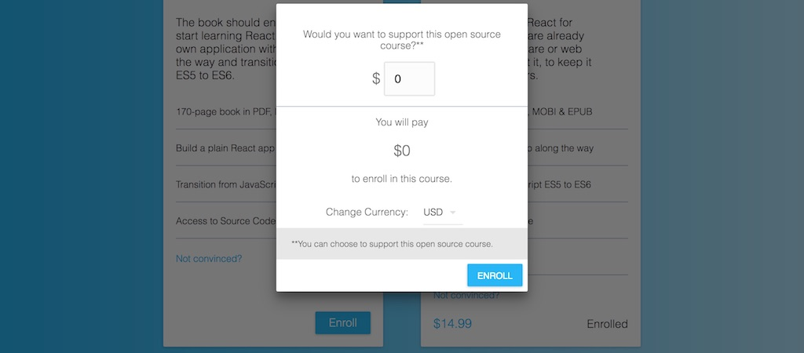

It is not the best solution to charge in a foreign currency as a European citizen. As most of my website readers come from the United States, I wouldn't want to confront them with another currency. Still, I would want to avoid the currency exchange fees if it is possible. They can get exceptional high especially when using PayPal. Since a greater part of students is from Europe, it was a step in the right direction to offer Euro as currency as well. In conclusion, users could choose from US Dollar and Euro as currency for their purchase.

It wasn't too difficult to add the currency feature to the course platform. There is a [neat API](http://fixer.io/) to pull in all the latest currency exchange rates for a base currency. For instance, calling [https://api.fixer.io/latest?base=USD](https://api.fixer.io/latest?base=USD) would output all the exchange rates when USD is used as base currency.

```javascript
{
  "base": "USD",
  "date": "2017-10-10",
  "rates": {
    "AUD": 1.2846,
    "BGN": 1.6579,
    "BRL": 3.1684,
    "CAD": 1.2499,
    "CHF": 0.97669,
    "CNY": 6.5787,
    "CZK": 21.955,
    "DKK": 6.3091,
    "GBP": 0.7579,
    "HKD": 7.8043,
    "HRK": 6.3605,
    "HUF": 263.33,
    "IDR": 13489,
    "ILS": 3.4982,
    "INR": 65.247,
    "JPY": 112.36,
    "KRW": 1132.7,
    "MXN": 18.572,
    "MYR": 4.22,
    "NOK": 7.9465,
    "NZD": 1.4146,
    "PHP": 51.477,
    "PLN": 3.6391,
    "RON": 3.8784,
    "RUB": 57.882,
    "SEK": 8.0754,
    "SGD": 1.3564,
    "THB": 33.26,
    "TRY": 3.6776,
    "ZAR": 13.688,
    "EUR": 0.84767
  }
}
```

If a user uses another currency than USD, it would simply calculate the amount by multiplying it with the currency exchange rate. The pseudo code for the final amount calculation is similar to the following:

```javascript
const applyLicenseDiscount = licensesCount => amount =>
  licensesCount * amount * // do apply discount based on licenses count

const applyCurrency = exchangeRate => amount =>
  exchangeRate * amount;

const getFinalAmount = (amount, licensesCount, exchangeRates, selectedCurrency) =>
  flow(
    applyLicenseDiscount(licensesCount),
    applyCurrency(exchangeRates[selectedCurrency]),
  )(amount);
```

The biggest challenge was to make the payment flow as robust as possible. I didn't want to end up with any surprises when money was involved.

**So what steps did I take to have a robust payment flow?**

* Unit and integration tests for the payment business logic
* Snapshot tests with [Jest](https://facebook.github.io/jest/) for components involved in the payment flow
* Manually going through the payment flow once in a while and before the launch
* Type checking with [Flow](/the-soundcloud-client-in-react-redux-flow/)
  * making sure that all parameters reach their respective APIs (Firebase, Stripe, PayPal) without being undefined

**And what steps did I take to have fallbacks in case of payment issues?**

* Fallback email templates if a user ran into a payment issue on the "Troubleshoot & Contact" page
  * no one had to make use of it
* Getting familiar with the Stripe and PayPal dashboards
* Setting up an admin page to have an overview of users and courses
 * being able to associate accounts with courses, payments on the Stripe and PayPal dashboards, and emails
 * being able to enroll users manually in case a payment was successful, but he/she didn't enroll in the course

That way, I was prepared in case of any payment issues. In the end, nothing bad happened due to testing, type checking and manual testing. But I must admit that the payment flow was the feature that was tested the most on the course platform.

# Where to host the course platform?

You can choose whatever hosting platform suits you. The most efficient one for me was using [Digital Ocean](https://m.do.co/c/fb27c90322f3). It powers all of my websites, applications and APIs. Regarding all of my websites, they are powered by one $5 Droplet using [Nginx's Server Blocks](/own-website-in-five-days/). Furthermore, all of my applications and APIs are hosted on a few Droplets using [Dokku](https://github.com/dokku/dokku) as underlying PaaS. Maybe Dokku is not the newest kid on the block, but I like its simplicity to get people without much experience started in this domain. It is simple to implement things such as SSL or an own database by using its plugin system. Dokku is great for running different kinds of one application as well. For instance, the course platform has a staging and production instance. So I am always able to test the production ready application when deploying it to my staging instance.

<ReadMore label="Host a single or multiple applications on Digital Ocean" link="/deploy-applications-digital-ocean/" />

When I briefly investigated alternatives, I was pretty excited about [now](https://zeit.co/now). It seems to be a great product and I love its ability of having immutable deployments. Re-deploying my applications on Dokku gives sometimes downtime with a 502 bad gateway. I would need to figure out how to solve it. Initially, I thought it would be because of the droplet size, but it wasn't and all of my other applications re-deploy instantly. So I need to investigate why it happens. However, in the end the now service was a bit too expensive when having an own domain and didn't fit into the rest of my hosting stack.

# How to track user activity?

Basically, I use 2 out of 3 services for tracking:

* First, the course platform uses Google Analytics with the [react-ga](https://github.com/react-ga/react-ga) node package. It is a simple drop in solution that makes it easy to track the most important user activities on your website. Since I use Google Analytics for all of my websites and applications, it makes it maintainable to manage those properties at one place.
* Second, the course platform uses [Sentry](https://sentry.io) for error tracking. It is only a small JavaScript ES6 service that forwards errors to the Sentry API with the help of the [raven](https://github.com/getsentry/raven-node) and [raven-js](https://github.com/getsentry/raven-js) node packages for the server-side and client-side. It is used for errors in React components and as a Redux middleware. Before, I wanted to use [Track.js](https://trackjs.com/pricing/), because I knew it from my former job, but it turned out to be too expensive. Sentry has a free version.
* The third service is not used yet, but I am planning to integrate it in the future. It is called [Mixpanel](https://mixpanel.com) and would allow me to track fine-grained activity on the platform. For instance, it would be valuable to know how many times a preview of an ebook was downloaded or how often different formats (PDF, EPUB, MOBI) were consumed.

In the end, Google Analytics and Sentry give me a bigger picture of user activities and great error reporting for the course platform.

# How to launch a course platform?

It was the most frightening thing to finally launch the course platform along with the course. I worked on both for the last 6 months while having a 9 to 6 job and invested every free minute, weekend and holiday in it. You can read more about the journey in my [launch blog post](/learn-react-redux-mobx-state-management/).

Before launching everything, it was great to know that the course platform already ran for one month without any issues. Users were able to purchase my previous ebook, [The Road to learn React](/the-road-to-learn-react/), on it. I think it is a great assurance to test the platform under the radar before an official launch.

As the day of the launch came into reach, I felt two increasing psychological effects: impostor syndrome and procrastination. It was tough to finish the last 10% of the course itself and the course platform. Regarding the impostor syndrome, I spoke to others before the launch and they assured me that it was a normal feeling. Most of them knew the feeling before launching something themselves. Especially, when it is about educating others in a topic. However, it was exceptionally hard to endure and if I hadn't promised the course in advance on social media and worked every free minute on it over the last 6 months, I might have just not launched it. But I did and it was great to see people actually enrolling in it and taking the course to learn about Redux and MobX.

For the launch day, I have written up a launch blog post for my website and essentially linked all the initial traffic to it. If people were interested in the course, the article would point them to the course platform. Otherwise, my own website would be able to handle most of the traffic in case of any surprising spike of user activities. Furthermore, my interested people wouldn't end up from the beginning on a paywall, but on a personal blog post that tells the story behind the product.

As mentioned, I upgraded the Firebase plan for the launch day and the following days to handle more than 100 simultaneous users on the course platform. 24 hours before the launch, in the middle of the night, I panicked because I didn't have any assurance that the server wouldn't break in case of too many users hitting the platform. So I ran a stress test on my course platform with the help of an external service in the night before the launch. The stress test went flawlessly even though I wonder up to today if it wasn't a fake after all. But it gave me a peaceful and restful night though.

Being more and more involved in having an own website and platform to be managed, I read up a couple of relevant marketing articles each second week. Fortunately, I have my girlfriend Liesa on my side [who is professionally active in the topics around content marketing](https://www.iamliesa.com/). So it was great to have her as my backup. However, even though knowing about a couple of tricks in the domain, I have had a hard time to transform them into action items. There is always this bad feeling when pitching someone else an own product. Even more when money is involved. In a perfect world, I want to give people a great experience without needing to pitch it to them. Nevertheless, if the educational content that I produce is the way I want to go in the future, I guess I have to learn how to cope with it.

There were two occasions when I had a bad feeling about pitching my own product: Product Hunt and my mailing list.

As a regular Product Hunt user, I wanted to include the platform for my launch. I read a [couple](https://blog.producthunt.com/how-to-launch-on-product-hunt-7c1843e06399) [of](https://help.producthunt.com/posting/how-to-post-a-product) [articles](https://medium.com/swlh/product-hunt-101-426511f03501) about launching on it. Two weeks before the launch, I approached two potential hunters on Twitter. I procrastinated doing it in the first place, because I didn't want to pitch my course at all. However, I hand picked those two hunters as the best fit for my course. Unfortunately, yet expected, as it was a pretty late request and cold mailed, I never got an answer from them. I think it is too bold after all to just reach out to people with whom you never connected before. I haven't had a good feeling about it from the beginning, but at least I tried. A couple of days before the launch, I decided to hunt my own course as product and prepared all the material for it.

My mailing list had over 7000 subscribers at the time of the launch. Usually, I update my subscribers every month about recent articles from my website about web development. So I never spam them. I am so grateful for the people believing in my content and subscribing to it. It was tough though to grow such a mailing list and it was a lot of effort that I have put into it over the last 18 months. Since I hate subscribing to too many newsletters myself, I try to keep the curated content update on a monthly base. However, now it was time to make use of the mailing list, because I launched a course that I worked on for over 6 months after all. So when I read about launches of other products, it was hard to accept that people would email their subscribers up to five times for a launch. Even though it grew the sales for them massively, I couldn't do it for my own launch. In the end, I barely managed to write two launch emails. It is because I don't want to bother people with something in the first place. I would want to avoid all the sales stuff, if I could do it, but after all if you make a living out of it you have to accept how the business world runs :-/

In the end, I found the open rate of 40% for both emails great though. Having no comparison after all, I am grateful that people read those emails and clicked through the content that was delivered to them. I never tried to add anything about SPF and DKIM to prevent landing in spam folders of my subscribers. (Should I?) Perhaps it would be an option to improve the delivery rate. You can view both launch emails in [my Newsletter backlog](https://www.getrevue.co/profile/rwieruch).

Finally, there was the launch day. The course was supposed to be officially launched on Twitter. It would be morning for the US west coast. Since I am travelling through south east asia at the moment, it was midnight for me. I was prepared for a long night in case of spiking user activities, comments on Twitter or Product Hunt, or any issues with the course platform itself. But there weren't any issues or bigger discussions in the end. I got great feedback on Twitter from my followers and was retweeted by some great people in the React community ([Mark Erikson](https://twitter.com/acemarke), [Dan Abramov](https://twitter.com/dan_abramov) and [Ali Sharif](https://twitter.com/sharifsbeat)). I want to thank you for all of your support at this point!

On Product Hunt the votes didn't take off, but after a couple of minutes Dan Abramov commented on my course. That was a huge surprise. I am not sure what would have made me more happy at this point in time; spiking upvotes or the comment by Dan. I guess in this moment, the latter outweighed everything else. It made me happy!

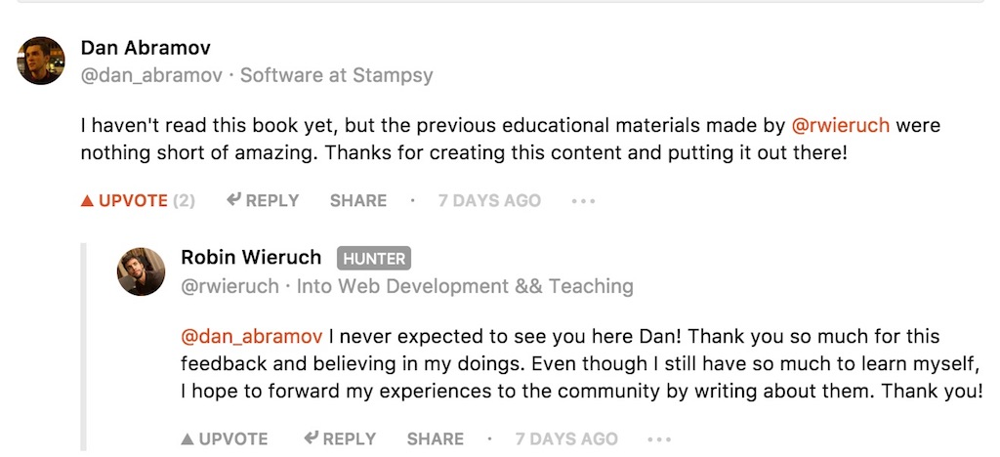

After tweeting about it, a couple of days later someone from Product Hunt approached me and featured the course in the popular section. I didn't mention his name here because I am not sure if his name should appear in this article. But thank you so much again for reaching out and supporting me in this case! After all, even though there are hundreds of articles out there how to launch on Product Hunt and how people did it, I found for myself that the most important thing to do is to keep being yourself.

The courses didn't bring me any six figure revenue, but that's okay, because I never expected too much from it. I hoped that it would compensate the work that I have put into it over the last 6 months and it did that well. Regarding the course itself, maybe it was too much niche or I am just too late with the topic itself, but I think state management in any view layer library or single page application framework will not go away in the near future. The course offers plenty of foundational and advanced knowledge about the topic. So it is a great investment for everyone to learn about those things when building web applications with advanced state management.

Were there any hiccups during the launch? I was prepared for emails and people asking questions during the launch, but even though there were people buying the course, everything went surprisingly well. For instance, because I was prepared, I could easily add course packages to users that have bought the course somewhere else. That way, I was also able to upgrade users from pre-orderings when they wanted to access the complete course. The email templates prevented any bigger issues and kept the emails short yet precise. For instance, there is no invoice system yet, but people could ask for it with the contact form. Furthermore, there was no payment problem at all even though I would have been prepared for the case.

In the end, I want to thank everyone who supported the launch of the course. Be it on [Twitter](https://twitter.com/rwieruch), [my Newsletter](https://www.getrevue.co/profile/rwieruch) and [Product Hunt](https://www.producthunt.com/posts/taming-the-state-in-react). Thank you :-)

# How much to pay for an own course platform?

The costs for an own course platform can be summarized into ongoing subscriptions and one time payments. In the beginning, when I started to write the ebook, I made a one time payment on Leanpub to create an ebook on their platform. It costs $99 at at time of writing this article. Leanpub makes it effortless to self-publish an ebook and they offer plenty of options to write it. In my case, I simply connected my GitHub repository with the manuscript to my Leanpub account and the platform took over to generate an ebook from the markdown. Afterward, you can decide on your own if you want to sell your ebook on their platform or take it on another platform. I decided to make use of both. As a cheaper alternative to Leanpub, you can convert several input formats into your own ebook formats by using something like [Pandoc](https://pandoc.org/).

There was no way around buying an own domain for the course platform. But that was only $11.99 for a year, because it wasn't too fancy. In addition, as already mentioned in the article, I host all of my websites, applications and APIs on [Digital Ocean](https://m.do.co/c/fb27c90322f3). The dedicated droplet for the course platform costs $10 a month, even though I am sure it would run with a $5 droplet as well.

The platform uses the free Firebase plan at the moment. Only for the launch I was cautious and upgraded to the $25 plan to allow more than 100 simultaneous connections. It was a one time investment.

Last but not least, the videos streamed on the course platform are powered by Vimeo Plus. It offers domain access level controls when being on this plan and costs $5 per month.

One time payments:

* 99$ Leanpub
* 25$ Firebase

Monthly Subscription:

* $1 Domain
* $5 Vimeo Plus
* $10 Digital Ocean

So effectively it costs me $16 per month to run the course platform now.

# Any planned features for the course platform?

There are so many ideas in my head to improve the course platform and to open source it eventually, but it takes a lot of resources to realize all of these things. It took me already 4 days to write up this article to get people excited about the project. Apart from the course platform itself, the courses on the platform are in great shape. A couple of days ago, I released the 4th edition for [The Road to learn React](/the-road-to-learn-react/) to keep it up to date for students to learn React for free. Furthermore, people started to translate it to Portuguese, Russian, Spanish, Italian and Korean.

My long term objective would be to open source the platform eventually. I guess it could be a valuable option for everyone to get an independent course platform up and running. In addition, a framework for a course platform makes it always easier to just focus on quality content itself. In the end, it is a challenge to strip out all the specific parts to keep the course platform as a generic platform while having limited time. Perhaps someone wants to fund the project to help me to keep going with it :-)

A couple of days ago, I launched another addition for the course platform: a partner program. It should give people the opportunity to spread the word about a course on the platform by earning a cut of the revenue that is made with their referrals. So far, it works as simple as sharing a link to the platform with your own partner identifier. If a person buys a course on the platform coming from the referral link, the partner gets 50% of the revenue. There are so many people out there who recommend great courses and I wanted to provide them an option to earn their share of money with it. If you have an account on the platform, you can access the referral page in the navigation bar.

I would love to add [Purchasing Power Parity](https://en.wikipedia.org/wiki/Purchasing_power_parity) to the course platform to enable everyone around the world to afford buying courses. So far, I haven't found out about a neat open source API that would give me the discounts depending on country codes. Do you know about one or want to build one as open source project? Nevertheless, at the moment it is a manual process to provide discounts for students from other countries when they reach out to me.

Update: [I added Purchasing Power Parity to the course platform and open sourced a JavaScript library for it](https://github.com/rwieruch/purchasing-power-parity).

At some point, there should be a flexible way of upgrading packages in a course. For now, it is a manual process by using an email template as well. Students enroll in a second package of the same course and can get a refund of the amount they have paid. In addition, integrating coupons on the platform would allow me to give discounts for people coming from my own website or somewhere else. I guess it is a neat way to give price off for certain events or student groups.

On the course platform, it is possible to purchase team licenses as well. So far there wasn't made any heavy usage of it, but it would be neat to have a proper team dashboard to invite team members to an enrolled course with multiple licenses.

Regarding the technical perspective: What about Cloudfare? I only heard good things about it regarding caching and content delivery around the world, but never had the time to introduce it to the platform nor to any of my websites. It frightens me too much to introduce another caching layer besides of webserver caching and service workers. If you know more about it, I am looking forward to get some tips about it :-)

So far, there are more than 1100 users signed up on it. It is growing by more than 30 sign ups per day, but most of the people only sign up for the free ebook coming from my own website. A couple of days ago, I have introduced the ability to unsubscribe from an email subscription. I intend to send out emails in the name of the platform to notify people about course launches and content updates, but wanted to make sure that users are able to unsubscribe from it. It think that's not unusual, is it? ;-) Far in the future, there are plans to automate it by using an external service (what about [Postmark](https://postmarkapp.com/)?). I want to keep it cheap yet nicely integrated with a high delivery rate.

In general, the platform should be more robust in the future. There should be more snapshot tests for components, unit and integrations tests for business logic and more type checking with Flow. So far, there isn't any CI connecting to my GitHub repository, for instance for test coverage, but I intend to do it in the near future as well.

In the end, everything boils down to prioritization. It is difficult to prioritize the time on things that have the biggest impact to sustain my educational content because most often it is for free. It is a tough job to keep the ball rolling for the course platform, course content, free and up to date ebooks, [open sourcing on GitHub](https://github.com/rwieruch) and writing educational articles on my website. I would love to keep the ball rolling and dedicate my full time on the content that I produce for others. I would love to see you signing up for one of the courses the platform :-)
