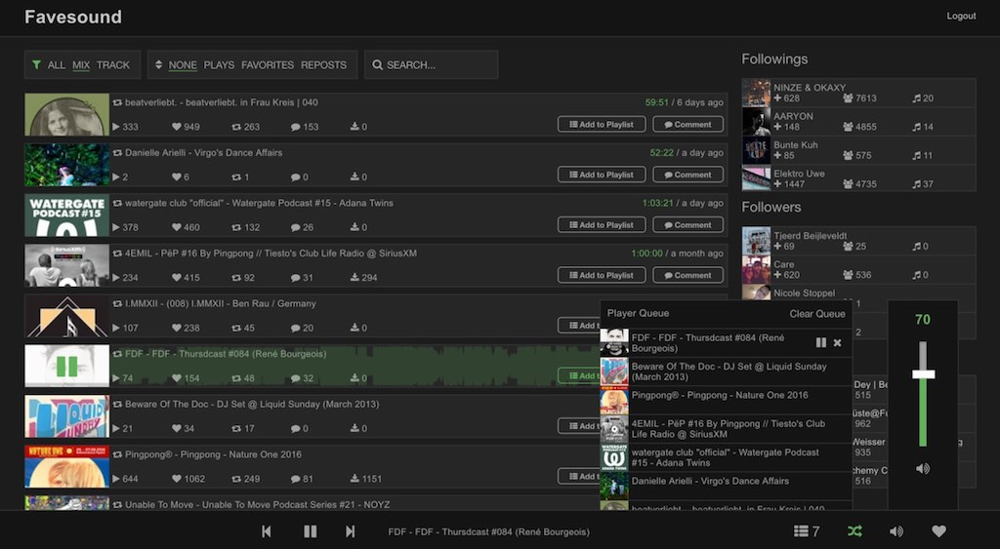

<Sponsorship />

The JavaScript and web development community settled down on the major three: React, Angular and Vue. They are frameworks and libraries with [full fledged ecosystems](/react-libraries/). Because of that, I call all of these candidates frameworks. These major three are backed by big companies and [communities/individuals](https://www.patreon.com/evanyou). It almost seems as if the JavaScript fatigue has settled down for a bit now. Many people believe that it will stay like that until the full adoption of [WebAssembly (WASM)](http://webassembly.org/). So enjoy the halt for a moment but keep your eyes open for WASM because [we are not far away from it](https://github.com/DenisKolodin/yew).

There are many people learning those major three frameworks nowadays. They are not only computer science graduates, like it used to be in the past, but also self-taught programmers coming from bootcamps and other backgrounds. I find it amazing that the barrier entering the field is made much more accessible in the recent years by all the opportunities organizations and companies are providing in the western world. I am saying western world here, because often it's not obvious that there is less education about those topics in other countries. It's a [huge privilege to work in this field](/giving-back-by-learning-react/) and therefore I hope people treasure it and do everything possible to [enable others for this privilege around the world](https://github.com/rwieruch/purchasing-power-parity).

The following article should give you guidance on how to approach learning one of those major three frameworks. It should help you to escape the analysis paralysis and get your internal mode from consuming to producing. So stay with me if you are about to learn one of the big three.

# Is it React, Angular or Vue?

I can only assume how the JavaScript ecosystem must feel for a beginner. It's the wild west where everyone jumps on the shiniest train. That's only because everyone consumes the [latest news](https://en.wikipedia.org/wiki/Availability_heuristic) on Hacker News, Twitter and Reddit. But no one is speaking about the real world where companies are not using the newest technology. It's the 90% (just throwing out a number) of the companies which have to stick to their decisions which they have made years ago. It's because their main goal is to increase the business value and not to exchange the underlying tech stack every year. It boils down to the value you can offer for a company, client, or your own product and not the tech stack you carry around with you.

There isn't a day passing where someone isn't asking about which of these major three frameworks to learn and use. Is it Angular, Vue or React? I tried to [answer a couple of those questions on platforms such as Quora too](https://www.quora.com/As-a-beginner-should-I-learn-about-AngularJs-or-jump-into-Angular-2-or-just-skip-them-and-learn-about-React-instead) but there is no way to keep up with it. They are popping up all day long. That's why I sat down to write this blog post in the first place. It's my attempt to offer a way out of this dilemma for people who are unsure about learning React, Vue or Angular.

In the past, I wrote about [my experiences moving from Angular to React](/reasons-why-i-moved-from-angular-to-react/), because I always felt it is more important to give people first-hand experiences instead of a technical comparison article. It's great to get to know about the motivations of people in the field using one of these three frameworks and why they moved from one to another at some point. It gives people access to real world experiences and not only the comparison of technical aspects. But in the end the article ended up in a pile with all the other comparison articles and just adds more heavy weight to it.

## Getting out of the Analysis Paralysis

Regardless of technical comparison or first-hand experience, many articles leave people with their [analysis paralyse](https://en.wikipedia.org/wiki/Analysis_paralysis) dilemma. Many of those articles have no immediate impact because they don't provide a clear actionable advice in the end. They just provide more input for consumer friendly readers. Instead of nudging them towards the act of producing, their readers keep consuming and wander around from one to another comparison article. They are never starting to learn the thing itself. They consume, but never end up to produce.

Note: I write about *them* as if I would exclude myself from the list, but that's not the case. I tend to over analysis things too and end up in this situation myself. The personality trait isn't a bad asset when you actually end up working as a developer, but in order to get there, it can be frustrating.

After all, if you want to learn something new, you have to take the leap from consuming to producing. It doesn't matter if you choose Vue, Angular or React, because they all solve the same problem. They enable you to build web applications. That's it. And believe it or not, if you mastered one of them, it's not too difficult to jump on another one if you have learned JavaScript properly.

Just think about it: If you are staying in the analysis paralysis, there will be another framework to learn in the next year. So it's just about getting your hands dirty. Produce. Don't consume.

## JavaScript is the foundation, nothing else matters

After all, JavaScript is the foundation of the major three or any other JS framework. If you have gathered enough JS knowledge, you shouldn't worry too much about the framework you are learning and using now. JavaScript should give you all the tools to use any of those frameworks. So your end goal should be to master JavaScript and not a framework which might be relevant for just another year for you. But JavaScript will be relevant for more than the next years.

You should master the core principles of JavaScript. Whether you take the bottom up (JavaScript -> Framework) or (Framework -> JavaScript) is up to your personal learning philosophy. What matters is that you understand JavaScript to move effortless from one to another library. It's not only applicable for React, Vue or Angular, but also for libraries such as [Redux or MobX](/redux-mobx/). When you move from one technology to the next, you will need to understand the underlying mechanisms. So just take your time to learn about these core principles:

* Functions are first-class citizens in JavaScript
* bind(), apply(), and call()
* Scopes and [Closures](/javascript-closure/)
* this
* Objects (e.g. `Object.keys(myObj).map(key => myMap[key])`)
* Arrays (e.g. `[1, 2].reduce((sum, summand) => sum + summand, 0)`)
* Prototypical Inheritance -> ES6 Class
* Callbacks and Promises
* [Event Loop](https://www.youtube.com/watch?v=8aGhZQkoFbQ)
* Event Bubbling
* Regular Expressions
* Error handling (`promise.then(...).catch(...)`, `try { } catch(e) { }`)
* JavaScript ES6 and beyond
* Hoisting, Memoization
* Declarative vs imperative programming
* Functional vs object-oriented programming

You don't need to be a wizard in these things. I am certainly not. But you should at least understand these principles to have a clue on how JavaScript works and how to use it without relying on heavyweight frameworks/libraries. For instance, people introduce far too early utility libraries such as [Lodash](https://lodash.com/). But most of the basic cases can be done with vanilla JavaScript. I found [this article](https://medium.com/dev-bits/a-perfect-guide-for-cracking-a-javascript-interview-a-developers-perspective-23a5c0fa4d0d) which explains lots of the mentioned core principles from above. You should check it out.

Not everyone is in the financial position to learn just anything. It's time consuming. If you are financially restricted, the most important advice would be to keep an eye on the job market. Your future client might not care if you have built their shiny web application in Vue, React, or Angular, but the job market shows clear trends where companies are heading towards. Keep an eye on it to learn something which will be relevant after you have learned it. There are plenty of developer surveys out there, especially at the end of the year, and you will find more of these trends on Google Trends or StackOverflow.

# From Consuming to Producing: Start to code!

I strongly believe that students should narrow down their learning material to pave their way of learning something more effortless. Therefore it doesn't help to purchase 10 courses on Udemy. It's a never ending consumer story and you will actually never get your hands dirty by actually programming yourself. Again, there are plenty of stories on platforms where people are speaking about the same problem: They have watched all the video courses, but no one sticked for them and they don't know how to start coding the thing they have watched for the last 30 hours.

Instead, if you have so much time to consume learning material, try to add diversity in it. Take one or maximum two video courses and supplement it with a book, a podcast and a real hands-on course with a coding playground to stimulate all senses. That's how I approached to [learn about machine learning](/machine-learning-javascript-web-developers/) recently. If you are coding a personal project along the way, you should be able to keep the challenges ahead and your skills in balance. Eventually you will end up in a [state of flow](/lessons-learned-deep-work-flow/) where it becomes a pleasure to apply your learnings in your project.

If you read these last paragraphs and you feel like you belong to this group of people consuming too much, the most important step for you is to start producing. I believe you have already consumed plenty of learning material by now, so sit down and start to code something with your chosen framework. If you get stuck, use your favorite search engine, ask questions on StackOverflow or join a Slack community to get help from others. The other way around most of these platforms are great to help people yourself. Teaching someone else is the best way to internalize the learnings.

Learning something new is never easy. Whereas someone is effortlessly building a thing in a video screencast in an hour without breaking out in a cold sweat, it takes you ages and lots of effort to implement the same thing on your own. But that's normal. 99% of the video screencasts are prepared to show off the optimal way and shield away all the effort. That's what it makes such a pleasure to watch them. Humans by nature avoid things which stressful. However, only if you are breaking out in a cold sweat and it takes you ages to implement the thing, you are actually learning the subject. So just sit down and start to code.

Personally I never learned real coding from books. Books were great for me to understand broader principles. However, when I decided to write books about learning to code myself, I tried to make them actionable. It wasn't a conscious decisions in the first place, but now many people reach out to me saying that they learned coding from reading **and doing the exercises**. When people get their hands dirty and stop only consuming the learning material, the things they learn will stick eventually.

# Pick a learning Project

So how do you start to code regardless of Vue, Angular or React? Pick a project which motivates you. Don't choose a ToDo application. For instance, take your favorite hobby and build an application for it. It doesn't need to be a full fledged application. If you like mathematics, implement a calculator. Start small.

At this point, if you are still in the analysis paralysis, implement the same calculator in all frameworks. Keep the project small, so that it doesn't take you to much time implementing it for the sake of comparing the major three. For instance, in case of a calculator only implement the addition, subtraction, multiplication and division. In the end, just take the framework which felt most comfortable for you and go with it.

Otherwise, if you cannot come up with a project idea, have a look what other developers are building to learn React, Angular or Vue. Most of them share their efforts on one of the named consumer friendly platforms. Let them inspire you, try to do something similar or just try to copy them. But not literally their source code.

If you don't have a hobby (what?) and nobody is inspiring you (no way!), a third way of getting inspiration is taking your favorite web application out there. You shouldn't implement the next Facebook, but what about a simple Trello clone? The most important advices are: keep the size of the project manageable and have a motivating topic to drive you through the troublesome parts of the project. You should be able to complete it eventually to start your next one afterward.

My personal story is similar to it. A couple of years ago, I decided to move from Angular to React. It was the time when I used SoundCloud on a daily basis to listen to my favorite artists (and still do it) and thus I wanted to implement a SoundCloud application in React in order to learn about React. At this time, Andrew already implemented [sound-redux](https://github.com/andrewngu/sound-redux) where I would be able to explore the source code in case I would run into any trouble. Fast forward, it took me [three months](https://github.com/rwieruch/favesound-redux/graphs/contributors?from=2016-01-27&to=2016-05-16&type=c) to implement [favesound-redux](https://github.com/rwieruch/favesound-redux) from scratch. I did the [mistake to learn React with Redux](/learn-react-before-using-redux/) though which steepened the learning curve, but somehow I managed to do it. However, nowadays it is used by others to learn about React and Redux as I used Andrew's project as inspiration and help for my own project. All of this doesn't mean that you should implement such large project yourself. I was in a great position to transfer lots of the underlying JavaScript knowledge from Angular to React. It just shows how a project can turn out if you pick a project and stick to coding for some time on it. After all, this personal story was my introduction to learn and eventually teach about React.

So what happens after you have built your first project? Show it to the community on Reddit, Hacker News, Twitter or your Slack Community. Even though it's a small project, just share it to get feedback about it. You should become a producer on those platforms not only a consumer like you used to be. That way, you will get plenty of feedback which helps you to grow as individual. Take this feedback with you, improve your project, and take another project afterward to learn more about using your framework. Repeat this whole process to learn with every project something new about general coding, JavaScript or your framework. Every project comes with its own challenges.

After all, it boils down to just a simple framework to learn any framework (or anything else):

* (1) narrow down your learning material and supplement it with material for all your senses
* (2) consume the learning material and start to produce on the side
* (3) pick up a project that keeps you motivated
* (4) break out in a cold sweat and take hours to tinker on your project
* (5) get help with your search engine, Slack groups or StackOverflow
* (6) finish you project and gather feedback from others
* (7) if still stuck in analysis paralysis, implement the same project in another framework
* repeat (3) to (6)

<Divider />

I hope that these lines gave you encouragement to start learning React, Vue, Angular or any other framework. It doesn't matter which one you choose, but you have to take the leap from consuming to producing. What matters is that you start coding now. Along the way, you should understand the core principles of JavaScript. I believe if you start to learn one of those now, you can make it on the job market this year using one of these solutions. If you decide to learn React, give [The Road to learn React](/the-road-to-learn-react/) as your reading material a shot. It's a pragmatic approach to learn React and all its fundamentals. While reading the book, you will implement your own application with lots of real world features. Otherwise, I am just keen to hear your thoughts about this article and if you start to learn any of those frameworks this year.
