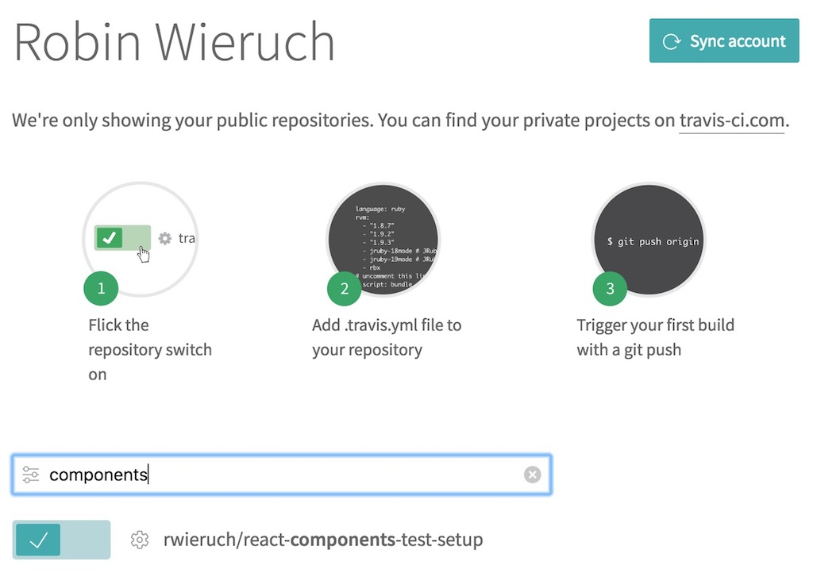
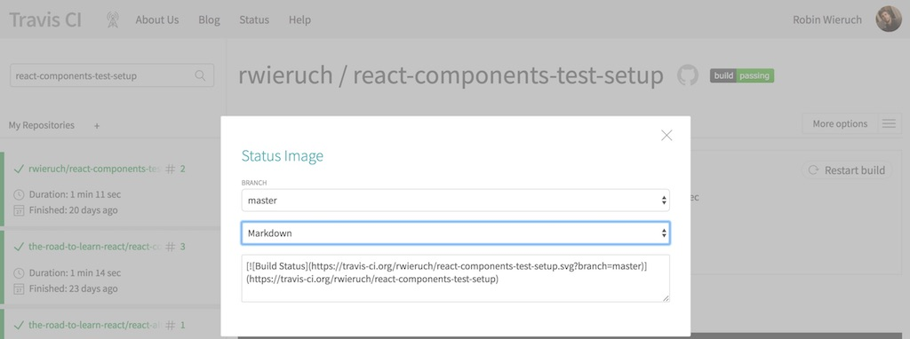

<Sponsorship />

The following tutorial will show you how to set up continuous integration with Travis CI. The continuous integration should make sure that the JavaScript application is built and tested with every change in the code base that reaches your CI. For instance, the CI would fail if the tests are not running through successfully or if the build process would fail. That's how you can always see whether your JavaScript application has a successful build and tests before deploying it.

If you have no GitHub account nor a setup for git, you should make sure to follow this guide [to set up GitHub and git on your machine](/git-essential-commands/). Afterward, create a repository for your JavaScript project on GitHub and commit/push all changes to it. From there, your continuous integration will pick up your project to test and build it.

Now, create an account for [Travis CI](https://travis-ci.org/) by using your GitHub account. Once you have created it, you can visit your dashboard on their platform where you can see all your GitHub repositories. Each GitHub repository can be synchronized individually with Travis CI. For instance, if you have a JavaScript project on GitHub at the moment, synchronize it on your Travis CI dashboard for giving this tutorial a more practical touch.



Now you should have synchronized Travis CI with your GitHub repository. The only thing left is telling Travis CI on how to install and run your application in their CI environment. On the command line, create a Travis configuration file in your JavaScript project's root folder:

```javascript
touch .travis.yml
```

Now enter the following configuration to it. The most important part are the scripts which should be executed to run your tests:

```javascript
language: node_js

node_js:
  - stable

install:
  - npm install

script:
  - npm test
```

Push these changes again via git to your GitHub repository. On every code change in your repository, Travis CI should be notified automatically and runs your JavaScript project through its pipeline. On their dashboard, you should see the build process and the tests which either succeed or fail. If you have more than one testing script for your JavaScript project, you can simply put them after each other in the Travis configuration file:

```javascript{10}
language: node_js

node_js:
  - stable

install:
  - npm install

script:
  - npm run test:unit && npm run test:snapshot && npm run test:cypress
```

*Note: If you are using Cypress.io for E2E testing, you need to add another configuration for addons:*

```javascript{6,7,8,9,10}
language: node_js

node_js:
  - stable

addons:
  apt:
    packages:
      # Ubuntu 16+ does not install this dependency by default, so we need to install it ourselves
      - libgconf-2-4

install:
  - npm install

script:
  - npm run test:unit && npm run test:snapshot && npm run test:cypress
```

Last but not least, you can add a fancy badge to your GitHub repository. First, open up your *README.md* file in your project. If you have no such file, create it on the command line in your project's root folder:

```javascript
touch README.md
```

Second, add markdown to describe your project. It's visible in your GitHub repository once you push it. In addition, you can add the fancy badge for your passing or failing build process. At your Travis CI dashboard for your project, you should find the grey and green colored "build passing" badge.



By clicking it, you should get the all the things you need for displaying it in your GitHub repository. You can choose the Markdown version and copy & paste it to your *README.md* file:

```javascript
# My JavaScript Project

[](https://travis-ci.org/rwieruch/my-javascript-project)
```

This badge references my project. So make sure to reference your own project by exchanging the account/organization and the repository name. That's it. You have set up continuous integration for your project which informs you when your build fails. Furthermore, it shows a fancy badge in your repository to inform other people that your project builds successfully which adds credibility to your project.

<ReadMore label="Test Coverage in JavaScript" link="https://www.robinwieruch.de/javascript-test-coverage" />
