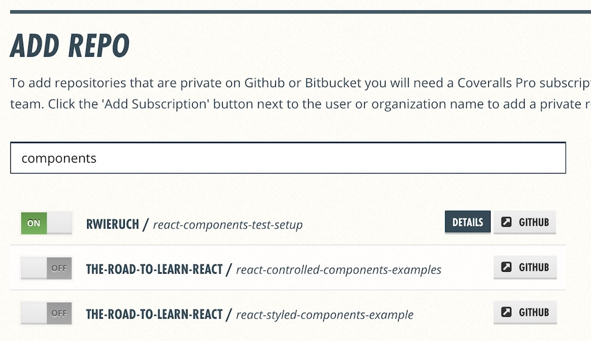
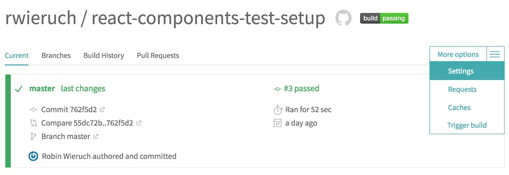
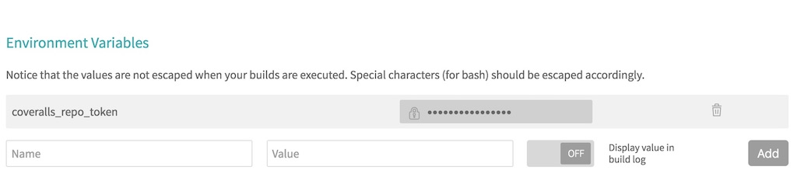
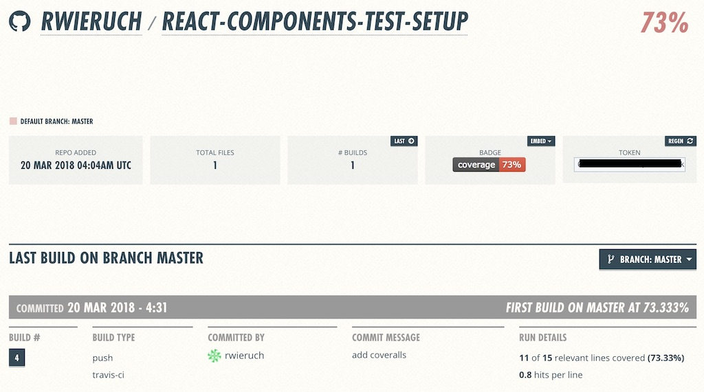

<Sponsorship />

<LinkCollection label="This tutorial is part 2 of 2 in the series." links={[{ prefix: "Part 1:", label: "How to set up Continuous Integration for JavaScript", url: "/javascript-continuous-integration/" }]} />

<LinkCollection label="This tutorial is part 3 of 3 in the series." links={[{ prefix: "Part 1:", label: "How to set up React with Webpack and Babel", url: "/minimal-react-webpack-babel-setup/" }, { prefix: "Part 2:", label: "How to test React components with Jest", url: "/react-testing-jest/" }]} />

Coveralls is used to show you the test coverage of your JavaScript application. Let's see how it can be used for your JavaScript project which is already on GitHub and connected to your Travis CI due to the previous CI setup tutorial. First, sign up at [Coveralls.io](https://coveralls.io/) with your GitHub account. Second, synchronize your GitHub repositories and toggle a specific repository to be used for code coverage.



Afterward, hit the "Details" button to copy your `coveralls_repo_token` to your clipboard. Since you don't want to add this private token directly to your public project, you can add it on your Travis CI dashboard to your repository's environment variables. You will find it via the settings option of your Travis repository.



Then, create a new environment variable for your project. You can name it coveralls_repo_token:



Last but not least, modify your project the following way. First, install the coveralls library on the command line to your dev dependencies:

```javascript
npm install --save-dev coveralls
```

Second, add a new script to your *package.json* file to introduce Coveralls to it:

```javascript{4}
"scripts": {
  "start": "webpack serve --config ./webpack.config.js --mode development",
  "test": "jest --config ./jest.config.json",
  "coveralls": "cat ./coverage/lcov.info | node node_modules/.bin/coveralls"
},
```

And third, extend your Travis CI configuration for reporting the coveralls information to your coveralls.io dashboard.

```javascript{10,12,13}
language: node_js

node_js:
  - stable

install:
  - npm install

script:
  - npm run test -- --coverage

after_script:
  - COVERALLS_REPO_TOKEN=$coveralls_repo_token npm run coveralls
```

That's it. By adding, committing and pushing your changes to GitHub now, you can see how a report shows up on your Coveralls.io dashboard.



Perhaps you can see that the coverage isn't too high. Then it's up to you the add tests to increase the percentage for your project.

Last but not least, you can add the fancy Coveralls badge to your GitHub's *README.md* file. You find the badge on the Coveralls dashboard for embedding it as markdown:

```javascript
# My JavaScript Project

[](https://coveralls.io/github/rwieruch/my-javascript-project?branch=master)
```

Make sure to change the URL to your repository's URL.

If you are using Jest as a test runner, you can enforce a certain coverage for your JavaScript project. Also you can include and exclude specific folders/files from your source code to be added/removed from your testing coverage report:

```javascript{3,4,5,6,7,8,9,10,11,12}
module.exports = {
  ...
  coverageThreshold: {
    global: {
      functions: 95,
      lines: 95
    }
  },
  collectCoverageFrom: [
    '<rootDir>/src/**/*.js',
    '!<rootDir>/src/pages/**/*.js'
  ]
};
```

That's everythin in a nutshell about testing coverage in JavaScript projects.

<ReadMore label="How to test React components with Jest" link="/react-testing-jest/" />

<ReadMore label="How to end-to-end test React components with Cypress" link="/react-testing-cypress/" />
