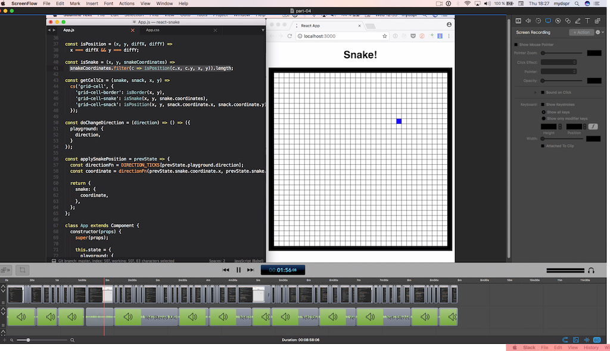
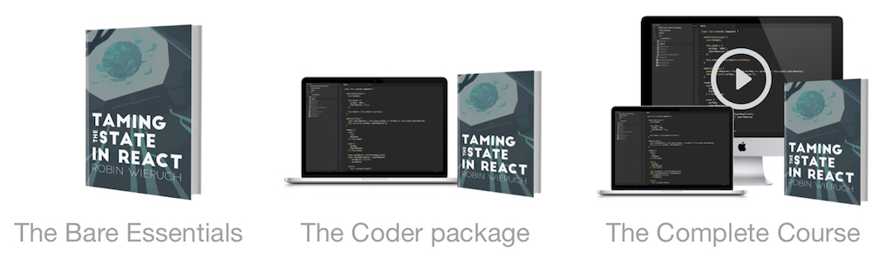
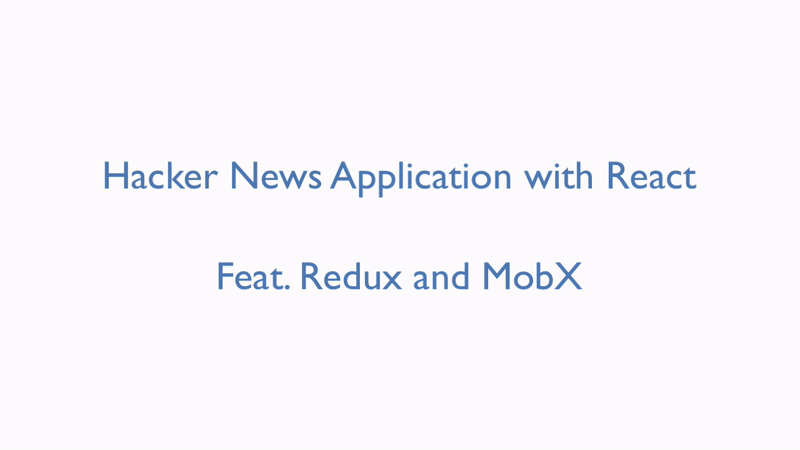

<Sponsorship />

I am excited to launch my course [Taming the State in React](https://roadtoreact.com/course-details?courseId=TAMING_THE_STATE). I worked on the course for the last 6 months and squeezed every of my free minutes during a workweek, weekends and holidays into it. For instance, when writing the book, I woke up two hours earlier before my 9 to 5 job to write ~750 qualitative words a day. It continued by building a platform around the course, by recording screencasts, by building exciting applications and boilerplate projects for course participants and by doing a bit of outreach with the of help my better half.

So now I am on the finish line and I am terrified to launch something that I have been working on deliberately over the last half year. I procrastinated the last 10% before the launch and felt that growing impostor syndrome. When I asked others about these feelings, they knew it very well before launching a product.

**However, I think it was worth it!** The course turned out to exceed all my expectations. What started as an attempt to write a sole book about state management in React with Redux and MobX, turned out into a full blown course with a 250-page book, exciting applications and boilerplate projects to get started in learning and building applications with these libraries, and multiple screencast series about implementing React applications from scratch with state management. **Grab it today on launch day to get 25% off**.

The bigger idea was to built a course that gives learners a consistent way to study the topic state management. I had the feeling that there exist way too many, partly inconsistent or outdated, tutorials around these topics and it is hard for learners to choose from so many opportunities. I thought, one well structured course should help beginners to get started easily in the topic of state management with React's local state, Redux and MobX. Afterward, everyone should be on one well set level to build his/her own applications with Redux or MobX.

# What will I learn from the course?

The course teaches you how to use local state in React and scaling React applications with advanced practices, patterns and techniques. Afterward, the book dives into learning Redux and MobX as libraries for state management. These libraries are taught from scratch without React but in combination with React later on. However, all these learnings are not necessarily bound to React as view layer library. They can be applied in other view layer (component based) libraries, such as Vue.js, or single page application (SPA) frameworks, such as Angular.js, too. If you are new to React and want to learn React before, I recommend you to read the up to date book [The Road to learn React](/the-road-to-learn-react/). It has been downloaded by 13.000 people so far, which makes me very proud.

Due to Redux's popularity, the course teaches more about Redux than MobX. But it is planned to grow the MobX part too, because I am really into that library as well. For both state management libraries, Redux and MobX, you will learn to use them standalone, to connect them to React applications in multiple ways, and to apply best practices, patterns and tricks to scale them in larger applications. You will learn about using JavaScript ES6 to keep your state immutable, middleware in Redux, and flat and normalized state structures. Afterward, the terms actions, reducers, store(s), connected components and so on, will not be foreign subjects to you anymore.

After taking the course, I believe you are ready to build your own applications in any (view layer) library or SPA framework of your choice with Redux or MobX. But when using React, you are setup with advanced knowledge about React's local state to use it in larger applications.

# What's the content of the course?

The course is divided into three packages. Basically, it boils down into taking the course (1) by reading the 250-page book in PDF, EPUB or MOBI and doing all the examples on the way, (2) by reading the book and having access to several exciting applications and boilerplate projects to get started on your own, or (3) by reading the book, getting access to all the source code and watching screencasts series to see me coding applications from scratch and explaining it for you.

For all of the three packages, you can join the Slack Group that was created to build a community around these courses where people help each other. There are already a couple of hundred people in the Slack Group because of my previous book about React and it has become a great community for those who want to learn more about it. In addition, when taking the course, you will get a curated list of articles for further readings outside of the book to keep yourself updated about these topics.

# Why should you take the course?

In the previous part, I have shown the benefits and learnings when taking the course, as well as talked about its content. So why should you believe in the course and my content in the first place?

For the last three years, I worked on larger scale applications using Angular and React with Redux. In my development team, we felt the shortcomings of Angular's state management, implemented our own state management solution when Flux wasn't a thing, but decided to move over to React and Redux eventually. Since it is a larger application, the migration is still ongoing, but while migrating and implementing a lot of features in React and Redux from scratch, there were several challenges ahead to overcome and opportunities to grow with them.

Last year, I started to write heavily about React and JavaScript. Over the time, I had the chance to advance my writing and teaching style due to my readers feedback. End of last year, I published an book about learning React from scratch. It got downloaded over 13.000 times which was an overwhelming surprise for me. I received great feedback and it makes me really happy to see how people are making progress in their learnings.

So by now, I believe that I am able to teach things about web development, JavaScript and React in a good way. I hope you believe in this as well. So jump on the train and [learn Redux and/or MobX](https://roadtoreact.com/course-details?courseId=TAMING_THE_STATE) :-)

<Divider />

I am looking forward to you finishing the course and building your own applications with Redux and MobX. If you run into any problems, message me or the other people in the Slack Group. Anyways, I wish you a great learning experience from knowing nothing or little about state management to applying the learnings in your own applications. Thank you all a lot for your support during the last months. I hope to see you sharing the course if you liked it!
