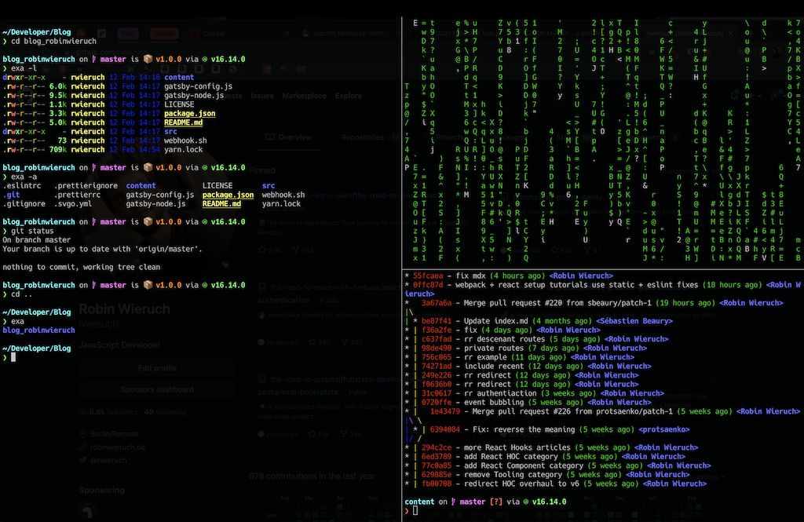
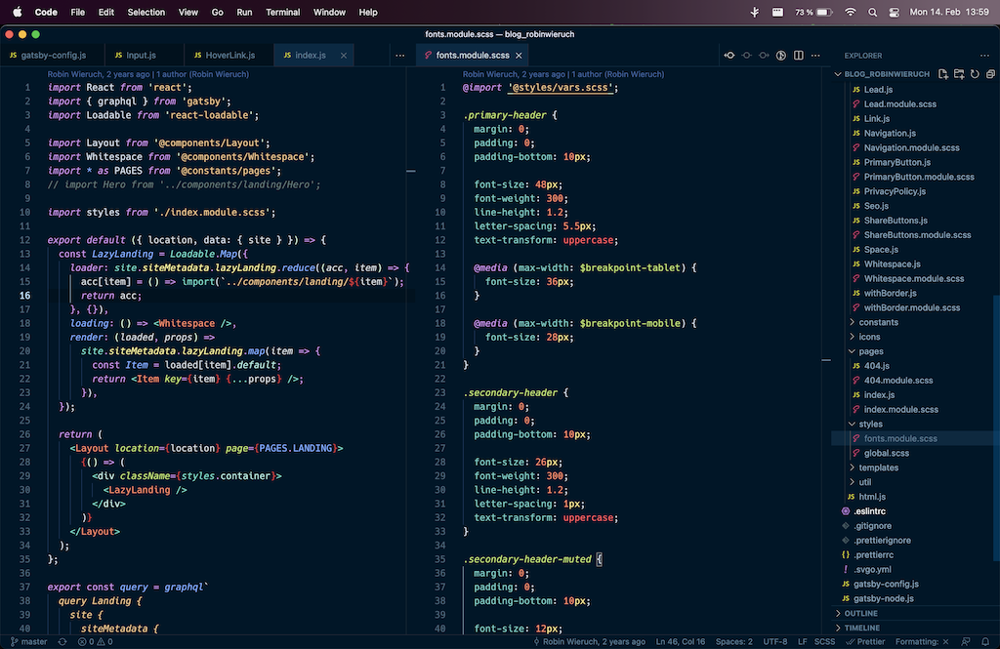

<Sponsorship />

This year (2022) I bought the new **MacBook Pro** after having used the MacBook Pro 2015 for the last years. This first month has been super exciting and I am up running working efficiently on my personal and professional web development projects as a **freelance JavaScript developer**. Here I want to share with you my **Mac setup for web development** that I have used which got inspired by [Swyx's Mac Setup](https://www.swyx.io/new-mac-setup-2021).

# MacBook Pro Specification

* 14-inch
* Apple M1 Pro mit 10‑Core CPU, 16‑Core GPU und 16‑Core Neural Engine
* 32 GB RAM
* 512 GB SSD
* QWERTY = English (International)
* macOS Monterey

# System Preferences

* Dock
  * Remove most applications from Dock
  * Automatic Hide
  * Smaller Dock
  * "Show recent applications in Dock" off
  * "Show indicators for open applications" on
  * Battery -> "Show Percentage"
* Display
  * Nightshift
* Security
  * Touch ID
* Notifications
  * Off, except for Calendar
* Siri
  * Disable
* Trackpad
  * Tap to Click
  * Point & Click -> Look up & data detectors off
* Keyboard
  * Text
    * disable "Capitalise word automatically"
    * disable "Add full stop with double-space"
    * disable "Use smart quotes and dashes"
    * use `"` for double quotes
    * use `'` for single quotes
* Spotlight
  * Disable Spotlight except for Applications and System Preferences
* Mission Control
  * Hot Corners: disable all
* Finder
  * Sidebar:
    * activate all Favorites
    * move Library to Favorites
  * Hide all Tags
  * Show all Filename Extensions
  * Remove Items from Bin after 30 Days
  * View -> Show Preview (e.g. image files)
* Sharing
  * "Change computer name"
    * Also terminal:
      * sudo scutil --set ComputerName "newname"
      * sudo scutil --set LocalHostName "newname"
      * sudo scutil --set HostName "newname"
  * "Make sure all file sharing is disabled"
* Security and Privacy
  * Turn on FileVault
  * Add Browser to "Screen Recording"
* Storage
  * Remove Garage Band & Sound Library
  * Remove iMovie
* Trackpad
  * Speed: 9/10
* Accessibility
  * Scroll Speed: 6/8

# System Preferences (Terminal)

Override more system preferences from the terminal ...

```text
# take screenshots as jpg (usually smaller size) and not png
defaults write com.apple.screencapture type jpg

# do not open previous previewed files (e.g. PDFs) when opening a new one
defaults write com.apple.Preview ApplePersistenceIgnoreState YES

# show Library folder
chflags nohidden ~/Library

# show hidden files
defaults write com.apple.finder AppleShowAllFiles YES

# show path bar
defaults write com.apple.finder ShowPathbar -bool true

# show status bar
defaults write com.apple.finder ShowStatusBar -bool true

killall Finder;
```

# Files

* If files from previous machine are needed, transfer via external drive instead of cloud

# Homebrew

Install [Homebrew](https://brew.sh) as package manager for macOS:

```text
# paste in terminal and follow the instructions
/bin/bash -c "$(curl -fsSL https://raw.githubusercontent.com/Homebrew/install/HEAD/install.sh)"
```

Update everything in Homebrew to recent version:

```text
brew update
```

Install GUI applications (read more about these in GUI Applications):

```text
brew install --cask \
  bitwarden \
  google-chrome  \
  firefox \
  brave-browser \
  tor \
  iterm2 \
  visual-studio-code \
  sublime-text \
  docker \
  rectangle \
  slack \
  discord \
  signal \
  vlc \
  calibre \
  figma \
  imageoptim \
  maccy
```

Install terminal applications (read more about these in Terminal Applications):

```text
brew install \
  wget \
  exa \
  git \
  nvm \
  pnpm \
  graphicsmagick \
  commitzen \
  cmatrix \
  vips
```

# GUI Applications

* [Bitwarden](https://bitwarden.com/) (password manager)
  * Preferences:
    * enable dark mode
    * enable Touch ID
* [Google Chrome](https://www.google.com/chrome/) (web development, web browsing)
  * Preferences
    * set default browser
    * enable dark mode
    * never save passwords
    * always show bookmarks
    * import bookmarks from previous machine
  * Chrome Developer Tools
    * enable dark mode
    * Network -> only "Fetch/XHR"
  * Chrome Extensions
    * [uBlock Origin](https://chrome.google.com/webstore/detail/ublock-origin/cjpalhdlnbpafiamejdnhcphjbkeiagm?hl=en)
    * [Bitwarden](https://chrome.google.com/webstore/detail/bitwarden-free-password-m/nngceckbapebfimnlniiiahkandclblb/related?hl=en)
    * [React Developer Tools](https://chrome.google.com/webstore/detail/react-developer-tools/fmkadmapgofadopljbjfkapdkoienihi?hl=en)
    * [Pocket](https://chrome.google.com/webstore/detail/save-to-pocket/niloccemoadcdkdjlinkgdfekeahmflj?hl=en)
    * [MetaMask](https://chrome.google.com/webstore/detail/metamask/nkbihfbeogaeaoehlefnkodbefgpgknn)
* [Firefox](https://www.google.com/chrome/) (web development)
* [Brave](https://brave.com/) (web browsing, wallet)
* [Tor](https://brave.com/) (secret web browsing)
* [iterm2](https://iterm2.com/) (terminal)
* [Visual Studio Code](https://code.visualstudio.com/) (web development IDE)
* [Sublime Text](https://www.sublimetext.com/) (editor)
* [Docker](https://www.docker.com/products/docker-desktop) (Docker, see [setup](/docker-macos/))
  * used for running databases (e.g. PostgreSQL, MongoDB) in container without cluttering the Mac
  * Preferences
    * enable "Use Docker Compose"
* [Rectangle](https://rectangleapp.com//) (window manager)
  * use Rectangle settings, not Spectacle
* [Slack](https://slack.com/) (team messenger)
* [Discord](https://discord.com/) (community messenger)
* [Signal](https://signal.org/en/) (messenger)
* [VLC](https://www.videolan.org/vlc/) (video player)
  * use as default for video files
* [Calibre](https://calibre-ebook.com/) (epub/ebook editor)
* [Figma](https://www.figma.com/) (design)
* [ImageOptim](https://imageoptim.com/mac) (performance)
* [Maccy](https://maccy.app/) (clipboard manager)
  * enable "Launch at Login"

# Built-in MacOS Applications

* iMessage
  * sync iCloud for iMessages just for the sake of syncing, then disable iCloud again
  * sync contacts on iCloud
  * iPhone: activate message forwarding to new Mac
* Pages
  * show word count
* Apple Mail
  * set up all email accounts
  * show most recent message at top
* Notes
  * New notes start with: Body
* Quick Time Player
  * save to Desktop

# Terminal Applications

* [wget](https://www.gnu.org/software/wget/) (curl replacement)
* [exa](https://the.exa.website/install/macos) (ls replacement)
  * `exa`
  * `exa -a` (include hidden files)
  * `exa -l` (include additional information)
* [git](https://git-scm.com/) (version control)
* [nvm](https://github.com/nvm-sh/nvm) (node version manager)
* [pnpm](https://pnpm.io/) (node package manager)
* [graphicsmagick](http://www.graphicsmagick.org/) ([screenshot/visual regression testing](https://loki.js.org/))
* [commitzen](https://commitizen-tools.github.io/commitizen/)
* [cmatrix](https://github.com/abishekvashok/cmatrix) (terminal screensaver)
* vips ([support for old Gatsby.js version on M1](https://github.com/lovell/sharp/issues/2460#issuecomment-751491241))

# iTerm2

The look and feel we want to achieve from our terminal:



* Make iterm2 Default Term
* Preferences ->
  * General -> Window
    * unselect "Native full screen windows"
    * select "close windows when closing an app"
  * Appearance ->
    * Windows
      * select "Hide scrollbars"
    * Tabs
      * unselect "Show tab bar in fullscreen"
    * Dimming
      * Unselect all dimming
  * Profiles -> Window
    * Transparency: 30
    * Style: Full Screen
    * Screen: Main Screen
  * Profiles -> Advanced
    * Semantic History -> Open with editor ... -> VS Code
  * [Open new split pane with current directory](https://apple.stackexchange.com/a/337386)
  * [Natural Text Editing](https://apple.stackexchange.com/a/293988)
* Bring it to fullscreen Command + Enters

# Oh My Zsh

When you open iTerm2, you see that MacOS already comes with zsh as default shell. Install [Oh My Zsh](https://ohmyz.sh/) for an improved (plugins, themes, ...) terminal (here: iTerm2) experience:

```text
sh -c "$(curl -fsSL https://raw.githubusercontent.com/ohmyzsh/ohmyzsh/master/tools/install.sh)"
```

Update everything (e.g. plugins) in Oh My Zsh to recent version:

```text
omz update
```

Important: If you change something in your Zsh configuration (*.zshrc*), force a reload:

```text
source ~/.zshrc
```

**Oh My Zsh Theme + Fonts:**

Install [Starship](https://starship.rs/) as your new terminal theme. We will use Homebrew, but you can use an alternative from the website too:

```text
brew install starship
```

Make it the default theme for Oh My ZSH from the terminal:

```text
echo 'eval "$(starship init zsh)"' >> ~/.zshrc
```

As font we will be using Hack Nerd Font in iTerm2, VS Code, and Sublime Text. Install it via:

```text
brew tap homebrew/cask-fonts
brew install --cask font-hack-nerd-font
```

Use the new font in iTerm2: Preferences -> Profile -> Text -> Font: font-hack-nerd-font.

If the theme and font changes do not apply, reload your zsh configuration (*.zshrc*) or close/open iTerm2.

**Oh My Zsh Plugins**

* [zsh-completions](https://github.com/zsh-users/zsh-completions)
* [zsh-autosuggestions](https://github.com/zsh-users/zsh-autosuggestions)
* [zsh-syntax-highlighting](https://github.com/zsh-users/zsh-syntax-highlighting)

**ZSH Configuration File (*.zshrc*):**

```markdown
# Path to your oh-my-zsh installation.
export ZSH="$HOME/.oh-my-zsh"

# Which plugins would you like to load?
# Standard plugins can be found in $ZSH/plugins/
# Custom plugins may be added to $ZSH_CUSTOM/plugins/
# Example format: plugins=(rails git textmate ruby lighthouse)
# Add wisely, as too many plugins slow down shell startup.
plugins=(
  git
  zsh-completions
  zsh-autosuggestions
  zsh-syntax-highlighting
)

# get machine's ip address
alias ip="ipconfig getifaddr en0"

# edit global zsh configuration
alias zshconfig="vim ~/.zshrc"
# reload zsh configuration
alias zshsource="source ~/.zshrc"
# reload zsh configuration
alias ohmyzsh="cd ~/.oh-my-zsh"

# navigate to global ssh directory
alias sshhome="cd ~/.ssh"
# edit global ssh configuration
alias sshconfig="vim ~/.ssh/config"

# edit global git configuration
alias gitconfig="vim ~/.gitconfig"

# git aliases
alias gits="git status"
alias gitd="git diff"
alias gitl="git lg"
alias gita="git add ."
alias gitc="cz commit"

# type sublime . to open current folder in Sublime Text
alias sublime="/Applications/Sublime\ Text.app/Contents/SharedSupport/bin/subl --new-window $@"

# load zsh-completions
autoload -U compinit && compinit

# use nvm
source /opt/homebrew/opt/nvm/nvm.sh

# use starship theme (needs to be at the end)
eval "$(starship init zsh)"
```

# VS Code

The look and feel we want to achieve from our IDE:



**Extensions:**

* [Night Owl](https://marketplace.visualstudio.com/items?itemName=sdras.night-owl) (Theme)
* [Auto Hide](https://marketplace.visualstudio.com/items?itemName=sirmspencer.vscode-autohide) (Hides Sidebar)
* [EditorConfig](https://marketplace.visualstudio.com/items?itemName=EditorConfig.EditorConfig) (Shared Config)
* [ESLint](https://marketplace.visualstudio.com/items?itemName=dbaeumer.vscode-eslint) ([Code Style](/vscode-eslint/))
* [Prettier](https://marketplace.visualstudio.com/items?itemName=esbenp.prettier-vscode) ([Code Format](/how-to-use-prettier-vscode/))
  * Prettier: [Formatting Toggle](https://marketplace.visualstudio.com/items?itemName=tombonnike.vscode-status-bar-format-toggle) (Toggle Prettier)
* [GitLens](https://marketplace.visualstudio.com/items?itemName=eamodio.gitlens) (Visualize Git)
* [Better Comments](https://marketplace.visualstudio.com/items?itemName=aaron-bond.better-comments) (Comment Highlighting)
* [Import Cost](https://marketplace.visualstudio.com/items?itemName=wix.vscode-import-cost)
* [Highlight Matching Tag](https://marketplace.visualstudio.com/items?itemName=vincaslt.highlight-matching-tag)
* [Auto Rename Tag](https://marketplace.visualstudio.com/items?itemName=formulahendry.auto-rename-tag)
* [Auto Close Tag](https://marketplace.visualstudio.com/items?itemName=formulahendry.auto-close-tag)
* [Color Highlight](https://marketplace.visualstudio.com/items?itemName=naumovs.color-highlight)
* [ES7+ React/Redux/React-Native snippets](https://marketplace.visualstudio.com/items?itemName=dsznajder.es7-react-js-snippets)
* [VSCode React Refactor](https://marketplace.visualstudio.com/items?itemName=planbcoding.vscode-react-refactor)
* [Vscode-styled-components](https://marketplace.visualstudio.com/items?itemName=styled-components.vscode-styled-components)
* [Color Highlight](https://marketplace.visualstudio.com/items?itemName=naumovs.color-highlight)
* [Color Picker](https://marketplace.visualstudio.com/items?itemName=anseki.vscode-color)

**Manual:**

* move Search feature from Activity Bar to Panel

**JSON Settings:**

```json
{
  "breadcrumbs.enabled": false,
  "files.trimTrailingWhitespace": true,
  "explorer.confirmDelete": false,
  "explorer.compactFolders": false,
  "workbench.colorTheme": "Night Owl",
  "workbench.sideBar.location": "right",
  "workbench.startupEditor": "none",
  "workbench.statusBar.visible": true,
  "workbench.editor.enablePreview": false,
  "workbench.activityBar.visible": false,
  "workbench.editor.restoreViewState": true,
  "terminal.integrated.fontFamily": "Hack Nerd Font Mono",
  "editor.fontFamily": "Hack Nerd Font Mono",
  "editor.fontSize": 14,
  "editor.tabSize": 2,
  "editor.insertSpaces": true,
  "editor.detectIndentation": false,
  "editor.renderWhitespace": "none",
  "editor.scrollBeyondLastLine": true,
  "editor.minimap.enabled": false,
  "editor.find.seedSearchStringFromSelection": "never",
  // syntax highlighting
  "files.associations": {
    ".env*": "makefile"
  },
  // prettier
  "prettier.singleQuote": true,
  "prettier.printWidth": 70,
  "editor.formatOnSave": true,
  "[javascript]": {
    "editor.formatOnSave": true,
    "editor.defaultFormatter": "esbenp.prettier-vscode"
  },
  "[javascriptreact]": {
    "editor.formatOnSave": true,
    "editor.defaultFormatter": "esbenp.prettier-vscode"
  },
  "[typescript]": {
    "editor.formatOnSave": true,
    "editor.defaultFormatter": "esbenp.prettier-vscode"
  },
  "[typescriptreact]": {
    "editor.formatOnSave": true,
    "editor.defaultFormatter": "esbenp.prettier-vscode"
  },
  // eslint
  "editor.codeActionsOnSave": {
    "source.fixAll.eslint": true
  },
  "eslint.validate": ["javascript"],
  "javascript.validate.enable": false,
  "javascript.updateImportsOnFileMove.enabled": "never",
  "typescript.updateImportsOnFileMove.enabled": "never",
  // auto generated
  "explorer.confirmDragAndDrop": false,
  "js/ts.implicitProjectConfig.checkJs": true,
  "editor.formatOnPaste": true,
  "editor.formatOnType": true,
  "extensions.ignoreRecommendations": true
}
```

# Sublime

Not used for web development anymore. Primarily used for writing this blog.

**General:**

* use License

**Extensions:**

* [Agila Theme](https://packagecontrol.io/packages/Agila%20Theme) (Theme)
* [Predawn](https://packagecontrol.io/packages/Predawn) (Theme)
* [SideBarEnhancements](https://packagecontrol.io/packages/SideBarEnhancements) (Folder/File Features)
* [TrailingSpaces](https://packagecontrol.io/packages/TrailingSpaces) (Deletes Trailing Spaces)

JSON Settings:

```json
{
  "caret_style": "solid",
  "folder_exclude_patterns":
  [
    ".git",
    "node_modules"
  ],
  "font_size": 14,
  "font_face": "Hack Nerd Font",
  "gutter": true,
  "highlight_line": true,
  "highlight_modified_tabs": true,
  "ignored_packages":
  [
    "TypeScript",
    "Vintage"
  ],
  "line_padding_bottom": 1,
  "line_padding_top": 1,
  "predawn_findreplace_small": true,
  "predawn_sidebar_arrows": true,
  "predawn_sidebar_narrow": true,
  "predawn_sidebar_xsmall": true,
  "predawn_tabs_small": true,
  "rulers":
  [
    120
  ],
  "scroll_past_end": true,
  "show_line_numbers": true,
  "spell_check": false,
  "tab_size": 2,
  "theme": "Agila Origin.sublime-theme",
  "theme_agila_compact_sidebar": true,
  "theme_agila_compact_tab": true,
  "theme_agila_horizontal_scrollbar_thinnest": true,
  "theme_agila_sidebar_font_xsmall": true,
  "theme_agila_sidebar_mini": true,
  "theme_agila_vertical_scrollbar_thinnest": true,
  "translate_tabs_to_spaces": true,
  "trim_trailing_white_space_on_save": true,
  "color_scheme": "Packages/Agila Theme/Agila Origin Oceanic Next.tmTheme",
}
```

# Git

From terminal, set global name and email:

```text
git config --global user.name "Your Name"
git config --global user.email "you@your-domain.com"
```

Improved `git log`:

```text
git config --global alias.lg "log --color --graph --pretty=format:'%Cred%h%Creset -%C(yellow)%d%Creset %s %Cgreen(%cr) %C(bold blue)<%an>%Creset' --abbrev-commit"
```

Now use:

```text
git lg
```

Set the default branch to main instead of master:

```text
git config --global init.defaultBranch main
```

Print global git configuration:

```text
git config --list
# or alias
# gitconfig
```

# SSH

There are two common strategies for SSH keys: one SSH key to rule them all or one SSH key per service. I use the latter one and will here run yout through it by [connecting to GitHub via SSH](https://docs.github.com/en/authentication/connecting-to-github-with-ssh/generating-a-new-ssh-key-and-adding-it-to-the-ssh-agent).

First, create a new SSH key in the *~/.ssh* folder:

```text
# in case the folder is not there yet
mkdir ~/.ssh

cd ~/.ssh
# or alias
# sshhome

ssh-keygen -t ed25519 -C "github"
# follow instructions
# use file name: github
# use passphrase and store it somewhere secure
```

Confirm whether passphrase was used properly by accessing private key:

```text
ssh-keygen -y -f gitHub
# confirm with passphrase
```

Create the SSH configuration file if it doesn't exist yet:

```text
# in case the file is not there yet
touch ~/.ssh/config
```

In your *~/.ssh/config* file, add the new SSH key, so that it can get picked up for every terminal session automatically:

```text
Host *
  AddKeysToAgent yes
  UseKeychain yes
  IdentityFile ~/.ssh/github
```

Add SSH key to MacOS' keychain:

```text
ssh-add --apple-use-keychain ~/.ssh/github
```

Add the public key to your GitHub settings via the website or via the GitHub CLI (via `brew install gh`):

```text
# copy public key and add it to https://github.com/
cat ~/.ssh/id_rsa.pub | pbcopy

# or use GitHub's CLI
gh auth login
# for the first login I think the SSH key gets added
# without the next command, but if not:

gh ssh-key add ~/.ssh/id_rsa.pub -t github
```

That's it. You have created an SSH key locally for one specific service, secured it via a passphrase, made it automatically available for every terminal session, and applied it to GitHub. In the case of GitHub, you are now able to interact with GitHub via SSH.

# NVM for Node/npm

The [node version manager (NVM)](https://github.com/nvm-sh/nvm) is used to install and manage multiple Node versions. After you have installed it via Homebrew in a previous step, type the following commands to complete the installation:

```text
echo "source $(brew --prefix nvm)/nvm.sh" >> ~/.zshrc

source ~/.zshrc
# or alias
# zshsource
```

Now install the latest LTS version on the command line:

```text
nvm install <latest LTS version from https://nodejs.org/en/>
```

Afterward, check whether the installation was successful and whether the [node package manager (npm)](https://www.npmjs.com/) got installed along the way:

```text
node -v && npm -v
```

Update npm to its latest version:

```text
npm install -g npm@latest
```

And set defaults for npm:

```text
npm set init.author.name "your name"
npm set init.author.email "you@example.com"
npm set init.author.url "example.com"
```

If you are a library author, log in to npm too:

```text
npm adduser
```

That's it. If you want to list all your Node.js installation, type the following:

```text
nvm list
```

If you want to install a newer Node.js version, then type:

```text
nvm install <version> --reinstall-packages-from=$(nvm current)
nvm use <version>
nvm alias default <version>
```

Optionally install [yarn](https://yarnpkg.com/) if you use it as alternative to npm:

```text
npm install -g yarn
yarn -v
```

If you want to list all globally installed packages, run this command:

```text
npm list -g --depth=0
```

That's it. You have a running version of Node.js and its package manager.

<Divider />

I hope my setup helps other developers to get their Mac up and running. If you have any additional ideas or want to share your setup, let me know!
