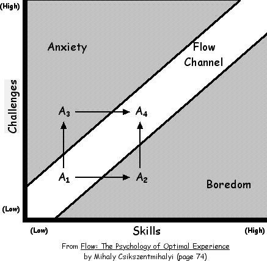
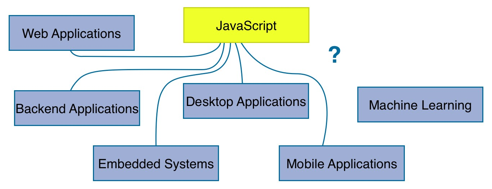
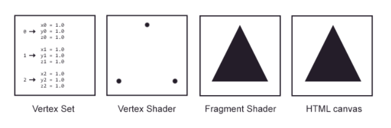
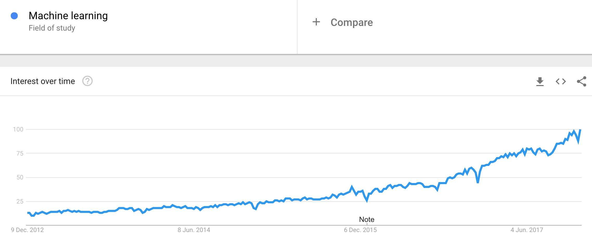
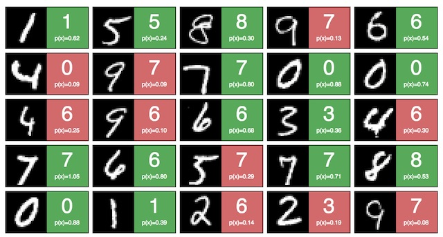
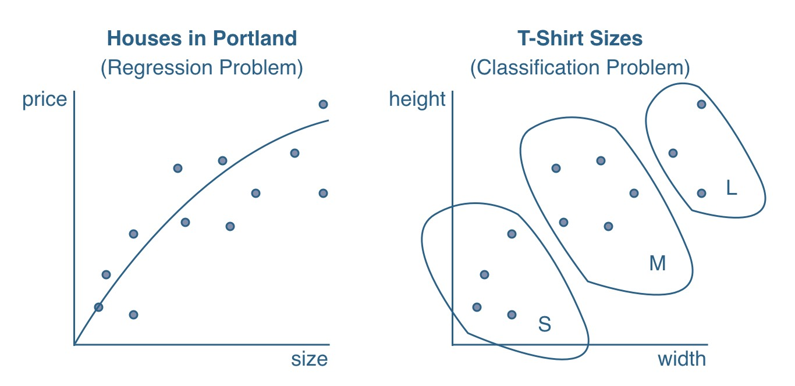
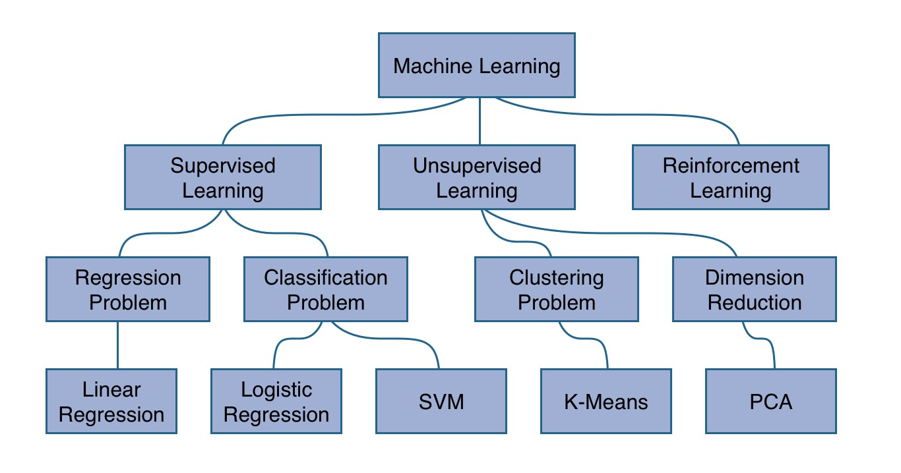
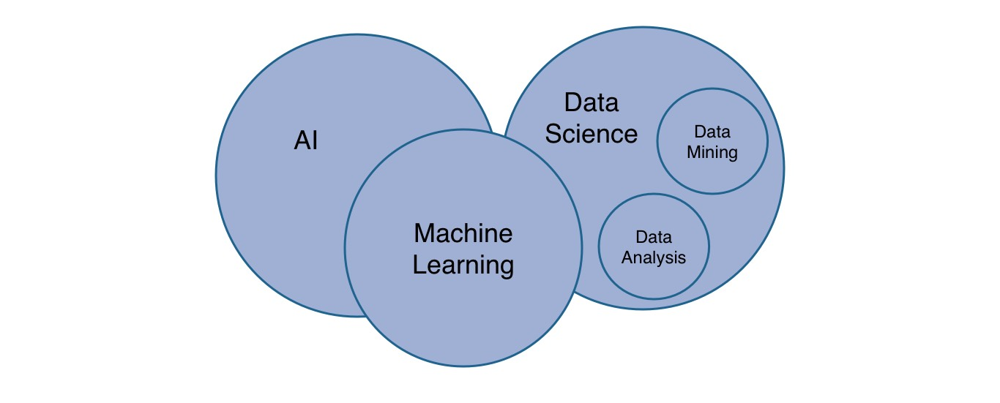

<Sponsorship />

Recently, I was wondering how I could escape the web development bubble for a while. 2017 was full of React, Redux and MobX in JavaScript where I have written actively about those topics on my blog, developed small ([1](https://github.com/rwieruch/favesound-redux), [2](/how-to-build-your-own-course-platform/), [3](https://github.com/rwieruch/open-crowd-fund), ...) and [large scale applications](https://www.small-improvements.com/features/?ref=robinwieruch.de) based on them, [self-published two educational ebooks](https://leanpub.com/u/rwieruch), and implemented a [course platform](https://roadtoreact.com/) with those technologies to teach others about them. The last year was all about those subjects, so I needed a side project to escape it for a while and to get into a zen mode of learning again.

**How did I get to machine learning?** A couple of months ago, I started to listen to the [Machine Learning Guide podcast](http://ocdevel.com/podcasts/machine-learning). I found out about it by chance and highly recommend it to get you an introduction for machine learning. Tyler Renelle is doing an amazing job to get you excited about the topic. I almost feel like I am following him on the same path to learn about machine learning now. Even though I didn't actively plan about learning ML, it was interesting to hear about all those foreign concepts. There it was again; this excitement when everything is unexplored. I felt like a whole new world opened up in front of me. It was the same feeling when [I finally got the foot into web development](/what-is-an-api-javascript/).

As I read about a couple of machine learning articles, the course on [Machine Learning by Andrew Ng](https://click.linksynergy.com/link?id=yL1MQRWYyXQ&offerid=467035.1560515719&type=2&murl=https%3A%2F%2Fwww.coursera.org%2Flearn%2Fmachine-learning) was the by far most recommended to get started in machine learning. I have never taken an online course from start to end before, even though I actively give these online courses myself, but I decided to give it a shot this time. Fortunately, the course had started one week ago. So I enrolled in it and by now finished it. It's a blast and I recommend everyone who wants to get into ML to take it. Even though it's a big commitment in the first place to enroll in the course for 12 weeks. But more about it later.

After university, I immediately took a job to work on a large scale application in JavaScript. So I never had the chance to apply most of my technical and mathematical learnings that I learned at university. Yet it was great to grow in web development and JavaScript over the last years and I don't want to miss that time. But when I started to learn about machine learning, it was a pleasure to cram out all the learnings in math. Suddenly I had a use case where it would make sense to take the derivative of a function: gradient descent. Why aren't schools and universities showing these real world use cases in a simplified version to motivate their students with hands-on problems? Learning all the theoretical things is fine, but when you finally apply the derivative for an optimization problem, it actually becomes exciting. It was always difficult for me to pick up a book about plain math. But as I started to relearn the math for machine learning again, I had an applicable domain for it. So I started to relearn all those things from university which obviously go beyond taking the derivative.

**So why is this article about machine learning in JavaScript?** If you are coming from web development as I do, you might know how difficult it can be to make the leap over to another domain such as machine learning. It comes with its own constraints. Not only the whole domain with its algorithms is different, but also its programming languages suited for machine learning paired with mathematical concepts from linear algebra, calculus and statistics. Personally, I found it an interesting strategy to boil down the different learning parts in machine learning: algorithms, programming languages (e.g. Python) and mathematical concepts. When I looked at those, I knew that I would definitely have to learn about the machine learning algorithms themselves and the underlying mathematical concepts. But I could strip out the best suited machine learning programming language and replace it with a language where I felt most efficient: JavaScript.

The following article should give you a **gentle introduction to machine learning from a web developer's perspective**. It should show you the opportunities in the field of machine learning and why it could be an advantage to learn about those things with JavaScript as a web developer now. Furthermore, it should give you guidance on how to approach the topic without learning everything from scratch. You can leverage the implementation details in JavaScript and focus on the theoretical parts: algorithms and mathematics. If you are familiar with the topic and have improvements for the article, please don't hesitate to reach out to me. I am still learning about the topic myself and I would be grateful for any nudges in the right direction. After all, the guidance I give only describes my learning path, but I hope that others can make use of it.

# Machine Learning in JavaScript? What's wrong with you?

By now I can hear the crowd yelling: JavaScript is not suited for machine learning. You may be right. But there are a couple of things why JavaScript could actually make sense to learn about machine learning as a web developer. And maybe not only as a web developer. Personally I think it has huge potential. That's why I attempt to make the topic more accessible for web developers.

As mentioned before, you might be already proficient in JavaScript. You don't have to learn another programming language from scratch. You can apply the theoretical parts of machine learning in any language. So why not JavaScript? Then you only have to learn about the theoretical parts in ML by applying the implementation details in JavaScript in the early stages. Afterward, you can always switch to another language for machine learning. Nobody takes that away from you. But you decide how to break down the learning paths for deploying your own learning curve and experience. You keep the overwhelming amount of things to learn to a minimum and thus might be better off to stay in a [state of flow](/lessons-learned-deep-work-flow/) by keeping challenges ahead and your level of skill in balance.

JavaScript is evolving with a rapid speed. It is applied in several domains by now where nobody would have seen it a couple of years ago. You can see it on [mobile devices](https://facebook.github.io/react-native/), [desktop applications](https://electronjs.org/), [embedded systems](https://tessel.io/) and of course [backend applications](https://nodejs.org/en/). It's not all about web development anymore. So why not machine learning? Maybe it becomes computational and implementation-wise efficient to write machine learning algorithms in JavaScript eventually. Recently a couple of libraries emerged which give us a framework around algorithms and neural networks. Those libraries make machine learning computational efficient by using WebGL in the browser. Perhaps it's not the best idea to train machine learning models in the browser, but using pre-trained models in the browser might be a promising field in the future. Last but not least, maybe it is just used as **a bridge for web developer entering the field of machine learning** but using a better suited programming language afterward. Nobody knows, but I want you to think about these possibilities.

**But what about the performance?** Machine learning algorithms are highly dependent on performance. Often they are using so called vectorized implementations to stay computational efficient. Graphical computations performed by the GPU are similarly used (see image; taken from webgltutorials.org). That's what makes C++ as a programming language so interesting for machine learning. Therefore, one would assume that JavaScript itself is not the best suited programming language. However, with [WebGL](https://developer.mozilla.org/en-US/docs/Web/API/WebGL_API) becoming popular for GPU accelerates executions in the browser, it is utilized for recent machine learning libraries in JavaScript too.

Another concern exists regarding the training phase. Why should it happen in the browser at all even though it is supported by the GPU? In highly efficient machine learning architectures the computation is offloaded to distributed systems. But there again, recent machine learning libraries for JavaScript are used with pre-trained models (inference phase) and not the training phase in the browser. The model comes from a server and is only used for further predictions and visualizations in the browser. So why shouldn't it be possible to offer a framework around this interplay of training phase backend and inference phase frontend? As mentioned before, using pre-trained models in the browser could be a common practice in the future. People are working eagerly on making those models smaller in size. So it's not as difficult anymore as it was in the past to transfer them via a remote API.

One big argument against machine learning in JavaScript is its lack of libraries. But that's not so true anymore. There are a bunch of libraries helping you out. For instance, consider a couple of programming languages in machine learning and the areas where they are primarily used:

* **Math / Data Analysis**: Matlab, Octave, Julia, R
* **Data Mining**: Scala, Java (e.g. Hadoop, Spark, Deeplearning4j)
* **Performance**: C/C++ (e.g. GPU accelerated)

Next, you can see why Python makes so much sense in machine learning. It has a suitable set of libraries for the different tasks assigned to the programming languages from above and even more good fitting solutions:

* **Math**: numpy
* **Data Analysis**: Pandas
* **Data Mining**: PySpark
* **Server**: Flask, Django
* **Performance**:
  * TensorFlow (because it is written with a Python API over a C/C++ engine)
  * Keras (sits on top of TensorFlow)

So yeah, it seems like that it just makes sense to use Python for machine learning. But the JavaScript ecosystem offers a rich set of libraries suited for most of the tasks too. Because most of them are not only used in machine learning, the JavaScript ecosystem developed a couple of sophisticated solutions beforehand:

* **Math**: math.js
* **Data Analysis**: d3.js
* **Server**: node.js (express, koa, hapi)
* **Performance**:
  * Tensorflow.js (e.g. GPU accelerated via WebGL API in the browser)
  * Keras.js

Even though a library such as math.js is not running on the GPU for expensive computations, I guess one could use utility libraries such as [gpu.js](https://github.com/gpujs/gpu.js) to accelerate its performance. Furthermore, the recent high level machine learning libraries such as Tensoflow.js come with their own set of mathematical functions which are indeed accelerated by the GPU. In the future you would either use one of those dedicated machine learning libraries for JavaScript which are GPU accelerated or math.js gets its own GPU accelerated wrapper eventually.

Except for the last libraries (Tensorflow.js and Keras.js) on the previous list, none of the other libraries is strictly related to machine learning. They were developed independently and thus have a strong community on their own. So JavaScript isn't so much behind other programming languages when it comes to the toolset. But for sure, the sky is the limit. There are endless of improvements which could be made or libraries which are needed. That's just another opportunity for open source developers to implement the necessary tools around it. And I assume in the future, there will evolve sophisticated libraries for machine learning in JavaScript. Just in the recent time, there were a couple of interesting libraries released or announced for machine learning in JavaScript.

* [Tensorflow.js](https://js.tensorflow.org/) (previously [Deeplearn.js](https://deeplearnjs.org)): The library by Google is GPU accelerated via WebGL API and used for predictions by using pre-trained models in inference mode in the browser but also for the training mode itself. It mirrors the API of the popular [TensorFlow](https://www.tensorflow.org/) library.

* [TensorFire](https://tenso.rs/) and [Keras.js](https://github.com/transcranial/keras-js): Yet another pair of two GPU accelerated libraries which are used for pre-trained models in inference mode. They allow you to write your models in [Keras](https://keras.io/) or TensorFlow with Python. Afterward you can deploy them to the web by using TensorFire or Keras.js.

Only 2017 brought up those exciting and promising libraries. So I am curious what 2018 will offer us.

As you can see, so far the article pointed out a couple of concerns using  JavaScript as your programming language to get started in machine learning. However, most of these reasons are not as much valid anymore as they were a couple of years ago. JavaScript is evolving and thus its capabilities of applying machine learning with it. Even though it may be only the bridge for you to learn about machine learning in the first place. Afterward, learn a more suited programming language for it. But then you have only to learn the programming language without worrying too much about the machine learning part anymore. Even though learning machine learning is an ongoing process and you will always learn something new in this fast paced domain. But it's exciting, because it has so many facets.

# Machine Learning as an Opportunity for Web Developer

I made my own motivation clear in the beginning of this article. However, that's not all to the story. There are plenty of reasons and opportunities to dive into machine learning as a web developer.

First of all, it is always an opportunity to broaden ones horizon. It doesn't only apply to machine learning. But whenever you feel you are getting too comfortable, take it as opportunity to learn something new. You don't need to take the practical way of implementing machine learning algorithms in JavaScript, maybe only learning about the math and the algorithms on a theoretical level suffices for you. After all, you keep your mind sharp by learning.

Second, there are plenty of job opportunities out there in the domain of machine learning. Sure, it is a overly hyped topic in the recent years, but not without any reason. Students and researcher in the field are hired straight away from university. There seems to be a huge demand in the general fields of AI, data analysis and machine learning. [Bootcamps are popping up or shift their focus to data science](https://www.switchup.org/research/best-data-science-bootcamps). JavaScript can be the entry point into machine learning for web developers. See it as opportunity to take one step beyond web development and maybe to a wider range of job opportunities. Perhaps the market in web development paired with machine learning grows in the next years. But even if it doesn't, you can learn a programming language suited for machine learning to apply all your theoretical learnings in it. After all, [maybe there comes the time when web developers have to make an important decision](https://medium.com/@TebbaVonMathenstien/are-programmers-headed-toward-another-bursting-bubble-528e30c59a0e) to get into a different domain than web development. Maybe their own works becomes redundant due to machine learning. So why not learning ML?

Third, even though JavaScript facilitates a lot of utility libraries for machine learning, there is plenty of space for improvements in the domain. Just thinking briefly about it, I am able to come up with a few things. For instance, speaking about computational efficiency, most of the libraries are not GPU accelerated yet. They would benefit a lot from these to be computational efficient for machine learning in the browser. In terms of visualizations, there are a couple of charting libraries, such as d3.js as low level visualization library, but there aren't any suitable abstractions for those visualizations applicable for machine learning related problems. It should be simpler to [plot the result of a support vector machine](http://cs.stanford.edu/people/karpathy/svmjs/demo/) or to visualize a performing neural network explicitly and not [not implicitly based on the used domain problem](https://github.com/javascript-machine-learning/mnist-neural-network-deeplearnjs). There is enough space for open source combining machine learning and JavaScript. You could contribute to widen the bridge for web developers entering the field of machine learning.

Last but not least, there is great effort involved on the side of ML open source contributors (e.g. Tensorflow.js, TensorFire, Keras.js, Brain.js) to enable machine learning in the browser. However, most often the documentation is suited for machine learners entering the browser domain and not the other way around as I described it in this article. Thus these solutions come with a lot of fundamental machine learning knowledge which isn't taught along the way. In return, it makes it difficult for web developers to enter the machine learning domain. Thus there is a great opportunity to pave the way for web developers into the domain of machine learning by making those fundamental topics and ported libraries accessible in an educational way. That's the point where I try to tie in my knowledge in teaching about those things. In the future, I want to give you the guidance if you are keen to enter the field of machine learning as web developer. Read more about this in the final paragraphs of this article.

# Introduction to Machine Learning

If you are familiar with machine learning, feel free to skip this section. Entering the field of machine learning as a beginner can be a buzzword heavy experience. Where should you start? There is so much terminology to clarify in the beginning. Is it **AI or machine learning**? What's all the hype about **deep learning**? And how fits **data science** in this area?

Let's start our journey with [AI (artificial intelligence)](https://en.wikipedia.org/wiki/Artificial_general_intelligence). *"It is the intelligence of a machine that could successfully perform any intellectual task that a human being can."* There is a great analogy in the *Machine Learning Guide* podcast to convey the information of AI: Whereas the goal of the industrial revolution was the simulation of the physical body through machines, it is the goal of AI to simulate the brain for mental tasks through algorithms. So how does machine learning relate to AI? Let's have a look at the a couple of subfields of AI:

* searching and planning (e.g. playing a game with possible actions)
* reasoning and knowledge representation (structuring knowledge to come to conclusions)
* perception (vision, touch, hearing)
* ability to move and manipulate objects (goes into robotics)
* natural language processing (NLP)
* learning

The last one represents machine learning. As you can see, it is only a subfield of AI. However, it might be the only essential core fragment of AI because it reaches into the other subfields of AI too. It reaches into them even more over the recent time. For instance, vision as subfield becomes more of a part of [applied machine learning](http://www.themtank.org/a-year-in-computer-vision). Where other techniques, e.g. domain specific algorithms, dominated the domain in the past, machine learning enters the field now. Now deep neural networks are often used for the domain. So what are applicable domains of AI and therefore most often machine learning? A bunch of domains and examples:

* Image Recognition (see referenced linked above)
* Web (e.g. Search Engines, Spam Filters)
* Art (e.g. [Painting](https://github.com/jcjohnson/neural-style))
* Autonomous Vehicles (e.g. [Tesla Autopilot](https://www.tesla.com/autopilot), awareness comes up for [Robots in Warfare](https://www.theguardian.com/technology/2017/aug/20/elon-musk-killer-robots-experts-outright-ban-lethal-autonomous-weapons-war))
* Medical Diagnosis
* Playing Games (e.g. [Go](https://www.youtube.com/watch?v=9xlSy9F5WtE), [StarCraft](https://deepmind.com/blog/deepmind-and-blizzard-open-starcraft-ii-ai-research-environment/))

So machine learning is a subfield of AI. Let's dive into the subject itself. There are a couple of great definitions for machine learning, yet when I started out with the subject, I found the one by Arthur Samuel (1959) most memorable: *"The field of study that gives computers the ability to learn without being explicitly programmed."* How does it work? Basically machine learning can be grouped into three categories: **supervised learning, unsupervised learning and reinforcement learning**. It's quite an evolution from the former to the latter. Whereas the former is more concrete, the latter becomes more abstract (yet exciting and unexplored). The former, supervised learning, gives the best entry point to machine learning and is used therefore in several educational machine learning courses to get you into the field. In supervised learning, an algorithm is trained to recognize a pattern in a given data set. The data set is split up into input (x) and output (y). The algorithm is trained to map input to output by learning with the given data set (**training phase**) the underlying pattern. Afterward, when the algorithm is trained, it can be used to make predictions for future input data points to come up with output data points (**inference phase**). During the training phase, a **cost function** estimates the performance of the current algorithm and adjusts the parameters of the algorithm based on those outcomes (penalization). The algorithm itself can be simplified into a simple function to map an input x to an output y. It's called **hypothesis** or **model**.

Predicting housing prices in Portland is one popular machine learning problem for supervised learning. Given a data set of houses whereas each house has a size in square meter (x), the price (y) of the house should be predicted. Thus the data set consists a list of sizes and prices for houses. It is called a **training set**. Each row in the training set represents a house. The input x, in this case the size of the house, is called a **feature** of the house. Since there is only one feature for the houses in the training set, it is called a **univariate** training set. If there are more features for a house, such as number of bedrooms and size, it becomes a **multivariate** training set. Increasing the size of the training size (m) and the size of features (n) can lead to an improved prediction of y whereas y is called a **label**, **target** or simply the output. In a nutshell: A model is trained with a penalizing cost function to predict labels from data points and their features.

Tom Mitchell (1998): *"A computer program is said to learn from experience E with respect to some class of tasks T and performance measure P, if its performance at tasks in T, as measured by P, improves with experience E."*

The previous use case of predicting housing prices in Portland is called a **regression problem**. A **linear regression**, as explained before, can be used to train the hypothesis to output **continuous values** (e.g. housing prices). Another problem in the area of supervised learning to be solved is called **classification problem** where a **logistic regression** is used to output **categorical values**. For instance, imagine you have a training set of T-Shirts. The features, such as width and height, can be used to make predictions for the categorical sizes X, M and L.

The previous paragraphs were a first glimpse on supervised learning in machine learning. How does unsupervised learning work? Basically there is a given training set with features but no labels y. The algorithm is trained without any given output data in the training set. In a classification problem the algorithm has to figure out on its own to classify the data points into clusters.

And last but not least, what about reinforcement learning? In reinforcement learning the algorithm is trained without any given data. It learns from experience by repeating a learning process. For instance, take this [flappy bird](https://github.com/xviniette/FlappyLearning) which learns to win the game by using neural networks in reinforcement learning. The algorithm is learning by trial and error. The underlying mechanism is a combination of rewards and penalizations to train the bird to fly. Similar as a real bird would learn how to fly.

Last but not least, there might be another question popping up in your head: **What's the relationship of data science to machine learning?** Data science is often associated with machine learning. So one could argue that machine learning bleeds into both domains: data science and artificial intelligence. However, data science has its own subfields such as data mining and data analysis. It can often be used coupled to machine learning, because data mining enables an algorithm to learn from mined data and data analysis enables researchers to study the outcomes of algorithms.

That was a broad introduction to the field of machine learning. If you are interested in those topics related to JavaScript, keep an eye on my website over the next months. I hope to cover a few topics to give people guidance entering the field as web developers. As I said, I am learning about the topic myself and try to internalize these learnings by writing them down.

# How to learn Machine Learning as Web Developer

There are a bunch of resources that I want to recommend for web developers entering the field of machine learning. As for myself, I wanted to stimulate my senses for at least 12 weeks. That's how long it is said to complete Andrew Ng's machine learning course. Keep in mind that it's my personal roadmap and it might not be suited for everyone. But it helped me a lot following a strict routine and having enough learning material along the way. So it might help other web developers too.

If you just want to get a feeling for the topic, start to listen to the [Machine Learning Guide](http://ocdevel.com/podcasts/machine-learning) up to episode 11. Tyler Renelle has done an amazing job giving an introduction to the topic. Since it is a podcast, just give it a shot while you exercise in a gym. That's how I entered the field of ML.

If you start to get excited, the next step would be to enroll in the [Machine Learning course](https://click.linksynergy.com/link?id=yL1MQRWYyXQ&offerid=467035.1560515719&type=2&murl=https%3A%2F%2Fwww.coursera.org%2Flearn%2Fmachine-learning) by Andrew Ng which takes 12 weeks for completion. It takes you on a long journey from shallow machine learning algorithms to neural networks, from regression problems to clustering problems and from theoretical knowledge in the field to applied implementations in Octave or Matlab. It is intense and challenging, but you can do it by dedicating a couple of hours each week to the course and the exercises.

The machine learning course goes from linear regression to neural networks in 5 weeks. In the end of week 5, I was left with an overwhelming feeling. It was a combination of "Can week 6 become even more complex?" and "Wow, this course taught me all the building blocks to implement a neural network from scratch". Andrew gives a perfect walkthrough to learn about all these concepts which build up on one another. After all, machine learning has a lot in common with the composition of functions from functional programming. But you will learn about this yourself. I can only say that it was an overwhelming feeling to see an own implementation of a neural network performing in the browser for the first time.

Along the way, I did all the weekly assignments and solved them in Octave. In addition, I implemented most of the algorithms in JavaScript as well as as exercise for myself and as estimation how feasible it is to implement these algorithms in a different language not suited for machine learning but suited for web developers. It worked and I published all of them in a open [GitHub organization](https://github.com/javascript-machine-learning). It's open for everyone to contribute. But that's not everything to the story. I wrote about a couple of topic as well to internalize my own learnings, to get guidance from others, but also to help web developers entering the field. So if you are doing the course, check out the JavaScript implementations and walkthroughs along the way. These walkthroughs are dedicated machine learning tutorials for Node.js and the browser.

* [Linear Regression with Gradient Descent in JavaScript](/linear-regression-gradient-descent-javascript/)
* [Improving Gradient Descent in JavaScript](/improving-gradient-descent-javascript/)
* [Gradient Descent with Vectorization in JavaScript](/linear-regression-gradient-descent-vectorization-javascript/)
* [Multivariate Linear Regression, Gradient Descent in JavaScript](/multivariate-linear-regression-gradient-descent-javascript/)
* [Linear Regression with Normal Equation in JavaScript](/multivariate-linear-regression-normal-equation-javascript/)
* [Logistic Regression with Gradient Descent in JavaScript](/logistic-regression-gradient-descent-classification-javascript/)
* [Neural Networks in JavaScript with deeplearn.js](/neural-networks-deeplearnjs-javascript)

It's not comprehensive yet, for instance a neural network implementation with vanilla JavaScript is missing, but I hope to complete all the bare bones algorithms in JavaScript at some point. The neural network implementation is done with a recently released library called deeplearn.js by Google which got rebranded to Tensorflow.js. I was pretty excited to use it for the first time, and it was my personal reward, after doing the course for 5 weeks, to use a library instead of implementing neural networks in JavaScript from scratch. Have a look at the [neural network in action to improve web accessibility](https://github.com/javascript-machine-learning/color-accessibility-neural-network-deeplearnjs). Another one [is learning digets using the MNIST databse and visualizes its outcome](https://github.com/javascript-machine-learning/mnist-neural-network-deeplearnjs). Maybe you see it as opportunity as well to contribute to the GitHub organization. Next on the agenda are K-Means, Support Vector Machines (SVM) and principal component analysis (PCA) from scratch in JavaScript!

After you have completed week 5 of the machine learning course, you should have a good feeling about what's machine learning and how to solve problems with it. Afterward, the course continues with shallow algorithms for supervised learning and unsupervised learning. It gives elaborated guidance of how to improve your implemented machine learning algorithms and how to scale them for large data sets. When you have completed week 5, you should continue as well with the Machine Learning Guide podcast to learn more about shallow algorithms and neural networks. I listened to it until episode 17, because afterward it goes heavily into natural language processing.

In addition, over the course of those weeks, I read [The Master Algorithm](http://amzn.to/2AthAGm) by Brilliance Audio to get an overview about the topic, its different perspectives and stakeholders, and its history. After that, I started to read the open source ebook [Deep Learning](http://www.deeplearningbook.org/) (by Ian Goodfellow and Yoshua Bengio and Aaron Courville). It happened after week 5 of the course and fitted perfectly to all the foundational knowledge I learned so far. Even though I found it quite a challenging book so far, I can recommend both books to give you even more guidance along the way. Once I finish the second book, I want to read the free ebooks [Neural Networks and Deep Learning by Michael Nielsen](http://neuralnetworksanddeeplearning.com/) and [Deep Learning by Adam Gibson, Josh Patterson](https://www.safaribooksonline.com/library/view/deep-learning/9781491924570/). Do you have any other book or podcast recommendations? You can leave a comment below!

What else is out there to learn machine learning? Now after I completed the course by Andrew Ng, I will take some rest to internalize all those learnings. Likely I will write more about them for my blog. You can subscribe to the Newsletter if you are interested in hearing about them. However, there a bunch of other courses out there which I want to check out.

* [Machine Learning Engineer Nanodegree](https://www.udacity.com/course/machine-learning-engineer-nanodegree--nd009) on Udacity
* [Deep Learning Specialization](https://click.linksynergy.com/link?id=yL1MQRWYyXQ&offerid=467035.11421701896&type=2&murl=https%3A%2F%2Fwww.coursera.org%2Fspecializations%2Fdeep-learning) on Coursera
* [Practical Deep Learning for Coders](http://course.fast.ai/) on Fast.ai

These are all courses recommended along with the Machien Learning course by Andrew Ng. Fast.ai has a course on [computational linear algebra](http://www.fast.ai/2017/07/17/num-lin-alg/) for the underlying math in ML too. In general, machine learning involves lots of math. If you need a refresher on certain topics, I can highly recommend Khan Academy.

* [Linear Algebra](https://www.khanacademy.org/math/linear-algebra)
* [Statistics](https://www.khanacademy.org/math/statistics-probability)
* [Calculus](https://www.khanacademy.org/math/calculus-home)

Getting back to topic: Machine Learning in JavaScript. What kind of libraries are out there to support you for machine learning in JavaScript? If you attempt to go the puristic way of implementing math operations from scratch, there is no way around [math.js](http://mathjs.org/) (e.g. [matrix operations](/linear-algebra-matrix-javascript/)). However, if you are using high level libraries such as Keras.js or Tensorflow.js, you will have the most important mathematical methods integrated by using their NDArrays, Tensors and mathematical operations. Otherwise, there are a couple of other libraries, not mentioning the mentioned again, which I didn't try yet. Keep in mind that not all of them are GPU accelerated, but I guess when it comes to computational efficiency, a couple of them will offer it in the future.

* [Pavlov.js](https://github.com/NathanEpstein/Pavlov.js) (Markov Decision Processes)
* [SVM.js](https://github.com/karpathy/svmjs) (Support Vector Machines)
* [Brain.js](https://github.com/harthur/brain) (Neural Networks)
* [Synaptic](https://github.com/cazala/synaptic) (Neural Networks)
* [Neataptic](https://github.com/wagenaartje/neataptic) (Neural Networks, Neuroevolution)
* [WebDNN](https://github.com/mil-tokyo/webdnn) (Neural Networks, Inference Mode)

There are even more machine learning related libraries in JavaScript for the other subfields of AI.

* [Natural](https://github.com/NaturalNode/natural) ([Natural Language Processing](https://en.wikipedia.org/wiki/Natural_language_processing))
* [Sentiment](https://github.com/thisandagain/sentiment) ([Sentiment Analysis](https://en.wikipedia.org/wiki/Sentiment_analysis))
* [OpenCV.js](https://github.com/ucisysarch/opencvjs) ([Computer Vision](https://en.wikipedia.org/wiki/Computer_vision) with OpenCV for the Browser)
* [opencv4nodejs](https://github.com/justadudewhohacks/opencv4nodejs) (Computer Vision with OpenCV for Node.js)
* [face-recognition.js](https://github.com/justadudewhohacks/face-recognition.js) (Face Recognition)
* [face-api.js](https://github.com/justadudewhohacks/face-api.js) (Face Recognition based on Tensorflow.js)

Another library didn't make it in the list, because it is is not actively maintained: [ConvNetJS](https://github.com/karpathy/convnetjs). In addition, there are two more libraries implementing shallow machine learning algorithms in JavaScript: [machine_learning](https://github.com/junku901/machine_learning) and [ml](https://github.com/mljs/ml). In those libraries you can find logistic regression, k-means clustering, decisions trees, k-nearest neighbours, principal component analysis and naive bayes for JavaScript.

Many of those libraries are only for machine learning in Node.js. Thus they are not using the computational efficient WebGL in the browser.

If you have any other recommendations, please leave a comment below. If you know whether certain libraries are active or not maintained anymore, please reach out as well. I would love to keep this article updated for the future.

# More Programming Languages for Machine Learning

After learning and applying all the theoretical concepts in a programming languages of your choice (e.g. JavaScript), you can always come back to learn a programming languages best suited for machine learning. It can be a great learning experience in itself to experience how much more efficient something can be implemented in a different language. I had the same feeling when solving mathematical equations in Octave when doing them in JavaScript before.

A previous paragraph has shown a couple of machine learning languages (Python, C/C++, R, Scala, Java, Matlab, Octave, Julia) and their fields of expertise. The one outlier facilitating everything with its libraries seems to be Python. I cannot give any profound recommendation here, because I didn't use any of those languages in relation to machine learning, but personally I would choose Python if I would continue to learn about the topic after applying it in JavaScript. The one most recommended resource regarding learning Python was [Learn Python the Hard Way](https://learnpythonthehardway.org/). Andrew Ng mentions in his machine learning course that often machine learning algorithms are developed as prototype in Octave or Matlab but implemented in Python afterward. Therefore I am still figuring out a pragmatic learning roadmap as a combination of video, text and audio material for Python as I did for machine learning itself. If you have any recommendations, please leave a comment below.

<Divider />

In the end, I am curious about your feedback regarding machine learning in JavaScript for web developers. As said, I am learning on a daily basis about the topic myself at the moment. Most likely I will invest more time in this field in 2018, but I would love to hear your thoughts about it too. Are you staying with me on this journey?

Furthermore, I am curious if you have any opportunities for me to get more into machine learning in a professional way. At the moment, I am actively freelancing and consulting in JavaScript and web development and building my own projects on the side, but I would love to **take the leap into machine learning for a professional position**. I am eager to learn and would look up to mentors who are keen to teach someone new to the field of machine learning. So please take a moment to think about it and reach out to me in case there is anything where you can help me out :)

Last but not least, I want to announce [BRIIM as a movement for machine learning in JavaScript](https://bri.im). I hope I don't go out on a limb with it, but I am looking forward seeing JavaScript becoming more accessible for machine learning in the next years. That's why I started the BRIIM movement as a place for everyone to come together. **It's an opportunity to act in concert as a community and not as individuals.** Instead of library communities being isolated from each other, it should give an entry point for machine learning in JavaScript to work under a collective movement. Instead of finding articles about machine learning all over the web, it would be great to have one well maintained resource for it. Instead of scraping together all the pieces to learn about machine learning in JavaScript, there should be one high qualitative resource to pave the way for beginners. It's a movement to contribute together towards widening the bridge for JavaScript enthusiast entering the field of machine learning. So I hope to see you on the other side to join me on this journey.

If you have made it so far in this article, thank you so much for reading it!
