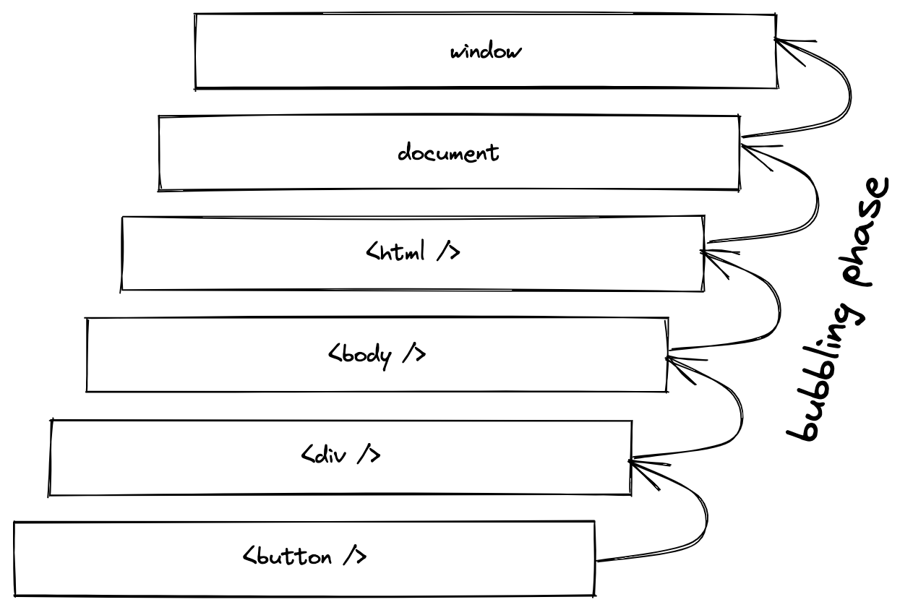
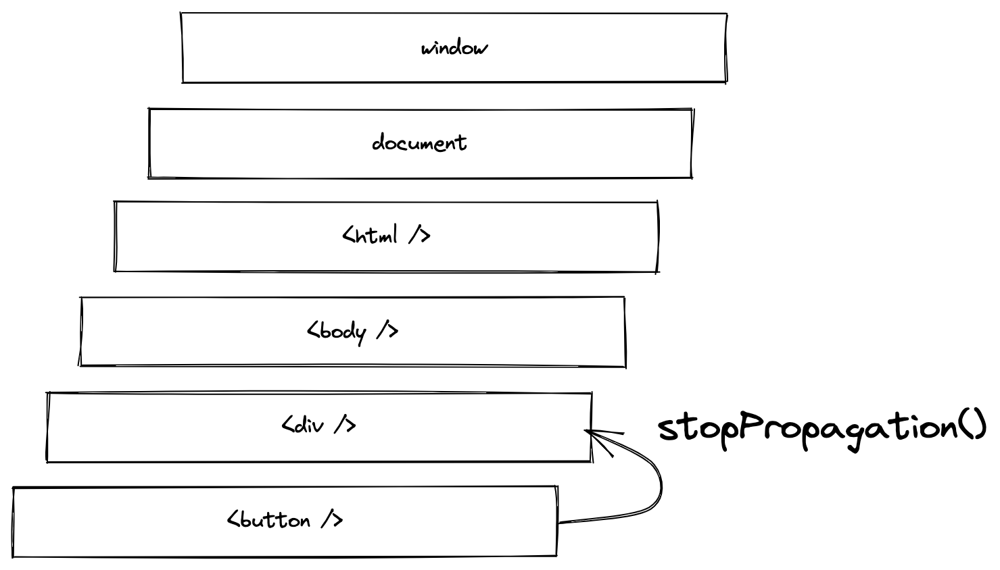
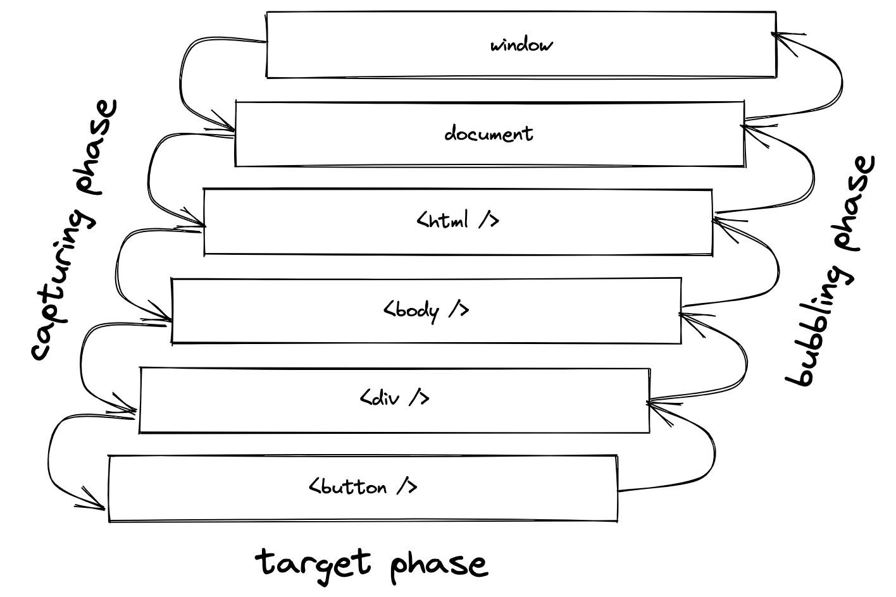
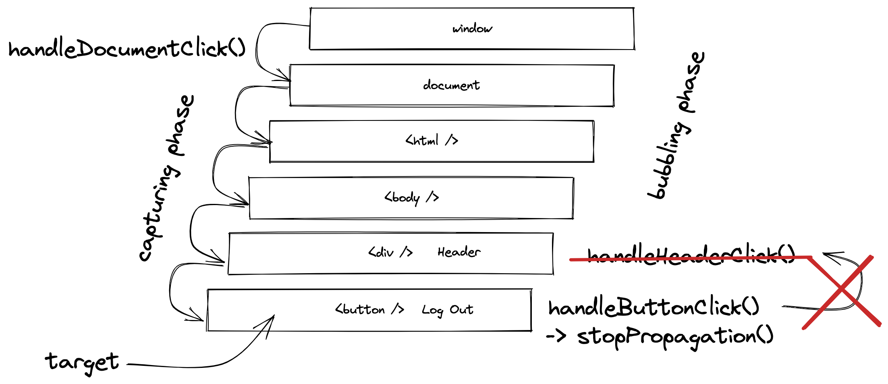

import Counter from './components/Counter.js';
import EventOrder from './components/EventOrder.js';
import BubblingBug from './components/BubblingBug.js';
import BubblingSingle from './components/BubblingSingle.js';
import BubblingMultiple from './components/BubblingMultiple.js';
import BubblingDocument from './components/BubblingDocument.js';
import StopPropagation from './components/StopPropagation.js';
import Header from './components/Header.js';
import Target from './components/Target.js';
import Analytic from './components/Analytic.js';

<Sponsorship />

A React tutorial about event bubbling and capturing. Most JavaScript developers may be already familiar with this topic, because it origins in JavaScript and its DOM API. However, in this article, I want to give some of guidance for **event bubbling and capturing in React**.

<ReadMore label="Event Handler in React" link="/react-event-handler/" />

An event handler in React can be used to listen to a specific event (e.g. on click event). We will kick things off with a [function component in React](/react-function-component/) where we increment a counter by using [React's useState Hook](/react-usestate-hook/):

```javascript
import * as React from 'react';

function App() {
  const [count, setCount] = React.useState(0);

  const handleClick = () => {
    setCount(count + 1);
  };

  return (
    <button type="button" onClick={handleClick}>
      Count: {count}
    </button>
  );
}

export default App;
```

<Box attached center>
  <Counter />
</Box>

In vanilla JavaScript, this would be equivalent to `element.addEventListener('click', handleClick);`. There are many events in React. To give you an idea, the following shows a list of events for mouse and touch events:

- touchstart
- touchmove
- touchend
- mousemove
- mousedown
- mouseup
- click

This particular event list is displayed in [its order of execution](https://developer.mozilla.org/en-US/docs/Web/API/Touch_events/Supporting_both_TouchEvent_and_MouseEvent#event_order). So if there are mouseup and a click event listeners added to a HTML element, the mouseup event will fire before the click event:

```javascript
import * as React from 'react';

function App() {
  const handleClick = () => {
    alert('click');
  };

  const handleMouseUp = () => {
    alert('mouseup');
  };

  return (
    <button
      type="button"
      onClick={handleClick}
      onMouseUp={handleMouseUp}
    >
      Which one fires first?
    </button>
  );
}

export default App;
```

<Box attached center>
  <EventOrder />
</Box>

In certain cases you may want to prevent one of the events when the other one fired. For example, when a touch event occurred and is handled, you may want to prevent all the click events (see [solution](https://stackoverflow.com/a/56970849/1189762)).

<ReadMore label="React preventDefault()" link="/react-preventdefault/" />

Anyway, in the previous example, all events happened on the same HTML element. There is nothing to see about event bubbling or capturing yet. Let's explore event bubbling with more than one HTML element next:

```javascript
import * as React from 'react';

function App() {
  const [count, setCount] = React.useState(0);

  const handleCount = () => {
    setCount((state) => state + 1);
  };

  return (
    <div onClick={handleCount}>
      <button type="button" onClick={handleCount}>
        Count: {count}
      </button>
    </div>
  );
}

export default App;
```

<Box attached center>
  <BubblingBug />
</Box>

In this example, it seems like that the button gets clicked twice, because the counter increments by two rather than one. However, what's happening instead is that the wrapping container element calls its event handler too. Entering event bubbling (in React) ...

# Event Bubbling in React

The following example shows two HTML elements with the same style. For the sake of simplicity, we are using inline style here, however, feel free to use a more sophisticated way of styling your React application.

<ReadMore label="How to style React components" link="/react-css-styling/" />

Anyway, let's get to the topic of **event bubbling**. As you can see, in the next example only the outer container element listens to a click event, not the inner container element. But regardless of whether you click the outer or inner element, the event handler will be fired nevertheless:

```javascript
import * as React from 'react';

const style = {
  padding: '10px 30px',
  border: '1px solid black',
};

function App() {
  const handleClick = () => {
    alert('click');
  };

  return (
    <div style={style} onClick={handleClick}>
      <div style={style}>Click Me</div>
    </div>
  );
}

export default App;
```

<Box attached center>
  <BubblingSingle />
</Box>

In JavaScript this principle is called **event bubbling**. Whenever an event happens on a HTML element (e.g. inner HTML element), it starts to run through the handlers of this specific element, then the handlers of its parent HTML element (e.g. outer HTML element, where it actually finds a listening handler), and afterward all the way up through each ancestor HTML element until it reaches the root of the document.



Try it yourself with the next example where both event handlers get triggered when the inner HTML element is clicked. If the outer HTML element gets clicked, only the outer element's event handler gets triggered:

```javascript{9-11,13-15,18-19}
import * as React from 'react';

const style = {
  padding: '10px 30px',
  border: '1px solid black',
};

function App() {
  const handleOuterClick = () => {
    alert('outer click');
  };

  const handleInnerClick = () => {
    alert('inner click');
  };

  return (
    <div style={style} onClick={handleOuterClick}>
      <div style={style} onClick={handleInnerClick}>
        Click Me
      </div>
    </div>
  );
}

export default App;
```

<Box attached center>
  <BubblingMultiple />
</Box>

In other words, events bubble up the whole document from their origin. Verify this bevavior yourself by adding an event listener on the document via [React's useEffect Hook](/react-useeffect-hook/):

```javascript{17-27}
import * as React from 'react';

const style = {
  padding: '10px 30px',
  border: '1px solid black',
};

function App() {
  const handleOuterClick = () => {
    alert('outer click');
  };

  const handleInnerClick = () => {
    alert('inner click');
  };

  React.useEffect(() => {
    const handleDocumentClick = () => {
      alert('document click');
    };

    document.addEventListener('click', handleDocumentClick);

    return () => {
      document.removeEventListener('click', handleDocumentClick);
    };
  }, []);

  return (
    <div style={style} onClick={handleOuterClick}>
      <div style={style} onClick={handleInnerClick}>
        Click Me
      </div>
    </div>
  );
}

export default App;
```

<Box attached center>
  <BubblingDocument />
</Box>

So if an event bubbles up the entire document from its interacted element, how can the bubbling be stopped for certain cases? Entering stopPropagation (in React) ...

# React: stopPropagation

The `stopPropagation()` method is native to the DOM API. Since React wraps events into a React version called synthetic events, this API is still available for React events where it can also be used to stop the propagation (read: bubbling) of events:

```javascript{6,9}
import * as React from 'react';

function App() {
  const [count, setCount] = React.useState(0);

  const handleCount = (event) => {
    setCount((state) => state + 1);

    event.stopPropagation();
  };

  return (
    <div onClick={handleCount}>
      <button type="button" onClick={handleCount}>
        Count: {count}
      </button>
    </div>
  );
}

export default App;
```

<Box attached center>
  <StopPropagation />
</Box>

We extended one of the previous examples by using the `stopPropagation()` method on an event. This way, when the button gets clicked, the event does not bubble up and does not trigger the event handler of the surrounding container element.



The other way around, when the container element gets explicitly clicked (unlikely in this scenario without any further styling), only the event handler of the container triggers. Here the `stopPropagation()` on the container element is kinda redundant, because there is no event handler above of it.

**That's the perfect time for a word of caution:** Do not stop event propagation by default. For example, if you would use `stopPropagation()` on every button in your project, but later you want to track user clicks on a document level, you will not receive these events anymore. Using `stopPropagation()` by default will often lead to bugs, so use it only when necessary.

Let's check out a more elaborate scenario when stopping event propagation makes sense. For example, there could be a clickable header which navigates a user to the home page from any page, however, within the header there is a button to log out a user from the application. Both elements should be clickable without interfering with each other:

```javascript
import * as React from 'react';

const styleHeader = {
  padding: '10px',
  border: '1px solid black',
  boxSizing: 'border-box',
  width: '100%',
  display: 'flex',
  justifyContent: 'space-between',
};

function App() {
  const [isActive, setActive] = React.useState(false);

  const handleHeaderClick = () => {
    alert('header click (e.g. navigate to home page)');
  };

  const handleButtonClick = (event) => {
    alert('button click (e.g. log out user)');

    if (isActive) {
      event.stopPropagation();
    }
  };

  return (
    <>
      <div style={styleHeader} onClick={handleHeaderClick}>
        <div>Header</div>
        <button type="button" onClick={handleButtonClick}>
          Log Out
        </button>
      </div>

      <button type="button" onClick={() => setActive(!isActive)}>
        Stop Propagation: {isActive.toString()}
      </button>
    </>
  );
}

export default App;
```

<Box attached>
  <Header />
</Box>

Without stopping the propagation, the log out button will trigger its own event handler, but also the event handler on the header, because the event bubbles up to it. When `stopPropagation()` gets activated, a click on the log out button will not lead to a bubbling event on the header, because the event gets prevented from bubbling up.

In conclusion, whenever there is a element with a handler nested in another element with a handler, where both are listening to the same event (here: click event), using `stopPropagation()` will help to delegate events to the correct handler (by preventing them from bubbling).

# Target vs CurrentTarget

When clicking an HTML element with a listener (event handler), you get access to its event (in React it is the synthetic event). Among other properties, the event has access to the `target` property which represents the element that caused the event. So if a button has an event handler and a user clicks this button, the event will have the button element as target.

Even though this event bubbles up to another event handler, if a nested element caused this event, then the `target` is still represented by this nested element. So throughout all handlers, the `target` of the event will not change.

What will change from event handler to event handler is the `currentTarget` of the event, because it represents the element where the actual event handler is running:

```javascript
import * as React from 'react';

const style = {
  display: 'block',
  padding: '10px 30px',
  border: '1px solid black',
};

function App() {
  const handleDivClick = (event) => {
    alert(`
      <div /> \n
      event.target: ${event.target} \n
      event.currentTarget: ${event.currentTarget}
    `);
  };

  const handleSpanClick = (event) => {
    alert(`
      <span /> \n
      event.target: ${event.target} \n
      event.currentTarget: ${event.currentTarget}
    `);
  };

  return (
    <div style={style} onClick={handleDivClick}>
      <span style={style} onClick={handleSpanClick}>
        Click Me
      </span>
    </div>
  );
}

export default App;
```

<Box attached center>
  <Target />
</Box>

Usually you will interact with an event's `target`, for example to stop the propagation of an event or to prevent the default behavior. However, sometimes you want to have access to the element from the running event handler, so then you can use `currentTarget` instead.

# Event Capturing in React

When speaking about event bubbling in JavaScript, one cannot hide that there exists the concept of **event capturing** too. Actually both happen one after another: When a user interacts with an element, the DOM API traverses down the document (capturing phase) to the target element (target phase), only then the DOM API traverses up again (bubbling phase).



There are certain cases where you may want to intercept an event in the capturing phase before it reaches the bubbling phase. Then you can use `onClickCapture` instead of `onClick` for click events in JSX or the `addEventListener()` methods third argument to activate the listening on the capturing phase instead of the bubbling phase:

```javascript{18,25,31,32}
function App() {
  const handleOuterClick = () => {
    alert('outer click');
  };

  const handleInnerClick = () => {
    alert('inner click');
  };

  React.useEffect(() => {
    const handleDocumentClick = () => {
      alert('document click');
    };

    document.addEventListener(
      'click',
      handleDocumentClick,
      true
    );

    return () => {
      document.removeEventListener(
        'click',
        handleDocumentClick,
        true
      );
    };
  }, []);

  return (
    <div style={style} onClickCapture={handleOuterClick}>
      <div style={style} onClickCapture={handleInnerClick}>
        Click Me
      </div>
    </div>
  );
}
```

<Box attached center>
  <BubblingDocument reverse />
</Box>

Speaking about "certain cases" is a bit vague. So let's go back to a previous example where we had the log out button nested in a header element. There the button stops the propagation of the event if it gets clicked to not trigger the event handler of the header. Now if you would want to extend this example by introducing analytical tracking on a top-level document level, you can verify yourself that for a button click you wouldn't receive the analytical tracking, but only for the header, because the button prevents the event from bubbling up to the document:

```javascript{9-11,14-27}
function App() {
  const handleHeaderClick = () => {
    alert('header click (e.g. navigate to home page)');
  };

  const handleButtonClick = (event) => {
    alert('button click (e.g. log out user)');

    // important: stops event from appearing
    // in the document's event handler
    event.stopPropagation();
  };

  React.useEffect(() => {
    const handleDocumentClick = (event) => {
      alert(`
        document clicked - \n
        run analytics for clicked element: ${event.target}
      `);
    };

    document.addEventListener('click', handleDocumentClick);

    return () => {
      document.removeEventListener('click', handleDocumentClick);
    };
  }, []);

  return (
    <>
      <div style={styleHeader} onClick={handleHeaderClick}>
        <div>Header</div>
        <button type="button" onClick={handleButtonClick}>
          Log Out
        </button>
      </div>
    </>
  );
}
```

<Box attached>
  <Analytic />
</Box>

With our knowledge about the capturing phase, we can run the analytical tracking of events *before* the bubbling of the actual user interactions. In this case, we add event listeners on the document by setting the third argument to `true` (using capturing phase instead of bubbling phase):

```javascript{25,32}
function App() {
  const handleHeaderClick = () => {
    alert('header click (e.g. navigate to home page)');
  };

  const handleButtonClick = (event) => {
    alert('button click (e.g. log out user)');

    // important: stops event from appearing
    // in the document's event handler
    event.stopPropagation();
  };

  React.useEffect(() => {
    const handleDocumentClick = (event) => {
      alert(`
        document clicked - \n
        run analytics for clicked element: ${event.target}
      `);
    };

    document.addEventListener(
      'click',
      handleDocumentClick,
      true
    );

    return () => {
      document.removeEventListener(
        'click',
        handleDocumentClick,
        true
      );
    };
  }, []);

  return (
    <>
      <div style={styleHeader} onClick={handleHeaderClick}>
        <div>Header</div>
        <button type="button" onClick={handleButtonClick}>
          Log Out
        </button>
      </div>
    </>
  );
}
```

<Box attached>
  <Analytic reverse />
</Box>

When the log out button gets clicked, the capturing phase runs through all handlers from top to bottom, thus triggering the handler on the document level for the analytical tracking. Then it traverses down the elements to the target (here: button), because no other event handlers are listening to the capturing phase (e.g. by using `onClickCapture` instead). From there, the event bubbles up and triggers the button's event handler which stops the event from propagating to the header's event handler.



In their day to day work, most developers use the bubbling phase to intercept events by using event handlers and to stop events from propagating by using the `stopPropagation()` method. So in a developer's mind there is always the model of events bubbling up the HTML tree. However, as illustrated in certain edge cases knowing about the capturing phase makes sense too.

<Divider />

Understanding event bubbling in JavaScript is crucial to make use of it in React. Whenever you have a complex page where pseudo buttons with event handler are wrapped into other pseudo buttons, there is no way around the native stopPropagation method. However, only use it sparingly and not by default, because otherwise you may run into bugs in the long run.