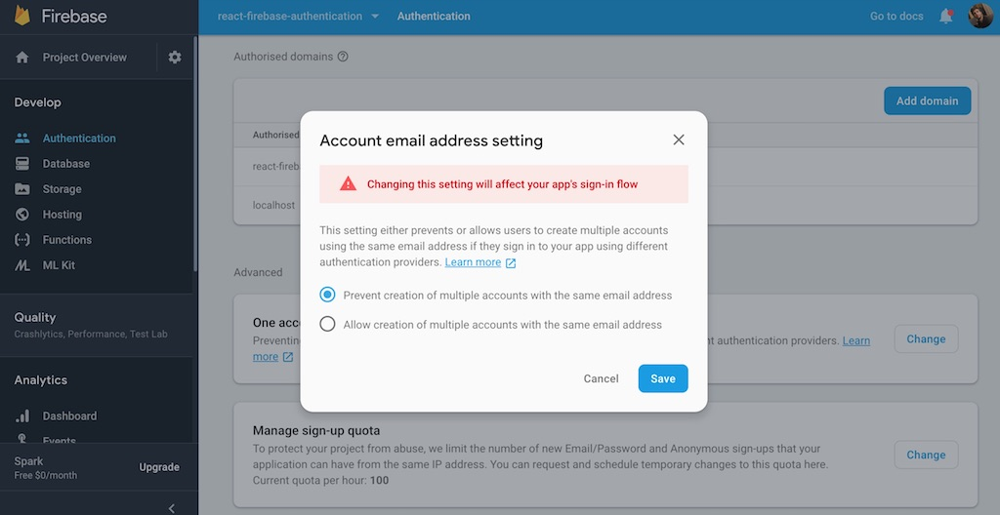

<Sponsorship />

<ReactFirebaseBook />

<LinkCollection
  label="This tutorial is part 5 of 5 in this series."
  links={[
    {
      prefix: "Part 1:",
      label: "A Firebase in React Tutorial for Beginners",
      url: "/complete-firebase-authentication-react-tutorial"
    },
    {
      prefix: "Part 2:",
      label: "React Firebase Authorization with Roles",
      url: "/react-firebase-authorization-roles-permissions"
    },
    {
      prefix: "Part 3:",
      label: "React Firebase Auth Persistence with Local Storage",
      url: "/react-firebase-auth-persistence"
    },
    {
      prefix: "Part 4:",
      label: "React Firebase Social Login: Google, Facebook, Twitter",
      url: "/react-firebase-social-login"
    }
  ]}
/>

The last section walked you through implementing social logins for Google, Facebook, and Twitter to being able to sign up/in with a email/password combination. However, since you have enabled multiple accounts for one email address, there is more than one account associated to your email, which can lead to bugs for your service/product. Imagine a user signs in with Google, buys a ebook on your website, is able to download the book as signed in user, and then signs out again. The next sign-in with the email/password combination won't show the e-book anymore. This is because the user has two accounts on your website. While one account is associated with Google, the other one is associated with the email/password combination.

To walk through this scenario, take one of your social accounts (Google, Facebook, Twitter) and log into the Firebase in React application. Check the account page and copy the email address that is associated to your social account. Log out and log in again with your email/password combination, using the same email as for your social login. It's possible because we enabled multiple accounts for the same email address in the Firebase dashboard. When you check the account page again, you should see the same email as when you logged in with the social account. Now head to your Firebase dashboard and check the "Authentication" tab. You should find two accounts associated to the same email you used before. The same applies for the "Database" tab.

In this section, we want to prevent this behavior by using only one email address per user, while still being able to sign-in via email/password, Google, Facebook or Twitter. It shouldn't matter which sign-in you take, as the account should be the same. That's where the linking of all the social accounts comes in.

Before we get started, head to the Authentication and Database tabs on your Firebase dashboard and delete the user you used with your personal email address. We will use this email address later, except this time it will end up once in both tabs for one account. First, disable the setting on your Firebase dashboard that encourages email addresses associated to more than one account.



We will prevent the user from signing in with another account when there is already an account associated to this email address. A message should point the user to the account page to link all the social accounts and the email/password account with each other instead. Let's show the user a custom error message for the sign up page. First, extract the error code and the custom message as variables:

```javascript{1,2,4,5,6,7,8,9}
const ERROR_CODE_ACCOUNT_EXISTS =
  'auth/account-exists-with-different-credential';

const ERROR_MSG_ACCOUNT_EXISTS = `
  An account with an E-Mail address to
  this social account already exists. Try to login from
  this account instead and associate your social accounts on
  your personal account page.
`;
```

Next, show the custom error message when the error code shows up. That's because we prevent more than one email address for one account:

```javascript{16,17,18}
...

class SignInGoogleBase extends Component {
  ...

  onSubmit = event => {
    this.props.firebase
      .doSignInWithGoogle()
      .then(socialAuthUser => {
        ...
      })
      .then(() => {
        ...
      })
      .catch(error => {
        if (error.code === ERROR_CODE_ACCOUNT_EXISTS) {
          error.message = ERROR_MSG_ACCOUNT_EXISTS;
        }

        this.setState({ error });
      });

    event.preventDefault();
  };

  ...
}

...
```

Repeat this for the other social logins (Facebook, Twitter) as well. If a user signs in with one of the social logins, but there is already an account in the system with this email address, the custom error message shows up. The user has to log in with the correct sign-in method and link all other desired social accounts to this account on the account page. We will add this feature later in the account page, but before this, we need to show a similar custom error message for the sign up page as well. The user might use a social login first and later attempt to sign up with an email address (email/password sign up) that has been used by the social login already.

```javascript{1,3,4,5,6,7,8,9}
const ERROR_CODE_ACCOUNT_EXISTS = 'auth/email-already-in-use';

const ERROR_MSG_ACCOUNT_EXISTS = `
  An account with this E-Mail address already exists.
  Try to login with this account instead. If you think the
  account is already used from one of the social logins, try
  to sign-in with one of them. Afterward, associate your accounts
  on your personal account page.
`;
```

Use the custom error message when the error code happens on sign-up:

```javascript{23,24,25}
...

class SignUpFormBase extends Component {
  ...

  onSubmit = event => {
    const { username, email, passwordOne, isAdmin } = this.state;
    const roles = {};

    if (isAdmin) {
      roles[ROLES.ADMIN] = ROLES.ADMIN;
    }

    this.props.firebase
      .doCreateUserWithEmailAndPassword(email, passwordOne)
      .then(authUser => {
        ...
      })
      .then(() => {
        ...
      })
      .catch(error => {
        if (error.code === ERROR_CODE_ACCOUNT_EXISTS) {
          error.message = ERROR_MSG_ACCOUNT_EXISTS;
        }

        this.setState({ error });
      });

    event.preventDefault();
  };

  ...
}

...
```

Now users can use the same email address for different sign-in methods. Next, let's head to the account page, where we'll create an area to manage and activate/deactivate all the sign-in methods (social sign-ins, email/password sign-in). Introduce all available sign-in methods and their optional providers (see Firebase class) as list of objects:

```javascript{3,4,5,6,7,8,9,10,11,12,13,14,15,16,17,18,19,20,29}
...

const SIGN_IN_METHODS = [
  {
    id: 'password',
    provider: null,
  },
  {
    id: 'google.com',
    provider: 'googleProvider',
  },
  {
    id: 'facebook.com',
    provider: 'facebookProvider',
  },
  {
    id: 'twitter.com',
    provider: 'twitterProvider',
  },
];

const AccountPage = () => (
  <AuthUserContext.Consumer>
    {authUser => (
      <div>
        <h1>Account: {authUser.email}</h1>
        <PasswordForgetForm />
        <PasswordChangeForm />
        <LoginManagement authUser={authUser} />
      </div>
    )}
  </AuthUserContext.Consumer>
);

...
```

Now implement the new component and render all available sign-in methods as buttons which are doing nothing:

```javascript{1,5,6,7,8,9,10,11,12,13,14,15,16,17,18,19,20,21,22,23,24}
import React, { Component } from 'react';

...

class LoginManagement extends Component {
  render() {
    return (
      <div>
        Sign In Methods:
        <ul>
          {SIGN_IN_METHODS.map(signInMethod => {
            return (
              <li key={signInMethod.id}>
                <button type="button" onClick={() => {}}>
                  {signInMethod.id}
                </button>
              </li>
            );
          })}
        </ul>
      </div>
    );
  }
}

...
```

Remember to make the Firebase instance available to the component, because we need to use it in the next step:

```javascript{4,10,24}
import React, { Component } from 'react';

import { AuthUserContext, withAuthorization } from '../Session';
import { withFirebase } from '../Firebase';
import { PasswordForgetForm } from '../PasswordForget';
import PasswordChangeForm from '../PasswordChange';

...

class LoginManagementBase extends Component {
  constructor(props) {
    ...
  }

  componentDidMount() {
    ...
  }

  render() {
    ...
  }
}

const LoginManagement = withFirebase(LoginManagementBase);

...
```

Then, fetch all active sign-in methods for the user's email address. Firebase has an API for it:

```javascript{4,5,6,7,8,9,10,11,13,14,15,16,17,18,19,20}
...

class LoginManagementBase extends Component {
  constructor(props) {
    super(props);

    this.state = {
      activeSignInMethods: [],
      error: null,
    };
  }

  componentDidMount() {
    this.props.firebase.auth
      .fetchSignInMethodsForEmail(this.props.authUser.email)
      .then(activeSignInMethods =>
        this.setState({ activeSignInMethods, error: null }),
      )
      .catch(error => this.setState({ error }));
  }

  ...
}

...
```

Next, differentiate between active sign-in methods and the remaining sign-in methods not in the list of fetched sign-in methods. You can show an error message with a conditional rendering as well:

```javascript{5,12,13,14,18,19,20,21,22,23,24,25,26,31}
class LoginManagementBase extends Component {
  ...

  render() {
    const { activeSignInMethods, error } = this.state;

    return (
      <div>
        Sign In Methods:
        <ul>
          {SIGN_IN_METHODS.map(signInMethod => {
            const isEnabled = activeSignInMethods.includes(
              signInMethod.id,
            );

            return (
              <li key={signInMethod.id}>
                {isEnabled ? (
                  <button type="button" onClick={() => {}}>
                    Deactivate {signInMethod.id}
                  </button>
                ) : (
                  <button type="button" onClick={() => {}}>
                    Link {signInMethod.id}
                  </button>
                )}
              </li>
            );
          })}
        </ul>
        {error && error.message}
      </div>
    );
  }
}
```

While all available sign-in methods are displayed, they differentiate between active and non-active. The active methods can be deactivated. On the other hand, sign-in methods that are available but not used by the user can be linked instead to make them active. We will implement both details in the next step:

```javascript{4,5,6,8,15,17,18,19,21,22,23}
class LoginManagementBase extends Component {
  ...

  componentDidMount() {
    this.fetchSignInMethods();
  }

  fetchSignInMethods = () => {
    this.props.firebase.auth
      .fetchSignInMethodsForEmail(this.props.authUser.email)
      .then(activeSignInMethods =>
        this.setState({ activeSignInMethods, error: null }),
      )
      .catch(error => this.setState({ error }));
  };

  onSocialLoginLink = provider => {
    ...
  };

  onUnlink = providerId => {
    ...
  };

  ...
}
```

Extract the fetch method, because we will use it after we linked (activated) or unlinked (deactivated) sign-in methods. Then the new class methods can be used by the buttons:

```javascript{12,22,23,30,31,32}
class LoginManagementBase extends Component {
  ...

  render() {
    const { activeSignInMethods, error } = this.state;

    return (
      <div>
        Sign In Methods:
        <ul>
          {SIGN_IN_METHODS.map(signInMethod => {
            const onlyOneLeft = activeSignInMethods.length === 1;
            const isEnabled = activeSignInMethods.includes(
              signInMethod.id,
            );

            return (
              <li key={signInMethod.id}>
                {isEnabled ? (
                  <button
                    type="button"
                    onClick={() => this.onUnlink(signInMethod.id)}
                    disabled={onlyOneLeft}
                  >
                    Deactivate {signInMethod.id}
                  </button>
                ) : (
                  <button
                    type="button"
                    onClick={() =>
                      this.onSocialLoginLink(signInMethod.provider)
                    }
                  >
                    Link {signInMethod.id}
                  </button>
                )}
              </li>
            );
          })}
        </ul>
        {error && error.message}
      </div>
    );
  }
}
```

Also, we added an improvement to avoid getting locked out of the application. If only one sign-in method is left as active, disable all deactivation buttons because there needs to be at least one sign-in method. Now let's implement the class methods for linking and unlinking accounts:

```javascript{5,6,7,8,12,13,14,15}
class LoginManagementBase extends Component {
  ...

  onSocialLoginLink = provider => {
    this.props.firebase.auth.currentUser
      .linkWithPopup(this.props.firebase[provider])
      .then(this.fetchSignInMethods)
      .catch(error => this.setState({ error }));
  };

  onUnlink = providerId => {
    this.props.firebase.auth.currentUser
      .unlink(providerId)
      .then(this.fetchSignInMethods)
      .catch(error => this.setState({ error }));
  };

  ...
}
```

Finally we are able to link and unlink accounts. Afterward, all active sign-in methods are fetched again. That's why we have extracted this class method from the `componentDidMount()` lifecycle method before, which is reusable now. The linking of the sign-in methods should work for Google, Facebook and Twitter now. However, it doesn't work for the email/password combination yet, because this one isn't done by a simple button click. If the user has only active social sign-in methods but no email/password sign-in method, an email/password combination must be provided; then it is possible to link this sign-in method to the other social sign-in methods.

First, extract the social sign-in methods to its own component and add a conditional rendering for the password sign-in method:

```javascript{4,5,6,20,21,22,23,24,25,26,27,28,29,30,31,32,33,34,35,36}
class LoginManagementBase extends Component {
  ...

  onDefaultLoginLink = () => {
    ...
  };

  render() {
    const { activeSignInMethods, error } = this.state;

    return (
      <div>
        Sign In Methods:
        <ul>
          {SIGN_IN_METHODS.map(signInMethod => {
            ...

            return (
              <li key={signInMethod.id}>
                {signInMethod.id === 'password' ? (
                  <DefaultLoginToggle
                    onlyOneLeft={onlyOneLeft}
                    isEnabled={isEnabled}
                    signInMethod={signInMethod}
                    onLink={this.onDefaultLoginLink}
                    onUnlink={this.onUnlink}
                  />
                ) : (
                  <SocialLoginToggle
                    onlyOneLeft={onlyOneLeft}
                    isEnabled={isEnabled}
                    signInMethod={signInMethod}
                    onLink={this.onSocialLoginLink}
                    onUnlink={this.onUnlink}
                  />
                )}
              </li>
            );
          })}
        </ul>
        {error && error.message}
      </div>
    );
  }
}
```

The DefaultLoginToggle component will use a different `onLink` handler than the SocialLoginToggle component, but the `onUnlink` stays the same. We will implement DefaultLoginToggle component and its missing handler in a moment, but first let's extract the SocialLoginToggle component:

```javascript{1,2,3,4,5,6,7,11,19}
const SocialLoginToggle = ({
  onlyOneLeft,
  isEnabled,
  signInMethod,
  onLink,
  onUnlink,
}) =>
  isEnabled ? (
    <button
      type="button"
      onClick={() => onUnlink(signInMethod.id)}
      disabled={onlyOneLeft}
    >
      Deactivate {signInMethod.id}
    </button>
  ) : (
    <button
      type="button"
      onClick={() => onLink(signInMethod.provider)}
    >
      Link {signInMethod.id}
    </button>
  );
```

The implementation details didn't change, but the component is standalone now. Next, let's implement the other component for the email/password sign-in. When this sign-in method is activated, it's sufficient to render only a button similar to the social sign-in methods to unlink (deactivate) this sign-in method. If this sign-in method isn't activated, you need to retrieve the user's desired email and password combination to link it as account to the other social accounts. It's very similar to our sign up form then:

```javascript
class DefaultLoginToggle extends Component {
  constructor(props) {
    super(props);

    this.state = { passwordOne: '', passwordTwo: '' };
  }

  onSubmit = event => {
    event.preventDefault();

    this.props.onLink(this.state.passwordOne);
    this.setState({ passwordOne: '', passwordTwo: '' });
  };

  onChange = event => {
    this.setState({ [event.target.name]: event.target.value });
  };

  render() {
    const {
      onlyOneLeft,
      isEnabled,
      signInMethod,
      onUnlink,
    } = this.props;

    const { passwordOne, passwordTwo } = this.state;

    const isInvalid =
      passwordOne !== passwordTwo || passwordOne === '';

    return isEnabled ? (
      <button
        type="button"
        onClick={() => onUnlink(signInMethod.id)}
        disabled={onlyOneLeft}
      >
        Deactivate {signInMethod.id}
      </button>
    ) : (
      <form onSubmit={this.onSubmit}>
        <input
          name="passwordOne"
          value={passwordOne}
          onChange={this.onChange}
          type="password"
          placeholder="New Password"
        />
        <input
          name="passwordTwo"
          value={passwordTwo}
          onChange={this.onChange}
          type="password"
          placeholder="Confirm New Password"
        />

        <button disabled={isInvalid} type="submit">
          Link {signInMethod.id}
        </button>
      </form>
    );
  }
}
```

Next, let's implement the handler in the parent component for the default sign-in via email/password. It receives a password from the child component, which is added to the authenticated user's email address:

```javascript{4,5,6,7,8,9,10,11,12,13,14}
class LoginManagementBase extends Component {
  ...

  onDefaultLoginLink = password => {
    const credential = this.props.firebase.emailAuthProvider.credential(
      this.props.authUser.email,
      password,
    );

    this.props.firebase.auth.currentUser
      .linkAndRetrieveDataWithCredential(credential)
      .then(this.fetchSignInMethods)
      .catch(error => this.setState({ error }));
  };

  ...
}
```

The Firebase API is not too elegant here, but it's good to know that it creates a credential from the user's email and desired password. Afterward, it links it to the other accounts. Then all active sign-in methods are fetched again to keep everything updated.

Previously, when we set up our Firebase class, we overrode its `auth` property with `app.auth()`. However, to create the credential from the email and password in the component, we need access to the Firebase internal `auth`, which has the `EmailAuthProvider` property, so we reference it before we override it with `app.auth()` in the next lines.

```javascript{7}
...

class Firebase {
  constructor() {
    app.initializeApp(config);

    this.emailAuthProvider = app.auth.EmailAuthProvider;
    this.auth = app.auth();
    this.db = app.database();

    this.googleProvider = new app.auth.GoogleAuthProvider();
    this.facebookProvider = new app.auth.FacebookAuthProvider();
    this.twitterProvider = new app.auth.TwitterAuthProvider();
  }

  ...
}

...
```

Now you can link and unlink different sign-in methods using only one account and email address.

### Exercises:

* Try to link and unlink different sign-in methods and check if you are able to sign-in with this method afterwards.
* Implement loading indicators for each button that activate and deactivate the sign-in methods for a better user experience.
* Read more about [social account linking in Firebase](https://firebase.google.com/docs/auth/web/account-linking)
* Confirm your [source code for the last section](http://bit.ly/2VnF3Rf)
