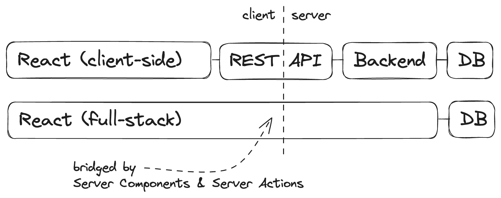

<Sponsorship />

React, with its addition of Server Components and Server Actions, is evolving into a full-stack framework. Once the most popular frontend framework, it has now successfully bridged the gap between frontend and backend to reign over both sides of the chasm.

I'm writing this article because the following illustration has been on my mind.



When the framework wars began in 2010 with Backbone, Knockout, and Ember, quickly followed by Angular and React, no one could predict the outcome. For a long time, client-side rendered (CSR) JavaScript applications dominated the scene. These applications, also known as single-page applications (SPAs), were typically just a small HTML file linked to a large JavaScript file, until the advent of code splitting.

<ReadMore label="Web Applications 101" link="/web-applications/" />

During this period, frontend development was dominated by various JavaScript frameworks and libraries (web developers like to have this discussion), while the backend was generally not tied to a specific language, as REST became the standard for API communication.

In my years as a freelance web developer, I've worked mainly with .NET, Java, Python, and PHP backends. Personally I have seen TypeScript/JavaScript only on the backend when it was a greenfield project or a smaller project where I had the control over the backend. However, this might change with the rise of full-stack React!

<ReadMore label="MacOS Web Development Setup" link="/mac-setup-web-development/" />

Looking back, it's fascinating to see how developers' perceptions of the period from 2010 to 2020 vary based on when they began their careers.

Developers who started before 2010 found themselves in a server-side rendered (SSR) environment and generally seem more comfortable with the recent shift back to server-side techniques. In contrast, many others have spent nearly a decade working only with REST APIs in client-side rendered (CSR) applications. Now they do not know what to make of the new full-stack React world.

```sh
⠀⠀⠀⠀⠀⠀⠀⠀⠀⠀⠀⠀⠀⣠⡶⠛⠛⢦⡀⠀⠀⠀⠀⠀⠀⠀⠀⠀⠀⠀
⠀⠀⠀⠀⠀⠀⠀⠀⠀⠀⠀⢀⣴⠋⠀⠀⠀⠈⣧⠀⠀⠀⠀⠀⠀⠀⠀⠀⠀⠀
⠀⠀⠀⠀⠀⢀⣠⠴⠞⠛⠉⠉⠉⠉⠉⠉⠛⠒⠾⢤⣀⠀⣀⣠⣤⣄⡀⠀⠀⠀
⠀⠀⠀⣠⡶⠋⠀⠀⠀⠀⠀⠀⠀⠀⠀⠀⠀⠀⠀⠀⠉⠛⢭⡀⠀⠈⣷⠀⠀⠀
⠀⠀⡴⠋⠀⠀⠀⠀⠀⠀⠀⠀⠀⠀⠀⠀⠀⠀⠀⠀⠀⠀⠀⠙⢦⢀⡟⠀⠀⠀
⠀⣾⠁⠀⠀⠀⠀⠀⠀⠀⠀⠀⠀⠀⠀⠀⠀⠀⠀⠀⠀⠀⠀⠀⠈⢻⡅⠀⠀⠀
⢸⠇⠀⠀⠀⠀⠀⠀⠀⠀⠀⠀⠀⠀⠀⠀⠀⠀⠀⠀⠀⠀⠀⠀⠀⠀⢻⣄⣀⠀  Did anyone forget SPAs?
⣾⠀⠀⣠⣤⣤⡀⠀⠀⠀⠀⠀⠀⠀⠀⠀⢀⣤⣤⣄⠀⠀⠀⠀⠀⠀⠸⡇⠉⣷
⣿⠀⠰⣿⣿⣿⡗⠀⠀⠀⠀⠀⠀⠀⠀⠀⢸⣿⣿⣿⠀⠀⠀⠀⠀⠀⠀⣧⡴⠋
⣿⠀⠀⢸⠛⢫⠀⠀⢠⠴⠒⠲⡄⠀⠀⠀⠀⡝⠛⢡⠀⠀⠀⠀⠀⠀⢰⡏⠀⠀
⢸⡄⠀⢸⡀⢸⠀⠀⠀⠀⠀⠀⠀⠀⠀⠀⠀⡇⠀⢸⠀⠀⠀⠀⠀⠀⡼⣄⠀⠀
⠀⢳⡄⠀⡇⢸⠀⠀⠀⠀⠀⠀⠀⠀⠀⠀⠀⢹⠀⢸⠀⠀⠀⠀⢀⡼⠁⢸⡇⠀
⠀⠀⠙⢦⣷⡈⡇⠀⠀⠀⠀⠀⠀⠀⠀⠀⠀⢸⠀⠈⡇⠀⣀⡴⠟⠒⠚⠋⠀⠀
⠀⠀⠀⠀⠈⠛⠾⢤⣤⣀⣀⡀⠀⠀⠀⠀⣀⣈⣇⡤⣷⠚⠉⠀⠀⠀⠀⠀⠀⠀
⠀⠀⠀⠀⠀⠀⠀⣰⠇⠀⠩⣉⠉⠉⠉⣩⠍⠁⠀⢷⣟⠀⠀⠀⠀⠀⠀⠀⠀⠀
⠀⠀⠀⠀⠀⠀⠀⡟⠐⠦⠤⠼⠂⠀⠸⠥⠤⠔⠂⠘⣿⣇⠀⠀⠀⠀⠀⠀⠀⠀
⠀⠀⠀⠀⠀⠀⣸⣧⡟⠳⠒⡄⠀⠀⠀⡔⠲⠚⣧⣀⣿⠿⠷⣶⡆⠀⠀⠀⠀⠀
⠀⠀⠀⠀⠀⠀⠻⣄⢀⠀⠀⡗⠀⠀⠀⡇⠄⢠⠀⣼⠟⠀⢀⣨⠇⠀⠀⠀⠀⠀
⠀⠀⠀⠀⠀⠀⠀⠙⢶⠬⠴⢧⣤⣤⣤⣽⣬⡥⠞⠛⠛⠋⠉⠀⠀⠀⠀⠀⠀⠀
```

But getting back on topic here! In recent years, TypeScript has emerged as the industry standard, providing frontend developers with a typed and more robust programming language. Once developers embraced TypeScript, there was no turning back. It's fascinating how a relatively small change in code can have such a significant impact on both a personal and industry-wide level.

However, TypeScript's impact on REST involved a lot of makeshift solutions. While OpenAPI (formerly Swagger) existed before, allowing teams to document REST APIs, it's main purpose has now become generating typed API interfaces. Despite the possibility of creating perfectly typed interfaces in a client-server architecture, many projects, in my experience as a freelance web developer over many years, failed to implement it properly from the start.

*Personal note: There may be developers who had a positive experience with an OpenAPI-driven architecture, but I am not one of them unfortunately.*

It's quite interesting to see how TypeScript changed the sentiment here. On the one hand, untyped SPAs with REST (and OpenAPI for documentation purposes) seemed to be "okay". However, once TypeScript became the standard and was seen as the norm, the generated type interface became unpleasant to work with because one got used to higher standards in a frontend codebase.

The drawbacks of generated type interfaces were clear:

* there was always a generation step involved
* the generated output was messy
* the generated code was not always correct based on the initial setup

Enter an old friend: RPC. Remote procedure calls were not new, but they gained popularity in the React ecosystem thanks to tRPC. From my experience as a solo developer on an [80k lines of code application](https://www.cloud-camping.com/) for half a year (in 2023), calling functions on my backend to read and write data was a revelation. I never felt more productive in an environment where both sides of the stack used TypeScript. Personally, I felt similarly productive only in a (generated) [typed GraphQL architecture](/react-with-graphql-tutorial/) a few years earlier.

<ReadMore label="Full-Stack React with tRPC" link="/react-trpc/" />

For a year (2023), I couldn't imagine anything better than tRPC. Calling my backend with just a function to read and write data felt revolutionary. Was that all I needed? No. The real breakthrough for me came with Server Components and Server Actions in 2024, which bridged the gap to the server by not only calling it, but by being able to implement and execute code on the other side.

Server Components allow us to execute React components on the server, enabling direct access from data sources (e.g. databases) before returning the UI with JSX.

```tsx
import { getMessages } from '@/messages/queries/';

const MessageList = async () => {
  const messages = await getMessages();

  return (
    <ul>
      {messages.map((message) => (
        <li key={message.id}>{message.text}</li>
      ))}
    </ul>
  );
};

export { MessageList };
```

[Server Actions](/next-server-actions/), on the other hand, create HTTP API endpoints under the hood that can be invoked just like remote procedure calls by executing a function. Server Components and Server Actions transform React into a full-stack framework. What an exciting time to **[transform the frontend into a full-stack environment](https://www.road-to-next.com/)**!

React itself provides only the primitives and specifications for Server Components and Server Actions. Meta frameworks built on top of React can bridge the gap with their bundler which interprets the [directives](https://react.dev/reference/rsc/directives) (i.e. `'use client'` and `'use server'`) between client and server.

Next.js, a leading meta framework for React, spearheaded the implementation of Server Components and Server Actions. Although Next.js already supported server-side rendering (SSR) before, Server Components and Server Actions now empower developers to access server-side resources such as databases and message queues.

<ReadMore label="Authentication in Next.js" link="/next-authentication/" />

This marks just the beginning of full-stack development with React. As developers start to [access databases](/next-prisma-sqlite/) directly through Server Components and Server Actions, there will be a learning curve ahead to tame the complexities beyond simple CRUD applications.

With thorough education, frontend developers will soon master implementing backend architectures with layers, design patterns and best practices, because, let's be honest, no one wants to see a ORM function call in a React component.

**And hopefully that's where I can help with [The Road to Next](https://www.road-to-next.com/)**.

I am hyped for this paradigm shift! Get ready for a new era where React developers will implement vertical features from the UI all the way to the database. I'm prepared for this journey, and I hope you are too :)