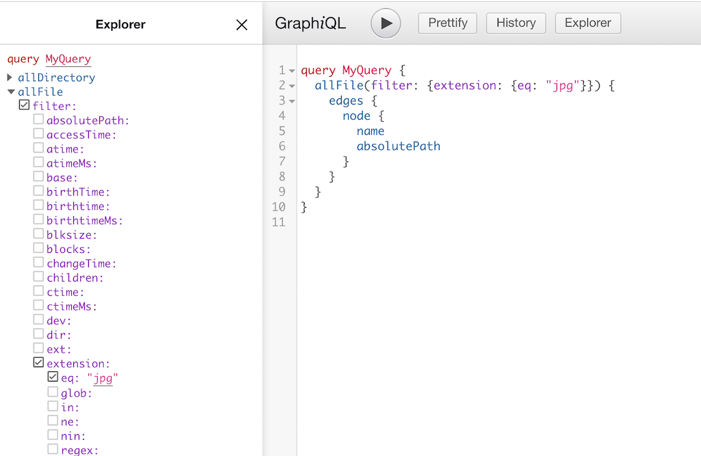

<Sponsorship />

Not long ago, most people argued against a framework like React, Angular or Vue for your personal website. Since then, tools on top of these frameworks -- like [Gatsby.js](https://www.gatsbyjs.org/) for React.js -- emerged to make static website development effortless. So if there is no actual demand, [why does a static website generator like Gatsby.js do so well](https://twitter.com/gatsbyjs/status/999684072501792768)?

A few months ago I started the attempt to migrate my website to Gatsby.js and I must say: I love it. It takes very much all the pain away that I had to deal with before. Most personal websites are not only HTML + CSS anymore. They come with a rich set of advanced CSS/HTML + JavaScript for lazy image loading, route prefetching, service workers, analytics, and offline capabilities. And that's only the tip of the iceberg. What about performance, SEO, and social media?

99% of my revenue is initiated through my website. Since I am self-employed, I receive weekly offers from potential clients, generate daily course sales, create hourly newsletter subscribers, and get continuous network benefits through my website. This website is the backbone of everything I do, so it deserves most of my attention.

In this article, I want to tell you why I literally migrate(d) my business over to Gatsby.js -- and why it might be a tremendously valuable thing to do for you as well. Since my website is not yet running on Gatsby.js, because I am still in the process of migrating the majority of my content, you can check out [this demo](https://www.iamliesa.com/) which runs the website of my fiancée. Disclaimer: It is not fully tested on all browsers yet :-)

# Gatsby.js is built on React.js

I start with the most obvious benefit: **Gatsby.js is built on top of React.js**. As an at least intermediate React developer, you feel immediately comfortable with it. You structure your pages as components, implement a repertoire of UI components, style your components with CSS modules or styled components, and update state with common sense. But also as a non React developer -- coming from another framework of choice -- you will not have a hard time to grasp how things work if you are [comfortable with JavaScript](/javascript-fundamentals-react-requirements/).

*Note: I do not recommend to [learn React.js](/learn-react-js/) while learning Gatsby.js. The latter comes with lots of things on top that you should learn in separation. Learning both frameworks in one step will blur the lines between React and Gatsby. Not to mention the plugin system, GraphQL, and the parts related to Node.js. Get a [good grasp about React.js first](/the-road-to-learn-react/) before learning Gatsby.js.*

With React.js in place, **I am in control** even though there will be a new React.js or Gatsby.js version in the future. I can handle the breaking changes and deal with migration paths. But that's only because my daily business is related to React and JavaScript. In contrast, most static site generators I used before were coupled to other programming languages (Go, Ruby, PHP) which I am rarely using. That's fine for widening one's horizon, but in everyday business life, it was a burden to deal with issues. **If your business depends on it, use a tech stack that makes it painless for you.**

# Gatsby Router

Gatsby comes as a full-blown framework to create static websites. Whereas in React you have to know all the [essential libraries](/react-libraries/) to complement React as its core, Gatsby comes with many things right away.

For instance, Gatsby ships with a build in Router and the Gatsby team decides which React Router makes most for their environment. As a developer, you don't need to care about it like in a plain React application. The implementation of the [routing in Gatsby](https://www.gatsbyjs.org/docs/routing/) is different from React. It has two modes to create routes: static and dynamic routes.

* Static Routes: Every component in the *src/pages* folder becomes automatically a route.
* Dynamic Routes: The `createPage` API allows you to create dynamic routes.

Most of your routes will be static anyway, so it's not getting easier as just implementing a component for it. Then you only need to use the [Gatsby Link](https://www.gatsbyjs.org/docs/gatsby-link/) component to give your user elements to interact with. That's only the beginning for routing in Gatsby though. Under the hood, Gatsby applies improvements for you. For instance, it catches routes that are going nowhere, [preloads other pages of routes linking to these pages](https://www.gatsbyjs.org/docs/gatsby-link/), and prevents a browser refresh when navigating from page to page. **Basically Gatsby Routing comes with all the improvements you would expect an application to have by default.**

# Gatsby.js Plugins

Gatsby Plugins make it possible to introduce pre-defined features on a fine-grained level to your project. A collection of plugins is also called Gatsby Theme. Plugins come with their default configuration, but can also be overridden with `options` from your side. Whether you want to have analytics (e.g. Google Analytics) or error tracking (e.g. Sentry) for your website, you can introduce it with a plugin and a few lines of code:

```javascript
module.exports = {
  plugins: [
    {
      resolve: 'gatsby-plugin-sentry',
      options: {
        dsn: process.env.GATSBY_SENTRY_DSN,
      },
    },
    {
      resolve: `gatsby-plugin-google-analytics`,
      options: {
        trackingId: process.env.GATSBY_GOOGLE_ANALYTICS,
        head: false,
        anonymize: true,
        respectDNT: true,
      },
    },
  ],
  ...
};
```

From the very beginning, Gatsby.js presented itself with a well-structured plugin system. A clean API and thus great adoption rate lead from one plugin to another. Nowadays, there is a [huge ecosystem of Gatsby.js plugins](https://www.gatsbyjs.org/plugins/) to choose from for your Gatsby.js site. Many of the following benefits (images, markdown, third-party integrations) of using Gatsby.js tie back to its powerful plugin ecosystem.

# GraphQL in Gatsby.js

[GraphQL is commonly seen as alternative to REST.](/why-graphql-advantages-disadvantages-alternatives/) However, whereas REST is mostly used for client-server communication via HTTP, GraphQL is just a query language independently of the communication protocol and data representation. Essentially GraphQL can be used anywhere where a client requests data. [Gatsby makes use of these GraphQL circumstances](https://www.gatsbyjs.org/docs/querying-with-graphql/) to query all of its internal (e.g. files) and external (e.g. third-party APIs of integrations) data. GraphQL becomes the interface between Gatsby and all its data sources.

```javascript
import React from 'react';
import { graphql } from 'gatsby';

export default ({ data }) => (
  <div>
    <h1>{data.site.siteMetadata.title}</h1>
  </div>
);

export const query = graphql`
  query {
    site {
      siteMetadata {
        title
      }
    }
  }
`;
```

*Note: GraphQL is another aspect which makes it difficult to learn Gatsby.js as a beginner. Like React it comes with its own ecosystem, best practices, and libraries. However, in Gatsby.js you are only using GraphQL from a client's perspective, so once you start to think of Gatsby's data sources as a graph, you are good to use it. However, I'd recommend people to [learn GraphQL](/the-road-to-graphql-book/) on the side to get a better understanding of it.*

Once you start your Gatsby.js application, you can open up GraphiQL, an explorative GraphQL client which comes with Gatsby, to traverse through all your data that's aggregated by Gatsby. This starts by having access to images and markdown via GraphQL, but also by accessing third-party APIs which come with Gatsby's plugin system (see integrations).



After all, it takes some time to adjust to this **new mindset of using GraphQL for all your data sources** -- essentially having all your data available only one GraphQL query away -- but once you get used to it, it becomes a pleasure to work with.

# Images in Gatsby.js

The performance of your website influences your SEO score and the UX of your website. If you are showing larger images in your blog posts or on your landing pages, you will not get around performance optimizations for them. Before I started to use Gatsby.js, I had to implement features like [lazy loading](https://developers.google.com/web/fundamentals/performance/lazy-loading-guidance/images-and-video/) or [source sets for responsive images](https://developer.mozilla.org/en-US/docs/Learn/HTML/Multimedia_and_embedding/Responsive_images) myself. Once implemented everything worked great, but I always felt that this implementation detail should not be in my hands. Every other website needs these features, so why isn't there an effortless abstraction for it? Gatsby solves this problem perfectly for you with [Gatsby Images and their Image Plugins](https://www.gatsbyjs.org/packages/gatsby-image/).

```javascript
import React from 'react';
import { graphql } from 'gatsby';
import Img from 'gatsby-image';

export default ({ data }) => (
  <div>
    <h1>Hello gatsby-image</h1>
    
  </div>
);

export const query = graphql`
  query {
    file(relativePath: { eq: 'blog/react-gatsby-js.jpeg' }) {
      childImageSharp {
        sizes(maxWidth: 900) {
          ...GatsbyImageSharpSizes
        }
      }
    }
  }
`;
```

Lazy loading and responsive image source sets are a thing of the past. Everything is applied under the hood for you. Also the well-known Blur Effect kicks in for people visiting your website making lazy loading of images not a dealbreaker for UX. And this scratches only the surface of Gatsby Image which handles various image formats and offers a rich API. **Don't worry about commonly used image features anymore, because Gatsby takes care of them.**

# Gatsby Integrations

Gatsby.js integrations tie back to Gatsby's plugin system, because they are installed and configured as plugins. However, many of the more powerful integrations make only sense when they get coupled with GraphQL to get data from a third-party API.

For instance, there exist several competing API-first Content Management Systems (CMS) which can be used in Gatsby.js. In these kind of headless CMS, non developers can arrange the content while developers deal with the under the hood implementation in Gatsby.js far away from the CMS. After all, the Gatsby.js website only queries the CMS's API for the necessary data.

```javascript
// example Gatsby plugin for an API CMS driven

module.exports = {
  plugins: [
    {
      resolve: `gatsby-source-contentful`,
      options: {
        spaceId: process.env.GATSBY_CONTENTFUL_SPACE_ID,
        accessToken: process.env.GATSBY_CONTENTFUL_ACCESS_TOKEN,
      },
    },
  ],
  ...
};

// example GraphQL query

query {
  contentFromCMS {
    edges {
      node {
        id
        name
        url
        imgSrcOne
        imgSrcTwo
      }
    }
  }
}
```

The previous code shows you everything that's needed to connect to Contenful's API. Initially you need to install and set up the Gatsby plugin with your credentials. Next, you can start to query your data sets with GraphQL which are managed by Contentful. Any non developer can take over from here to provide more data in the CMS while developers make sure everything is displayed properly in the source code or markdown.

Headless CMS are only one of Gatsby's set of neat third-party integrations. You have seen before how it integrates neatly with tracking APIs like Google Analytics or Sentry.  Also A/B testing tools like Segment are available. Another sort of integrations comes in form of deployments (e.g. Netlify). Here you can find [all of Gatsby's integrations](https://www.gatsbyjs.com/integrations/). Use them to abstract away the pain that every website suffers.

# Next Level Markdown: MDX

Almost every static website generator comes with support for markdown. Otherwise it wouldn't be possible to create blog posts and landing pages effectively. Gatsby uses its plugins to make markdown available in your website. By having GraphQL at your disposal, you can query any markdown file(s) and its frontmatter to render everying of its content and details of the frontmatter in your React components.

```javascript
query($path: String!) {
  markdownRemark(frontmatter: { path: { eq: $path } }) {
    html
    frontmatter {
      title
      description
      dateLong: date(formatString: "MMMM DD, YYYY")
      dateShort: date(formatString: "YYYY-MM-DD")
      banner {
        childImageSharp {
          sizes(maxWidth: 900) {
            ...GatsbyImageSharpSizes
          }
        }
      }
      keywords
      hashtags
      author
    }
  }
}
```

Except for the dynamic GraphQL querying, this sounds pretty similar to what other static website generators are providing for you. However, Gatsby takes this one level further by [integrating perfectly](https://www.gatsbyjs.org/packages/gatsby-mdx/) with [MDX](https://mdxjs.com/) which lets you use JSX (e.g. React Components) in your markdown files. **MDX brings markdown to the next level** and it's amazing to see how this new ecosystem flourishes in Gatsby.js.

```javascript
---
path: "/blog/my-first-blog-post"
date: "2019-05-04"
title: "My first Blog Post"
---

# My first Blog Post

My Blog post where I can use headings and images from markdown


but also JSX (e.g. React Components):

<YouTube videoId="YDLErVsbSRI" />

In addition, I can pass information from the outside to this markdown
file to use them as props for my specific React Components:

<TableOfContents {...props} />

That's how I can create a table of contents automatically.
```

In the end, markdown files can co-exist next to your source code in your Gatsby.js project, but can also be pulled during build time from your headless CMS integration via its API. It's up to you where you put your content. Also images rendered in markdown come with all the benefits from Gatsby Image.

# Gatsby Themes & Website specific Content

Basically [Gatsby Themes](https://www.gatsbyjs.org/docs/themes/what-are-gatsby-themes/) make up a set of Gatsby Plugins while being represented as a plugin themselves. You can also combine multiple Gatsby Themes. This way, it's possible to publish Gatsby Themes with the focus on certain topics (e.g. Analytics, MDX) which can then be weaved into your Gatsby configuration with all the remaining plugins.

```javascript
module.exports = {
  plugins: [
    // your themes
    {
      resolve: "my-gatsby-analytics-theme",
      options: {},
    },
    // other plugins
    {
      resolve: `gatsby-source-contentful`,
      options: {
        spaceId: process.env.GATSBY_CONTENTFUL_SPACE_ID,
        accessToken: process.env.GATSBY_CONTENTFUL_ACCESS_TOKEN,
      },
    },
  ],
  ...
};
```

However, what about sharing the structure, style and behavior of a whole Gatsby website with someone else so that only the content differs? Basically how a Wordpress or Hugo theme would work. Effectively you can pull all the content that's specific to the website into a separate folder while all the website's structure, style and behavior stays somewhere else. For my new Gatsby website, I did the same to be able to share the same foundation with my fiancée's website. Then everyone can [contribute configuration and content](https://github.com/rwieruch/blog_iamliesa_content) for their specific use cases -- which makes it also possible for others to access the content for contributing to it.

After all, Gatsby's plugin system, themes and content distribution makes it possible to build one Gatsby website which is used by more than one party. If you take it one step further, you could extract all content to a CMS. It aligns **perfectly with the DRY principle** if you want to serve more than one complex static website with Gatsby. One perfectly build Gatsby Website to serve them all.

# Gatsby integrates into the JAMstack

Gatsby integrates nicely into the JAMstack where website development becomes painless because of its plug and play nature of technologies related to this tech stack. For instance, in a JAMstack you could use Netlify to serve your website and Contentful as API based CMS to provide your content. If authentication is needed, you just plug in another API that deals with it. *"A modern web development architecture based on client-side JavaScript, reusable APIs, and prebuilt Markup"* (Source: Mathias Biilmann, CEO & Co-founder of Netlify).

Basically you are not running a client-server architecture with a database yourself anymore, but only your client-side application which is API driven. Since Gatsby.js gives you the perfect foundation to integrate with third-parties because of it's plugin system and GraphQL, **I believe Gatsby.js will become one of the most crucial building blocks in the future of JAMstack.**

# It's blazing fast ...

The most important mantra of Gatsby.js: *"[it] helps developers build blazing fast websites and apps"*. The statement holds true for building the website even lots of data is fetched from third-party APIs, lots of logic is weaved into your *gatsby-node.js* file, and lots of different pages get created. [Only if the build crashes I would wish that there would be a default rollback.](https://github.com/gatsbyjs/gatsby/issues/10701)

The statement holds also true for the perceived performance of users visiting your website. Lazy image loading, preloading of pages, and responsive image source sets improve the UX tremendously. If you are [performing a Google Lighthouse Audit](https://www.gatsbyjs.org/docs/audit-with-lighthouse/) with the Gatsby.js defaults, [it's not a surprise anymore that your scores are above average](https://twitter.com/dan_abramov/status/1085265495283171328).

# Gatsby PWA and Service Workers

It has been never easier to create a [Progressive Web Application (PWA)](https://developers.google.com/web/progressive-web-apps/). Just another aspect to consider to drive your Website Audit Scores up. Essentially you need only [two](https://www.gatsbyjs.org/packages/gatsby-plugin-offline/) [plugins](https://www.gatsbyjs.org/packages/gatsby-plugin-manifest/) in Gatsby.js to make it work:

```javascript
module.exports = {
  plugins: [
    {
      resolve: `gatsby-plugin-manifest`,
      options: {
        name: `My Gatsby Website`,
        short_name: `My Gatsby Website`,
        start_url: `/`,
        background_color: `#f7f0eb`,
        theme_color: `#a2466c`,
        display: `standalone`,
      },
    },
    `gatsby-plugin-offline`
  ],
}
```

While the former Gatsby Plugin gives your application a manifest to make it installable on a user's home screen, the later plugin installs a service worker to make your application perform offline. It's everything that's needed to make your application a PWA from a technical perspective. **And Gatsby makes this damn easy.**

If you would create a website yourself, everything would be up to you. Especially the service worker can be tricky with its changing implementation details and best practices. I implemented it myself for my website -- it was done in a couple of hours -- but if I would look into it one year later, I would need to understand it again and check whether there are new things to consider. In the end, I don't want to bother about it and I would be happy to have Gatsby with its defaults.

However, [if service worker go wrong](https://twitter.com/kentcdodds/status/1053338165363142656), they make your business crash. It happens when an old version of your website gets cached and you have no control to serve your users a new website except for having them to delete their service workers manually in the browser's developer tools. Therefore I must say I didn't use the service worker plugin from Gatsby yet. I wish there would be more than one configuration default to serve different purposes:

* 1) minimal service worker configuration without caching; just to please Google Lighthouse
* 2) default service worker configuration

Then I would choose the "pseudo" service worker and be happy without eager caching.

# Gatsby SEO

Implementing SEO in Gatsby isn't much different from any other static website generators. You need to know structured data and meta tags to improve your website's SEO by default -- independently from your content which comes with its own keyword optimizations etc.

**Structured Data:** Sprinkle it everywhere in your React components where it makes sense. For instance, if you show the author of your blog post somewhere on the page, there exists structured data for it. If you display a date somewhere, there exists structured data for it. Or if you display HTML elements for navigation, there is structured data for it.

**Meta Tags:** Usually you have one React component that takes care about all the SEO aspects for the meta tags. If a user visits a page on your website, this components receives props about the page's title, description, and keywords. But there is more to it like preview images for Twitter and Facebook. Everything related to SEO and social media can end up in this component.

# Beyond Static Website Generator

Gatsby takes steps **beyond being just a static website generator**. Actually you can implement pretty dynamic web applications with it. Hence I considered to not only move my website to Gatsby.js, but also my entire [course platform](/how-to-build-your-own-course-platform/) with authentication, authorization and payment methods. Always just think about all the pages in your web applications which can be visited by your user. For instance, if you have an ecommerce store, you need to create all the product detail pages during build time.

Since you can create dynamic routes in your *gatsby-node.js* file, you can do lots of experimental stuff in there. **Gatsby.js gives you a way to create dynamic pages.** For instance, my new website uses simple NLP to recommend readers more reading material after finishing one of my articles. But one could imagine more complex machine learning usages here to create the best reading experience for your audience.

In another experimental catalog application of mine, I created all the different search filters and their permutations as dynamic pages. It would lead to SEO benefits as well, because there would be URLs like "/books-for-kids-older-than-six" or "/books-large-format-for-kids-between-six-and-twelve". It really depends on you, your requirements and your creativity, **how far you push the boundaries of Gatsby being a static website generator**.

# Gatsby Community

After all, I don't want to miss mentioning the Gatsby community. It's awesome! After creating my first issue on GitHub, I got an immediate invite to their GitHub organization. **It gives you a sense of belonging.** If you contribute to their projects or documentation -- which by the way is top notch -- you have access to their [Gatsby Swag](https://store.gatsbyjs.org/). I didn't apply for mine yet, because of too many things on my plate, but I would love to wear their T-Shirt someday :-)

**The Gatsby.js community pushes the boundaries of static website generators.** They work on the bleeding edge with their integrations, performance optimization, and MDX for markdown. It happens that you run into problems, because they are just in the making within the Gatsby.js ecosystem, but if you open an issue on GitHub, you will always find yourself surrounded by helpful people. Just recently I started to migrate my content over to my new Gatsby.js website and run into problems with [MDX + PrismJS for large markdown files](https://github.com/ChristopherBiscardi/gatsby-mdx/issues/411). One day later [a PR was created to fix the issue in the core Gatsby.js project](https://github.com/gatsbyjs/gatsby/pull/15452). Thank you [John](https://twitter.com/4lpine) -- creator of MDX -- for helping out!

<Divider />

Whereas Gatsby.js gives you a full-blown framework with all the expected defaults (routing, image handling, plugin system), you still use React.js under the hood to create pages and UI components. It merges an abstraction with a concrete world perfectly into one solution for static websites.  Many other static websites are way behind the innovations Gatsby.js brings on the table -- most importantly being API first driven. And it will just get better with a striving community, plugin ecosystem and themes.

If you find any other things about Gatsby.js that you enjoy, please leave a comment below. Otherwise I hope this blog post will become a great reference for people considering Gatsby.js. If you want to get a notification whether I do a course about static website development with Gatsby.js, sign up for my newsletter :-) It might come up in the future, because I want to share all the things I learned in implementation detail.
