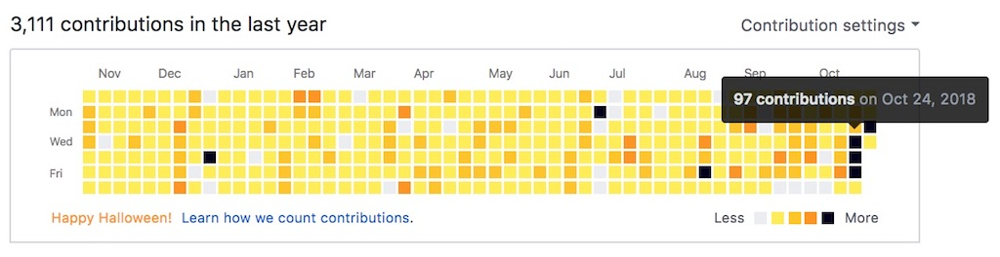

<Sponsorship />

React Hooks were introduced at [React Conf October 2018](https://www.youtube.com/watch?v=dpw9EHDh2bM) as a way to use state and side-effects in React function components. Whereas function components have been called functional stateless components (FSC) before, they are finally able to use state with React Hooks. Therefore, many people refer to them as function components now.

In this walkthrough, I want to explain the motivation behind hooks, what will change in React, why we shouldn't panic, and how React hooks can be used in function components by showcasing common React Hooks such as the state and effect hooks by example. This tutorial is only an introduction to React Hooks. At the end of this tutorial, you will find many more tutorials to learn about React Hooks in depth.

# Why React Hooks?

React Hooks were invented by the React team to introduce state management and side-effects in [function components](/react-function-component/). It's their way of making it more effortless to use only React function components without the need to refactor a React function component to a React class component for using lifecycle methods, in order to use have side-effects, or local state. React Hooks enable us to write React applications with only function components.

**Unnecessary Component Refactorings:** Previously, only React class components were used for local state management and lifecycle methods. The latter have been essential for introducing side-effects, such as listeners or data fetching, in React class components.

```javascript
import React from 'react';

class Counter extends React.Component {
  constructor(props) {
    super(props);

    this.state = {
      count: 0,
    };
  }

  render() {
    return (
      <div>
        <p>You clicked {this.state.count} times</p>
        <button
          onClick={() =>
            this.setState({ count: this.state.count + 1 })
          }
        >
          Click me
        </button>
      </div>
    );
  }
}

export default Counter;
```

Only if you didn't need state or lifecycle methods, React functional *stateless* components could be used. And because React function components are more lightweight (and elegant), people already used plenty of function components. This came with the drawback of refactoring components from React function components to React class components every time state or lifecycle methods were needed (and vice versa).

```javascript
import React, { useState } from 'react';

// how to use the state hook in a React function component
function Counter() {
  const [count, setCount] = useState(0);

  return (
    <div>
      <p>You clicked {count} times</p>
      <button onClick={() => setCount(count + 1)}>
        Click me
      </button>
    </div>
  );
}

export default Counter;
```

With Hooks there is no need for this refactoring. Side-effects and state are finally available in React function components. That's why a rebranding from functional stateless components to function components would be reasonable.

**Side-effect Logic:** In React class components, side-effects were mostly introduced in lifecycle methods (e.g. componentDidMount, componentDidUpdate, componentWillUnmount). A side-effect could be [fetching data in React](/react-fetching-data/) or [interacting with the Browser API](/react-intersection-observer-api/). Usually these side-effects came with a setup and clean up phase. For instance, if you would miss to remove your listener, you could run into [React performance issues](/react-warning-cant-call-setstate-on-an-unmounted-component/).

```javascript
// side-effects in a React class component
class MyComponent extends Component {
  // setup phase
  componentDidMount() {
    // add listener for feature 1
    // add listener for feature 2
  }

  // clean up phase
  componentWillUnmount() {
    // remove listener for feature 1
    // remove listener for feature 2
  }

  ...
}

// side-effects in React function component with React Hooks
function MyComponent() {
  useEffect(() => {
    // add listener for feature 1 (setup)
    // return function to remove listener for feature 1 (clean up)
  });

  useEffect(() => {
    // add listener for feature 2 (setup)
    // return function to remove listener for feature 2 (clean up)
  });

  ...
}
```

Now, if you would introduce more than one of these side-effects in a React class component's lifecycle methods, all side-effects would be grouped by lifecycle method but not by side-effect. That's what React Hooks are going to change by encapsulating a side-effect in one hook whereas every hook has its own side-effect with a setup and clean up phase. You will see later in a tutorial how this works for real by adding and removing listeners in a React Hook.

**React's Abstraction Hell:** Abstraction and thus reusability were introduced with [Higher-Order Components](/react-higher-order-components/) and [Render Prop Components](/react-render-props/) in React. There is also [React's Context with its Provider and Consumer Components](/react-context/) that introduce another level of abstraction. All of these advanced patterns in React are using so called wrapping components. The implementation of the following components shouldn't be foreign to developers who are creating larger React applications.

```javascript
import { compose } from 'recompose';
import { withRouter } from 'react-router-dom';

function App({ history, state, dispatch }) {
  return (
    <ThemeContext.Consumer>
      {theme =>
        <Content theme={theme}>
          ...
        </Content>
      }
    </ThemeContext.Consumer>
  );
}

export default compose(
  withRouter,
  withReducer(reducer, initialState)
)(App);
```

Sophie Alpert coined it "the wrapper hell" in React. You are not only seeing it in the implementation, but also when inspecting your components in the browser. There are dozens of wrapped components due to Render Prop Components (including Consumer components from React's Context) and Higher-Order Components. It becomes an unreadable component tree, because all the abstracted logic is covered up in other React components. The actual visible components are hard to track down in the browser's DOM. So what if these additional components were not needed because the logic is only encapsulated in functions as side-effects instead? Then you would remove all these wrapping components and flatten your component tree's structure:

```javascript
function App() {
  const theme = useTheme();
  const history = useRouter();
  const [state, dispatch] = useReducer(reducer, initialState);

  return (
    <Content theme={theme}>
      ...
    </Content>
  );
}

export default App;
```

That's what React Hooks are bringing on the table. All side-effects are sitting directly in the component without introducing other components as container for business logic. The container disappears and the logic just sits in React Hooks that are only functions. [Andrew Clark already left a statement in favor of React Hooks in his popular Higher-Order Component library called recompose.](https://github.com/acdlite/recompose/commit/7867de653abbb57a49934e52622a60b433bda918)

**JavaScript Class Confusion:** JavaScript mixes two worlds pretty well: Object-oriented programming (OOP) and functional programming. React introduces many developers to both worlds. On the one side, React (and Redux) introduced people to functional programming (FP) with function compositions, general programming concepts with functions (e.g. higher-order functions, JavaScript built-in methods like map, reduce, filter) and other terms such as immutability and side-effects. React itself didn't really introduce these things, because they are features of the language or the programming paradigm itself, but they are heavily used in React whereas [every React developer becomes automatically a better JavaScript developer](/javascript-fundamentals-react-requirements/).

On the other side, React uses JavaScript classes as one way to define React components. A class is only the declaration whereas the actual usage of the component is the instantiation of it. It creates a class instance whereas the `this` object of the class instance is used to interact with class methods (e.g. setState, forceUpdate, other custom class methods). However, classes come with a steeper learning curve for React beginners who are not coming from an OOP background. That's why class bindings, the `this` object and inheritance can be confusing. I have [a few chapters in my React book](/the-road-to-learn-react/) focusing only on this aspect of React which is always the most confusing thing about React for beginners.

```javascript
// I THOUGHT WE ARE USING A CLASS. WHY IS IT EXTENDING FROM SOMETHING?
class Counter extends Component {
  // WAIT ... THIS WORKS???
  state = { value: 0 };

  // I THOUGH IT'S THIS WAY, BUT WHY DO I NEED PROPS HERE?
  // constructor(props) {
  //  SUPER???
  //  super(props);
  //
  //  this.state = {
  //    value: 0,
  //  };
  // }

  // WHY DO I HAVE TO USE AN ARROW FUNCTION???
  onIncrement = () => {
    this.setState(state => ({
      value: state.value + 1
    }));
  };

  // SHOULDN'T IT BE this.onDecrement = this.onDecrement.bind(this); in the constructor???
  // WHAT'S this.onDecrement = this.onDecrement.bind(this); DOING ANYWAY?
  onDecrement = () => {
    this.setState(state => ({
      value: state.value - 1
    }));
  };

  render() {
    return (
      <div>
        {this.state.value}

        {/* WHY IS EVERYTHING AVAILABLE ON "THIS"??? */}
        <button onClick={this.onIncrement}>+</button>
        <button onClick={this.onDecrement}>-</button>
      </div>
    )
  }
}
```

Now, many people argue React shouldn't take JavaScript classes away because people don't understand them. After all, they belong to the language. However, one of the hypotheses of introducing the Hooks API is a smoother learning curve for React beginners when writing their React components without JavaScript classes in the first place.

### Exercises:

* Read more about [React Function Components](/react-function-component/)

# React Hooks: What changes in React?

Every time a new feature is introduced, people are concerned about it. There is one side of the group that is ecstatic about the change, and the other side that fears the change. I heard the most common concerns for React Hooks are:

* Everything changes! *Subtle panic mode ...*
* React is becoming bloated like Angular!
* It’s useless, classes worked fine.
* It’s magic!

Let me address these concerns here:

**Everything changes:** React Hooks will change how we write React applications in the future. However, at the moment, nothing changes. You can still write class components with local state and lifecycle methods and deploy advanced patterns such as Higher-Order Components or Render Prop Components. Nobody takes these learnings away from you. See how I upgraded all my open source projects from older versions to React 16.6. and none of of these projects had problems. They are using HOCs, Render Props and I believe even the old context API (correct me if am wrong). Everything I have learned all these years still works. The React team makes sure that React stays backward compatible. It will be the same with React 16.7.



**React is becoming bloated like Angular:** React was always seen as a library with a slim API. That's true and shall be true in the future. However, in order to adjust things that were the status quo of building component-based applications a few years ago, and not to be overtaken by other libraries who adapt to the new status quo, React introduces changes in favor of older APIs. If React would start out fresh this year, maybe there would be only function components and hooks. But React was released a couple of years ago and needs to adapt to keep up with the status quo or to invent a status quo. Maybe there will follow deprecations of React class components and lifecycle methods in a few years in favor of React function components and hooks, but at the moment, the React team keeps React class components in their repertoire of tools. After all, the React team utilizes hooks as an invention to run a marathon with React an not to win a sprint. Obviously, React Hooks add yet another API to React, but it is in favor to simplify React's API in the future. I like this transition more than having a React 2 where everything is different.

**It’s useless, classes worked fine:** Imagine you would start from zero to learn React and you would be introduced to React with Hooks. Maybe [create-react-app](https://github.com/facebook/create-react-app) wouldn't start out with a React class component but with a React function component. Everything you need to learn for your components would be React Hooks. They manage state and side-effects, so you would only need to know about the state and the effect hook. It's everything a React class component did for you before. It will be simpler for React beginners to learn React without all the other overhead that comes with JavaScript classes (inheritance, this, bindings, super, ...). Imagine React Hooks as a new way of how to write React components - It's a new mindset. I am a skeptical person myself, but once I wrote a couple of simpler scenarios with React Hooks, I was convinced that this is the simplest way to write but also to learn React. As someone who is doing lots of React workshops, I argue that it takes away all the frustration classes bring on the table for React beginners.

**It’s magic:** React is known to be down to earth with JavaScript. Writing React applications makes you a better JavaScript developer - that's one of the best things about React when someone asks me: "Why should I learn React?". Whether there comes another library in the future or not, everyone is prepared by honing their JavaScript skills and general programming skills when using React. It's one of the things that made Redux, often used in React, popular: There is no magic, it is plain JavaScript. Now these React Hooks come along the way, introduce something stateful in a previously often pure function component, a couple of not easily to accept rules, and many don't understand what's going on under the hood. But think about it this way: A function component in React is not a mere function. You still have to import React as library to your source code file. It does something with your function, because the function becomes a function component in React land. This function component comes with hidden implementations that were there all the time. How else would it have been possible to use functions as function components as we did it before React Hooks were introduced? And people accepted it too, even though it's kinda magic. Now, the only thing changed (and maybe it has already been this way before) is that these function components come with an extra hidden object that keeps track of hooks. To quote Dan Abramov from [his article about hooks](https://medium.com/@dan_abramov/making-sense-of-react-hooks-fdbde8803889): *"Perhaps you’re wondering where React keeps the state for Hooks. The answer is it’s kept in the exact same place where React keeps state for classes. React has an internal update queue which is the source of truth for any state, no matter how you define your components."*.

**Finally, think about it this way:** Component-based solutions such as Angular, Vue, and React are pushing the boundaries of web development with every release. They build up on top of technologies that were invented more than two decades ago. They adapt them to make web development effortless in 2018 and not 1998. They optimize them like crazy to meet the needs in the here and now. We are building web applications with components and not with HTML templates anymore. We are not there yet, but I imagine a future where we sit together and invent a component-based standard for the browser. Angular, Vue and React are only the spearhead of this movement.

In the following, I want to dive into a few popular React Hooks by example to get you up to speed. All examples can be found in this [GitHub repository](https://github.com/the-road-to-learn-react/react-hooks-introduction).

### Exercises:

* Read more about [React Class to Function Component Migration](/react-hooks-migration)

# React useState Hook

You have seen the useState Hook before in a code snippet for a typical counter example. It is used to manage local state in function components. Let's use the hook in a more elaborate example where we are going to manage an array of items. In another article of mine, you can learn more about [managing arrays as state in React](/react-state-array-add-update-remove/), but this time we are doing it with React hooks. Let's get started:

```javascript
import React, { useState } from 'react';

const INITIAL_LIST = [
  {
    id: '0',
    title: 'React with RxJS for State Management Tutorial',
    url:
      'https://www.robinwieruch.de/react-rxjs-state-management-tutorial/',
  },
  {
    id: '1',
    title: 'React with Apollo and GraphQL Tutorial',
    url: 'https://www.robinwieruch.de/react-graphql-apollo-tutorial',
  },
];

function App() {
  const [list, setList] = useState(INITIAL_LIST);

  return (
    <ul>
      {list.map(item => (
        <li key={item.id}>
          <a href={item.url}>{item.title}</a>
        </li>
      ))}
    </ul>
  );
}

export default App;
```

The useState hook accepts an initial state as argument and returns, [by using array destructuring](https://developer.mozilla.org/en-US/docs/Web/JavaScript/Reference/Operators/Destructuring_assignment#Array_destructuring), two variables that can be named however you want to name them. Whereas the first variable is the actual state, the second variable is a function to update the state by providing a new state.

The goal of this scenario is to remove an item from the list. In order to accomplish it, every item in the rendered list has a button with a click handler. The click handler can be inlined in the function component, because it will make use of `list` and `setList` later. Hence you don't need to pass these variables to the handler, because they are already available from the outer scope of the component.

```javascript{4,5,6,7,14,15,16}
function App() {
  const [list, setList] = useState(INITIAL_LIST);

  function onRemoveItem() {
    // remove item from "list"
    // set the new list in state with "setList"
  }

  return (
    <ul>
      {list.map(item => (
        <li key={item.id}>
          <a href={item.url}>{item.title}</a>
          <button type="button" onClick={onRemoveItem}>
            Remove
          </button>
        </li>
      ))}
    </ul>
  );
}
```

Somehow we need to know about the item that should be removed from the list. Using a higher-order function, we can pass the identifier of the item to the handler function. Otherwise we wouldn't be able to identify the item that should be removed from the list.

```javascript{4,14}
function App() {
  const [list, setList] = useState(INITIAL_LIST);

  function onRemoveItem(id) {
    // remove item from "list"
    // set the new list in state with "setList"
  }

  return (
    <ul>
      {list.map(item => (
        <li key={item.id}>
          <a href={item.url}>{item.title}</a>
          <button type="button" onClick={() => onRemoveItem(item.id)}>
            Remove
          </button>
        </li>
      ))}
    </ul>
  );
}
```

Finally, use the identifier to filter the list with a built-in array method. It returns a new list which is used to set the new state of the list.

```javascript{5,6}
function App() {
  const [list, setList] = useState(INITIAL_LIST);

  function onRemoveItem(id) {
    const newList = list.filter(item => item.id !== id);
    setList(newList);
  }

  return (
    <ul>
      {list.map(item => (
        <li key={item.id}>
          <a href={item.url}>{item.title}</a>
          <button type="button" onClick={() => onRemoveItem(item.id)}>
            Remove
          </button>
        </li>
      ))}
    </ul>
  );
}
```

That should do the job. You are able to remove an item from the list based on the identifier you pass to the handler. The handler then filters the list and sets the new state of the list with the `setList` function.

The useState hook gives you everything you need to manage state in a function component: initial state, the latest state, and a state update function. Everything else is JavaScript again. Furthermore, you don't need to bother about the state object with its shallow merge as before in a class component. Instead, you encapsulate one domain (e.g. list) with useState, but if you would need another state (e.g. counter), then just encapsulate this domain with another useState.

### Exercises:

* Read more about [React's useState Hook](/react-usestate-hook)

# React useEffect Hook

Let's head over to the next hook called useEffect. As mentioned before, function components should be able to manage state and side-effects with hooks. Managing state was showcased with the useState hook. Now comes the useEffect hook into play for side-effects which are usually used for interactions with the Browser/DOM API or external API like data fetching. Let's see how the useEffect hook can be used for interaction with the Browser API by implementing a simple stopwatch. You can see how it is done in a React class component in this [GitHub repository](https://github.com/the-road-to-learn-react/react-interval-setstate-unmounted-component-performance).

```javascript
import React, { useState } from 'react';

function App() {
  const [isOn, setIsOn] = useState(false);

  return (
    <div>
      {!isOn && (
        <button type="button" onClick={() => setIsOn(true)}>
          Start
        </button>
      )}

      {isOn && (
        <button type="button" onClick={() => setIsOn(false)}>
          Stop
        </button>
      )}
    </div>
  );
}

export default App;
```

There is no stopwatch yet. But at least there are is a [conditional rendering](/conditional-rendering-react/) to show either a "Start" or "Stop" button. The state for the boolean flag is managed by the useState hook.

Let's introduce our side-effect with useEffect that registers an interval. The function used for the interval emits a console logging every second to your developer tools of your browser.

```javascript{1,6,7,8}
import React, { useState, useEffect } from 'react';

function App() {
  const [isOn, setIsOn] = useState(false);

  useEffect(() => {
    setInterval(() => console.log('tick'), 1000);
  });

  return (
    <div>
      {!isOn && (
        <button type="button" onClick={() => setIsOn(true)}>
          Start
        </button>
      )}

      {isOn && (
        <button type="button" onClick={() => setIsOn(false)}>
          Stop
        </button>
      )}
    </div>
  );
}

export default App;
```

In order to remove the interval when the component unmounts (but also after every other render update), you can return a function in useEffect for anything to be called for the clean up. For instance, there shouldn't be any memory leak left behind when the component isn't there anymore.

```javascript{7,9}
import React, { useState, useEffect } from 'react';

function App() {
  const [isOn, setIsOn] = useState(false);

  useEffect(() => {
    const interval = setInterval(() => console.log('tick'), 1000);

    return () => clearInterval(interval);
  });

  ...
}

export default App;
```

Now, you want to setup the side-effect when mounting the component and the clean up the side-effect when unmounting the component. If you would log how many times the function within the effect is called, you would see that it sets a new interval every time the state of the component changes (e.g. click on "Start"/"Stop" button).

```javascript{7}
import React, { useState, useEffect } from 'react';

function App() {
  const [isOn, setIsOn] = useState(false);

  useEffect(() => {
    console.log('effect runs');
    const interval = setInterval(() => console.log('tick'), 1000);

    return () => clearInterval(interval);
  });

  ...
}

export default App;
```

In order to only run the effect on mount and unmount of the component, you can pass it an empty array as second argument.

```javascript{10}
import React, { useState, useEffect } from 'react';

function App() {
  const [isOn, setIsOn] = useState(false);

  useEffect(() => {
    const interval = setInterval(() => console.log('tick'), 1000);

    return () => clearInterval(interval);
  }, []);

  ...
}

export default App;
```

However, since the interval is cleaned up after every render too, we need to set the interval in our update cycle too. But we can tell the effect to run only when the `isOn` variable changes. Only when one of the variables in the array changes, the effect will run during the update cycle. If you keep the array empty, the effect will only run on mount and unmount, because there is no variable to be checked for running the side-effect again.

```javascript{10}
import React, { useState, useEffect } from 'react';

function App() {
  const [isOn, setIsOn] = useState(false);

  useEffect(() => {
    const interval = setInterval(() => console.log('tick'), 1000);

    return () => clearInterval(interval);
  }, [isOn]);

  ...
}

export default App;
```

The interval is running whether the `isOn` boolean is true or false. It would be great to only run it when the stopwatch is activated.

```javascript{7,9,11}
import React, { useState, useEffect } from 'react';

function App() {
  const [isOn, setIsOn] = useState(false);

  useEffect(() => {
    let interval;

    if (isOn) {
      interval = setInterval(() => console.log('tick'), 1000);
    }

    return () => clearInterval(interval);
  }, [isOn]);

  ...
}

export default App;
```

Now introduce another state in your function component to keep track of the timer of the stopwatch. It is used to update the timer, but only when the stopwatch is activated.

```javascript{5,12,22}
import React, { useState, useEffect } from 'react';

function App() {
  const [isOn, setIsOn] = useState(false);
  const [timer, setTimer] = useState(0);

  useEffect(() => {
    let interval;

    if (isOn) {
      interval = setInterval(
        () => setTimer(timer + 1),
        1000,
      );
    }

    return () => clearInterval(interval);
  }, [isOn]);

  return (
    <div>
      {timer}

      {!isOn && (
        <button type="button" onClick={() => setIsOn(true)}>
          Start
        </button>
      )}

      {isOn && (
        <button type="button" onClick={() => setIsOn(false)}>
          Stop
        </button>
      )}
    </div>
  );
}

export default App;
```

There is still one mistake in the code. When the interval is running, it updates the timer every second by increasing it by one. However, it always relies on a stale state for the timer. Only when the `inOn` boolean flag changes the state is fine. In order to receive always the latest state for the timer when the interval is running, you can use a function instead for the state update function which always has the latest state.

```javascript{12}
import React, { useState, useEffect } from 'react';

function App() {
  const [isOn, setIsOn] = useState(false);
  const [timer, setTimer] = useState(0);

  useEffect(() => {
    let interval;

    if (isOn) {
      interval = setInterval(
        () => setTimer(timer => timer + 1),
        1000,
      );
    }

    return () => clearInterval(interval);
  }, [isOn]);

  ...
}

export default App;
```

An alternative would have been to run the effect also when the timer changes. Then the effect would receive the latest timer state.

```javascript{18}
import React, { useState, useEffect } from 'react';

function App() {
  const [isOn, setIsOn] = useState(false);
  const [timer, setTimer] = useState(0);

  useEffect(() => {
    let interval;

    if (isOn) {
      interval = setInterval(
        () => setTimer(timer + 1),
        1000,
      );
    }

    return () => clearInterval(interval);
  }, [isOn, timer]);

  ...
}

export default App;
```

That's the implementation for the stopwatch that uses the Browser API If you want to continue, you can extend the example by providing a "Reset" button too.

```javascript{20,21,22,23,41,42,43}
import React, { useState, useEffect } from 'react';

function App() {
  const [isOn, setIsOn] = useState(false);
  const [timer, setTimer] = useState(0);

  useEffect(() => {
    let interval;

    if (isOn) {
      interval = setInterval(
        () => setTimer(timer => timer + 1),
        1000,
      );
    }

    return () => clearInterval(interval);
  }, [isOn]);

  const onReset = () => {
    setIsOn(false);
    setTimer(0);
  };

  return (
    <div>
      {timer}

      {!isOn && (
        <button type="button" onClick={() => setIsOn(true)}>
          Start
        </button>
      )}

      {isOn && (
        <button type="button" onClick={() => setIsOn(false)}>
          Stop
        </button>
      )}

      <button type="button" disabled={timer === 0} onClick={onReset}>
        Reset
      </button>
    </div>
  );
}

export default App;
```

That's it. The useEffect hook is used for side-effects in React function components that are used for interacting with the Browser/DOM API or other third-party APIs (e.g. data fetching). You can read more about [the useEffect hook in React's documentation](https://reactjs.org/docs/hooks-effect.html).

# React Custom Hooks

Last but not least, after you have learned about the two most popular hooks that introduce state and side-effects in function components, there is one last thing I want to show you: custom hooks. That's right, you can implement your own custom React Hooks that can be reused in your application or by others. Let's see how they work with an example application which is able to detect whether your device is online or offline.

```javascript
import React, { useState } from 'react';

function App() {
  const [isOffline, setIsOffline] = useState(false);

  if (isOffline) {
    return <div>Sorry, you are offline ...</div>;
  }

  return <div>You are online!</div>;
}

export default App;
```

Again, introduce the useEffect hook for the side-effect. In this case, the effect adds and removes listeners that check if the device is online or offline. Both listeners are setup only once on mount and cleaned up once on unmount (empty array as second argument). Whenever one of the listeners is called, it sets the state for the `isOffline` boolean.

```javascript{1,6,7,8,10,11,12,14,15,16,17,18,19,20,21,22}
import React, { useState, useEffect } from 'react';

function App() {
  const [isOffline, setIsOffline] = useState(false);

  function onOffline() {
    setIsOffline(true);
  }

  function onOnline() {
    setIsOffline(false);
  }

  useEffect(() => {
    window.addEventListener('offline', onOffline);
    window.addEventListener('online', onOnline);

    return () => {
      window.removeEventListener('offline', onOffline);
      window.removeEventListener('online', onOnline);
    };
  }, []);

  if (isOffline) {
    return <div>Sorry, you are offline ...</div>;
  }

  return <div>You are online!</div>;
}

export default App;
```

Everything is nicely encapsulated in one effect now. It's a great functionality which should be reuse somewhere else too. That's why we can extract the functionality as its a custom hook which follows the same naming convention as the other hooks.

```javascript{3,4,5,6,7,8,9,10,11,12,13,14,15,16,17,18,19,20,21,22,23,24,25,28}
import React, { useState, useEffect } from 'react';

function useOffline() {
  const [isOffline, setIsOffline] = useState(false);

  function onOffline() {
    setIsOffline(true);
  }

  function onOnline() {
    setIsOffline(false);
  }

  useEffect(() => {
    window.addEventListener('offline', onOffline);
    window.addEventListener('online', onOnline);

    return () => {
      window.removeEventListener('offline', onOffline);
      window.removeEventListener('online', onOnline);
    };
  }, []);

  return isOffline;
}

function App() {
  const isOffline = useOffline();

  if (isOffline) {
    return <div>Sorry, you are offline ...</div>;
  }

  return <div>You are online!</div>;
}

export default App;
```

Extracting the custom hook as function was not the only thing. You also have to return the `isOffline` state from the custom hook in order to use it in your application to show a message to users who are offline. Otherwise, it should render the normal application. That's it for the custom hook that detects whether you are online or offline. You can read more about [custom hooks in React's documentation](https://reactjs.org/docs/hooks-custom.html).

React Hooks being reusable is the best thing about them, because there is the potential to grow an ecosystem of custom React Hooks that can be installed from npm for any React application. And not only for React applications. Evan You, creator of Vue, [is hooked (!) by them as well](https://twitter.com/youyuxi/status/1056042395891105793). Maybe we will see a bridge between both ecosystems where it is possible to share hooks between Vue and React.

### Exercises:

* Read more about [React State with Hooks](/react-state-usereducer-usestate-usecontext)
* Read more about [How to fetch data with React Hooks](/react-hooks-fetch-data)

<Divider />

If you want to dive deeper into the state and effect hooks, check out my other React Hook tutorials:

* [How to useEffect Hook?](/react-usecontext-hook/)
* [How to useReducer Hook?](/react-usereducer-hook/)

Check out the official [FAQ](https://reactjs.org/docs/hooks-faq.html) and [Rules](https://reactjs.org/docs/hooks-rules.html) for hooks in React's documentation to learn more about their fine-grained behaviour. In addition, you can checkout [all officially available React Hooks](https://reactjs.org/docs/hooks-reference.html) too.
