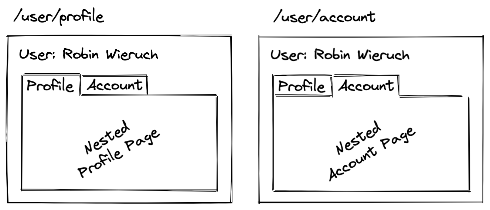
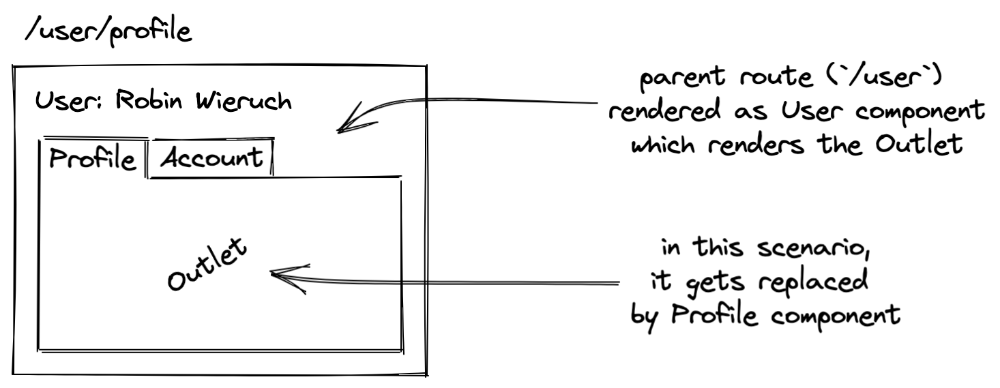

<Sponsorship />

A React Router tutorial which teaches you how to use **Nested Routes with React Router 6**. The code for this React Router v6 tutorial can be found over [here](https://github.com/the-road-to-learn-react/react-router-6-examples). In order to get you started, create a new React project (e.g. [create-react-app](https://github.com/facebook/create-react-app)). Afterward, [install React Router](https://reactrouter.com/docs/en/v6/getting-started/installation#basic-installation) and read the following React Router tutorial to get yourself aligned to what follows next.

<ReadMore label="React Router 6 Introduction" link="/react-router/" />

Nested Routes are a powerful feature. While most people think React Router only routes a user from page to page, it also allows one to exchange specific fragments of the view based on the current route. For example, on a user page one gets presented multiple tabs (e.g. Profile, Account) to navigate through a user's information. By clicking these tabs, the URL in the browser will change, but instead of replacing the whole page, only the content of the tab gets replaced.



In the following we will recreate this scenario with React Router. To illustrate how this works and how you can implement nested routes step by step in React yourself, we will start off with the following example:

```javascript
import { Routes, Route, Link } from 'react-router-dom';

const App = () => {
  return (
    <>
      <h1>React Router</h1>

      <nav>
        <Link to="/home">Home</Link>
        <Link to="/user">User</Link>
      </nav>

      <Routes>
        <Route index element={<Home />} />
        <Route path="home" element={<Home />} />
        <Route path="user" element={<User />} />
        <Route path="*" element={<NoMatch />} />
      </Routes>
    </>
  );
};
```

In this [function component](/react-function-component/) we have matching Link and Route components from React Router for the `home/` and `user/` routes. Furthermore, we have a so called Index Route loaded with the Home component and a so called No Match Route loaded with the NoMatch component. Both act as fallback routes. From here, we will explore the concept of Nested Route.

# Nested Routes in React Router

We will continue working on the User component, because this is the place where we want to have the nested routing via tabs. Therefore, we will instantiate a new set of Link components (which will be our unstyled tabs) which navigate a user to their profile and their account.

<ReadMore label="How to CSS style React components" link="/react-css-styling/" />

```javascript
const User = () => {
  return (
    <>
      <h1>User</h1>

      <nav>
        <Link to="/user/profile">Profile</Link>
        <Link to="/user/account">Account</Link>
      </nav>
    </>
  );
};
```

We are using absolute paths here to navigate a user from their profile to their account and vice versa, however, we could also use relative paths as a best practice. Because the User component sits in the `/user` route, the Link components can anticipate their parent route (here: `/user`) and just append relative paths (here: `profile` and `account`) to it (e.g. `/user/profile`):

```javascript{7-8}
const User = () => {
  return (
    <>
      <h1>User</h1>

      <nav>
        <Link to="profile">Profile</Link>
        <Link to="account">Account</Link>
      </nav>
    </>
  );
};
```

At this time, when we attempt to click one of these links in our React application, we would get stranded at our No Match Route. This tells us that we didn't map these routes (here: `/user/profile` and `/user/account`) to any actual Route components yet. Therefore, we will add these two new routes as so called Nested Routes to our `/user` route:

```javascript{14-17}
const App = () => {
  return (
    <>
      <h1>React Router</h1>

      <nav>
        <Link to="/home">Home</Link>
        <Link to="/user">User</Link>
      </nav>

      <Routes>
        <Route index element={<Home />} />
        <Route path="home" element={<Home />} />
        <Route path="user" element={<User />}>
          <Route path="profile" element={<Profile />} />
          <Route path="account" element={<Account />} />
        </Route>
        <Route path="*" element={<NoMatch />} />
      </Routes>
    </>
  );
};
```

The Route components map to the Link components in a one to one relationship now. However, there can be more than one Link component linking to the same route, so it's actually a one to many relationship.

When testing this in the browser, we will see that only the User components shows up and not its nested Profile component nor its nested Account component when clicking their respective links. We are missing the crucial Outlet component from React Router:

```javascript{1,15}
import { Routes, Route, Link, Outlet } from 'react-router-dom';

...

const User = () => {
  return (
    <>
      <h1>User</h1>

      <nav>
        <Link to="profile">Profile</Link>
        <Link to="account">Account</Link>
      </nav>

      <Outlet />
    </>
  );
};
```

The Outlet component renders the matching child route with its respective component (here either Profile or Account component) from the parent Routes' component collection of Route components.



If there is no `/profile` and no `/account` route matching (e.g. `/user/settings`), you will see only the User component showing up. To avoid this, you can add a combination of Index and No Match Routes. Afterward, the default route will be the `/profile` route:

```javascript{15,18}
const App = () => {
  return (
    <>
      <h1>React Router</h1>

      <nav>
        <Link to="/home">Home</Link>
        <Link to="/user">User</Link>
      </nav>

      <Routes>
        <Route index element={<Home />} />
        <Route path="home" element={<Home />} />
        <Route path="user" element={<User />}>
          <Route index element={<Profile />} />
          <Route path="profile" element={<Profile />} />
          <Route path="account" element={<Account />} />
          <Route path="*" element={<NoMatch />} />
        </Route>
        <Route path="*" element={<NoMatch />} />
      </Routes>
    </>
  );
};
```

That's it. While the User component always renders the tabs as navigation, its content (Outlet) gets replaced by the matching nested route (either Profile or Account component based on `/user/profile` or `/user/account` route). If none of these routes are matched when visiting the `/user` route, the application will show either the Profile component (if route matches exactly `/user`) or the NoMatch component (if route does not match, e.g. `/user/setting`) showing up.

# Dynamic Nested Routes in React Router

In the next example for Nested Routes, we will start from a clean slate in the App component. This time we do not want to render static nested routes like we did before (e.g. `/user/profile`), but dynamic nested routes based on identifiers (e.g. `/users/1` for showing the user who has the identifier `1` and therefore matches this route). So we will adjust our example from a single user route (`/user`) to a multi user route (`/users`).

Let's start by initializing a list of items (here: `users`) in our App component. The list is just sample data, but it could be [fetched in React](/react-hooks-fetch-data/) from a remote API too. Moreover, we will pass the users to the Users component as [props](/react-pass-props-to-component/):

```javascript{2-5,13,20}
const App = () => {
  const users = [
    { id: '1', fullName: 'Robin Wieruch' },
    { id: '2', fullName: 'Sarah Finnley' },
  ];

  return (
    <>
      <h1>React Router</h1>

      <nav>
        <Link to="/home">Home</Link>
        <Link to="/users">Users</Link>
      </nav>

      <Routes>
        <Route element={<Layout />}>
          <Route index element={<Home />} />
          <Route path="home" element={<Home />} />
          <Route path="users" element={<Users users={users} />} />
          <Route path="*" element={<NoMatch />} />
        </Route>
      </Routes>
    </>
  );
};
```

The Users component becomes a [list component in React](/react-list-component/), because it iterates over each user and returns JSX for it. In this case, it's a bit more than a mere list, because we add a React Router's Link component to the mix. The relative path in the Link component hints to a respective nested (here: `/${user.id}` nested in `/users`) yet dynamic (here: `/${user.id}`) route:

```javascript{1,6-14}
const Users = ({ users }) => {
  return (
    <>
      <h2>Users</h2>

      <ul>
        {users.map((user) => (
          <li key={user.id}>
            <Link to={user.id}>
              {user.fullName}
            </Link>
          </li>
        ))}
      </ul>
    </>
  );
};
```

By having this new dynamic yet nested route, we need to create a matching nested Route component for it in the App component. First, since it is a so called **Nested Route** (or child route) of the `/users` route, we can nest it in this respective parent Route component. In addition, since it is a so called **Dynamic Route**, it uses a dynamic route defined as `:userId` whereas a user's identifier matches dynamically (e.g. user with `id` of `'1'` would be matched to `/users/1`):

```javascript{16-18}
const App = () => {
  const users = [
    { id: '1', fullName: 'Robin Wieruch' },
    { id: '2', fullName: 'Sarah Finnley' },
  ];

  return (
    <h1>React Router</h1>

    <nav>...</nav>

    <Routes>
      <Route element={<Layout />}>
        <Route index element={<Home />} />
        <Route path="home" element={<Home />} />
        <Route path="users" element={<Users users={users} />}>
          <Route path=":userId" element={<User />} />
        </Route>
        <Route path="*" element={<NoMatch />} />
      </Route>
    </Routes>
  );
};
```

This way, the User component becomes a nested route of the Users component. Thus it's the Users component's responsibility to render its nested route with the help of the Outlet component again -- which again is there to render the matched child route:

```javascript{1,12}
import { Routes, Route, Link, Outlet } from 'react-router-dom';

...

const Users = ({ users }) => {
  return (
    <>
      <h2>Users</h2>

      <ul>...</ul>

      <Outlet />
    </>
  );
};
```

Next, we are going to declare the missing User component which gets nested via the Outlet in the Users component whenever a user's identifier matches in the URL. In this new component, we can use React Router's `useParams` Hook to get the respective `userId` (which equals `:userId`) from the URL:

```javascript{3,8-18}
import {
  ...
  useParams,
} from 'react-router-dom';

...

const User = () => {
  const { userId } = useParams();

  return (
    <>
      <h2>User: {userId}</h2>

      <Link to="/users">Back to Users</Link>
    </>
  );
};
```

That's it. We have seen how to create nested routes by nesting one Route component (or multiple Route components) in another Route component. While the former are the nested child routes, the latter is the parent route which renders the enclosing component that has to make use of the Outlet component to render the actual matched child route.

<ReadMore label="Descendant Routes with React Router" link="/react-router-descendant-routes/" />

In addition, we have also seen how we can create dynamic routes by using the colon in a Route's `path` prop (e.g. `:userId`). Essentially the `:userId` acts as asterisk for any identifier. In our case, we use a Link component to navigate the user to a `/users/:userId` route where `:userId` stands for the actual user's identifier. In the end, we can always get the dynamic paths (called parameters or params) from the URL by using React Router's `useParams` Hook.

<Divider />

If you happen to use React Router for your React application, Nested Routes can boost your user experience tremendously by giving your users access to very specific parts of your applications while sharing these parts as URLs.