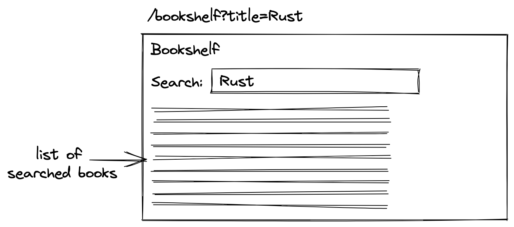

<Sponsorship />

A React tutorial which teaches you how to use **Search Params with React Router 6**. The code for this React Router tutorial can be found over [here](https://github.com/the-road-to-learn-react/react-router-6-examples). In order to get you started, create a new React project (e.g. [create-react-app](https://github.com/facebook/create-react-app)). Afterward, [install React Router](https://reactrouter.com/docs/en/v6/getting-started/installation#basic-installation) and read the following React Router tutorial to get yourself aligned to what follows next.

<ReadMore label="React Router 6 Introduction" link="/react-router/" />

Search Params are a powerful feature, because they enable you to capture state in a URL. By having state in a URL, you can share it with other people. For example, if an application shows a catalog of products, a developer will enable a user to search it. In React this would translate into a list of items (here: products) and a HTML input field for filtering them.

Now there is a high chance that React developers will manage this search state with React's useState Hook. Which is fine for this one user, but bad for collaborating with other users.

Therefore a best practice would be managing this search state in a URL, because this way the search state becomes shareable with other users. If one user searches a list of items by title (e.g. "Rust"), the search param gets appended to the URL (e.g. `/bookshelf?title=Rust`) as a key value pair, and therefore can be shared with another user. Then the other user who gets the link will see the same filtered list of items on their page.



# React Router: From State to URL

To get things started, we will implement the previous image where we have a list of items and search it via a HTML input field. We will not be using React's useState Hook to capture the search state, but a shareable URL by using React Router. The App component will be the following -- which is similar to the App component from the previously mentioned React Router tutorial:

```javascript
const App = () => {
  return (
    <>
      <h1>React Router</h1>

      <nav>
        <Link to="/home">Home</Link>
        <Link to="/bookshelf">Bookshelf</Link>
      </nav>

      <Routes>
        <Route index element={<Home />} />
        <Route path="home" element={<Home />} />
        <Route path="bookshelf" element={<Bookshelf />} />
        <Route path="*" element={<NoMatch />} />
      </Routes>
    </>
  );
};
```

While the Home and NoMatch components are just placeholder components with any implementation, we will focus on the Bookshelf component  which shows books as a [list component](/react-list-component/). These books are just sample data here, but they could be fetched from a [remote API](/node-express-server-rest-api/) (or [mock API](/react-mock-data/)) too:

```javascript
const Bookshelf = () => {
  const books = [
    {
      title: 'The Road to Rust',
      isCompleted: false,
    },
    {
      title: 'The Road to React',
      isCompleted: true,
    },
  ];

  return (
    <>
      <h2>Bookshelf</h2>

      <ul>
        {books.map((book) => (
          <li key={book.title}>{book.title}</li>
        ))}
      </ul>
    </>
  );
};
```

A straightforward implementation of enabling a user to filter this list by a case insensitive title matching would be using [React's useState Hook](/react-usestate-hook/) and an HTML input field. Finally an [event handler](/react-event-handler/) would read the value from the input field and write it as state:

```javascript{1-2,7,9-11,17,20}
const byTitle = (title) => (book) =>
  book.title.toLowerCase().includes((title || '').toLowerCase());

const Bookshelf = () => {
  const books = [...];

  const [title, setTitle] = React.useState('');

  const handleTitle = (event) => {
    setTitle(event.target.value);
  };

  return (
    <>
      <h2>Bookshelf</h2>

      <input type="text" value={title} onChange={handleTitle} />

      <ul>
        {books.filter(byTitle(title)).map((book) => (
          <li key={book.title}>{book.title}</li>
        ))}
      </ul>
    </>
  );
};
```

That's the "using state in React" version. Next we want to use React Router to capture this state in a URL instead. Fortunately, React Router offers us the **useSearchParams** hook which can be used almost as replacement for React's useState Hook:

```javascript{6,14,17,26,31}
import * as React from 'react';
import {
  Routes,
  Route,
  Link,
  useSearchParams,
} from 'react-router-dom';

...

const Bookshelf = () => {
  const books = [...];

  const [search, setSearch] = useSearchParams();

  const handleTitle = (event) => {
    setSearch({ title: event.target.value });
  };

  return (
    <>
      <h2>Bookshelf</h2>

      <input
        type="text"
        value={search.get('title')}
        onChange={handleTitle}
      />

      <ul>
        {books.filter(byTitle(search.get('title'))).map((book) => (
          <li key={book.title}>{book.title}</li>
        ))}
      </ul>
    </>
  );
};
```

Because of two things, it cannot be used a direct replacement for React's useState Hook. First, it operates on an object instead of a string, because a URL can have more than one search param (e.g. `/bookshelf?title=Rust&rating=4`) and therefore every search param becomes a property in this object (e.g. `{ title: 'Rust', rating: 4 }`).

Essentially it would have been similar to our previous implementation if we would have been using React's useState Hook with an object instead of a string:

```javascript
const [search, setSearch] = React.useState({ title: '' });
```

However, even though the stateful value returned by `useSearchParams` is of type object (`typeof search === 'object'`), it is still not accessible like a mere JavaScript object data structure because it is an instance of [URLSearchParams](https://developer.mozilla.org/en-US/docs/Web/API/URLSearchParams). Hence we need to call its getter method (e.g. `search.get('title')`) instead.

And second, React Router's useSearchParams Hook does not accept an initial state, because the initial state comes from the URL. So when a user shares the URL with the search param (e.g. `/bookshelf?title=Rust`), another user would get `{ title: 'Rust' }` as initial state from React Router's Hook. The same happens when the application navigates a user to a route with search params with its optional search params set.

That's it for using a URL for state instead of using one of [React's state management Hooks](/react-state/). It improves the user experience tremendously, because a URL becomes more specific to what the user sees on a page. Hence this specific URL can be shared with other users who will see the page with the same UI then.

# URLSearchParams as Object

If you do not want to use URLSearchParams when dealing with React Router's useSearchParams Hook, you can write a custom hook which returns a  JavaScript object instead of an instance of URLSearchParams:

```javascript{1-8,13,25,30}
const useCustomSearchParams = () => {
  const [search, setSearch] = useSearchParams();
  const searchAsObject = Object.fromEntries(
    new URLSearchParams(search)
  );

  return [searchAsObject, setSearch];
};

const Bookshelf = () => {
  const books = [...];

  const [search, setSearch] = useCustomSearchParams();

  const handleTitle = (event) => {
    setSearch({ title: event.target.value });
  };

  return (
    <>
      <h2>Bookshelf</h2>

      <input
        type="text"
        value={search.title}
        onChange={handleTitle}
      />

      <ul>
        {books.filter(byTitle(search.title)).map((book) => (
          <li key={book.title}>{book.title}</li>
        ))}
      </ul>
    </>
  );
};
```

However, this custom hook should be taken with a grain of salt, because it does not work for repeated keys (e.g. array search params with `?editions=1&editions=3`) and other edge cases when working with sophisticated URLs.

In general, only using React Router's useSearchParams Hook (or this custom useCustomSearchParams hook) does not give you the whole experience for state management in URLs, because it is only usable for string primitives and no other data types. We will explore this and how to solve this problem in the next sections.

# Search Params and preserving Data Types

Not all state consist of only strings. In the previous example of using search params with React Router, we have used a string (here: `title`) that gets encoded in the URL. When decoding this string from the URL, we will get by default a string -- which works in our case because we expected a string. But what about other primitive data types like number or boolean? Not to speak of complex data types such as arrays.

<ReadMore label="React Checkbox Component" link="/react-checkbox/" />

To explore this caveat, we will continue our example from the previous section by implementing a checkbox. We will use this checkbox component and wire it up to React Router's search params:

```javascript{1-5,16-18,30-34,37}
const bySearch = (search) => (book) =>
  book.title
    .toLowerCase()
    .includes((search.title || '').toLowerCase()) &&
  book.isCompleted === search.isCompleted;

const Bookshelf = () => {
  const books = [...];

  const [search, setSearch] = useCustomSearchParams();

  const handleTitle = (event) => {
    setSearch({ title: event.target.value });
  };

  const handleIsCompleted = (event) => {
    setSearch({ isCompleted: event.target.checked });
  };

  return (
    <>
      <h2>Bookshelf</h2>

      <input
        type="text"
        value={search.title}
        onChange={handleTitle}
      />

      <Checkbox
        label="Is Completed?"
        value={search.isCompleted}
        onChange={handleIsCompleted}
      />

      <ul>
        {books.filter(bySearch(search)).map((book) => (
          <li key={book.title}>{book.title}</li>
        ))}
      </ul>
    </>
  );
};
```

Try it in your browser. You will see that the searching for the `isCompleted` boolean does not work, because `isCompleted` coming from our `search` object gets represented as a string as either `'true'` or `'false'`. We could circumvent this by enhancing our custom hook:

```javascript{1,7-13,15,18-20,26}
const useCustomSearchParams = (param = {}) => {
  const [search, setSearch] = useSearchParams();
  const searchAsObject = Object.fromEntries(
    new URLSearchParams(search)
  );

  const transformedSearch = Object.keys(param).reduce(
    (acc, key) => ({
      ...acc,
      [key]: param[key](acc[key]),
    }),
    searchAsObject
  );

  return [transformedSearch, setSearch];
};

const PARAMS = {
  BooleanParam: (string = '') => string === 'true',
};

const Bookshelf = () => {
  const books = [...];

  const [search, setSearch] = useCustomSearchParams({
    isCompleted: PARAMS.BooleanParam,
  });

  ...

  return (...);
};
```

Essential the new version of the custom hook takes an object with optional transformation functions. It iterates through each transformation function and if it finds a match between transformation function and search param it applies the function onto the search param. In this case, we transform a string boolean (either `'true'` or `'false'`) to an actual boolean. If no match is found, it just returns the original search param. Hence we do not need a transformation function for the `title`, because it's a string and can stay as string.

By having the implementation details for the custom hook in place, we could also create other transformer functions (e.g. `NumberParam`) and therefore fill the gaps for the missing data type conversions (e.g. `number`):

```javascript
const PARAMS = {
  BooleanParam: (string = '') => string === 'true',
  NumberParam: (string = '') => (string ? Number(string) : null),
  // other transformation functions to map all data types
};
```

Anyway, when I started to implement this myself I figured there must be already a library for this problem. And yes, there is: entering use-query-params.

# React Router: Use Search Params

The [use-query-params](https://github.com/pbeshai/use-query-params) library fits perfectly the use case of working with sophisticated URLs as state that go beyond mere strings. In this section, we will explore the use-query-params library and therefore get rid of our custom useSearchParams hook.

Follow the library's installation instructions yourself. You will need to install the library on the command line and instantiate it on a root level in your React project:

```javascript{3,4,10,12}
import React from 'react';
import ReactDOM from 'react-dom';
import { BrowserRouter, Route } from 'react-router-dom';
import { QueryParamProvider } from 'use-query-params';

import App from './App';

ReactDOM.render(
  <BrowserRouter>
    <QueryParamProvider ReactRouterRoute={Route}>
      <App />
    </QueryParamProvider>
  </BrowserRouter>,
  document.getElementById('root')
);
```

However, use-query-params didn't adapt properly to React Router 6 yet. Hence you may see the following error popping up: *"A `<Route>` is only ever to be used as the child of `<Routes>` element, never rendered directly. Please wrap your `<Route>` in a `<Routes>`."*. Therefore adjust your code on the root level:

```javascript{5-6,12-28,32}
import React from 'react';
import ReactDOM from 'react-dom';
import {
  BrowserRouter,
  useNavigate,
  useLocation,
} from 'react-router-dom';
import { QueryParamProvider } from 'use-query-params';

import App from './App';

const RouteAdapter = ({ children }) => {
  const navigate = useNavigate();
  const location = useLocation();

  const adaptedHistory = React.useMemo(
    () => ({
      replace(location) {
        navigate(location, { replace: true, state: location.state });
      },
      push(location) {
        navigate(location, { replace: false, state: location.state });
      },
    }),
    [navigate]
  );
  return children({ history: adaptedHistory, location });
};

ReactDOM.render(
  <BrowserRouter>
    <QueryParamProvider ReactRouterRoute={RouteAdapter}>
      <App />
    </QueryParamProvider>
  </BrowserRouter>,
  document.getElementById('root')
);
```

Now you are good to go to use use-query-params for powerful URL state management in React. All you have to do is using the new `useQueryParams` hook instead of our custom hook from before. Also notice that compared to our custom hook, you need to "transform" a string search param too:

```javascript{2-7,14-17}
import * as React from 'react';
import { Routes, Route, Link } from 'react-router-dom';
import {
  useQueryParams,
  StringParam,
  BooleanParam,
} from 'use-query-params';

...

const Bookshelf = () => {
  const books = [...];

  const [search, setSearch] = useQueryParams({
    title: StringParam,
    isCompleted: BooleanParam,
  });

  ...

  return (...);
};
```

You can also provide sensible defaults. For example, at this time when navigating to `/bookshelf` without search params, `title` and `isComplete` would be undefined. However, if you expect them to be at least an empty string for `title` and `false` for `isComplete`, you can provide these defaults if you want to:

```javascript{7,16-17}
import * as React from 'react';
import { Routes, Route, Link } from 'react-router-dom';
import {
  useQueryParams,
  StringParam,
  BooleanParam,
  withDefault
} from 'use-query-params';

...

const Bookshelf = () => {
  const books = [...];

  const [search, setSearch] = useQueryParams({
    title: withDefault(StringParam, ''),
    isCompleted: withDefault(BooleanParam, false),
  });

  ...

  return (...);
};
```

There is one other noteworthy thing to mention: At the moment, use-query-params uses the default 'pushin' mode which means that every time a search params gets appended it will not override the other search params. Hence you preserve all search params while changing one of them. However, if that's not your desired behavior, you could also change the mode (e.g. to 'push') which will not preserve previous search params anymore (which does not make sense in our scenario though):

```javascript{5,9}
const Bookshelf = () => {
  ...

  const handleTitle = (event) => {
    setSearch({ title: event.target.value }, 'push');
  };

  const handleIsCompleted = (event) => {
    setSearch({ isCompleted: event.target.checked }, 'push');
  };

  ...

  return (...);
};
```

That's it. Besides the two data type conversions that we used here, there are also conversions for numbers, arrays, objects and others. For example, if you would want to have a [selectable table in React](/react-table-select/), you may want to have each selected row in a table represented as identifier in an array (in use-query-params' it's the `ArrayParam` conversion) mapped to an actual URL. Then you could share this URL with another user which would start off with the selected rows.

<Divider />

Using URLs as state is a powerful combination for an improved user experience. React Router's search params give you a great start when dealing with single or multiple string states. However, once you want to preserve the data types that you mapped onto the URL, you may want to use a library such as use-query-params on top for sophisticated URL state management in React.
