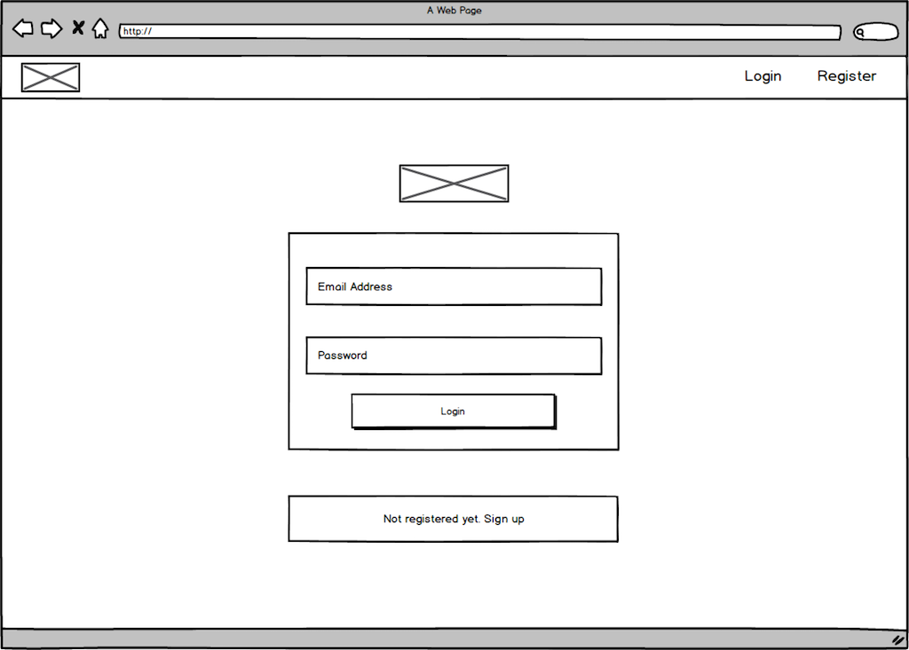

<Sponsorship />

[Semantic UI](https://semantic-ui.com/) is a UI component framework for theming websites. Semantic UI enables developers to build websites with fast and concise HTML, along with a complete mobile responsive experience. Semantic UI treats words and classes as exchangeable concepts. Classes use syntax from natural languages like noun/modifier relationships, word order, and plurality to link concepts intuitively.

# Semantic UI in React Installation

In order to use Semantic UI in a React app, we would have to make use of [Semantic UI React](https://react.semantic-ui.com/), a React integration of the original Semantic UI library. Semantic UI React provides several prebuilt components that we can use to speed up our development process by having UI components ready to be used whilst building a React app.

The best way to get started with Semantic UI React is by running the command below:

```javascript
npm install semantic-ui-react
```

Semantic UI React needs the general Semantic UI stylesheet to be styled properly. That can be done by installing the Semantic UI CSS package:

```javascript
npm install semantic-ui-css
```

Then it can be imported in your React entry point file where React hooks into the DOM:

```javascript{3}
import React from 'react';
import ReactDOM from 'react-dom';
import 'semantic-ui-css/semantic.min.css';

import App from './App';

ReactDOM.render(<App />, document.getElementById('root'));
```

Afterward, Semantic UI can be used in your React application. The next sections will show you how to import components from Semantic UI React, how to use them, and how to arrange them.

# Overview of Semantic UI React Components

In this tutorial, we'll explore how to use Semantic UI in a React application by building a page where people are able to login as a user. The login page will contain several top-level elements from Semantic UI. It's going to contain a header, a navigation bar and a form. It's also going to feature Semantic UI components so we get to see how the components can be utilized. A mockup of what the login form is going to look like can be seen below.



The final application can be found here: [React with Semantic UI](https://github.com/the-road-to-learn-react/react-semantic-ui-example). We'll start by creating a React app using the [create-react-app](https://github.com/facebook/create-react-app) utility which enables developers to easily create React apps with zero build config. If you haven't heard about it, checkout the [MacOS](https://www.robinwieruch.de/react-js-macos-setup/) or [Windows](https://www.robinwieruch.de/react-js-windows-setup/) setup guide. Otherwise, create your application with it on the command line:

```javascript
create-react-app react-semantic-ui-app
cd react-semantic-ui-app
npm start
```

Once that's done, run the commands from above to install Semantic UI React and CSS for your application. Don't forget to import the Semantic UI CSS in your React file where ReactDOM is used to hook into the HTML.

# Semantic UI: Login Form

Next, we'll start creating the required components. Navigate into the `src` folder and create a `Login.js` file. Afterward, implement  it with the following code. We will go through all the components and explain them afterward.

```javascript
import React from 'react';
import {
  Button,
  Form,
  Grid,
  Header,
  Message,
  Segment,
} from 'semantic-ui-react';

export default () => (
  <Grid centered columns={2}>
    <Grid.Column>
      <Header as="h2" textAlign="center">
        Login
      </Header>
      <Segment>
        <Form size="large">
          <Form.Input
            fluid
            icon="user"
            iconPosition="left"
            placeholder="Email address"
          />
          <Form.Input
            fluid
            icon="lock"
            iconPosition="left"
            placeholder="Password"
            type="password"
          />

          <Button color="blue" fluid size="large">
            Login
          </Button>
        </Form>
      </Segment>
      <Message>
        Not registered yet? <a href="#">Sign Up</a>
      </Message>
    </Grid.Column>
  </Grid>
);
```

Now, in your App component, import the new form component and display it. Afterward you should be able to see the login form in your browser after starting the application.

```javascript{2,4,7,8,9}
import React from 'react';
import { Container } from 'semantic-ui-react';

import Login from './Login';

const App = () => (
  <Container>
    <Login />
  </Container>
);

export default App;

```

We built a login form with Semantic UI in React. We started by importing some Semantic components that will be used to build the login form. We'll highlight the components imported and discuss them.

**Semantic UI Grid**

[Semantic UI Grids](https://react.semantic-ui.com/collections/grid/) are structures to align layout in a design. Grid allows grouping of content into rows and columns by using the more specific `Grid.Row` and `Grid.Column` components respectively.

```javascript
import React from 'react'
import { Grid } from 'semantic-ui-react'

const ButtonExample = () => (
  <Grid>
    <Grid.Column>
      <p>Content lives here</p>
      <p>Content lives here</p>
      <p>Content lives here</p>
      <p>Content lives here</p>
    </Grid.Column>
  </Grid>
);
```

The output can be seen [here](https://codesandbox.io/embed/rw5p24jk1p). When using Grid, we don't necessarily need to specify the rows as Grid automatically knows how to wrap it's content into a new row if the column width is filled. In the code block for the login form above, we created a Grid component and used just one Grid.Column component. The Grid component also allows further props like the ones below:

* `centered`: Used to center a Grid.
* `className`: Used to add additional classes.
* `columns`: Used to represent column count per row in a Grid.
* `divided`: Used to create dividers between columns.
* `textAlign`: Used to specify the text alignment in a grid. Value can be
  * `left`
  * `center`
  * `right`
  * `justify`
* `verticalAlign`: Used to specify a grid's vertical alignment. Value can be
  * `bottom`
  * `middle`
  * `top`

**Semantic UI Button**

[Semantic UI Buttons](https://react.semantic-ui.com/elements/button/) allow users to take actions, and make choices, with a single tap or click. They help communicate an action a user can take by interacting with it.

```javascript
import React from 'react';
import { Button } from 'semantic-ui-react';

const ButtonExample = () => (
  <Button onClick={() => console.log('Clicked')}>Click Here</Button>
);
```

The output can be seen [here](https://codesandbox.io/embed/x9jjqzr4nq). The Button component allows the following props:

* `active`: This prop is used to show the current state of the button.
* `as`: This specifies the element type to render the content in.
* `circular`: This prop when applied makes a button circular.
* `className`: Enables additional classes for the button.
* `color`: This is used to set the color of the button.
* `disabled`: This prop, when set to true, can make a button unable to be interacted with.
* `loading`: Adds a loading indicator to the button.
* `primary`: This prop formats a button to show different levels of emphasis.
* `size`: This prop is used to specify the size of the button.

**Semantic UI Header**

The [Semantic UI Header](https://react.semantic-ui.com/elements/header/) component is used to display the HTML heading tags, that is, `h1` down to `h6`.  We can specify which of the header tags to be used by using the `as` props.

```javascript
import React from 'react';
import { Header } from 'semantic-ui-react';

const HeaderExample = () => (
  <div>
    <Header as="h1">Login</Header>
    <Header as="h2">Login</Header>
    <Header as="h3">Login</Header>
    <Header as="h4">Login</Header>
    <Header as="h5">Login</Header>
    <Header as="h6">Login</Header>
  </div>
);
```

The output can be seen [here](https://codesandbox.io/embed/wn2qmnxxp8). It accepts the following props:

* `as`: This specifies the element type to render the content in. Values range from `h1` to `h6` to `p`.
* `className`: Used to add additional classes.
* `color`: This is used to set the color of the header.
* `dividing`: This can be used to create a divider between the header and the content.
* `textAlign`: Used to align the header content. Value can be any of the following:
  * `left`
  * `center`
  * `right`
  * `justified`

**Semantic UI Form**

The Form component is used to display a set of related user input fields in a clean and organized way. There are two ways in which you can create a form using Semantic UI. You can either write the Form components using the shorthand props API or without the shorthand props API.

```javascript
// without shorthand props
import React from 'react';
import { Button, Form } from 'semantic-ui-react';

const LoginForm = () => (
  <Form>
    <Form.Field>
      <label>Email Address</label>
      <input placeholder="Email Address" />
    </Form.Field>
    <Form.Field>
      <label>Password</label>
      <input placeholder="Password" />
    </Form.Field>
    <Button type="submit">Submit</Button>
  </Form>
);

export default LoginForm;
```

The output can be seen [here](https://codesandbox.io/embed/p7446xvn0). In the code block above, form fields in Semantic UI are created by using `Form.Field`. [Form.Field](https://react.semantic-ui.com/collections/form/#content-field) is a form element that contains a input and a label. However, using the shorthand method would lead to the following:

```javascript
// with shorthand props
import React from 'react';
import { Form } from 'semantic-ui-react';

const LoginForm = () => (
  <Form>
    <Form.Group>
      <Form.Input label="Email Address" placeholder="Email Address" />
      <Form.Input label="Password" placeholder="Password" />
    </Form.Group>
    <Form.Button>Submit</Form.Button>
  </Form>
);

export default LoginForm;
```

The output can be seen [here](https://codesandbox.io/embed/vmn1kxo9qy). Using the [shorthand method](https://react.semantic-ui.com/collections/form/#shorthand-subcomponent-control) as seen above, results in a concise and less written code. The Form component also supports HTML controls for input fields.

```javascript
import React from 'react';
import { Form } from 'semantic-ui-react';

const LoginForm = () => (
  <Form>
    <Form.Group widths="equal">
      <Form.Field label="An HTML <input>" control="input" />
      <Form.Field label="An HTML <select>" control="select">
        <option value="male">Male</option>
        <option value="female">Female</option>
      </Form.Field>
    </Form.Group>
    <Form.Group grouped>
      <label>HTML radios</label>
      <Form.Field
        label="This one"
        control="input"
        type="radio"
        name="htmlRadios"
      />
      <Form.Field
        label="That one"
        control="input"
        type="radio"
        name="htmlRadios"
      />
    </Form.Group>
    <Form.Group grouped>
      <label>HTML checkboxes</label>
      <Form.Field label="This one" control="input" type="checkbox" />
      <Form.Field label="That one" control="input" type="checkbox" />
    </Form.Group>
    <Form.Field
      label="An HTML <textarea>"
      control="textarea"
      rows="3"
    />
    <Form.Field label="An HTML <button>" control="button">
      HTML Button
    </Form.Field>
  </Form>
);

export default LoginForm;
```

The output can be seen [here](https://codesandbox.io/embed/jq54zy45w). Just like `Form.Field`, the Form component has other subcomponents that help to build usable and organized forms. They include, `Form.Button` `Form.Checkbox` `Form.Dropdown` `Form.Input` `Form.Radio` `Form.Select` `Form.TextArea`. These are all syntactic sugar for setting the controls on the `Form.Field` subcomponent. The Form component accepts the following [props](https://react.semantic-ui.com/collections/form/#shorthand-field-control-html):

* `action`: This is the action for the HTML form.
* `className`: Additional classnames that might be needed.
* `loading`: If this prop is added, it automatically shows a loading indicator.
* `onSubmit`: This prop is used to set a submit handler for the HTML form.
* `size`: The form can vary in size.

**Semantic UI Message**

The Message component is used to display information that explains nearby content.

```javascript
import React from 'react';
import { Message } from 'semantic-ui-react';

const MessageExampleMessage = () => (
  <Message>
    Not registered yet? <a href="#">Sign Up</a>
  </Message>
);
```

The output can be seen [here](https://codesandbox.io/embed/5wwv5mx03l). The Message component can be written in different ways. It can be written without a header as seen above or with a header just like the example below.

```javascript
import React from 'react';
import { Message } from 'semantic-ui-react';

const MessageExample = () => (
  <Message>
    <Message.Header>Sign Up</Message.Header>
    <p>
      Not registered yet? <a href="#">Sign Up</a>
    </p>
  </Message>
);
```

The output can be seen [here](https://codesandbox.io/embed/j1z91mlkqw). We can also use the Message component by passing both the header and content as props:

```javascript
import React from 'react';
import { Message } from 'semantic-ui-react';

const MessageExample = () => (
  <Message>
    <Message
      header="Sign Up"
      content="Not registered yet?. Sign Up"
    />
  </Message>
);
```

The output can be seen [here](https://codesandbox.io/embed/535n0qxmop). A full list of how the Message component can be customized and utilized can be seen [here](https://react.semantic-ui.com/collections/message/).

**Semantic UI Segment**

A segment is a Semantic UI element that's used to group related content. Segments can be used to display conditional content. It can be formatted to raise above the page, show it contains multiple pages, or look like a pile of images. The output can be seen [here](https://codesandbox.io/embed/x9mj9z8yzo).

```javascript
import React from 'react';
import { Button, Header, Icon, Segment } from 'semantic-ui-react';

const SegmentExamplePlaceholder = () => (
  <Segment placeholder>
    <Header icon>
      <Icon name="pdf file outline" />
      No documents are listed for this customer.
    </Header>
    <Button primary>Add Document</Button>
  </Segment>
);

export default SegmentExamplePlaceholder;
```

**Semantic UI Modals**

Modals are used to create dialogs, popovers or lightboxes that help convey some information. The use of a modal temporarily blocks interactions with the main view of a site whilst showing some content. A Semantic UI modal can be created using the Modal component as seen in the code block below.

```javascript
import React from 'react';
import { Button, Header, Image, Modal } from 'semantic-ui-react';

const ModalExample = () => (
  <Modal trigger={<Button>Show Modal</Button>}>
    <Modal.Header>Select a Photo</Modal.Header>
    <Modal.Content image>
      <Image
        wrapped
        size="medium"
        src="https://react.semantic-ui.com/images/avatar/large/rachel.png"
      />
      <Modal.Description>
        <Header>Default Profile Image</Header>
        <p>
          We've found the following gravatar image associated with
          your e-mail address.
        </p>
        <p>Is it okay to use this photo?</p>
      </Modal.Description>
    </Modal.Content>
  </Modal>
);

export default ModalExample
```

The output can be seen [here](https://codesandbox.io/embed/ojk0mw86vz). Let's explore some of the props that the Modal component accepts:

* `basic`: This prop ensures that the modal has the barest setup
* `centered`: This is used to make the modal vertically centered in the viewport.
* `className`: This is used to set additional class names.
* `content`: The actual content for the Modal.
* `header`: The text displayed above the content in bold.
* `size`: The size prop allows us to determine the size of the modal.
* `trigger`: The trigger prop as the name suggests is what is used to trigger the opening of the modal. It's displayed in place of the modal. In the example above, it was set to a button.

The full list of configs with the Modal component can be seen on the documentation [here](https://react.semantic-ui.com/modules/modal/#types-modal).

# Semantic UI: Navigation Menu

For the navigation menu, we have a brand logo and two menu links to the far right. To accomplish that we'll be using the Menu component. In the `src` folder, create a file named `Menu.js` and edit it with the code block below.

```javascript
import React from 'react';
import { Container, Image, Menu } from 'semantic-ui-react';

export default () => (
  <Menu>
    <Container>
      <Menu.Item as="a" header>
        <Image
          size="small"
          src="https://www.robinwieruch.de/img/page/logo.svg"
        />
      </Menu.Item>

      <Menu.Menu position="right">
        <Menu.Item as="a" name="login">
          Login
        </Menu.Item>

        <Menu.Item as="a" name="register">
          Register
        </Menu.Item>
      </Menu.Menu>
    </Container>
  </Menu>
);
```

Then it needs to be imported in the App component and displayed above of the login form:

```javascript{1,4,8,9,13}
import React, { Fragment } from 'react';
import { Container } from 'semantic-ui-react';

import Menu from './Menu';
import Login from './Login';

const App = () => (
  <Fragment>
    <Menu />
    <Container>
      <Login />
    </Container>
  </Fragment>
);

export default App;
```

Let's go over the Menu component and it's subcomponents.

**Semantic UI Menu**

The [Menu](https://react.semantic-ui.com/collections/menu/) component allows us to create navigation menus and grouped navigation actions. It has sub components like `Menu.Item`, `Menu.Header ` and `Menu.Menu`. `Menu.Item` is an item in a Menu and can be used to include links or a brand image. `Menu.Header` acts as a header. It can be written as `Menu.Header` or by adding the `header` prop to `Menu.Item`. `Menu.Menu` is used to encapsulate a menu inside another menu. Let's explore some of the props that the Menu component accepts:

* `as`: Used to set the element type to render menu as.
* `className`: Used to set additional classes.
* `fixed`: A menu can be fixed to a particular side of the page. It accepts any of the following values:
  * `left`
  * `right`
  * `bottom`
  * `top`
* `inverted`: If the `inverted` prop is present, the colors of the menu are inverted so as to show greater a contrast.
* `size`: This is used to determine the size of the menu.

The full list of configs with the Menu component can be seen on the documentation [here](https://react.semantic-ui.com/collections/menu/).

**Semantic UI Image**

The [Semantic UI Image](https://react.semantic-ui.com/elements/image/) component is how we represent and display images in Semantic UI. The syntax is very similar to the traditional HTML5 tag as it uses the `src` attribute to fetch the image to be displayed.

```javascript
import React from 'react';
import { Image } from 'semantic-ui-react';

const ImageExample = () => (
  <Image src="https://www.robinwieruch.de/img/page/logo.svg" />
);
```

The output can be seen [here](https://codesandbox.io/embed/q3o0n4v3xj). It accepts the following props:

* `bordered`: When this prop is present, a border is automatically added to the image.
* `centered`: This prop sets the image centrally in a content block.
* `circular`: Displays the image in a circular format.
* `className`: Used to add additional classes.
* `size`: This is used to determine the image size.

<Divider />

The final application can be found here: [React with Semantic UI](https://github.com/the-road-to-learn-react/react-semantic-ui-example). In this article, we were introduced to Semantic UI and how it helps to style our apps and provide theming. We learned that Semantic UI enables developers to build websites with fast and concise HTML, along with a complete mobile responsive experience. We also got introduced to the React version of Semantic UI, Semantic UI React, which allows us to use Semantic UI in our React apps. Lastly, we went over some key components in Semantic UI React by building a page with a login form and a navigation menu.
