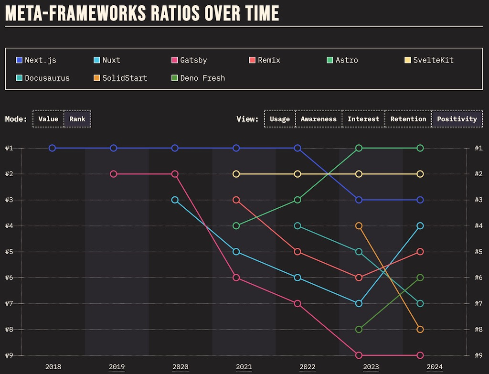

<Sponsorship />

Here I want to give you a brief overview of starter kits for a new React project. I want to reflect on advantages and disadvantages, on the skill-level needed as a developer, and on what features each starter project has to offer for you as a React developer. At the end you will know about 3 solutions for different requirements.

**A bit of context on why I write this guide now:** The new React documentation has been released, which [sunsets create-react-app (CRA)](https://github.com/reactjs/react.dev/pull/5487) as the recommended way to start a React application, and instead recommends several [starter kits](https://react.dev/learn/start-a-new-react-project) which in their sum were not perfectly well received by the React community ([A](https://www.reddit.com/r/reactjs/comments/11t3a63/introducing_reactdev_the_new_react_docs_site/), [B](https://www.reddit.com/r/reactjs/comments/11u1r3w/new_react_docs_pretend_spas_dont_exist_anymore/), [C](https://www.reddit.com/r/reactjs/comments/11unjpq/will_typescript_nextjs_become_necessary_or_even/), [D](https://www.reddit.com/r/reactjs/comments/11vjhf9/react_is_still_the_library_you_used_to_know/), [E](https://www.reddit.com/r/reactjs/comments/11uop56/the_new_docs_confused_me_a_little_please_help/), [F](https://news.ycombinator.com/item?id=35186812), [G](https://news.ycombinator.com/item?id=35201848)). For many it seemed too much influenced by politics [0], too heavy on (meta) framework lock-ins [1], too focused on SSR [2], and too far away from the problems a normal tech worker faces in their daily work outside of the bleeding edge Twitter bubble [3].

<ReadMore label="Why [1] and [2] matter as recent web development trends." link="/web-development-trends/" />

More about this below, but first my list of recommended React starter projects ...

**Disclaimer:** From an individual developer's perspective, I am all-in with the framework/SSR agenda which the React team pushes in their new documentation. However, I feel like this recent announcement puts React beginners (from my educational perspective) and companies who want to adopt React (from my freelance perspective) in a bad position. Hence I want to give them more diverse options as escape hatch here.

# React with Vite

[Vite](https://vitejs.dev/) is the clear successor of create-react-app (CRA), because it does not much deviate from it. Compared to create-react-app (CRA) (which uses Webpack) it is much faster, because it uses [esbuild](https://esbuild.github.io/) under the hood.

<ReadMore label="Learn to set up React with Webpack project from scratch" link="/minimal-react-webpack-babel-setup/" />

Identical to create-react-app (CRA) though, Vite still favors creating a single-page application (SPA) with client-side routing/rendering over SSR. However, since SSR is becoming a more important topic these days, it is available as opt-in feature in Vite.

When coming from a create-react-app (CRA), it is a straightforward [migration to Vite](/vite-create-react-app/). Opt-in features like [TypeScript](/vite-typescript/), [ESLint](/vite-eslint/), SVG, and SSR are only a few configurations away with Vite's *vite.config.js* file, in addition to feature specific files (e.g. *tsconfig*).

Vite with React allows developers to use React without an opinionated framework. It's up to the developer to choose complementary [React libraries](/react-libraries/) for routing, data fetching, state management and [testing](/vitest-react-testing-library/). Compared to all the React frameworks, it doesn't force any specific React features, libraries, or configurations (on a project level) on you.

<ReadMore label="Learn more about the history of CSR/SSR/SSG in web applications" link="/web-applications/" />

Last but not least, Vite encourages beginners to learn React and its fundamentals without the distraction of a framework. When I updated my book [The Road to React](https://www.amazon.com/dp/B077HJFCQX) in 2022, I replaced create-react-app with Vite. While Vite takes the passenger seat, a beginner can solely focus on React and its core features. In contrast, when learning React in the environment of a framework, React almost takes the passenger seat and one has to follow the opinions (e.g. file-based routing) of the framework instead.

**React with Vite Advantages:**

* almost drop-in replacement for create-react-app (CRA)
* still SPA/CSR friendly, but SSR is opt-in
* no framework/company lock-in
* lightweight
* does not mingle with React on a feature level
  * therefore focus on React itself and not a framework
* gentle learning curve for getting to know React's fundamentals

**React with Vite Disadvantages:**

* prioritizes SPA/CSR
* no framework support
* no access to architectural features provided by React for integrated frameworks
  * e.g. React Server Components (RSC)

**Why it may not be the default in React's documentation:**

* uses SPA/CSR over SSR
* technical lock-in prevents developers from using all React features
  * e.g. React Server Components (RSC)
* not contributing to the vision
  * of having a React framework
  * of enabling diverse rendering techniques
  * of enabling all available React features
    * e.g. React Server Components (RSC)
* framework (here: React) agnostic
  * React is not Vite's priority
  * from [Evan You](https://twitter.com/youyuxi) the creator of Vue

# React with Next

[Next.js](https://nextjs.org/) as a framework is the most mature and therefore obvious choice when a React developer wants to use React in an opinionated framework environment. It comes with many batteries included (e.g. file-based routing). If Next.js is not your cup of tea though, check out the more recently released [Remix](https://remix.run/) framework; which differs from Next.js by focusing on web standards.

Next.js prioritizes server-side rendering (SSR) as rendering technique. However, it can be used with static-site generation (SSG) and client-side rendering (CSR, see React with Vite) too. On top there are a few more bleeding edge rendering techniques like incremental static regeneration (ISR) and React Server Components (RSC) available. What makes this more mind blowing: You can mix and match rendering techniques in a Next.js application. While a marketing page can use SSG, the actual application behind the sign in/up uses SSR.

There comes a cost with this much power though: Different rendering techniques create an engineering overhead, the framework works on new rendering techniques constantly and therefore will change its prioritization eventually, and not all day to day tech workers are able to keep up with the pace. Even though Next.js did a great job in not introducing breaking changes in the past, there will always be new standards/configurations when working on the bleeding edge of bringing JavaScript/React rendering to the backend.

In conclusion, while Next.js comes with many batteries included (e.g. file-based routing), it also comes with responsibilities. While React itself (e.g. with Vite) stays relatively stable, you will definitely see changes in the Next.js ecosystem, because they are spearheading bringing React to the server.

**Next.js Advantages:**

* opinionated framework with built-in libraries
* SSR and many other rendering techniques
  * performance boost (caveat: if done right)
  * improved SEO compared to CSR (see React with Vite)
* Vercel as big player with lots of funding
  * works closely with the React core team
  * has many React core team members hired in the past
* working on the bleeding edge [3]

**Next.js Disadvantages:**

* working on the bleeding edge [3]
* overhead/stability/maintainability compared to only React with Vite
* steeper learning curve compared to React with Vite
  * more focus on framework specifics, less on React itself
* framework (and infrastructure, e.g. deploy on Vercel) lock-in
  * the latter perhaps solved by [OpenNext](https://open-next.js.org/)

**Why it may be the default in React's documentation:**

* most mature framework which fits React's framework agenda
* SSR as first-class citizen which fits React's SSR agenda
* uses all of React's primitives
  * e.g. React Server Components (RSC)
* not prioritizing "old fashioned" SPA/CSR
* close relationship to React and its core team
* implementation of new features in Next in collaboration with React's core team
  * and used by Meta/Facebook eventually

# React with Astro

[Astro](https://astro.build/) allows developers to create content-focused websites. Because of its island architecture and therefore selective hydration, it gives every website fast performance by default. Therefore SEO relevant websites profit from using Astro.

From an implementation perspective, it favors the concept of multi-page applications (MPAs) over single-page applications (SPAs). Therefore it [closes the historical cycle](/web-applications/): from MPAs being the predominantly kind of a website (prior 2010) to SPAs taking over (2010 - 2020) to going back to MPAs (and thus making MPAs a term in the first place).

Astro is a framework (here: React) agnostic solution. Thus you can use Astro's built-in component syntax or a framework (e.g. React) of your choice. The framework is only there for server-side rendering though and is not exposed to the client. Only if one decides to hydrate an interactive island (see island architecture) to the client, it gets all the necessary JavaScript code shipped to the browser.

Astro is seen as competitor to [Gatsby](https://www.gatsbyjs.com/) for content-focused websites. Over the last years, in my personal opinion, but also when seeing polls, Gatsby lost the direct competition against Next. During this competition, there may have been too much focus on feature parity (e.g. SSR) with Next and therefore less focus on what really matters DX and performance-wise for content-focused websites. This gave Astro an opportunity to step in as viable alternative.

In conclusion, even though Next (with either SSR/SSG/ISR) or Gatsby would be a fit for content-focused websites too, Astro, even though relatively new as competitor, seems to fit the more specific requirements (performance, focus on content production (e.g. MDX)) of having a content-focused website here.

In contrast, the only fact that speaks for using Next: It mixes rendering techniques and therefore a performance optimized marketing page can be implemented in the same application as the actual application hidden behind a login. But it still comes with less performance (not taking RSC into account, because not stable yet) according to Astro's benchmark and therefore I'd rather mix Next and Astro in a [modern Monorepo Setup](/javascript-monorepos/) for having a web application and website side by side.

**React with Astro Advantages:**

* content-focused websites
* performance
* SEO
* framework (e.g. React) agnostic

**React with Astro Disadvantages:**

* not advertised for dynamic web applications

**Why it may not be the default in React's documentation:**

* framework agnostic
  * React is not Astro's priority
* not aligning with React's new features
  * e.g. React Server Components
    * uses island architecture with selective hydration instead
* full page reloads on every link click
  * therefore not the best UX for navigation
  * which would be solved better in Next with RSC eventually
* instead Gatsby made it on the list of recommended starters
  * first-class React solution
  * which integrates with React's features on an architectural level
  * with closer bonds to the React core team

## More options to start a React project ...

* [Parcel](https://parceljs.org/) instead of Vite
* [Monorepo Setup](/javascript-monorepos/) (e.g. Turborepo) with opt-in Vite, Next, and/or Astro
* [create-t3-app](https://create.t3.gg/) for [tRPC](/react-trpc/)
* [React Native](https://reactnative.dev/)/[Expo](https://expo.dev/) for mobile applications
* [Tauri](https://tauri.app/)/[Electron](https://www.electronjs.org/) for desktop applications

## Options to start a SSR project with another library than React ...

* SvelteKit
* SolidStart
* QwikCity

# How to start a React Project?

* If you are starting out to learn React (from an educators perspective), stick to **Vite with React**, because it stays as close as possible to React's fundamentals. The same holds true if you are only looking for a lightweight SPA/CSR solution.
* If you are looking for an opinionated framework on top of React with several rendering techniques (and infrastructure) included, I'd recommend using **Next with React** as the most mature solution with all its advantages and disadvantages.
  * If Next.js does not fit your needs but you are still looking for an all batteries included SSR framework, check out **Remix with React**.
* If you want to have a content-focused website, check out **Astro with React**.

<ReadMore label="How to learn React" link="/learning-react/" />

**Disclaimer:** Writing this blog post in 2023 may be totally different from writing it in 2024 when Next's App Router and RSC become stable and therefore the status quo when creating server-side React applications. This is the tipping point in my personal opinion which may push Next as a all-in one solution for all previously listed cases.

<Divider />

[0]

- many React core team members working for Vercel (and therefore on Next.js) now
- Vercel's close relationship with React to implement new features (e.g. RSC)
- maybe unwanted framework (here: React) agnostic solutions (e.g. Vite, Astro)
- no desire to push Next as monopoly though
  - therefore there are other first-class React frameworks recommended

[1]

- using a framework means having batteries included, however, it also comes with ...
  - opinions about libraries and implementations
  - abstractions (e.g. configurations) on top of React's core
  - a fast moving framework next to a more slowly moving core
  - effects on long term stability
- there is a framework lock-in by just seeing the difference of Next.js and Remix
  - how much work has to be done to migrate from one to another?
  - potential infrastructure lock-in (see Vercel deploy and OpenNext)
- steeper learning curve when learning a framework

[2]

- many developers are content with CSR/SPAs
- desire to avoid the costs (e.g. opinions, abstractions) that come with a framework
- SSR is not fully there yet, because perceived enduser performance can be both fast or slow depending on the developers avoiding/implementing SSRs pitfalls (DX)

[3]

From personal experience as a freelance React developer working with many "non-developer first" companies since 2017 ...

- no desire to use opt-in abstractions (e.g. Next.js) until they become the default
- SPAs just work and feel like being finally stable
- companies are tired of reinventing the wheel
  - but they have to stick to trends, otherwise hiring issue
- no immediate need for SSR (yet), until the DX surpasses SPAs (perhaps with stable RSC)
- bleeding edge tech solves many problems ...
  - which day to day tech workers working on internal B2B do not face
  - which forces more educational content on non-web dev first companies
  - which introduces implementation overhead
  - and changes every ~6-12 months
    - the argument: one does not have to keep up with the changes
      - security updates are a requirement in many companies
      - it's in the nature of the human to stay up to date

# Final Thoughts on React Starter Projects

Many educators closed the gap of teaching modern React for many years. While the old documentation still taught React Class Components as first-class citizen, other learning materials such as books, videos or courses had to fill the gap for years (2019 - 2023). Whereas many educators would probably endorse an easier starting point for React beginners (until there is more stability with RSC/Next and a more streamlined/integrated learning experience), the new "Start a New React Project" section in the React documentation instead places lots of React beginners in a difficult position.

* What happened: Beginners asking about React in the past where pointed towards the old documentation; but told to use Function Components with Hooks instead.
* What may happen: Beginners asking about React are pointed towards the new documentation; but will be told to use Vite instead of Next.

In conclusion though, I am happy for the React team shipping the new documentation. It was about time, but seeing this tremendous effort made it worth waiting for it. However, it came with lots of discussions specifically around the choices of React starter projects.

Even though everyone knew implictly that SSR and frameworks are becoming the priority for modern React, it was still a surprise for many not seeing Vite as the simplest way to create a React project from the ground (at least in 2023). It may have been a different story in 2024, when all fundamentals (availability of an interagted React/Next tutorial for beginners, stability of Next13/RSX, focus on RSC-first applications) would be there, but shipping this shift in "how to create a new React applicacation" now, with the new documentation, seemed rushed.

Form a solo developer perspective, I am hyped where this server-side adventure takes us. However, I feel with the beginners starting to learn React right now, the same as they did when React Hooks were announced, hence this blog post for giving a more diverse set of options to start a new React project.