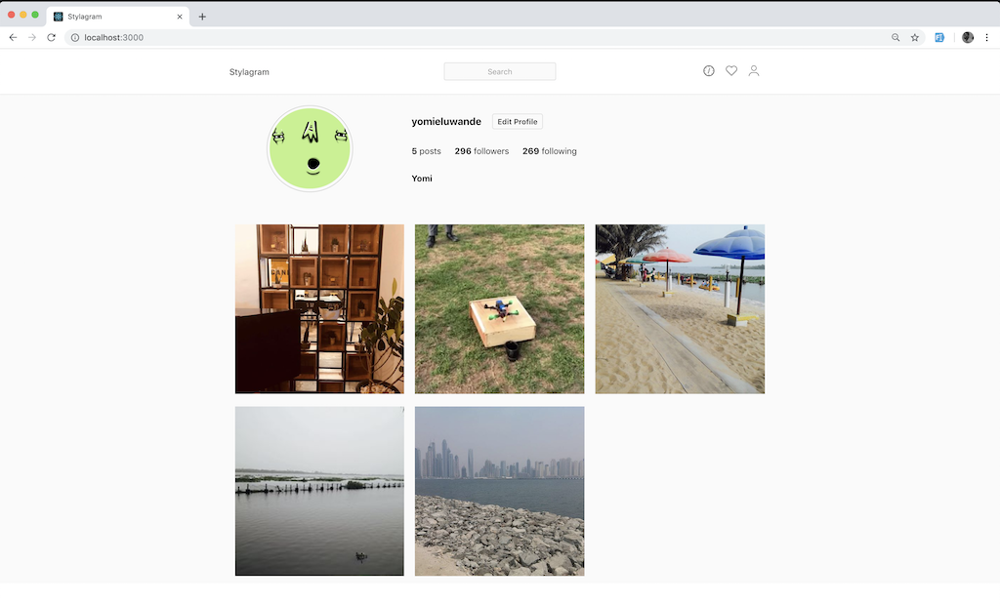

<Sponsorship />

So much has been said about the appropriate way to style modern web apps. There's the general and oldest method of styling at document level - creating a `style.css` file and linking to it in the HTML file and more recently the method of styling in JS. This is popularly known as CSS-in-JS.

CSS-in-JS is a styling approach that abstracts the CSS model to the component level, rather than the document level. This is the idea that CSS can be scoped to a specific component only and as opposed to the document level. The benefits of using CSS-in-JS includes:

* **Reduce the number of HTTP requests:** CSS-in-JS would mean that we don't have to make HTTP requests to load assets and resources.
* **Styling Fragmentation:** Using CSS-in-JS means you can write styles freely without worrying about compatibility issues.

An example of the CSS-in-JS approach is [styled-components](https://www.styled-components.com). Styled Components allow you to write plain CSS in your components without worrying about class name collisions. It helps to write CSS that's scoped to a single component and does not leak to any other element in the page.

# Why Styled Components?

Styled Components enable writing of CSS in JavaScript using tagged template literals. It removes the mapping between components and styles — component is made into a low-level styling construct. Styled Components  was created because of the following reasons:

* **Automatic critical CSS**: Styled Components keeps track of which components are rendered on a page and injects their styles and nothing else, fully automatically. Combined with code splitting, this means your users load the least amount of code necessary.
* **No class name bugs**: Styled Components generates unique class names for your styles. You never have to worry about duplication, overlap or misspellings.
* **Easier deletion of CSS**: it can be hard to know whether a class name is used somewhere in your codebase. Styled Components makes it obvious, as every bit of styling is tied to a specific component. If the component is unused (which tooling can detect) and gets deleted, all its styles get deleted with it.
* **Simple dynamic styling**: adapting the styling of a component based on its props or a global theme is simple and intuitive without having to manually manage dozens of classes.
* **Painless maintenance**: you never have to hunt across different files to find the styling affecting your component, so maintenance is a piece of cake no matter how big your codebase is.
* **Automatic vendor prefixing**: write your CSS to the current standard and let Styled Components handle the rest.

# Getting started with Styled Components

We can install Styled Components using NPM, with the command below:

```javascript
npm install styled-components
```

Styled Components utilizes tagged [template literals](https://developer.mozilla.org/en-US/docs/Web/JavaScript/Reference/Template_literals) to style your components. It removes the mapping between components and styles. This means that when you're defining your styles, you're actually creating a normal React component, that has your styles attached to it.

With the installation done, let's go ahead to create our first Styled Component. We'll be creating a reusable `Button` component styled with Styled Components:

```javascript
import React from 'react';
import styled from 'styled-components';

const Button = styled.button`
  cursor: pointer;
  background: transparent;
  font-size: 16px;
  border-radius: 3px;
  color: palevioletred;
  border: 2px solid palevioletred;
  margin: 0 1em;
  padding: 0.25em 1em;
  transition: 0.5s all ease-out;

  &:hover {
    background-color: palevioletred;
    color: white;
  }
`;

function App() {
  return (
    <div>
      <h1>Hello CodeSandbox</h1>
      <h2>Start editing to see some magic happen!</h2>
      <Button>I am a Button</Button>
    </div>
  );
}

export default App;
```

In the code block above, the `Button` variable created here is a React component that can be used in the function component. The variable is assigned to `styled.button` which features a backtick syntax, in which you can write the actual CSS.

As you can see, Styled Components allows you to write CSS just the way you'd write in your normal `style.css` document and even use pseudo-selectors like `:hover`.

Because React apps work a lot with state, Styled Components also allows you to dynamically set CSS properties [using props](https://www.robinwieruch.de/react-pass-props-to-component/). You can pass a function to your style declarations, with one parameter, being the component’s `prop` value. You can then use `props` to adjust your styling as seen the `Button` example below:

```javascript{9,10,11,18,19}
import React from 'react';
import styled from 'styled-components';

const Button = styled.button`
  cursor: pointer;
  background: transparent;
  font-size: 16px;
  border-radius: 3px;
  color: ${props => (props.primary ? 'violet' : 'palevioletred')};
  border: ${props =>
    props.primary ? '2px solid violet' : '2px solid palevioletred'};
  margin: 0 1em;
  padding: 0.25em 1em;
  transition: 0.5s all ease-out;

  &:hover {
    color: white;
    background-color: ${props =>
      props.primary ? 'violet' : 'palevioletred'};
  }
`;

function App() {
  return (
    <div>
      <h1>Hello CodeSandbox</h1>
      <h2>Start editing to see some magic happen!</h2>
      <Button>I am a Button</Button>
      <Button primary>I am a Primary Button</Button>
    </div>
  );
}

export default App;
```

In the example, the `Button` component changes the `color`, `border`, and `background-color` based on the props passed, in this case the `primary` prop. We are using an arrow function that is passing in props and checking to see if the prop `primary` is present. If it is, then we are telling JavaScript to render out the CSS style enclosed in additional double back-ticks.

To further understand Styled Components, we'll be using it to build an app, a clone of the popular image sharing app, Instagram.

# Build an Instagram clone with Styled Components

The goal is to build an Instagram clone and here's a screenshot of what the app will look like below:



To get started, we'll need to create a React app and that can be done easily using the [create-react-app](https://github.com/facebook/create-react-app) CLI package. The `create-react-app` CLI package enables creating React apps easily with no build configuration. The CLI can be used as seen below. This command creates a React app in a folder named `stylagram`:

```javascript
create-react-app stylagram
```

In order to build this app, we'll be dividing this app into different components:

* Header Component
* Profile Component
* Image Component

We'll first build out these components individually and then bring everything together at the end.

## Creating the Header Component

To create the header component, create a file titled `Header.js` in the `src/components/` folder. You can then edit with the code below:

```javascript
// Header.js
import React from 'react';
import styled from 'styled-components';
import { ReactComponent as Explore } from '../explore.svg';
import { ReactComponent as Avatar } from '../avatar.svg';
import { ReactComponent as Compass } from '../compass.svg';

const Nav = styled.div`
  background-color: #fff;
  border-bottom: 1px solid rgba(0, 0, 0, 0.0975);
`;

const NavHeader = styled.div`
  max-width: 1010px;
  padding: 26px 20px;
  width: 100%;
  display: flex;
  align-items: center;
  margin: 0 auto;
`;

const NavLeft = styled.div`
  width: 33.333%;
  text-align: left;
`;

const NavCenter = styled.div`
  width: 33.333%;
  text-align: center;
`;

const Input = styled.input`
  font-size: 16px;
  border: solid 1px #dbdbdb;
  border-radius: 3px;
  color: #262626;
  padding: 7px 33px;
  border-radius: 3px;
  color: #999;
  cursor: text;
  font-size: 14px;
  font-weight: 300;
  text-align: center;
  background: #fafafa;

  &:active,
  &:focus {
    text-align: left;
  }
`;

const NavRight = styled.div`
  width: 33.333%;
  text-align: right;

  svg {
    margin-right: 20px;
  }
`;

const MenuLink = styled.a``;

function Header() {
  return (
    <Nav>
      <NavHeader>
        <NavLeft>Stylagram</NavLeft>

        <NavCenter>
          <Input type="text" placeholder="Search" />
        </NavCenter>

        <NavRight>
          <MenuLink href="#">
            <Compass />
          </MenuLink>

          <MenuLink href="#">
            <Explore />
          </MenuLink>

          <MenuLink href="#">
            <Avatar />
          </MenuLink>
        </NavRight>
      </NavHeader>
    </Nav>
  );
}

export default Header;
```

Our `Header` component is a navigation bar that's split into three sections; the logo which is at the far left, the search bar which is in the middle and the icons which are situated to the far right.

As seen in the code block above, various components styled with Styled Components are created and used to build the navigation bar. It's also interesting to note that Styled Components also supports nesting of CSS as seen in the `Input` component.

```javascript
const Input = styled.input`
  font-size: 16px;
  border: solid 1px #dbdbdb;
  border-radius: 3px;
  color: #262626;

  padding: 7px 33px;
  border-radius: 3px;
  color: #999;
  cursor: text;
  font-size: 14px;
  font-weight: 300;
  text-align: center;
  background: #fafafa;

  &:active,
  &:focus {
    text-align: left;
  }
`
```

As seen above, pseudo-selectors and pseudo-elements are well handled in Styled Components and pretty much everything that can be done in traditional CSS can be done in Styled Components.

## Creating the Profile Component

To create the header component, create a file titled `Profile.js` in the `src/components/` folder. You can then edit with the code below.

```javascript
// Profile.js
import React from 'react';
import styled from 'styled-components';
import SingleImage from './Image.js';

const feedsource = [
  {
    source:
      'https://scontent-lhr3-1.cdninstagram.com/vp/ea6621cf5f948bd2eaf5bebfcfcde5d1/5D1B1250/t51.2885-15/e35/c0.135.1080.1080/s480x480/31819148_387652391751516_4869384593058299904_n.jpg?_nc_ht=scontent-lhr3-1.cdninstagram.com',
    likes: '43',
    comments: '3',
    isVideo: false,
    id: 0,
  },
  {
    source:
      'https://scontent-lhr3-1.cdninstagram.com/vp/f14456c901b071f5367c4a6032ec48b6/5C900EF8/t51.2885-15/e15/s320x320/14240675_192169101203223_495226036_n.jpg?_nc_ht=scontent-lhr3-1.cdninstagram.com',
    likes: '313',
    comments: '10',
    isVideo: true,
    id: 1,
  },
  {
    source:
      'https://scontent-lhr3-1.cdninstagram.com/vp/9e4e0f7667fe733406f88b9f86bdf84a/5D19E7B2/t51.2885-15/e35/s480x480/14262723_1219537941422458_2127857940_n.jpg?_nc_ht=scontent-lhr3-1.cdninstagram.com',
    likes: '29',
    comments: '2',
    isVideo: false,
    id: 2,
  },
  {
    source:
      'https://scontent-lhr3-1.cdninstagram.com/vp/3c9520014265a02a446841b20c529066/5D188BE1/t51.2885-15/e35/c135.0.810.810/s240x240/14294939_1218250054909378_1762757626_n.jpg?_nc_ht=scontent-lhr3-1.cdninstagram.com',
    likes: '18',
    comments: '2',
    isVideo: false,
    id: 3,
  },
  {
    source:
      'https://scontent-lhr3-1.cdninstagram.com/vp/34afcdf7b06fc1f4a6b1a0e7985ebe1a/5D24FDF9/t51.2885-15/e35/c135.0.810.810/s480x480/14240669_1005823466206583_2103344102_n.jpg?_nc_ht=scontent-lhr3-1.cdninstagram.com',
    likes: '30',
    comments: '4',
    isVideo: false,
    id: 4,
  },
];

const ProfileContainer = styled.div`
  max-width: 1010px;
  width: 100%;
  margin: 20px auto;
`;

const ProfileDetails = styled.div`
  display: flex;
`;

const ProfileDetailsLeft = styled.div`
  margin-right: 40px;
  width: 300px;
  display: flex;
  align-items: center;
  justify-content: center;
`;

const ProfileDetailsRight = styled.div`
  display: flex;
  align-items: end;
  justify-content: center;
  flex-direction: column;
`;

const ProfileImage = styled.img`
  border-radius: 50%;
  width: 150px;
  border: 1px solid #ccc;
  padding: 5px;
`;

const ProfileDetailsUsername = styled.div`
  display: flex;
  align-items: center;
  justify-content: center;
`;

const EditProfileButton = styled.div`
  background-color: transparent;
  border: 1px solid #dbdbdb;
  color: #262626;
  border-radius: 4px;
  cursor: pointer;
  font-weight: 600;
  padding: 5px 9px;
  text-transform: capitalize;
  font-size: 14px;
  margin-left: 20px;
`;

const HeadingThreeText = styled.h3``;

const ParagraphText = styled.p`
  margin-right: 25px;
`;

const ProfileDetailsMeta = styled.div`
  display: flex;
  justify-content: center;
`;

const ProfileDetailsName = styled.div`
  text-align: left;
`;

const ImagesWrapper = styled.div`
  margin-top: 50px;
  display: flex;
  flex-wrap: wrap;
`;

function Profile() {
  return (
    <ProfileContainer>
      <ProfileDetails>
        <ProfileDetailsLeft>
          <ProfileImage src="https://api.adorable.io/avatars/285/abott@adorable.png" />
        </ProfileDetailsLeft>

        <ProfileDetailsRight>
          <ProfileDetailsUsername>
            <HeadingThreeText>yomieluwande</HeadingThreeText>
            <EditProfileButton>Edit profile</EditProfileButton>
          </ProfileDetailsUsername>

          <ProfileDetailsMeta>
            <ParagraphText>
              <strong>5</strong> posts
            </ParagraphText>
            <ParagraphText>
              <strong>296</strong> followers
            </ParagraphText>
            <ParagraphText>
              <strong>269</strong> following
            </ParagraphText>
          </ProfileDetailsMeta>

          <ProfileDetailsName>
            <ParagraphText>
              <strong>Yomi</strong>
            </ParagraphText>
          </ProfileDetailsName>
        </ProfileDetailsRight>
      </ProfileDetails>

      <ImagesWrapper>
        {feedsource.map(item => (
          <SingleImage image={item} key={item.id} />
        ))}
      </ImagesWrapper>
    </ProfileContainer>
  );
}

export default Profile;
```

In the code block above, just like the `Header.js` component, we create various styled components that are used to build the Profile component. The `styled` variable contains many functions representing all known HTML elements, this allows us to style heading tags, img tags e.t.c as seen in the code block above.

Also, a `feedSource` array is created, this contains objects of data that will be used to display feed images just like Instagram. The source links are actually linked to my personal Instagram images.

We use the `SingleImage` component to display the pictures in the `feedSource` array. The array is iterated through using the `.map` function and then data is fed to the `SingleImage` component as props.

## Creating the Image Component

To create the header component, create a file titled `Image.js` in the `src/components/` folder. You can then edit with the code below.

```javascript
// Image.js
import React from 'react';
import styled from 'styled-components';
import { ReactComponent as Comment } from '../comment.svg';
import { ReactComponent as Play } from '../play.svg';
import { ReactComponent as Heart } from '../heart.svg';

const ImgContainer = styled.div`
  position: relative;
  flex-basis: 100%;
  flex-basis: calc(33.333% - 20px);
  margin: 10px;
  cursor: pointer;
  transition: 0.5s all ease-in;
`;

const ImgIcons = styled.div`
  display: flex;
  align-items: center;
  justify-content: center;
  color: #ffffff;
  margin-right: 20px;

  svg {
    margin-right: 10px;
  }
`;

const ImgMeta = styled.div`
  display: none;
  align-items: center;
  justify-content: center;
  position: absolute;
  background-color: rgba(0, 0, 0, 0.5);
  top: 0;
  right: 0;
  bottom: 0;
  left: 0;

  ${ImgContainer}:hover & {
    display: flex !important;
  }
`;

const Img = styled.img`
  cursor: pointer;
  width: 100%;
`;

function Image({ image }) {
  return (
    <ImgContainer>
      
      <ImgMeta>
        <ImgIcons>
          {image.isVideo ? <Play /> : <Heart />} {image.likes}
        </ImgIcons>
        <ImgIcons>
          <Comment /> {image.comments}
        </ImgIcons>
      </ImgMeta>
    </ImgContainer>
  );
}

export default Image;
```

In the code block above, the `Image` function component accepts a prop. That prop is then used in the component itself. The `Img` component which is an HTML img element styled variable accepts a `src` attribute which is set to the `source` value.

If you hover on an Instagram image, you get to see the number of likes, number of comments if it's an image, and number of plays if it's a video. We'll also be replicating that on our version of the Instagram app.

There are icons that are displayed in the `ImgIcons` component when the image is hovered on (we'll see how that's handled later on). One of the `Play` and `Heart` icons are displayed conditionally based on if the `image.isVideo` value is true or false.

As mentioned above, we'll like to see the number of engagements a particular image or video has when hovered on. This is implemented using CSS and by adding an overlay over the image and then showing the likes/views and comments count. Something like the code block below:

```html
<div class="imageContainer">
  
  <div class="imgageOverlay"></div>
</div>
```

```css
.imageContainer {
  position: relative;
}

.imageSource {
  width: 400px;
  height: 400px;
}

.imageContainer:hover {
  .imgageOverlay {
    display: block;
  }
}

.imageOverlay {
  display: none;
  background-color: rgba(0, 0, 0, 0.7);
  top: 0;
  bottom: 0;
  right: 0;
  left: 0;
  position: absolute;
}
```

In the code block above, the `imageContainer  ` div is a parent div and it contains two child divs. When the `imageContainer` div is hovered on, the `display` value for the `imageOverlay` div is set to `block` thereby creating the dark overlay over the image.

In Styled Components, this can be done by referring to another component within a component. This is known as the "component selector" pattern. Whenever a component is created or wrapped by the `styled()` factory function, it is also assigned a stable CSS class for use in targeting.

As seen in the code snippet above, the `Image.js` component, the component selector pattern is used like so:

```javascript
const ImgContainer = styled.div`
  position: relative;
  flex-basis: 100%;
  flex-basis: calc(33.333% - 20px);
  margin: 10px;
  cursor: pointer;
  transition: .5s all ease-in;
`

const ImgMeta = styled.div`
  display: none;
  align-items: center;
  justify-content: center;
  position: absolute;
  background-color: rgba(0, 0, 0, .5);
  top: 0;
  right: 0;
  bottom: 0;
  left: 0;

  ${ImgContainer}:hover & {
    display: flex !important;
  }
`
```

`ImgMeta` component has a `display` value of `none` and this only changes to `flex` when the parent component `ImgContainer` is hovered on.

One gotcha for the pattern above is that the styled component been selected needs to have been created before being used in another component. For example, the `ImgContainer` component was created before being used in the `ImgMeta` component.

## Global Styles

There are cases in which we need to set some styles that apply to every section of the React app. A file like `index.css` in the `src` folder should be able to handle this. However, we can go a step further by writing those global styles with Styled Components.

To do that, create a file called `globalStyle.js` in the newly created `src/theme` folder.

```javascript
// globalStyle.js
import { createGlobalStyle } from 'styled-components';

const GlobalStyle = createGlobalStyle`
  body {
    margin: 0;
    padding: 0;
    font-family: -apple-system, BlinkMacSystemFont, "Segoe UI", "Roboto", "Oxygen",
      "Ubuntu", "Cantarell", "Fira Sans", "Droid Sans", "Helvetica Neue",
      sans-serif;
    -webkit-font-smoothing: antialiased;
    -moz-osx-font-smoothing: grayscale;
  }

  code {
    font-family: source-code-pro, Menlo, Monaco, Consolas, "Courier New",
      monospace;
  }
`;

export default GlobalStyle;
```

With the file created, you can go ahead to copy the code block above into it. To start with, the [createGlobalStyle](https://www.styled-components.com/docs/api#createglobalstyle) function is imported from Styled Components. It is a helper function to generate a special StyledComponent that handles global styles.

With the above done, you can go ahead to place it at the top of your React tree and the global styles will be injected when the component is "rendered".

```javascript
// App.js
import React, { Fragment } from 'react';
import styled from 'styled-components';
import Header from './components/Header.js';
import Profile from './components/Profile.js';
import GlobalStyle from './theme/globalStyle';

const AppWrapper = styled.div`
  background-color: #fafafa;
`;

function App() {
  return (
    <Fragment>
      <GlobalStyle />
      <AppWrapper>
        <Header />

        <Profile />
      </AppWrapper>
    </Fragment>
  );
}

export default App;
```

## Extending Styled Components

Styled Components supports extending style. This means styles can be inherited to a new component based on the previous styled component and extend it with some new styles.

In the example above, we used a `Button` component created in the above and passed it to the `styled()` constructor to create a new button with extending styles:

```javascript
import React from 'react';
import styled from 'styled-components';

const Button = styled.button`
  cursor: pointer;
  background: transparent;
  font-size: 16px;
  border-radius: 3px;
  color: palevioletred;
  color: ${props => (props.primary ? 'violet' : 'palevioletred')};
  border: ${props =>
    props.primary ? '2px solid violet' : '2px solid palevioletred'};
  margin: 0 1em;
  padding: 0.25em 1em;
  transition: 0.5s all ease-out;

  &:hover {
    color: white;
    background-color: ${props =>
      props.primary ? 'violet' : 'palevioletred'};
  }
`;

const GreenButton = styled(Button)`
  background-color: white;
  color: green;
  border-color: green;
`;

function App() {
  return (
    <div>
      <h1>Hello CodeSandbox</h1>
      <h2>Start editing to see some magic happen!</h2>
      <Button>I am a Button</Button>
      <Button primary>I am a Primary Button</Button>
      <GreenButton primary>I am a Primary Button</GreenButton>
    </div>
  );
}

export default App;
```

You can find out more about extending styles in the Styled Components [documentation](https://www.styled-components.com/docs/basics#extending-styles).

## Reusable CSS in Styled Components

Styled Components also supports the use of easily reusing CSS in other components. It does with a helper function called `css` which is imported from styled-components package as seen below. The helper function is used to generate CSS from a template literal with interpolations.

```javascript
import styled, { css } from 'styled-components';

const complexMixin = css`
  color: ${props => (props.whiteColor ? 'white' : 'black')};
`;

// This is an example of a nested interpolation
const StyledComp = styled.div`
  ${props => (props.complex ? complexMixin : 'color: blue;')};
`;
```

In the code block above, if there's a prop value of `complex` the `complexMixin` styles will be applied to the `StyledComp` component.

The `css` helper function also allows the generation of valid CSS using template literals within interpolations, meaning it is used to generate CSS using when inside `${}` wrapped inside another template literal string.

```javascript
import styled, { css } from 'styled-components'

const Button = styled.button`
  cursor: pointer;
  background: transparent;
  font-size: 16px;
  border-radius: 3px;
  color: palevioletred;
  margin: 0 1em;
  padding: 0.25em 1em;
  transition: 0.5s all ease-out;

  ${props => props.primary &&
    css`
    background-color: white;
      color: green;
      border-color: green;
  `};
`;
```

In the code block above, the styles defined in the `css` helper function will only be applied if a prop of primary is present. You can find out more about the `css` helper function in the [Styled Components documentation](https://www.styled-components.com/docs/api#css).

## Theming in Styled Components

Styled Components has full theming support by exporting a `<ThemeProvider>` wrapper component. The `ThemeProvider` wrapper component accepts a `theme` props and provides a theme to all React components underneath itself via the context API.

This means that all Styled Components will have access to the provided theme, even when they are multiple levels deep.

```javascript
import React from 'react';
import styled, { ThemeProvider } from 'styled-components';

// Define our button, but with the use of props.theme this time
const Button = styled.button`
  font-size: 1em;
  margin: 1em;
  padding: 0.25em 1em;
  border-radius: 3px;

  color: ${props => props.theme.main};
  border: 2px solid ${props => props.theme.main};
`;

// We are passing a default theme for Buttons that aren't wrapped in the ThemeProvider
Button.defaultProps = {
  theme: {
    main: 'palevioletred',
  },
};

// Define what props.theme will look like
const themeSettings = {
  main: 'mediumseagreen',
};

function App() {
  return (
    <div>
      <Button>Normal</Button>

      <ThemeProvider theme={themeSettings}>
        <Button>Themed</Button>
      </ThemeProvider>
    </div>
  );
}

export default App;
```

In the example above, we create a `Button` component that accepts props for dynamic styles, in this case, a `theme` prop. The Button component also has a default theme setting for whenever a `theme` prop is not passed.

In the return statement of the function, there are two variations of the Button, one as a standalone button and one that's wrapped in a `ThemeProvider` component. In the `ThemeProvider` component, we pass `themeSettings` as a prop and what that means is that the second button will get the CSS styles defined in the `themeSettings` object. You can find out more about theming in the [Styled Components documentation](https://www.styled-components.com/docs/advanced#theming).

<Divider />

Styled Components allow you to do so much more and we've only scratched the surface in this tutorial. We just built a simple application (an Instagram clone) which gave us the overview of the Styled Components. You can read more about Styled Components in their [official documentation](https://github.com/styled-components/styled-components). The codebase for the Stylagram app can be seen on GitHub [here](https://github.com/yomete/stylagram). If you've used Styled Components in your project before, you can write about your experience so far and reviews below.

<ReadMore label="Alternative to Styled Components: CSS Modules" link="https://www.robinwieruch.de/react-css-modules" />