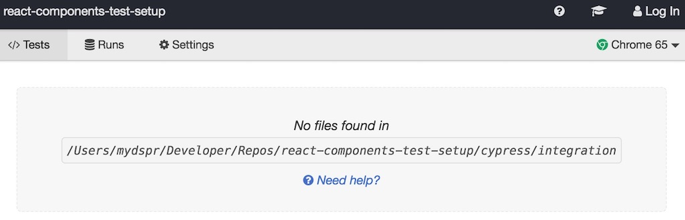
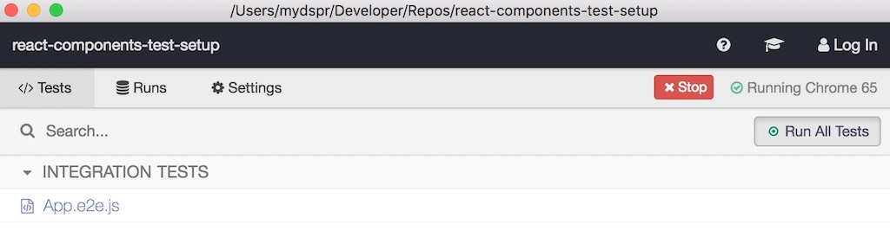

<Sponsorship />

<LinkCollection label="This tutorial is part 3 of 3 in the series." links={[{ prefix: "Part 1:", label: "How to set up React with Webpack and Babel", url: "/minimal-react-webpack-babel-setup/" }, { prefix: "Part 2:", label: "How to test React components with Jest", url: "/react-testing-jest" }]} />

End-to-end testing (E2E) was always a tedious task with testing frameworks from the past. However, nowadays many people are using [Cypress.io](https://cypress.io) for it. Their documentation has a high quality and their API is concise and clean. Let's use Cypress for this React testing tutorial series. First, you have to install it on the command line to your dev dependencies:

```javascript
npm install --save-dev cypress
```

Second, create a dedicated folder for Cypress and its E2E tests in your project folder. It comes with its given [folder structure](https://docs.cypress.io/guides/core-concepts/writing-and-organizing-tests.html):

```javascript
mkdir cypress
cd cypress
mkdir integration
cd integration
```

Third, add a script for npm to your *package.json* file. That way, you are able to run Cypress easily from the command line:

```javascript{5}
{
  ...
  "scripts": {
    "start": "webpack serve --config ./webpack.config.js --mode development",
    "test:cypress": "cypress open"
  },
  ...
}
```

Afterward, run Cypress for the first time:

```javascript
npm run test:cypress
```

It opens up a window which indicates that you don't have any tests yet: "No files found in".



Now, for your new Cypress **cypress/integration/** folder, create a end-to-end testing file for your App component.

```javascript
touch cypress/integration/App.e2e.js
```

Next, add your first test to it. It's not really an end-to-end test, but only the simplest assertion you can make to verify that Cypress is working for you.

```javascript
describe('App E2E', () => {
  it('should assert that true is equal to true', () => {
    expect(true).to.equal(true);
  });
});
```

You might already know the "describe"- and "it"-blocks which enable you to encapsulate your tests in blocks. These blocks are coming from Mocha, which is used by Cypress, under the hood. The assertions such as `expect()` are used from Chai. *"Cypress builds on these [popular tools and frameworks](https://docs.cypress.io/guides/references/bundled-tools.html) that you hopefully already have some familiarity and knowledge of."*

Now you can run Cypress again on the command line:

```javascript
npm run test:cypress
```

You should see the following output now. Cypress finds your test and you can either run the single test by clicking it or run all of your tests by using their dashboard.



Run your test and verify that true is equal to true. Hopefully it turns out to be green for you. Otherwise there is something wrong. In contrast, you can checkout a failing end-to-end test too.

```javascript
describe('App E2E', () => {
  it('should assert that true is equal to true', () => {
    expect(true).to.equal(false);
  });
});
```

If you want, you can change the script slightly for Cypress to run every test by default without opening the additional window.

```javascript{5}
{
  ...
  "scripts": {
    "start": "webpack serve --config ./webpack.config.js --mode development",
    "test:cypress": "cypress run"
  },
  ...
}
```

As you can see, when you run Cypress again on the command line, all your tests should run automatically. In addition, you can experience that there is some kind of video recording happening. The videos are stored in a folder for you to experience your tests first hand. You can also add screenshot testing to your Cypress end-to-end tests. Find out more about [the video and screenshot capabilities of Cypress.io](https://docs.cypress.io/guides/guides/screenshots-and-videos.html). You can suppress the video recording in your Cypress configuration file in your project folder. It might be already generated by Cypress for you, otherwise create it on the command line from your root folder:

```javascript
touch cypress.json
```

Now, in the Cypress configuration file, add the `video` flag and set it to false.

```javascript
{
  "video": false
}
```

In case you want to find out more about the configuration capabilities of Cypress, [checkout their documentation](https://docs.cypress.io/guides/references/configuration.html).

Eventually you want to start to test your implemented React application with Cypress. Since Cypress is offering end-to-end testing, you have to start your application first before visiting the website with Cypress. You can use your local development server for this case.

But how to run your development server, in this case webpack-dev-server, before your Cypress script? There exists a [neat library](https://github.com/bahmutov/start-server-and-test) which you can use to start your development server before Cypress. First, install it on the command line for your dev dependencies:

```javascript
npm install --save-dev start-server-and-test
```

Second, add it to your *package.json* file's npm scripts. The library expects the following script pattern: `<start script name> <url> <test script name>`.

```javascript{5,6}
{
  ...
  "scripts": {
    "start": "webpack serve --config ./webpack.config.js --mode development",
    "test:cypress": "start-server-and-test start http://localhost:8080 cypress",
    "cypress": "cypress run"
  },
  ...
}
```

Finally, you can visit your running application with Cypress in your end-to-end test. Therefore you will use the global `cy` cypress object. In addition, you can also add your first E2E test which verifies your header tag (h1) from your application.

```javascript{2,3,4,5,6,7}
describe('App E2E', () => {
  it('should have a header', () => {
    cy.visit('http://localhost:8080');

    cy.get('h1')
      .should('have.text', 'My Counter');
  });
});
```

Basically, that's how a selector and assertion in Cypress work. Now run your test again on the command line. It should turn out to be successful.

A best practice in Cypress testing is adding the base URL to your **cypress.json** configuration file. It's not only to keep your code DRY, but has also performance impacts.

```javascript
{
  "video": false,
  "baseUrl": "http://localhost:8080"
}
```

Afterward, you can remove the URL from your single E2E test. It always takes the given base URL now.

```javascript{3}
describe('App E2E', () => {
  it('should have a header', () => {
    cy.visit(‘/‘);

    cy.get('h1')
      .should('have.text', 'My Counter');
  });
});
```

The second E2E test you are going to implement will test the two interactive buttons in your React application. After clicking each button, the counter integer which is shown in the paragraph tag should change. Let's begin by verifying that the counter is 0 when the application just started.

```javascript{9,10,11,12,13,14}
describe('App E2E', () => {
  it('should have a header', () => {
    cy.visit('/');

    cy.get('h1')
      .should('have.text', 'My Counter');
  });

  it('should increment and decrement the counter', () => {
    cy.visit('/');

    cy.get('p')
      .should('have.text', '0');
  });
});
```

Now, by [interacting with the buttons](https://docs.cypress.io/guides/core-concepts/interacting-with-elements.html), you can increment and decrement the counter.

```javascript{15,16,17,18,19,20,21,22,23,24,25}
describe('App E2E', () => {
  it('should have a header', () => {
    cy.visit('/');

    cy.get('h1')
      .should('have.text', 'My Counter');
  });

  it('should increment and decrement the counter', () => {
    cy.visit('/');

    cy.get('p')
      .should('have.text', '0');

    cy.contains('Increment').click();
    cy.get('p')
      .should('have.text', '1');

    cy.contains('Increment').click();
    cy.get('p')
      .should('have.text', '2');

    cy.contains('Decrement').click();
    cy.get('p')
      .should('have.text', '1');
  });
});
```

That's it. You have written your first two E2E tests with Cypress. You can navigate from URL to URL, interact with HTML elements and verify rendered output. Two more things:

* If you need to provide sample data for your E2E tests, checkout the best practice of using fixtures in Cypress.
* If you need to spy, stub or mock functions in Cypress, you can use Sinon for it. Cypress comes with built-in Sinon to test your asynchronous code.

<ReadMore label="Test Coverage in JavaScript" link="/javascript-test-coverage" />

<ReadMore label="How to test React components with Jest & Enzyme" link="/react-testing-jest-enzyme" />
