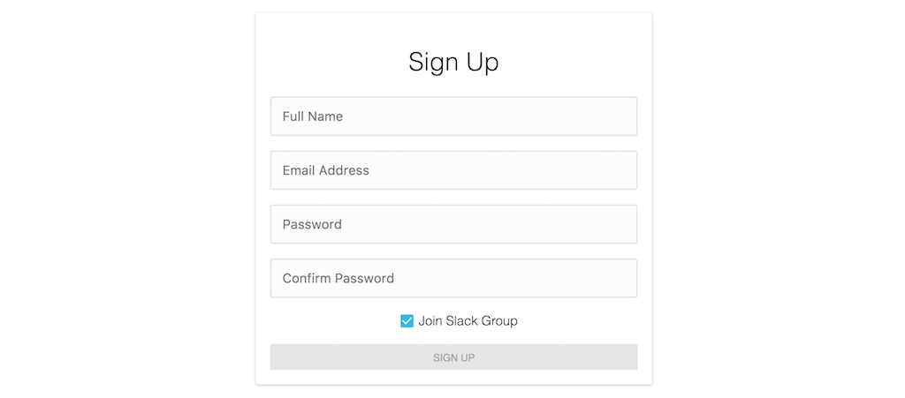

<Sponsorship />

The article showcases how to setup an automated Slack invitation for a JavaScript and/or React application. Why would you want an automated Slack invitation in the first place? My personal motivation was it to create a like minded community of people learning React, but the idea about a Slack Channel started out on Twitter.

Sometimes people approach people when they face problems implementing their application or seek for advice about it. Since I write and tweet about JavaScript and React, I had a couple of these conversations too. For a while I managed to help out individuals, but it didn't scale well. It would be a full-time job at some point and it is sad that all this knowledge gets lost because it is only discussed by two people. That's why I decided to open up a [React Slack Channel](https://slack-the-road-to-learn-react.wieruch.com/) to help people learn React.js. It is so much more valuable to share these discussions in a group of people. This way, more people are able to help and more people can learn from it.

The same React Slack Group is used for my [React courses](https://roadtoreact.com/). People can join the group when they face problems or want to help out others. It is one crucial part of [my own course platform](/how-to-build-your-own-course-platform/) to grow a community of like minded people. The automated invitation for the Slack Group is powered by the [slack-invite-automation](https://github.com/outsideris/slack-invite-automation) open source project and runs on one of my [Dokku instances](/deploy-applications-digital-ocean/).

However, that's not all to the story. Afterward, I wanted to be able to invite users programmatically to the Slack Group when they participated in one of my courses. During the sign up process, people can tick a checkbox to get an automated Slack invite. Since then the participation rate in the Slack Group went up. Now the Slack Group invitation is fully automated. People can visit an external website to request access or opt-in on the course platform to get their invite to Slack.

The following article will guide you through the process of setting up an automated Slack invitation for your community. It guides you briefly through the process of setting up a Slack App. Furthermore, it shows you how to use the programmatic Slack API in your own JavaScript and/or React application.

# Create a Slack Application

I don't want to replicate too much of the official instructions about creating an App on the Slack platform, because they could go out of sync at some point. But basically you have to create a new [Slack App](https://api.slack.com/apps). In the process, you have to add the "admin" permission to your application. Afterward you can finish the process by installing the Slack App and visiting a specific URL to authorize it. Personally, I followed [these instructions](https://github.com/outsideris/slack-invite-automation) to setup an external Slack invitation website. It demonstrates the walkthrough with a couple of screenshots too. Afterward, you would already have an externally running website to invite users to your Slack Channel. You don't need to use it though and the installed Slack App will suffice to invite users programmatically to your Slack Group.

# Programmatic Slack Invitation in JavaScript

After you have setup your Slack App, you can invite people to your Slack Group programmatically by using the provided Slack token. Slack has a bunch of API endpoints, but not all of them are officially released yet. [Slack's invite endpoint is one of these unreleased API endpoints](https://github.com/slackhq/slack-api-docs/issues/30). So be aware of changes for these endpoints at any time. However, a couple of developers have found out about Slack's API endpoints and [documented them on GitHub](https://github.com/ErikKalkoken/slackApiDoc). There is no OAuth authentication needed at this point in time of writing this article.

When you have installed your Slack App, you can invite people by email and the provided Slack token programmatically in JavaScript. In most browsers, the [native fetch API](https://developer.mozilla.org/en-US/docs/Web/API/Fetch_API) is supported. But you can use any other library (axios, superagent, request, jQuery) to make the request. In a node.js application, you would use a library to perform the Slack invite. In the following example axios is used to perform the invite:

```javascript
import axios from 'axios';

var SLACK_TOKEN = 'my-slack-token-xxx';
var SLACK_INVITE_ENDPOINT = 'https://slack.com/api/users.admin.invite';

function inviteSuccess() {
  console.log('success');
}

function inviteError() {
  console.log('error');
}

function inviteToSlack(email) {
  var QUERY_PARAMS = `email=${email}&token=${SLACK_TOKEN}&set_active=true`;

  axios.get(`${SLACK_INVITE_ENDPOINT}?${QUERY_PARAMS}`)
    .then(inviteSuccess)
    .catch(inviteError);
}
```

That's it. If you have provided a valid email and Slack token, the user using the endpoint should have a Slack invitation.

# Slack Invitation in React

For my course platform, I do the same programmatic Slack invite in a React application. Students can opt-in for the Slack invite on the Sign Up page. It makes it effortless for them to participate rather than going on an external website to request a Slack invite.



The form for the React Sign Up component doesn't become anymore complex by adding the Slack invitation to it. The following is a sign up form where the Slack invite is added on top. Before the `onUserAuthSignUp()` function is called to authenticate an user, the user gets invited to the Slack Group when the checkbox for the invitation was checked.

```javascript{10,14,17,18,19,28,33,34,35,46,75,76,77,78,79,80,81,82}
class SignUp extends Component {
  constructor(props) {
    super(props);

    this.state = {
      email: '',
      passwordOne: '',
      passwordTwo: '',
      username: '',
      isSlackInvite: true,
    };

    this.onSubmit = this.onSubmit.bind(this);
    this.onCheckSlackInvite = this.onCheckSlackInvite.bind(this);
  }

  onCheckSlackInvite(e) {
    this.setState(prevState => ({ isSlackInvite: !prevState.isSlackInvite }));
  }

  onSubmit(e) {
    e.preventDefault();

    const {
      email,
      passwordOne,
      username,
      isSlackInvite,
    } = this.state;

    const { onUserAuthSignUp } = this.props;

    if (isSlackInvite) {
      inviteToSlack(email);
    }

    onUserAuthSignUp(email, passwordOne, username);
  }

  render() {
    const {
      email,
      passwordOne,
      passwordTwo,
      username,
      isSlackInvite,
    } = this.state;

    return (
      <form onSubmit={this.onSubmit}>
        <input
          type="text"
          placeholder="Full Name"
          value={username}
          onChange={e => this.setState({ username: e.target.value})}
        />
        <input
          type="text"
          placeholder="Email Address"
          value={email}
          onChange={e => this.setState({ email: e.target.value})}
        />
        <input
          type="password"
          placeholder="Password"
          value={passwordOne}
          onChange={e => this.setState({ passwordOne: e.target.value})}
        />
        <input
          type="password"
          placeholder="Confirm Password"
          value={passwordTwo}
          onChange={e => this.setState({ passwordTwo: e.target.value})}
        />

        <div>
          <label>Join Slack Group</label>
          <input
            type="checkbox"
            checked={isSlackInvite}
            onChange={this.onCheckSlackInvite}
          />
        </div>

        <button
          disabled={passwordOne !== passwordTwo || passwordOne === '' || username === ''}
          type="submit"
        >
          Sign Up
        </button>
      </form>
    );
  }
}
```

This tutorial doesn't go into detail on how to implement this sign up process itself. The last code snippet only shows how the Slack invite can be used as opt-in in your sign up process. If you are curious about implementing a whole authentication flow in React (with sign up where you can opt-in the Slack invite), checkout the [complete Firebase in React authentication tutorial](/complete-firebase-authentication-react-tutorial/).

That's it. Since I have made it effortless for people to join the Slack Group to learn React, the rate of people joining the Slack Channel went up. If you are curious about React, [you can join as well](https://slack-the-road-to-learn-react.wieruch.com/)!

<Divider />

Hopefully the article gave you a couple of insights on how to use Slack in a programmatic way in JavaScript and React to automate your member invitation for your Slack Group. My own experiences have shown me that it helps a lot to grow a community of like minded people around a certain topic.
