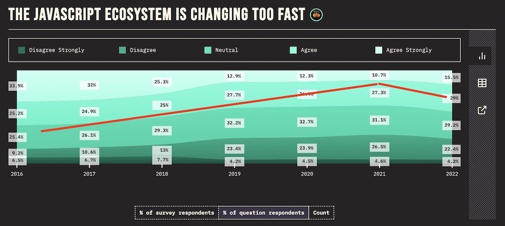
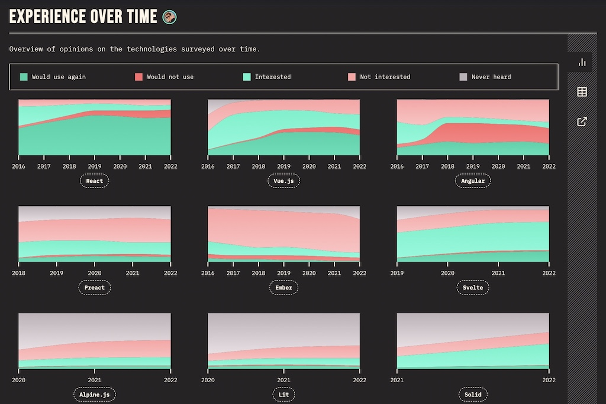
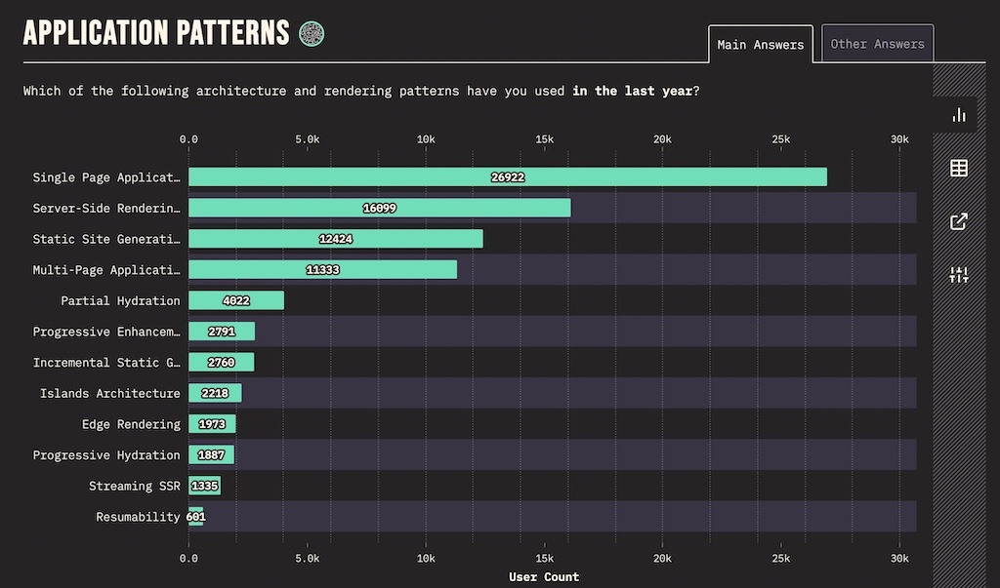
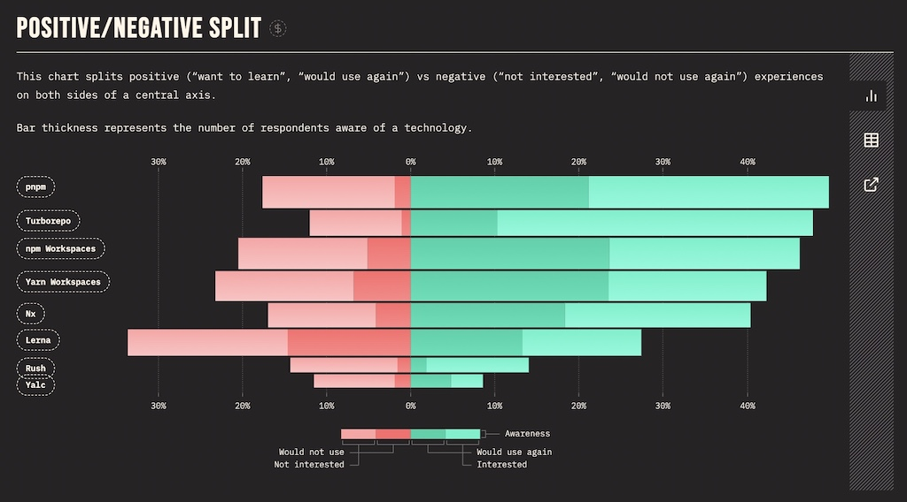

<Sponsorship />

While, in my personal opinion, the web development landscape slowed down for a few years (2016 - 2021), it started to gain lots of traction just last year (also see [State of JS](https://2022.stateofjs.com/) where the images for this article are taken from). In this article, I want to point out new web development trends that I have seen, which are certainly trends which I expect to continue sparking interest among web developers, and which I am excited about for the next year. Let's get right into them ...

# (Meta) Frameworks

Single-page applications (SPAs) and their respective frameworks (e.g. React.js, Vue.js, Svelte.js) have been through more or less hype cycles and have been around for years now. However, with the rise of meta frameworks on top these solutions, we can see a clear trend with applications shifting from client-side (CSR) to server-side rendering (SSR). SSR is all over the place when working with JavaScript frameworks these days.

The most popular meta framework called [Next.js](https://nextjs.org/) comes on top of React.js. Andrew Clark, core React developer, went so far calling it ["the real React 18 release"](https://twitter.com/acdlite/status/1549853625673023488) in 2022, because it comes with all the batteries (e.g. Suspense, streaming SSR) included that the React team provides as fundamental building blocks on a lower level of the library. Both, Vercel (the company behind Next.js) and the React.js core team are working closely together delivering a great developer experience.

While many developers eyeball the close relationship between Next.js and React.js with a concerned stance, there are alternatives for React.js like [Remix](https://remix.run/) (recently acquired by Shopify) out there. Remix takes a different approach on turning React.js into a meta framework (e.g. using web standards as first-class citizen), but there are also features that converge (e.g. nested routing) between both frameworks due to their competition.

Even though Next.js is already an established contender in the modern SSR space, and turned many frontend developers naturally into full-stack developers, other frameworks should be on your watchlist too: [SvelteKit](https://kit.svelte.dev/) (build on [Svelte.js](https://svelte.dev/)) with its recent 1.0 release backed by Vercel and [SolidStart](https://start.solidjs.com/) (build on [Solid.js](https://www.solidjs.com/)) with its improved DX compared to React.js.

# Application and Rendering Patterns

While the last decade (2010 - 2020) has been dominated by Single-Page Applications (SPAs) with their [client-side rendering](https://www.robinwieruch.de/web-applications/) (CSR), starting from Knockout.js and Ember.js over to Angular.js, React.js and Vue.js, the last years have seen an increasing interest in server-side rendering (SSR) with meta frameworks. From the outside it seems like the cycle is closing again, because we have been using SSR with sprinkled JavaScript (e.g. jQuery, MooTools, Dojo.js) in multi-page applications (MPAs) for a long time before (2005 - 2010). However, whereas back in the time Java (e.g. JSP) or later Ruby on Rails have been used for the SSR, it's different this time because we are relying on JavaScript instead. For a few years Next.js has been the driving force behind this trend, however, other meta frameworks like SvelteKit are catching up.

SSR has been competing with static site generation (SSG) for quite a while for the perfect performance (see Next.js vs [Gatsby.js](https://www.gatsbyjs.com/)) even though both patterns serve entirely different purposes. While the latter pattern is used for static content (e.g. websites like a blog), the former is used for dynamic content (e.g. web applications). If [SEO](https://en.wikipedia.org/wiki/Search_engine_optimization) is relevant, both SSR and SSG can make sense. However, with the requirement of highly dynamic content or user-centered content with authentication, developers cannot choose SSG (once build before deploy, therefore static) and have to decide between SSR (on-demand build per request with individual data on the server) or CSR (on-demand fetching of individual data on the client) these days.

CSR, SSR, SSG are not the most recent trends for rendering techniques though. While SSR and SSG started the trend on performance optimization a few years ago, more nuanced rendering techniques like Incremental Static Regeneration (ISR) and Streaming SSR came alive. The former advances SSG, because it allows to statically rebuild a website on a per-page basis (e.g. rebuild page X every 60 seconds) instead of rebuilding the whole website. Even further, On-Demand ISR, also called On-Demand Revalidation, can be used to trigger rebuilds via an application exposed API (e.g. when CMS data updates).

Streaming SSR on the other hand optimizes the single-threaded bottleneck of server-side rendering. While common SSR has to wait on the server for the data to send the rendered content to the client at once, Streaming SSR allows developers to divide the application in chunks which can be send progressively in parallel from server to client.

Over the last years rendering patterns have been quite straightforward with SSG and SSR in SPAs/MPAs. However, more nuanced versions are trending these days. But not only ISR and SSR streaming get more relevant, but also Partial Hydration (e.g. React Server Components) which allows to hydrate only some of your components on the client, Progressive Hydration which gives more fine-grained control over the order of hydration,  Island Architectures (e.g. [Astro](https://astro.build/)) for isolated applications or components in a MPA, and using resumability instead of hydration (e.g. [Qwik](https://qwik.builder.io/)) are becoming valid approaches these days.

# Serverless at the Edge

Rendering Techniques like SSR and SSG highly correlate with the trend of serverless at the edge, because both are driven by performance with the goal of providing a seamless user experience in the browser. Essentially the urge to serve users faster websites and web applications sparked the interest to be serverless at the edge.

But let's start from the beginning: Serverless, also known as serverless functions, serverless compute (e.g. AWS Lambda) or cloud functions (e.g. Google/Firebase Cloud Functions) has been a big trend in cloud computing for several years now. While serverless still means having a running (remote) server, the developer does not have to manage the server and its associated tasks (e.g. infrastructure scaling on-demand). Instead one has to deploy a single function as a serverless function which is taken care of by the cloud provider.

Serverless functions unlocked another advantage, because instead of deploying your application server to one (or a few) data center(s), there can be dozens of them around the world. Therefore in a perfect world, serverless functions would run as close as possible to their users, because it would mean the shortest client-server roundtrip and thus an improved user experience. Deploying serverless functions as close to the user as possible coined the terms edge computing and edge functions.

Many cloud providers (e.g. Cloudflare with Cloudflare Workers, Vercel with its Edge Network, Deno with Deno Deploy) are competing in this space where everyone optimizes for the best time to interactive (TTI) experience for their end users. Edge functions are not only serving SSG/SSR content faster (because the wire to the end user is shorter), but can also cache their results closer to the user too.

But not only performance matters, even though it's the main driver, other benefits like decreasing cost come with computing on the edge too. For example, often not all data send between client and server (here edge function) needs to be computed by a main data center. In IoT, there is lots of irrelevant data (e.g. video recordings without changes per frame) send to a main data center which could simply be filtered on the edge instead. After all, edge functions are only the beginning ...

# Database Renaissance

With the advent of serverless (at the edge), databases experience a renaissance as well. With a serverless function developers quickly ran into the problem of opening up too many database connections, because there is not one server which keeps one connection open, but many serverless functions with a 1:1 connection to a database. [Connection pooling](https://en.wikipedia.org/wiki/Connection_pool) has been the solution for this problem, but either one has to take care of it oneself or has a third-party service handling it.

Popular contenders in the serverless database space are [PlanetScale](https://planetscale.com/) (MySql), [Neon](https://neon.tech/) (PostgreSQL), and [Xata](https://xata.io/) (PostgreSQL) which come with many features like database branching, schema diffing and powerful searching/analytics/insights. When it comes to serverless around the world, they provide edge caching or distributed read-only database to move your data closer to your users for minimal latency.

If the third-party service should not only distribute your database, but also your application, [Fly.io](https://fly.io/) packages everything into one platform. Which brings us beyond just databases, where lots of movement is happening too. [Railway](https://railway.app/), seen as the Heroku successor, brings everything for a Platform as a Service (PaaS) to deploy your tech stack. If you want to move one step up the service chain towards Backends as a Service (BaaS), you get an open source alternative to Firebase with [Supabase](https://supabase.com/) which comes with application/database hosting, authentication, and edge functions.

# JavaScript Runtimes

It all started when Ryan Dahl [announced](https://www.youtube.com/watch?v=ztspvPYybIY) Node.js at a conference in 2009. What started as an experiment which decoupled JavaScript from the browser and made it available on the server, became one of the biggest drivers for JavaScript's success story over the last decade. Essentially Ryan Dahl used the JavaScript Engine called V8 (implemented by the Chrome) for Node.js without the browser itself. Hence both the Chrome browser and Node.js use the same JavaScript Engine, but have their own JavaScript Runtimes (e.g. Browser APIs vs Node APIs) to interact with it.

A decade later Ryan Dahl [announced](https://www.youtube.com/watch?v=M3BM9TB-8yA) Deno as successor of Node with the promise of providing developers with a more secure and faster environment which comes with resembling browser APIs, TypeScript and a standard library out of the box. [Deno](https://deno.land/), which also runs on V8, is only one of many JavaScript Runtimes these days though.

In the competing land of edge functions, many cloud providers implement their own JavaScript Runtime (e.g. Cloudflare Workers) which optimizes for their own infrastructure (e.g. Cloudflare). Thereby also Deno's business model is becoming a cloud provider with [Deno Deploy](https://deno.com/deploy) and their just-in-time on the edge rendering SSR framework (which started as proof of concept) called [Deno Fresh](https://fresh.deno.dev/). Cloud provider independent solutions like [Bun](https://bun.sh/) (running on JavaScriptCore Engine and implemented infamously in Zig) became another viral hit in the race for the fastest JavaScript Runtime recently.

The sharp mind would see (once again) lots of fragmentation in the JavaScript landscape due to different runtimes. If things get messed up, we would end up in the same situation that we had with fragmented JavaScript support in browsers for years, but this time on the server where not all JavaScript may be supported equally across runtimes when deployed on different cloud providers. Therefore all stakeholders (e.g. Deno, Vercel, Cloudflare) joined the [WinterCG](https://wintercg.org/) to collaborate on API interoperability between their JavaScript Runtimes.

# Monorepos

In the past monorepos have mainly been used for large-scale applications where one project contains smaller projects in one version controlled repository. Each of these smaller projects can be anything from individual application (e.g. SPA, MPA) to reusable package (e.g. functions, components, services). The practice of combining projects dates back to the early 2000 when it was called a shared codebase.

However, these days monorepos are not only exclusive to large-scale applications, but also smaller companies and open source projects who would certainly benefit from them. For example, a company could have various packages in a monorepos ranging from shared UI components, a shared design system (e.g. reusable cooperate design), and commonly used utility functions for their respective domain.

These packages can be imported in various applications: the actual application (e.g. app.mywebsite.com with client-side rendering) which uses all of these shared packages, the home/product/landing page (e.g. mywebsite.com with server-side rendering or static site generation) with SEO in mind uses only the shared design system package, and the technical documentation page (e.g. docs.mywebsite.com) which uses the shared UI components and shared design system packages.

[Turborepo](https://turbo.build/) (acquired by Vercel) brought up the [monorepo hype](https://www.robinwieruch.de/javascript-monorepos/) in JavaScript/TypeScript again. Turborepo allows teams to create build pipelines for all their applications and packages within a monorepo. The eye-catcher: caching of builds within the pipeline on a local machine or in the cloud across teams. Turborepo paired with other vital monorepo tools such as npm/yarn/pnpm workspaces (dependency management) and [changesets](https://github.com/changesets/changesets) (versioning) makes this toolchain a space to watch this year.

Competitors of Turborepo are [Nx](https://nx.dev/), [Rush](https://rushjs.io/), and [Lerna](https://lerna.js.org/) (not maintained for a while, [then acquired by Nx' company Nrwl](https://blog.nrwl.io/lerna-is-dead-long-live-lerna-61259f97dbd9)).

# Utility-First CSS

Developers either love or hate it: [Tailwind CSS](https://tailwindcss.com/) is the poster child for utility-first CSS. While the one side of developers hate it for appearing verbose in their UI code, the other side of developers loves it for its great DX. As a developer, you configure it once in your project and use its pre-defined CSS right away in HTML.

This love and hate divide about utility-first CSS may come to an end with the recent rise of server-side rendering (SSR) though. For a few years CSS-in-JS solutions like [Styled Components](https://styled-components.com/) (SC) and [Emotion](https://emotion.sh/) have been the prevailing force for styling modern component-based web applications. However, if performance in the world of SSR is one of the primarily goals, CSS-in-JS comes with negative impacts: increased bundle size (SC with 12.7kB, Emotion with 7.9kB) and more importantly runtime overhead due to CSS serialization before inserting it into the DOM.

Therefore we may be seeing [developers migrating]((https://dev.to/srmagura/why-were-breaking-up-wiht-css-in-js-4g9b)) towards SSR friendlier solutions like utility-first-CSS (e.g. Tailwind CSS, [UnoCSS](https://github.com/unocss/unocss)) paired with pre-defined UI component (e.g. [DaisyUI](https://daisyui.com/components)), other equally popular alternatives like [CSS Modules](https://github.com/css-modules/css-modules), or underdogs called zero-runtime/compile-time CSS-in-JS (e.g. [vanilla-extract](https://github.com/vanilla-extract-css/vanilla-extract), [linaria](https://github.com/callstack/linaria), [astroturf](https://github.com/astroturfcss/astroturf), [compiled](https://github.com/atlassian-labs/compiled)).

# End-to-End Type Safety with TypeScript

The evolution from JavaScript to TypeScript is unstoppable. In this big migration of web development, E2E type safety for full-stack applications is certainly an important trend. The implementation of this concept stands and falls with the communication layer (API) which is required to bridge typed entities (e.g. `type User`, `type BlogPost`) from the server to the client application.

The usual suspects in web development for client-server communication are [REST](https://www.robinwieruch.de/node-express-server-rest-api/) and [GraphQL](https://graphql.org/). Both can be used with [OpenAPI](https://en.wikipedia.org/wiki/OpenAPI_Specification) for REST and [GraphQL Code Generator](https://github.com/dotansimha/graphql-code-generator) for GraphQL to generate a typed schema file for the frontend application.

However, there is a new rising star for type safe APIs called [tRPC](https://trpc.io/) which can be used as REST/GraphQL replacement. If you are working in a TypeScript monorepo where frontend and backend are sharing code, tRPC enables you to export all types from the backend to the frontend application without any intermediate generation of a typed schema. Subsequently the frontend can call the backend's API by just using typed functions which are wired by HTTP under the hood to enable the actual client-server communication. The overall trend certainly moves toward using more of these type-safe solutions for full-stack applications like tRPC, [Zod](https://zod.dev/), [Prisma](https://www.prisma.io/), and [TanStack Router](https://tanstack.com/router) which all provide type safety at the edge of an application.

# Build Tools

In React-land, [create-react-app](https://create-react-app.dev/) (CRA) dominated the landscape for a few years. It was a little revolution at its time, because beginners were given a ready-to-go React starter project without having to configure a [custom Webpack with React setup](https://www.robinwieruch.de/minimal-react-webpack-babel-setup/) anymore. However, over the last year Webpack became outdated rather quickly.

[Vite](https://vitejs.dev/) is the new kid on the block when it comes to single-page applications (SPAs), because it works with all the popular frameworks (e.g. React.js) for creating a starter project. Implemented by Evan You the creator of Vue.js, it coins itself as next generation frontend tooling. Under the hood it gains its power from [esbuild](https://esbuild.github.io/), which compared to other JavaScript bundlers is written in Go, and therefore bundles dependencies 10-100x faster than its competitors (e.g. Webpack).

While Vite's ecosystem thrives with additions like [Vitest](https://vitest.dev/) (testing alternative to Jest), other competitors like [Turbopack](https://turbo.build/pack) by Vercel emerged just recently. Turbopack is coined as the successor of Webpack, because it has been spearheaded by Tobias Koppers the creator of Webpack. Because Next.js is still using Webpack and Turbopack is developed by the same company, we can expect Next.js and Turbopack probably being a perfect match in the future.

# AI Driven Development

Will AI take a developer's job eventually? There is no answer to this question yet, however, AI driven development became a thing in 2022. With the release of [GitHub Copilot](https://github.com/features/copilot), developers were able to get paired with a AI programmer in their favorite IDE. It is as simple as writing code (or writing a comment stating what you want to code) and GitHub Copilot will auto-complete the implementation details to its best understanding.

But it does not stop here: [ChatGPT](https://openai.com/blog/chatgpt/) by OpenAI is a more general language model which takes care of programming tasks too. While you can ask ChatGPT free form questions, it is also able to perform coding tasks. Many developers already caught themselves using ChatGPT as StackOverflow replacement. In many situations, ChatGPT delivered helpful answers (not always flawless though) when used as a search engine replacement. Because the latter has to deal with lots of SEO spam (not only for development related content), ChatGPT is seen as a viable alternative at the moment.

"At the moment" is the important term here though. From a bird's eye view AI created content can (and will) also harm the world wide web. Where manually created SEO content was already a problem before, no one stops someone from producing more auto-generated SEO content with ChatGPT. Will ChatGPT train on its own generated content eventually?

<Divider />

There are a few noteworthy mentions that I don't want to forget but which didn't make it into the listed trends: [Tauri](https://tauri.app/) as a alternative to Electron for desktop applications implemented by JavaScript/CSS/HTML, [Playwright](https://playwright.dev/) as alternative to Cypress for E2E testing, [Warp](https://www.warp.dev/) and [Fig](https://fig.io/) as next generation terminals, [CSS Container Queries](https://developer.mozilla.org/en-US/docs/Web/CSS/CSS_Container_Queries) as an CSS Media Queries alternative for responsive design, and last but not least [htmx](https://htmx.org/) as enriched HTML for creating interactive user interfaces without JavaScript. Since I only gave a small summary here, I encourage you to check them out yourself!

Anyway, hopefully I was able to provide you with a great overview of the status quo in the web development ecosystem. I intend to write more about a few of these technologies this year, so if you are working for one of them, hit me up and we can maybe collaborate on it.